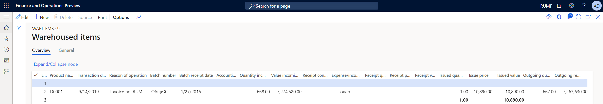
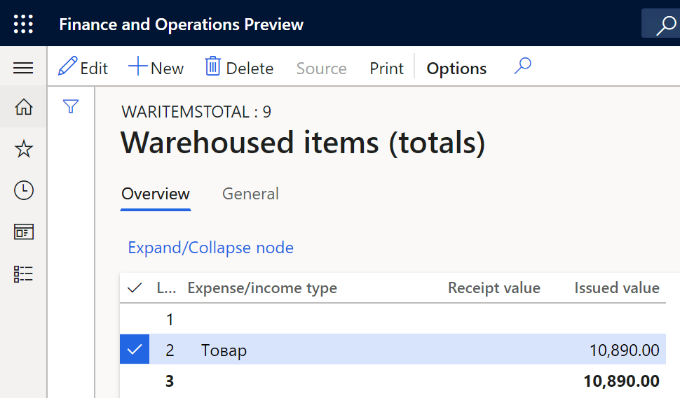
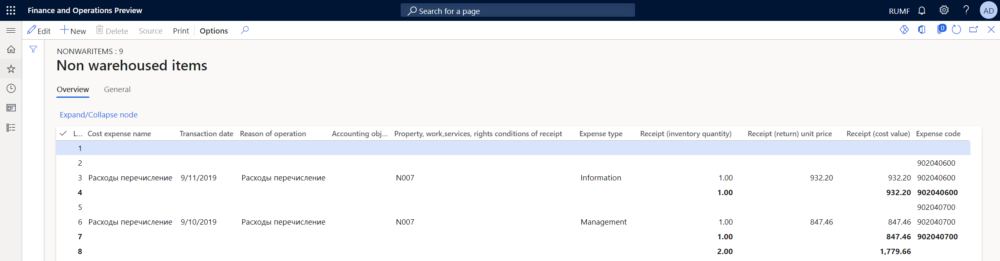
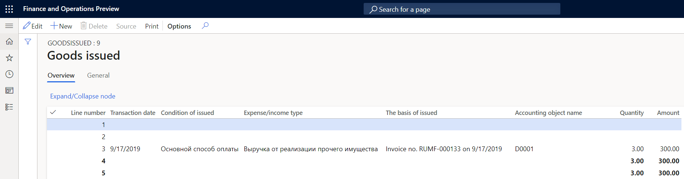

---
# required metadata
title: Goods movement tax registers
description: This topic provides information about goods movement tax registers.
author: akroshkina
ms.date: 08/16/2021
ms.topic: article
ms.prod: 
ms.technology: 

# optional metadata

# ms.search.form:  
audience: Application User
# ms.devlang: 
ms.reviewer: kfend
# ms.tgt_pltfrm: 
# ms.custom: 
ms.search.region: Russia
# ms.search.industry: 
ms.author: anasyash
ms.search.validFrom: 2021-08-01
ms.dyn365.ops.version: 

---

# Goods movement tax registers

[!include [banner](../includes/banner.md)]

## Overview

This topic provides information about the following tax registers:

- Warehoused items
- Warehoused items (totals)
- Non warehoused items
- Goods issued

In this topic, the term "goods" refers to raw materials and supplies, items that are acquired and produced, and services. Tax registers for fixed assets are described in [Fixed assets and intangible assets registers](rus-assets-tax-registers.md).

Operating costs are related to the acquisition of property and to the calculation of the cost when the property is written off for various purposes.

The taxable profit base is reduced by the costs of materials that are written off for production or sold, and all other costs of acquired property during the current period. Expenses that are related to production that is in progress and unrealized products are excluded from the current period's expenses.

From the perspective of tax accounting, two types of expenses occur when raw materials and supplies are purchased:

- **Direct costs**: The costs of raw materials and materials that are the basis of the products that are produced. The tax base can be reduced only on the cost of goods that are written off to production or sold during the current period. For tax accounting purposes, expenses that are related to production that is in progress and products that aren't sold are excluded from the current period's expenses and don't reduce the tax base.

- **Indirect costs**: All other costs that are related to the acquired property. These costs reduce the tax base during the period when they were incurred.

The tax accounting of other warehoused goods or purchased items differs from the tax accounting of raw materials only in that no production is in progress for those goods.

The cost of goods sold in tax accounting can be calculated only by the first in, first out (FIFO) method or, in specific cases, by the average method.

## Set up tax registers

The following tax registers must be created:

- Warehoused items
- Warehoused items (totals)
- Non warehoused items
- Goods issued

To set up the **Warehoused items (totals)**, **Non warehoused items**, and **Goods issued** registers, follow the steps in the topic, [Create tax registers and the tax register journal](rus-profit-tax-registers.md#create-a-tax-register).

To set up the **Warehoused items** register, follow the steps in the next section.

### Set up the Warehoused items register

1.  Go to **Tax** > **Setup** > **Profit tax** > **Registers**.
2.  On the **Tax registers** page, set up a register.
3.  On the **Parameters** FastTab, set up the following parameters.

    | **Parameter name** | **Value** |
    |-------------------------|-------------------------|
    | Batch separator | If the batch is defined by the inventory dimensions set, enter the separator for batches. For example enter a comma (**,**). |
    | Create the tax register transactions by item type | Select a value. |
    | Number of additional batch threads | Enter the number of additional batch threads. |
    | Count the on-hand inventory at the start period and the end period | Select **Yes** or **No**. |
    | Show an original document for a register line | Select **Yes** or **No**. |

## Warehoused items tax register

The **Warehoused items** tax register contains the following information:

- Movement of raw materials and other materials into production
- Invoices for the sale of raw materials and other materials
- Items that are returned to the vendor
- Item write-offs

  

The tax register lines show the following information:

- **Product name**: The name of the items.
- **Transaction date**: The date of the movement (receipt or issue)  of the items during the reporting period.
- **Reason of operation**: A description of the reason for the movement. For example, this field might show the invoice number.
- **Batch number**: The name of the warehouse.
- **Batch receipt date**: The date when the items were received in the warehouse.
- **Accounting object**
- **Quantity incoming remainder**: The quantity of items at the beginning of the reporting period.
- **Value incoming remainder**: The total amount of items at the beginning of the reporting period.
- **Receipt condition**: The condition for receiving goods. This value comes from the **Method of payment** field in the source document.
- **Expense/income type**: The type of moving items.
- **Receipt quantity**: The quantity of received items.
- **Receipt price**: The price of one received item.
- **Receipt value**: The total amount of received items.
- **Issued quantity**: The quantity of issued items.
- **Issue price**: The price of one issued item.
- **Issued value**: The total amount of issued items.
- **Outgoing quantity remainder**: The quantity of the items after their movement.
- **Outgoing remainder value**: The total amount of the items after their movement.

## Warehoused items (totals) tax register

The **Warehoused items (totals)** tax register shows the total amount of each type of income or expense, based on the receipts in the **Warehoused items** tax register.

 

The tax register lines show the following information:

- **Expense/income type**: The type of moving goods.
- **Receipt value**: The total amount of received items.
- **Issued value**: The total amount of issued items.

>[!NOTE]
>The amounts of these expenses in the tax declaration must be manually reduced by the cost in work in progress and finished goods warehouse.

## Non warehoused items tax register

The **Non warehoused items** tax register shows information about the movement of goods, works, services, and rights that are written off at their actual cost, and that don't move through the warehouse. The assumption is that this property isn't connected with the main activity of the company. Instead, its acquisition is a general economic expense
and is accepted for tax accounting in the period when the expense was made.

The tax register lines show the following information:

- **Cost expense name**: The name of the expense.
- **Transaction date**: The date of the transaction.
- **Reason of operation**: A description of the transaction.
- **Accounting object**: The name of the items.
- **Property, work, services, rights conditions of receipt**: The terms of payment for the invoice. This value comes from the **Method of payment** field in the source document.
- **Expense type**: The name of the expense codes that were settled with the register.
- **Receipt (inventory quantity)**: The number of non-warehoused items.
- **Receipt (return) unit price**: The price of one item.
- **Receipt (cost value)**: The total amount of the items.
- **Expense code**: The expense code of the transaction.

## Goods issued tax register

The **Goods issued** tax register summarizes information about the income from the disposal of the taxpayer's property, the sale of works, services, and rights, and the formation of the amounts of corresponding income from sales that are included in the tax base.

The tax register lines show the following information:

- **Transaction date**: The invoice date.
- **Condition of issued**: The method of payment. This value comes from the **Method of payment** field in the source document.
- **Expense/income type**: The name of the expense or income code that was settled with the register.
- **The basis of issued**: A description of the transaction.
- **Accounting object name**: The name of the goods.
- **Quantity**: The quantity of the goods.
- **Amount**: The total amount of the goods.

[!INCLUDE[footer-include](../../includes/footer-banner.md)]v
