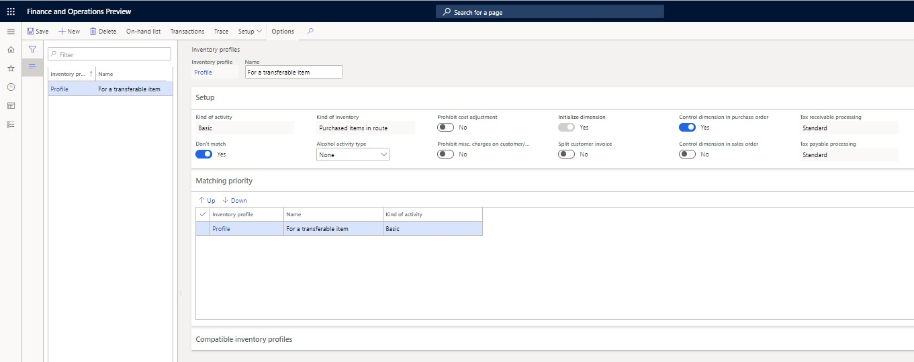
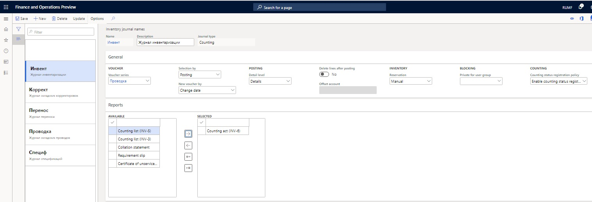
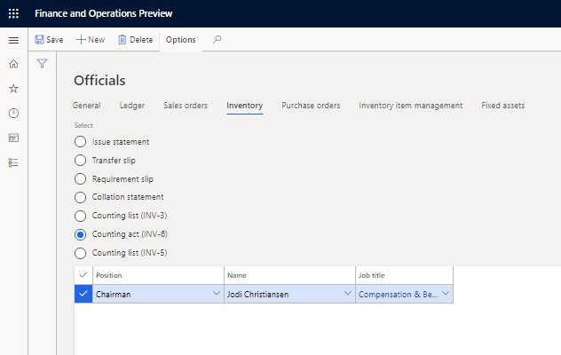
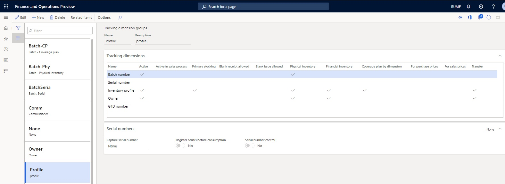
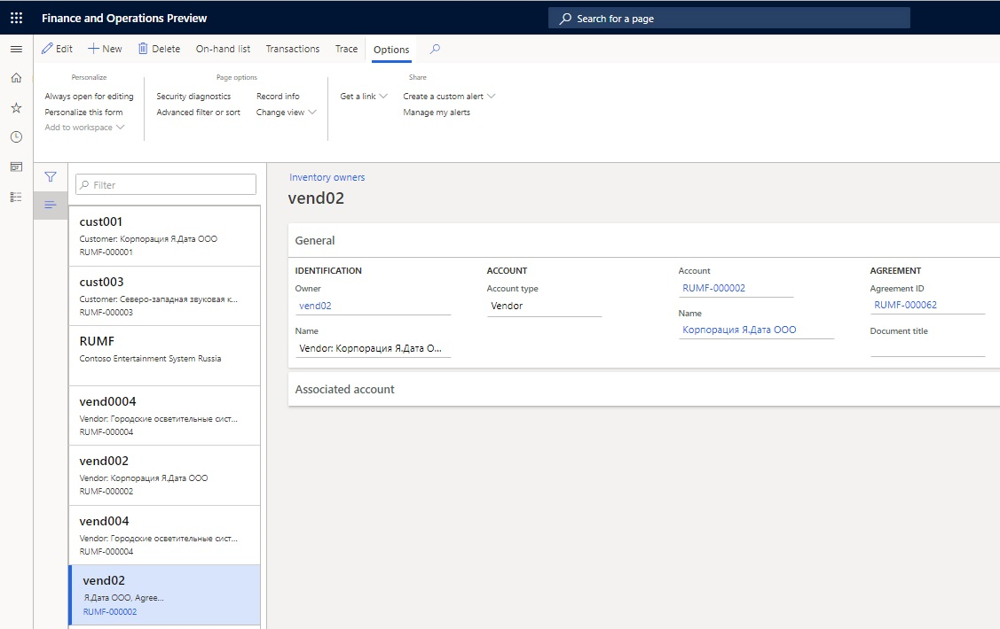
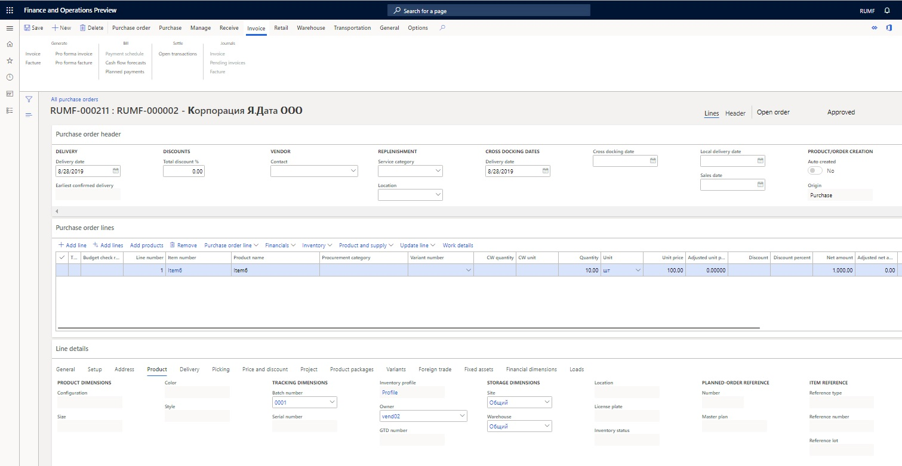
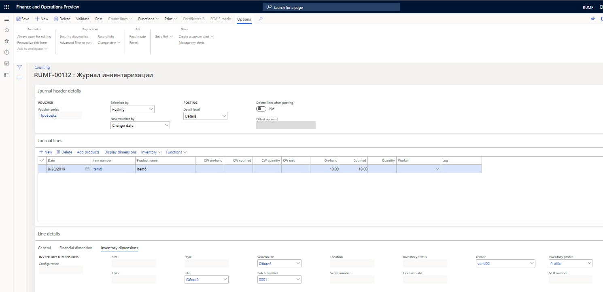
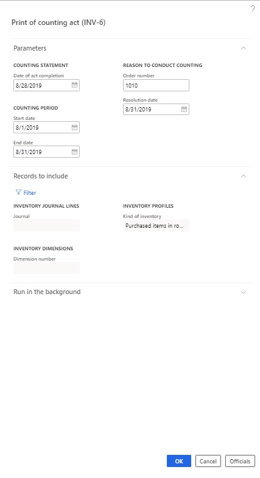
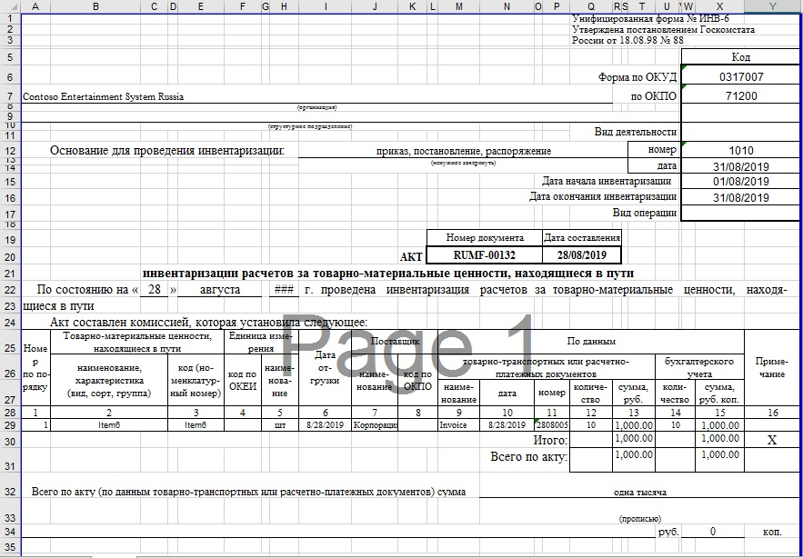

---
# required metadata
title: Goods in transit from vendor
description: This topic provides information about the settings and actions that are required for the Counting act for goods in transit (INV-6) report.
author: anasyash
ms.date: 05/20/2020
ms.topic: article
ms.prod: 
ms.technology: 

# optional metadata
ms.search.form:  
audience: Application User
# ms.devlang: 
ms.reviewer: kfend
# ms.tgt_pltfrm: 
# ms.custom: 
ms.search.region: Russia
# ms.search.industry: 
ms.author: anasyash
ms.search.validFrom: 2019-06-28
ms.dyn365.ops.version: 8.1.2

---

# Goods in transit from vendor (Russia)

[!include [banner](../includes/banner.md)]

The item counting process (INV-6) is used to identify the quantity and value of inventory items that are in transit when inventory is counted.

The item counting process is done in the context of nomenclatures, shipping documents, and vendors.

## Set up an inventory profile for a transferable item
To reflect the goods and materials that are in transit, you can set the kind of inventory for the **Basic** kind of activity. The **Kind of inventory** field can have the following values:

- Common
- Purchased items in route

1. Go to **Inventory management** \> **Setup** \> **Dimensions** \> **Inventory profiles**.
2. Select **New** to create an inventory profile for an item.
3. In the **Inventory profile** field, enter the name of the inventory profile.
4. In the **Name** field, enter a description of the inventory profile.
5. On the **Setup** FastTab, in the **Kind of activity** field, select **Basic**.
6. Set the **Don't match option** to **Yes** to prevent on-hand inventory that uses this inventory profile from being automatically matched with a compatible inventory profile.
7. In the **Kind of inventory** field, select **Purchased items in route**. The **Initialize dimension** and **Control dimension in purchase order** options are automatically set to **Yes**.

> [!NOTE]
> The **Kind of inventory** field is available only if you select **Basic** in the **Kind of activity** field.

8. On the **Matching priority** FastTab, select **Up** or **Down** to change the order of the inventory profile.
9. Select **Save**, and close the page.

  
 
## Set up a number sequence for the Counting act (INV-6) report

1. Go to **Inventory management** \> **Setup** \> **Inventory and warehouse management parameters**.
2. On the **Number sequences** tab, in the **Number sequence code** field, select a number sequence for the **Counting act (INV-6)** reference.
3. Select **Save**, and close the page.

## Set up an inventory journal name for the Counting act (INV-6) report

1. Go to **Inventory management** \> **Setup** \> **Journal names** \> **Inventory**.
2. Create a journal name.
3. In the **Name** field, enter the inventory journal name.
4. In the **Description** field, enter a description.
5. In the **Journal type** field, select **Counting**.
6. On the **Reports** FastTab, in the **Available** field, select **Counting act (INV-6)**, and then select the left arrow button to move the report to the **Selected** field.

> [!NOTE]
> If the **Available** field is blank, select **Update** on the Action Pane to update the list of available reports.

7. Select **Save**, and close the page.

  
 
## Add officials to the Counting act (INV-6) report
You can specify the company officials who are involved in the item counting process for the **Counting act (INV-6)** report.

1. Go to **Organization administration** \> **Setup** \> **Contacts** \> **Officials**.
2. On the **Inventory** tab, select the **Counting act (INV-6)** option.
3. Select **New** to create an official for the **Counting act (INV-6)** report.
4. In the **Position** field, select the designation of the official.
5. In the **Name** field, enter the name of the official.
6. In the **Job title** field, select the job title of the official.

> [!NOTE]
> By default, the job title is copied from the selected employee's record.
 
  
 
7. Select **Save**, and close the page.

### Create an inventory tracking dimension group for the Counting act (INV-6) report

1. Go to **Product information management** \> **Setup** \> **Dimension and variant groups** \> **Tracking dimension groups**.
2. Select **New** to create a dimension group.
3. In the **Name** field, enter the name of the dimension group.
4. In the **Description** field, enter a description.
5. On the **Tracking dimensions** FastTab, on the **Inventory profile** line, select the **Active**, **Primary stocking**, **Physical inventory**, **Financial inventory**, **Coverage plan by dimension**, and **Transfer** check boxes.
6. On the **Owner** line, select the **Active**, **Physical inventory**, **Financial inventory**, and **Transfer** check boxes.

> [!NOTE]
> To make the report reflect the details of shipping and payment documents, on the **Batch number** line, select the **Active** and **Physical inventory** check boxes.

  
 
7. Select **Save**.

## Create a purchase agreement

1. Go to **Accounts payable** \> **Purchase orders** \> **Purchase agreements**.
2. Select **New** to open the **Create purchase agreement** dialog box.
3. On the **Vendor** FastTab, in the **Vendor account** field, select the vendor account.
4. In the **Purchase agreement classification** field, select **Blanket purchase agreement**.
5. On the **General** FastTab, in the **Document** section, in the **Purchase agreement** field, enter the ID of the purchase agreement.
6. Specify other details, and then select **OK**.
7. On the **Purchase agreements** page, switch to the **Header** view, and then, on the **Financial** FastTab, in the **Inventory profile** section, set the following fields:

- In the **Kind of activity** field, select **Basic**.
- In the **Inventory profile** field, select the inventory profile that you created earlier.
 
  
 
8. On the Action Pane, on the **Purchase agreement** tab, in the **Generate** group, select **Confirmation** to update the status of the purchase agreement to **Effective**.

## Add an inventory owner to the Counting act (INV-6) report

1. Go to **Inventory management** \> **Setup** \> **Dimensions** \> **Inventory owners**.
2. Select **New** to add an inventory owner.
3. In the **Owner** field, enter the owner code.
4. In the **Account type** field, select **Vendor**.
5. In the **Account** field, select the principal code. The **Name** field is filled in automatically.
6. In the **Agreement ID** field, select the purchase agreement that you created earlier. In this way, you associate the new owner with the agreement.

  

7. Select **Save**.

## Register goods and materials that are in transit

1. Create a new purchase order. In the **Purchase agreement** field, select the purchase agreement that you created earlier, and then, on the purchase order line, in the **Item number** field, select the item number.

> [!NOTE]
> The **Tracking dimension** field for the item should be set to the inventory profile that you created earlier.

2. On the **Line details** FastTab, on the **Product** tab, in the **Tracking dimension** section, validate that the **Inventory profile** field is set to the inventory profile that you created earlier.
3. In the **Owner** field, select the record that you created earlier.

  

4. Post the invoice in the usual way.

## Generate a Counting act (INV-6) report
You can use the **Print of counting act (INV-6)** dialog box to generate a **Counting act (INV-6)** report as a Microsoft Excel file. You must generate this report to track items that are transferred between warehouses and to create a counting list of the items in the transfer that have been purchased. The counting list can contain on-hand inventory holdings.

1. Go to **Inventory management** \> **Journal entries** \> **Item counting** \> **Counting**.
2. Select **New** to open the **Dimensions display** dialog box.
3. On the **Overview** FastTab, validate that the **Name** field is set to the inventory journal name that you created earlier.
4. In the **Store inventory** section, set the **Site** and **Warehouse** fields.
5. On the **Counting by** FastTab, validate that the **Inventory profile** and **Owner** options are set to **Yes**.

> [!NOTE]
> You can also set the **Batch number** and **Warehouse** options to **Yes**, if those dimensions are applicable.
 
  
 
6. Select **OK** to create an inventory counting journal for the items in the transfer.
7. On the **Counting** page, in the **Journal lines** FastTab, create a line, and select the item number that you created earlier.
8. On the **Line details** FastTab, on the **Inventory dimensions** tab, in the **Inventory profile** and **Owner** fields, select the records that you created earlier. The **On-hand** field on the journal line is automatically updated.
9. On the **Journal lines** FastTab, select **Functions** \> **Create counting list** to create a counting list. For each line, the **Counted** field is updated with the value that is specified in the **On-hand** field.

  

10.	On the Action Pane, select **Print** \> **Counting act (INV-6)** to open the **Print of counting act (INV-6)** dialog box.
11.	In the **Date of act completion** field, select the date when the counting process is scheduled to be completed.
12.	In the **Start date** and **End date** fields, select the start and end dates of the inventory counting period.
13.	In the **Order number** field, enter the order number that you're generating the **Counting act INV-6** report for.
14.	In the **Resolution date** field, select the transaction date of the order that you're generating the **Counting act INV-6** report for.

> [!NOTE]
> The values in the **Journal**, **Dimension number**, and **Kind of inventory** fields are based on the inventory counting transactions. To change the values of these fields, select **Filter**. For example, you can modify these values to generate the report for a different journal or a different dimension.

  
 
15.	Select **OK** to generate the **Counting act (INV-6)** report.

  
 

[!INCLUDE[footer-include](../../includes/footer-banner.md)]