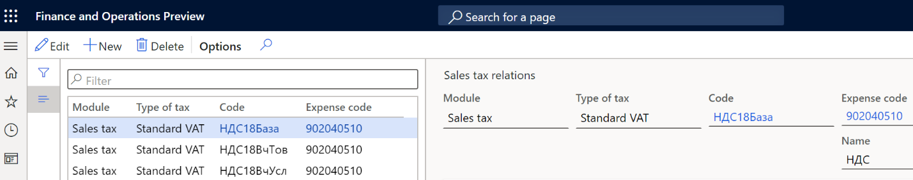
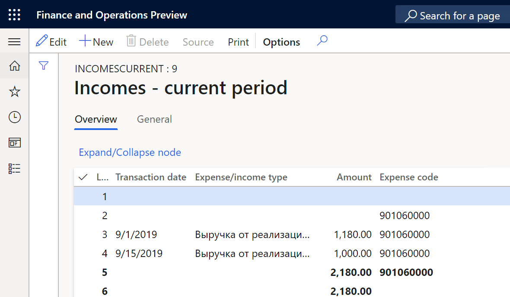
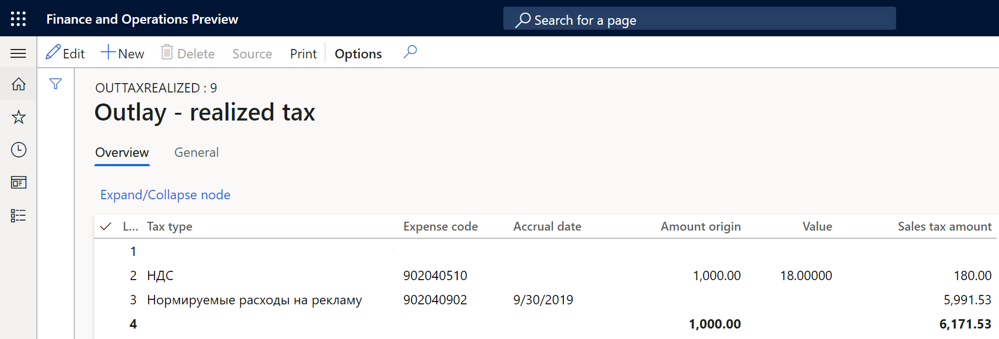
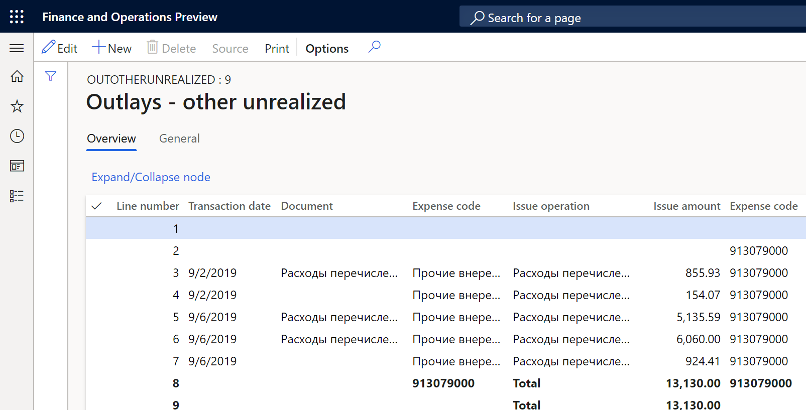

# Other tax registers

[!include [banner](../includes/banner.md)]

This article provides information about the following tax accounting registers. Although the system automatically fills in these registers, you can manually correct the results of the automatic calculation.

- Incomes - current period
- Outlay - realized tax
- Outlay - realized
- Outlays - unrealized
- Outlays - other unrealized

## Setup

Set up the settlement periods for all taxes except value-added tax (VAT). The settlement period must equal the formation period of the register journal. Otherwise, the accrual date will be entered incorrectly on the register lines.

### Set up taxes that are automatically processed

1. Create expense codes for taxes. For more information, see [Create an expense or income code](rus-expense-and-income-codes.md#create-an-expense-or-income-code).
2. Create ledger posting groups for taxes. For more information, see [Set up a posting group](rus-local-specific-posting-sales-vat.md#set-up-a-posting-group).
3. Create sales tax codes. For more information, see [Set up sales tax codes](../general-ledger/tasks/set-up-sales-tax-codes.md).

Set up sales tax relations between the sales tax code and the expense code. For example, follow these steps to set up the relations for VAT.

1. Go to **Tax** > **Setup** > **Profit tax** > **Sales tax relations**.
2. Select **New**.
3. In the **Module** field, select **Sales tax**.
4. In the **Type of tax** field, select the type of the tax. For example, select **Standard VAT**.
5. In the **Code** field, select the sales tax code, based on the value of the **Type of tax** field.
6. In the **Expense code** field, select an expense code that corresponds to the tax.

      

## Tax registers

### Incomes - current period register

Create and set up the tax registers as described in the [Create tax registers and the tax register journal](rus-profit-tax-registers.md#create-a-tax-register). Create expense codes, and assign them to the register. For more information, see [Create an expense or income code](rus-expense-and-income-codes.md#create-an-expense-or-income-code) and [Create tax registers and the tax register journal](rus-profit-tax-registers.md#set-up-expense-and-income-codes-for-the-tax-register).

The **Incomes - current period** register summarizes information about income that is obtained for a specific reporting period. The amounts of income, including non-operating income, are used to fill in the income tax declaration.

  

The tax register lines show the following information:

- **Transaction date**: The date of the invoice.
- **Expense/income type**: The name of the income code.
- **Amount**: The amount of the invoice.

### Outlay - realized tax register

Create and set up the tax registers as described in the article, [Create tax registers and the tax register journal](rus-profit-tax-registers.md#create-a-tax-register).

The **Outlay - realized tax** register is used to summarize information about taxes and duties that are included in other expenses.

The register is formed from two types of taxes:

  - Taxes that are automatically processed, such as VAT. You must set up sales tax relations for these taxes.
  - Taxes that aren't automatically processed, such as taxes on advertising, extraction of mineral resources, and usage of water resources. Create expense codes that are used to post these taxes, and assign them to the register. For more information, see [Create an expense or income code](rus-expense-and-income-codes.md#create-an-expense-or-income-code) and [Create tax registers and the tax register journal](rus-profit-tax-registers.md#set-up-expense-and-income-codes-for-the-tax-register).

The tax register contains information about all accrued taxes and duties, and presents lines that are grouped by tax type.

Before you calculate the **Outlay - realized tax** register, you must create and close a sales and purchase book for the period that the register is created for. This step is required because the VAT expense is calculated based on closed sales and purchase books. If the sales and purchase books aren't closed for the register period, only expenses for other taxes are calculated in the register.

  

The tax register lines show the following information:

  - **Tax type**: The name of the tax, such as **VAT**.
  - **Expense code**: The expense code of the tax.
  - **Accrual date**: The last day of the period.
  - **Amount origin**: The tax base. For taxes that aren't automatically processed, this field is blank.
  - **Value**: The tax rate. For taxes that aren't automatically processed, this field is blank.
  - **Sales tax amount**: The total tax amount for the expense code.

### Outlay - realized register

Create and set up the tax registers as described in [Create tax registers and the tax register journal](rus-profit-tax-registers.md#create-a-tax-register). Create expense codes, and assign them to the register. For more information, see [Create an expense or income code](rus-expense-and-income-codes.md#create-an-expense-or-income-code) and [Create tax registers and the tax register journal](rus-profit-tax-registers.md#set-up-expense-and-income-codes-for-the-tax-register).

The **Outlay - realized** register summarizes the amounts of other expenses of the current period or future periods.
This tax register contains information from the following tax registers:

  - Standard expenses in current period
  - Warehoused items
  - Non warehoused items
  - Outlay - realized tax

The tax register lines show the following information:

  - **Transaction date**: The date of the expense.
  - **Expense code**: The expense code.
  - **Object (operation) name**: A description of the document.
  - **Amount**: The expense amount.

### Outlays - other unrealized register

Create and set up the tax registers as described in the [Create tax registers and the tax register journal](rus-profit-tax-registers.md#create-a-tax-register). Create expense codes, and assign them to the register. For more information, see [Create an expense or income code](rus-expense-and-income-codes.md#create-an-expense-or-income-code) and [Create tax registers and the tax register journal](rus-profit-tax-registers.md#set-up-expense-and-income-codes-for-the-tax-register).

The **Outlays - other unrealized** register summarizes the amounts of other unrealized expenses, based on general ledger transactions. This register can also include expenses that are manually entered in the register.

  

The tax register lines show the following information:

- **Transaction date**: The date of the transaction.
- **Document**: A description of the document.
- **Expense code**: The expense code and its description.
- **Issue operation**: A description of the document.
- **Issue amount**: The amount of the transaction (either the tax base or the tax amount).

### Outlays - unrealized register

Create and set up the tax registers as described in the [Create tax registers and the tax register journal](rus-profit-tax-registers.md#create-a-tax-register). Create expense codes, and assign them to the register. For more information, see [Create an expense or income code](rus-expense-and-income-codes.md#create-an-expense-or-income-code) and [Create tax registers and the tax register journal](rus-profit-tax-registers.md#set-up-expense-and-income-codes-for-the-tax-register).

The **Outlays - Unrealized** register summarizes information about unrealized expenses that are incurred during a tax reporting period. The register is calculated at the end of the accounting period, based on expenses that are accrued from the beginning of the tax period until the reporting date. This tax register is calculated based on general ledger entries.

The tax register lines show the following information:

  - **Date**: The transaction date.
  - **Expense code**: The expense code and its description.
  - **Operation**: A description of the document.
  - **Amount**: The amount of the transaction (either the tax base or the tax amount).
  - **Loss**

[!INCLUDE[footer-include](../../includes/footer-banner.md)]
