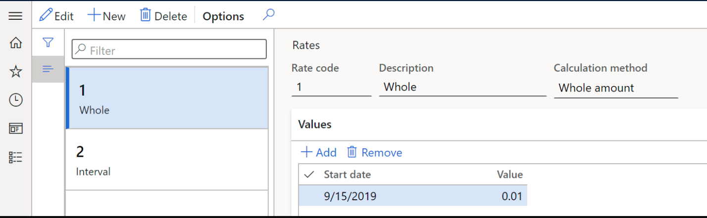
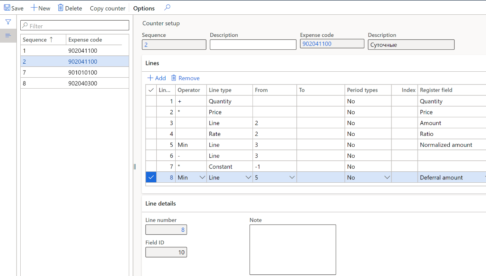
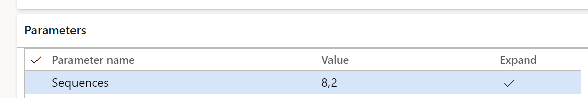
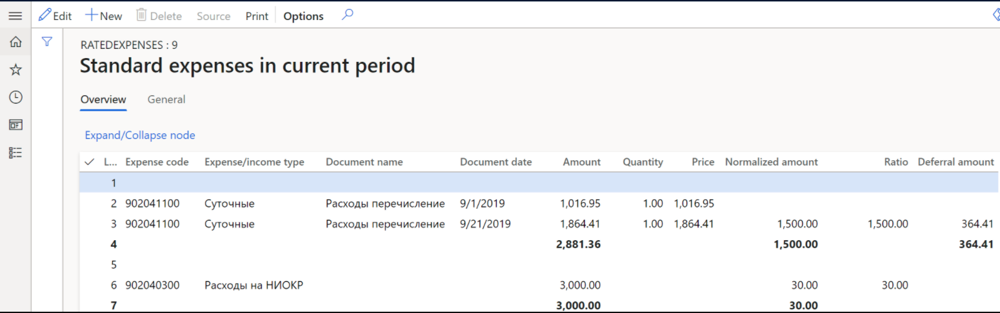

# Rated expenses registers

[!include [banner](../includes/banner.md)]

## Overview

Some types of expenses are reported differently in accounting and tax accounting. These expenses include rated expenses, of which only a part within the established standard is accepted for tax accounting in the current period. The remaining part can be accepted for tax accounting in subsequent tax periods. In accounting, these expenses are considered at the same time.

## Set up

### Create sequences of calculation and counters

For all types of rated expenses, you need to create sequences of calculation that consist of counters. If the standard for an expense is determined per unit, for example daily travel expenses, the document must specify the number of rated units (in this case, days) and their prices for correct calculation.

#### Create rates

Various constants or rates, such as tax rates, can be used as parameters to calculate register lines. Instead of storing rates directly in the calculation algorithm, these parameters can be stored in a special rates directory.

When used in counters, rates must be pre-configured. To set up rates, complete the following steps.

1. Go to **Tax** > **Setup** > **Profit Tax** > **Rates**.
2. On the Action Pane, select **New**.
3. In the **Rate code** field, enter the unique code of the rate.
4. In the **Calculation method** field, select one of the following:

    - **Whole amount**: Determine the percentage of the expenses eligible for tax accounting in the current period.
    - **Interval**: Determine the amount limit for tax accounting in the current period.

5. If you selected **Whole amount**, on the **Values** FastTab, do the following:

    - In the **Start date** field, enter the date from which the value of the rate will be used in the sequence of calculation.
    - In the **Value** field, enter the ratio value that will be used in the sequence of calculation.

      

6. If you selected **Interval**, on the **Values** FastTab, do the following:

    - In the **Start date** field, enter the date from which the value of the rate will be used in the sequence of calculation
    - In the **Criterion type** field, select the rate calculation criteria type, **Minimum** or **Maximum**.

7. On the **Intervals** FastTab:

    - In the **Value** field, enter the lower limit of the transaction amount from which the rate will be applied.
    - In the **For amount** field, enter the amount to be accounted for in this period.

#### Create and set up the sequence of calculation 

The sequence of calculation contains counters that implement several arithmetic and logical operations on strings of certain types for a specified period. For more information about how to set up sequence of calculation, see [Set up deferrals (Russia)](rus-set-up-deferrals.md#sequence-of-calculation).

Complete the following steps to create a sequence of calculation for rated expenses.

1. Create and set up the tax register **Standard expenses in current period** as described in the article, [Create tax registers and the tax register journal](rus-profit-tax-registers.md#create-a-tax-register).
2. Create expense codes for normalization. For more information, see [Expense and income codes](rus-expense-and-income-codes.md#create-an-expense-or-income-code).
3. Go to **Tax** > **Setup** > **Profit Tax** > **Sequence of calculation**.
4. On the Action Pane, select **New** to create a new sequence.
5. In the **Channel** field, specify the register type.
6. In the **Channel reference** field, specify the register code for the rated expenses you created in step 1.
7. On the Action Pane, select **Counters**. 
8. On the **Counter setup** page, on the Action Pane, select **New**.
9. On the **Lines** FastTab, select **Add** and specify values in the **Operator**, **Line Type**, **From**, **To**, **Period Types**, and **Index** columns.
10. In the **Register field** column, select a value to determine the column of tax register to which the line value should be output:

    - **Amount**: The total amount of the expense.
    - **Quantity**: The number of rated units. This value comes from the corresponding field in the source document.
    - **Price**: The amount per unit. This value comes from the corresponding field in the source document.
    - **Normalized amount**: The rated amount of the expense.
    - **Ratio**: The calculated amount using the ratio for the expense code from the sequences of calculation.
    - **Deferral amount**: The difference between the total amount and normalized amount accounted for in the expenses of the future period.

     

### Assign calculation sequences to the register

1. Go to **Tax** > **Setup** > **Profit Tax** > **Registers**.
2. Select the **Standard expenses in current period** tax register from the list.
3. On the **Parameters** FastTab, in the **Value** column, choose the numbers of the calculation sequences to form the register from the list.

    

## Standard expenses in current period register

Calculate the tax register as described in the article, [Create tax registers and the tax register journal](rus-profit-tax-registers.md#calculate-and-print-tax-registers).

The **Standard expenses in current period** register reflects information about the expenses of the current period, their rated part, and the part that exceeds the standard.

View the following information on the register lines:

   - **Line number**
   - **Expense code**: Expense code from the sequences of calculation
   - **Expense/income type**: Description of the expense code
   - **Document name**: Description of the document
   - **Document date**: Transaction date

These fields are the result of calculating the respective sequence of calculation: **Amount**, **Quantity**, **Price**, **Normalized amount**, **Ratio**, and **Deferral amount**.

[!INCLUDE[footer-include](../../includes/footer-banner.md)]
