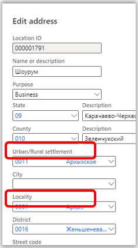

---
# required metadata
title: Russian address formats. Import from State Address Register (GAR)
description: This topic provides information about how to import addresses in the GAR format.
author: epodkolz
ms.date: 23/06/2022
ms.topic: article
ms.prod: 
ms.technology: 

# optional metadata

# ms.search.form:  
audience: Application User
# ms.devlang: 
ms.reviewer: kfend
# ms.tgt_pltfrm: 
# ms.custom: 
ms.search.region: Russia
# ms.search.industry: 
ms.author: 
ms.search.validFrom: 
ms.dyn365.ops.version: Version 10.0.29

---

# Import from State Address Register (GAR) 
[!include [banner](../includes/banner.md)]

Starting from the 10.0.29 update, import of addresses is available in a new State Address Register (GAR) format – Import from GAR.

This topic provides information about how to import addresses in the GAR format.

The GAR format that is provided by the Federal Tax Service (FTS) contains information about addresses in administrative-territorial and municipal divisions. Current GAR functionality provides import of addresses in municipal division only. In addition to the [FIAS functionality](rus-russian-address-format-and-import-from-FIAS.md) that provides import of States, Counties, Cities, Districts, Streets, group of houses, group of flats, ZIP/Postal codes, and land plots, the GAR functionality provides import of Urban/Rural settlements and Localities, that are the components of the municipal division.
Parking lots (spaces), Room numbers and Rooms numbers within the premises are not supported in the GAR functionality.

The following table provides information about GAR levels and corresponding tabs/tables on the **Address setup** page.

| Level | Name in GAR | Tab on the Address setup page | Table |
|---|---|---|---|
| 1 | Subject of the Russian Federation | State/Province | LogisticsAddressState |
| 2 | Administrative area | City （Address level - City）|LogisticsAddressCity |
| 3 | Municipal district | County | LogisticsAddressCounty |
| 4 |	Rural / Urban Settlement | City （Address level - Rural / Urban Settlement）|	LogisticsAddressCity |
| 5 |	City | City （Address level - City) |	LogisticsAddressCity |
| 6 |	Locality	|City （Address level - Locality) | LogisticsAddressCity
| 7	| Planning structure element |	District	| LogisticsAddressDistrict |
| 8 |	Road network element	| Street	| LogisticsAddressStreet_RU |
| 9	| Steads |	Land plots	| LogisticsAddressSteadNumber_RU |
| 10 |	House	| Group of houses |	LogisticsAddressHouseNumber_RU |
| 11 |	Apartments and Rooms |	Group of flats	| LogisticsAddressFlatNumber_RU |

## Enable Import from GAR feature
1. Go to **Workspaces** > **Feature management**.
2. In the feature list, select and enable the following feature: **(Russia) Import addresses from the State Address Register (GAR)**.

After enabling the feature, the **Import from FIAS** functionality won’t be available. The new menu item **Import from GAR** will be available instead.

## Import ER configurations
The **GAR import** feature utilizes the [Electronic Reporting (ER) functionality](../../fin-ops-core/dev-itpro/analytics/general-electronic-reporting.md). You need to import the following ER configurations:

1.  Import configurations for GAR address metadata files:
    1.  GAR metadata import ADDHOUSE(RU)
    2.  GAR metadata import ADDR_OBJ(RU)
    3.	GAR metadata import APARTMENT(RU)
    4.	GAR metadata import HOUSE(RU)
    5.	GAR metadata import OPERATION(RU)
    6.	GAR metadata import ROOM(RU)

2.  Import configurations for GAR MUN hierarchy file:
    1.  GAR hierarchy import MUN_HIERARCHY(RU)

3.  Import configurations for GAR address files:
    1.	GAR address import ADDR_OBJ(RU)
    2.	GAR address import APARTMENTS(RU)
    3.	GAR address import HOUSES(RU)
    4.	GAR address import ROOMS(RU)
    5.	GAR address import STEADS(RU)

4.  Import configurations for GAR address parameters files:
    1.  GAR parameters import ADDR_OBJ(RU)
    2.  GAR parameters import APARTMENTS(RU)
    3.	GAR parameters import HOUSES(RU)
    4.	GAR parameters import ROOMS(RU)
    5.  GAR parameters import STEADS(RU)

For more information on importing ER configurations, see [Download ER configurations](../../fin-ops-core/dev-itpro/analytics/er-download-configurations-global-repo.md).

## GAR import

1.	Download the database from [https://fias.nalog.ru/Updates](https://fias.nalog.ru/Updates).
2.	Go to **Organization administration** > **Global address book** > **Import from GAR**.
3.	Select **Import from GAR** to open the **Import from GAR** dialog box.
4.	On the **Parameters** FastTab, select **Browse** to select the zip archive.
5.	Set the **Full import** option to **Yes**, if you are importing a full database. If you are importing a delta file, set the **Full import** option to **No**.
6.	If you intend to import houses and steads, set the **Import Houses and Steads** option to **Yes**.
7.	If you intend to import rooms, set the **Import Rooms and Apartments** option to **Yes**.
8.	Select **OK** to start the import.

> [!IMPORTANT]
> Currently, there is a 2Gb limitation for the import of addresses. The state can’t be imported if it contains an XML file that exceeds 2Gb in size.

Due to the size limitation for import of addresses, you need to unzip the downloaded database, and create zip file for the state(s) that are needed. 
You can import either one state or several states. To import several states, the zip file should contain folders with those states. Follow these steps to create a zip file with required states:
1.	Unzip the downloaded database into a folder.
2.	Create a new zip file that contains the folders that correspond to the required states and the metadata files.

    - AS_ADDHOUSE_TYPES_*
    - AS_ADDR_OBJ_TYPES_*
    - AS_APARTMENT_TYPES_*
    - AS_HOUSE_TYPES_*
    - AS_OPERATION_TYPES_*
    - AS_ROOM_TYPES_*

> [!Note]
>
> Do not change the folders names in the zip file, they should remain as the codes of states.
>
> Metadata files are optional, except for the first import. For the first import make sure the zip file contains metadata.
After import is completed, you can validate the imported data on the **Address setup** page.

The **Urban/Rural settlement** and **Locality** are imported to the **City** level with the respective **Address level**. If exists, the parent **Urban/Rural settlement** will contain the respective code of **Urban/Rural settlement**.

> [!Note]
>
> Filtering by **Urban/Rural settlement**, **City** and **Locality** address levels is not supported.
Codes for **Cities** (including **Urban/Rural settlements** and **Localities**), **Districts**, **Streets** are generated automatically while importing. They are unique within the parent address component level. If the current parent level component has no children, then 001 or 0001 will be assigned (depending on the object type); if there are child records, the new one will be incremented by 1.

### Importing GAR in batch
The process of importing of addresses can take time, thus it is highly recommended to use the batch job mode by enabling the **Batch processing** option (For example: Address data size is about 800M for state 01, and may take 1-2 hours to import). 
You can review the status of the “Import from GAR” batch in the **Batch jobs** page. You can also review the log there (**Batch job** tab, **Log** button). The import can be completed with error. For example, if the version of the file is older than the one that was already imported, the error “Address version validation failed: the version is older than the latest imported version” will be shown.

## Address format setup
Follow the steps described in [Address setup](../../fin-ops-core/fin-ops/organization-administration/global-address-book-address-setup.md#set-up-address-formats).

To comply with the GAR address format, on the Address setup page, on the **Address format** tab, add new **Urban/Rural settlement** and **Locality address** components that are available in the **Address application object** enum.

These address components are also available on the **Manage addresses** page, and **New Address** and **Edit Address** dialogs:

[!INCLUDEfooter-include]
