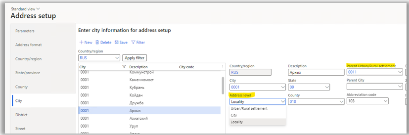

---
# required metadata
title: Import from State Address Register (GAR)
description: This article provides information about how to import addresses in the GAR format.
author: epodkolz
ms.date: 06/29/2022
ms.topic: article
ms.prod: 
ms.technology: 

# optional metadata

# ms.search.form:  
audience: Application User
# ms.devlang: 
ms.reviewer: kfend
# ms.tgt_pltfrm: 
# ms.custom: 
ms.search.region: Russia
# ms.search.industry: 
ms.author: 
ms.search.validFrom: 
ms.dyn365.ops.version: Version 10.0.29

---

# Import from State Address Register (GAR) 

[!include [banner](../includes/banner.md)]

Starting in Dynamics 365 Finance version 10.0.29, address import is available in a new State Address Register (GAR) format – Import from GAR.

This article provides information about how to import addresses in the GAR format.

The GAR format that is provided by the Federal Tax Service (FTS) contains information about addresses in administrative-territorial and municipal divisions. Current GAR functionality provides import of addresses in the municipal division only. In addition to the [FIAS functionality](rus-russian-address-format-and-import-from-FIAS.md) that provides import of States, Counties, Cities, Districts, Streets, group of houses, group of flats, ZIP/Postal codes, and land plots, the GAR functionality provides the import of urban/rural settlements and localities, which are the components of the municipal division.
Parking lots (spaces), room numbers, and rooms numbers within the premises are not supported in the GAR functionality.

The following table provides information about GAR levels and the corresponding tabs and tables on the **Address setup** page.

| Level | Name in GAR | Tab on the Address setup page | Table |
|---|---|---|---|
| 1 | Subject of the Russian Federation | State/Province | LogisticsAddressState |
| 2 | Administrative area | City （Address level - City）|LogisticsAddressCity |
| 3 | Municipal district | County | LogisticsAddressCounty |
| 4 |	Rural / Urban Settlement | City （Address level - Rural / Urban Settlement）|	LogisticsAddressCity |
| 5 |	City | City （Address level - City) |	LogisticsAddressCity |
| 6 |	Locality	|City （Address level - Locality) | LogisticsAddressCity
| 7	| Planning structure element |	District	| LogisticsAddressDistrict |
| 8 |	Road network element	| Street	| LogisticsAddressStreet_RU |
| 9	| Steads |	Land plots	| LogisticsAddressSteadNumber_RU |
| 10 |	House	| Group of houses |	LogisticsAddressHouseNumber_RU |
| 11 |	Apartments and Rooms |	Group of flats	| LogisticsAddressFlatNumber_RU |

## Enable the Import from GAR feature
1. Go to **Workspaces** > **Feature management**.
2. In the feature list, find and select the feature: **(Russia) Import addresses from the State Address Register (GAR)**.
3. Select **Enable now**.

After you enable the feature, the **Import from FIAS** functionality isn't available. The new menu item **Import from GAR** is available instead.

## Import ER configurations
The **GAR import** feature utilizes the [Electronic Reporting (ER) functionality](../../fin-ops-core/dev-itpro/analytics/general-electronic-reporting.md). You need to import the following ER configurations:

1. Import configurations for GAR address metadata files:

    - GAR metadata import ADDHOUSE(RU)
    - GAR metadata import ADDR_OBJ(RU)
    - GAR metadata import APARTMENT(RU)
    - GAR metadata import HOUSE(RU)
    - GAR metadata import OPERATION(RU)
    - GAR metadata import ROOM(RU)

2. Import configurations for GAR MUN hierarchy file:
    
    - GAR hierarchy import MUN_HIERARCHY(RU)

3. Import configurations for GAR address files:
    
    - GAR address import ADDR_OBJ(RU)
    - GAR address import APARTMENTS(RU)
    - AR address import HOUSES(RU)
    - GAR address import ROOMS(RU)
    - AR address import STEADS(RU)

4. Import configurations for GAR address parameters files:
    
    - GAR parameters import ADDR_OBJ(RU)
    - GAR parameters import APARTMENTS(RU)
    - GAR parameters import HOUSES(RU)
    - GAR parameters import ROOMS(RU)
    - GAR parameters import STEADS(RU)

For more information about importing ER configurations, see [Download ER configurations](../../fin-ops-core/dev-itpro/analytics/er-download-configurations-global-repo.md).

## GAR import

1. Download the database from [https://fias.nalog.ru/Updates](https://fias.nalog.ru/Updates).
2. Go to **Organization administration** > **Global address book** > **Import from GAR**.
3. Select **Import from GAR** to open the **Import from GAR** dialog box.
4. On the **Parameters** FastTab, select **Browse** to select the zip archive.
5. Set the **Full import** option to **Yes**, if you are importing a full database. If you are importing a delta file, set the **Full import** option to **No**.
6. If you intend to import houses and steads, set the **Import Houses and Steads** option to **Yes**.
7. If you intend to import rooms, set the **Import Rooms and Apartments** option to **Yes**.
8. Select **OK** to start the import.

    > [!IMPORTANT]
    > Currently, there is a 2Gb limitation for address import. The state can’t be imported if it contains an XML file that exceeds 2Gb in size.

    

Due to the size limitation for address import, you need to unzip the downloaded database, and create zip file for the state(s) that are needed. 
You can import one state or several states. To import several states, the zip file should contain folders with those states. Follow these steps to create a zip file with required states.

1.	Unzip the downloaded database into a folder.
2.	Create a new zip file that contains the folders that correspond to the required states and the metadata files.

    - AS_ADDHOUSE_TYPES_*
    - AS_ADDR_OBJ_TYPES_*
    - AS_APARTMENT_TYPES_*
    - AS_HOUSE_TYPES_*
    - AS_OPERATION_TYPES_*
    - AS_ROOM_TYPES_*

    

    > [!NOTE]
    > Don't change the folder names in the zip file. The names should remain as the codes of states.
    >
    > Metadata files are optional, except for the first import. For the first import, make sure the zip file contains metadata. After import is complete, validate the imported data on the **Address setup** page.

The **Urban/Rural settlement** and **Locality** are imported to the **City** level with the respective **Address level**. The parent **Urban/Rural settlement** will contain the respective code of **Urban/Rural settlement** if it exists.

    

> [!NOTE]
> Filtering by **Urban/Rural settlement**, **City**, and **Locality** address levels isn't supported. Codes for **Cities** (including **Urban/Rural settlements** and **Localities**), **Districts**, and **Streets** are generated automatically during import. The codes are unique within the parent address component level. If the current parent level component has no children, then 001 or 0001 will be assigned (depending on the object type). If there are child records, the new code will be incremented by one (1).

### Importing GAR in batch
The process of importing of addresses can take time. For example, Address data size is about 800M for state 01, and may take 1-2 hours to import.We recommend you use the batch job mode by enabling the **Batch processing** option.  

You can review the status of the **Import from GAR** batch on the **Batch jobs** page. You can also review the log there on the **Batch job** tab by selecting the **Log** button. The import can complete with errors. For example, if the version of the file is older than the one that was already imported, the error **Address version validation failed: the version is older than the latest imported version** will be shown.

## Address format setup
Follow the steps described in the article, [Address setup](../../fin-ops-core/fin-ops/organization-administration/global-address-book-address-setup.md#set-up-address-formats).

To comply with the GAR address format, on the **Address setup** page, on the **Address format** tab, add the new components **Urban/Rural settlement** and **Locality address** that are available in the **Address application object** enum.

These address components are also available on the **Manage addresses** page, and **New Address** and **Edit Address** dialogs.

[!INCLUDEfooter-include]
