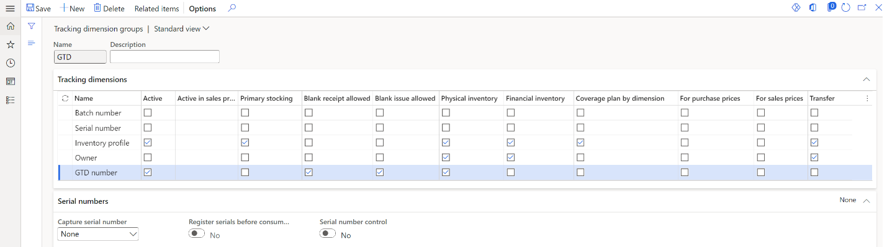

# Set up customs clearance

This topic provides information about the registration information, which
reflects the process of customs clearance of products transported across the
border of the Russian Federation:

-   calculation of customs payments: import and export customs fees, customs
    duties, value added tax (VAT) and excise tax collected on the import of
    products to the customs territory of the Russian Federation
-   reflection of the issue by the customs authorities of the cargo customs
    declaration (GTD) and the adjustment of the customs value (KTS)
-   generation of postings on debts to customs or customs broker for the amount
    of customs payments
-   adjustment of the cost of imported products for the amount of customs duties
    and fees
-   write-off of duties and fees for expenses

## Set up currency of statistical value and number sequences

1.  Go to **Inventory management** \> **Setup** \> **Inventory and warehouse
    management parameters**.
2.  On the **General** tab, in the **Customs declaration** section, in the
**Currency of statistical value** field, select a currency code of the
statistical value to reflect the totals for customs payments. For example,
**USD**.
3.  On the Action Pane, select **Save**.

>[!NOTE] 
>If this field is empty, on the **Section overview** form, the main
currency of the company will be used as the currency of the statistical value.

4.  On the **Number sequences** tab, set number sequences for numbering customs
journals, KTS numbers, operations for posting GTD and KTS in a usual way.

## Set up Inventory profile and GTD number

1.  Go to **Product information management** \> **Setup** \> **Dimension and
    variant groups** \> **Tracking dimension groups**.
2.  Create and set up a customs declaration number as described in [Customs
    declaration
    numbers](https://docs.microsoft.com/en-us/dynamics365/finance/localizations/rus-custom-declaration-number#set-up-customs-declaration-numbers-in-tracking-dimensions).
    When creating, on the **Tracking dimensions** FastTab, select the following
    check boxes to activate the inventory profile and the GTD number:
3.  On the **Inventory profile** line, select the **Active** and **Coverage plan
    by dimension** check boxes;
4.  On the **GTD number** line, select the **Active**, **Blank receipt
    allowed**, **Blank issue allowed** and **Physical inventory** check boxes.
5.  On the Action Pane, select **Save**.

## Set up ledger posting groups

1.  Go to **Tax \> Setup \> Sales tax \> Ledger porting groups.**
2.  Create a ledger posting group for each of the following type of customs
    duties and fees:

    -   Customs duty for import
    -   Customs duty for export
    -   Customs fee for escort
    -   Customs fee for storage
    -   Customs fee for export issuance
    -   Customs fee for import issuance

3.  In the **Sales tax receivable** field, select an expense account for this
    type of tax. For example, select account **91** with subaccounts for customs
    duty for import or export, customs fee for escort and account **44** with
    subaccounts for customs fee for storage, customs fee for import or export
    issuance.

>[!NOTE] 
>In the case of import deliveries, the configured account is used only if
duties and fees are not included in the cost of the product.

4.  On the Action Pane, select **Save**.

| **Ledger posting group**        | Value of the **Sales tax receivable** field |
|---------------------------------|---------------------------------------------|
| Customs duty for import         | 91.                                         |
| Customs duty for export         | 91.                                         |
| Customs fee for escort          | 91.                                         |
| Customs fee for storage         | 44.                                         |
| Customs fee for export issuance | 44.                                         |
| Customs fee for import issuance | 44.                                         |

### Set up a fixed unit

To calculate customs payments for the calculation method **Weight** or
**Volume**, set up fixed units.

1.  Go to **Organization
    administration** \> **Setup** \> **Units** \> **Units**.
2.  If it is necessary, create and set up the unit in a usual way. For more
    information, see [Manage units of
    measure](https://docs.microsoft.com/dynamics365/supply-chain/pim/tasks/manage-unit-measure).
3.  On the **General** FastTab, set the following fields:
   
    -   In the **Classification** section, in the **Unit class** field, select
        the quantity, volume or weight indicator.
    -   In the **Roles** section, set the **System unit** option to **Yes**.

4.  On the Action Pane, select **Save**.

### Set up sales tax codes

To set up a sales tax codes that can be used to automatically calculate customs
payments, follow these steps.

1.  Go to **Tax** \> **Indirect taxes** \> **Sales tax** \> **Sales tax codes**.
2.  Create and set up the sales tax code as described in [Set up sales tax
    codes](https://docs.microsoft.com/dynamics365/finance/general-ledger/tasks/set-up-sales-tax-codes).
3.  In the **Type of tax** field, select **Customs duty** or **Customs fee**.
4.  On the **General** FastTab, in the **Ledger posting group** field, select a
    ledger posting group that you created earlier.
5.  For customs fee set the following fields:

    -  On the **Calculation** FastTab, in the **Origin** field, select **Amount
        per unit.**
    -  In the **Unit** field, select the unit value.
    -  On the **General** FastTab, in the **Fee type** field, select the type
        of customs fee.

>[!NOTE] 
>You can create only one sales tax code for **Export issuance** and for
**Import issuance** values of the **Fee type** field.

    -  Optional: For **Escort** and **Storage** fee type, on the Action Pane,
    select **Sales tax code \> Limits** and configure the limits of escort or
    volume of stored products.

    -  On the Action Pane, select **Save** and close this page.

6.  For customs duty set the following fields:

    -  On the **General** FastTab, in the **Complex rate** field, select the
        complex rate value that is applied to the customs duty:

        -   If this field isn’t set, the complex rate value is an ad valorem
            duty and is calculated as a percentage of the customs value of the
            products. In this case, the distribution of the duty on the lines of
            the section in the customs journal is made in proportion to the
            value.
        -   If this field is set to **Maximum**, the rate is calculated as
            specific: the calculated value of the customs duty (from the customs
            value) will be compared with the value is defined by the formula K =
            (r \* m) / q, where *r* is the value of the **Amount rate** field,
            *m* is the value of the quantity, weight or volume in the customs
            journal based on the **Method of duty calculation** field, *q* is
            the value of the **Calculated quantity** field. The maximum of these
            values is chosen as the duty value. In this case, the distribution
            of the duty on the lines of the section in the customs journal is
            made based on the value of the **Method of duty calculation** field.
        -   If this field is set to **Summation**, the calculated value of the
            customs duty (from the customs value) will be added to the value is
            defined by the formula K = (r \* m) / q, where *r* is the value of
            the **Amount rate** field, *m* is the value of the quantity, weight
            or volume in the customs journal based on the **Method of duty
            calculation** field, *q* is the value of the **Calculated quantity**
            field. In this case, the distribution of the duty on the lines of
            the section in the customs journal is made in proportion to the
            value.

    -  If the **Complex rate** field is set, set the following fields:

       -   In the **Method of duty calculation** field, select the method that is
        used to calculate the customs duty.
       -   In the **Unit** field, select the value of the unit of measurement in
        which the value of the **Amount rate** field is measured.
    -   On the Action Pane, select **Sales tax code \> Values**.
    -   In the **Amount rate** field, enter the amount for a specific rate of
        customs duty that is defined by the customs authorities.
    -   In the **Currency** field, select the currency that is used for the
        calculation of customs duty.
    -   In the **Calculated quantity** field, enter the quantity of products for
        the customs duty rate.

7.  On the Action Pane, select **Save**.

## Set up an inventory profile

1.  Go to **Inventory management** \> **Setup** \> **Dimensions** \> **Inventory
    profiles**.
2.  Create and set up an inventory profile in a usual way.
3.  On the **Setup** FastTab, in the **Kind of activity** field, select
    **Basic**.
4.  On the Action Pane, select **Save**.

## Set up the terms of delivery for customs clearance of products

Follow these steps to set up the terms of delivery for the customs clearance of
imported products, which determine the time of transfer of ownership, and the
overhead expenses.

1.  Go to **Accounts payable** \> **Setup** \> **Terms of delivery**.

–or–

    Go to **Procurement and sourcing** \> **Setup** \> **Distribution** \> **Terms of delivery**.

–or–

    Go to **Sales and marketing** \> **Setup** \> **Distribution** \> **Terms of delivery**.

2.  Create and set up a term of delivery in a usual way.

3.  On the **General** FastTab, set the following fields:

    -   In the **Receipt transactions status** field, select the status of the
        receipt transactions to include in the customs journal of import:

        -   **Purchased** – The products in transit are purchased. The transfer
            of ownership occurs before crossing the customs border.
        -   **On order** – The products in transit are ordered but not
            purchased. The transfer of ownership occurs after crossing the
            customs border.

    -   In the **Inventory profile** field, select the inventory profile that is
        used for inventory transactions after the customs cargo declaration is
        issued. This field is available only if you have selected **Purchased**
        in the **Receipt transactions status** field.

>[!NOTE]
>The inventory profile must have a **Basic** activity.

4.  On the Action Pane, select **Save**.

## Set up a charges code for customs payments

If for imported purchases the transfer of ownership occurred after the customs
clearance procedure, the amounts of customs duties and fees adjust the purchase
amount. The invoice lines (for duties and fees) are created automatically when
posting the customs journal or the KTS journal.

If the transfer of ownership occurred before crossing the customs border, the
change in the cost of receipt is carried out by correcting the overhead expenses
for the purchase order invoice when posting the customs journal or the KTS
journal.

The cost adjustment is made if the **Include to the cost** option is set to
**Yes** in the customs journal header or in the KTS journal. Otherwise, the
amount of fees and duties will be charged to the account set up in the posting
group of the corresponding tax code as expenses.

To set up a charges code that is used to calculate customs payments for import
and export operations, follow these steps.

1.  Go to **Accounts payable** \> **Charges** **setup** \> **Charges code**.

2.  On the Action Pane, select **New**. Set up the charges code in a usual way.
    For more information, see [Create charges
    codes](https://docs.microsoft.com/en-us/dynamicsax-2012/appuser-itpro/create-charges-codes).

3.  In the **Customs payment type** field, select the type of customs payment to
    establish compliance with the overhead expense.

>[!Note]
>The charges codes that have the **Customs payment type** field filled in
are not available for manual choosing when creating a purchase order.

4.  On the **Posting** FastTab, set the following fields:

    -   In the **Type** field, select **Item** for **Debit** section and
        **Ledger account** for **Credit** section.
    -   In the **Credit** section, in the **Posting** field, select the
        appropriate posting type. For example, **Purchase charges duty** for
        duty.
    -   In the **Credit** section, in the **Account** field, select an account
        that will be used as a transit account, in case of transfer of ownership
        after the customs clearance procedure. In this case, the invoice is
        posted in two iterations: to the transit account when posting the
        customs journal or the KTS journal, and to the nomenclature account when
        posting the purchase order invoice.

5.  On the Action Pane, select **Save**.

## Assign a charges code to terms of delivery

To relate the terms of delivery with overhead expenses that increase the
transaction amount (the cost of imported products), follow these steps.

1.  Go to **Inventory management** \> **Setup** \> **Custom
    payments** \> **Misc. charges relation with terms of delivery**.
2.  On the Action Pane, select **New**.
3.  In the **Charges code** field, select a charges code that should be used
    when calculating customs payments for the specified delivery condition. The
    amount of the overhead expense will be automatically added to the invoice
    value when calculating customs payments.
4.  In the **Delivery terms** field, select a term of delivery for the charges
    code.

>[!NOTE]
>After processing the customs journal, it is forbidden to distribute on
the lines of the included in the customs journal purchase or invoice overhead
expenses, whose delivery condition corresponds to the delivery conditions in the
customs journal header, because these overhead expenses affect the basis for
calculating customs payments.

## Set up a product

1.  Go to **Product information management** \> **Products** \> **Released
products**.
2.  If it’s necessary, create and set up a new product in a usual way.

>[!NOTE]
>On the Manage inventory FastTab, in the **Weight measurements** and
**Physical dimensions** sections you must specify volume and weight
characteristics of the product to distribute customs payments on the lines of
the customs journal.

3.  In the **Tracking dimension group** field, select a GTD group that you created
earlier.
4.  In the **Units of measures** section, in the **Inventory unit**, **Purchase
unit** and **Sales unit** fields, select a unit that you set earlier.
5.  Select **OK**.
6.  On the **General** FastTab, in the **Charges** section, in the **Charges code**
field select a charges code for transportation. This field is available only for
services.

## Set up a customs counteragent 

Follow these steps to set up a vendor account as a customs authority or a
customs broker. You can also set up a customs office code and a posting profile
that is used to calculate customs payments. This information is included in
customs declarations that are submitted to the customs authority. The codes for
the customs offices are defined in the Customs Code of the Russian Federation.

1.  Go to **Inventory management** \> **Setup** \> **Custom
    payments** \> **Customs counteragents**.
2.  On the Action Pane, select **New**. 

    -   In the **Counteragent account** field, select a vendor account number as the
    counteragent account number.
    -   In the **Counteragent type** field, select the type of counteragent:
    -   **Custom authority**. In this case, the counteragent cannot act as a customs
    counteragent. The debt on customs payments will be formed to the customs.
    The contract can only have the type of contract with customs.
    -   **Custom broker**. In this case, the counteragent acts as a customs
    counteragent. When creating a customs journal, you can select its contract
    as a contract with a customs counteragent. In this case, the debt on customs
    payments will be formed to the customs broker.
    -   In the **Description** field, enter a brief description of the customs
    counteragent.
    -   In the **Posting profile** field, select the posting profile that is used to
    calculate the customs payments.

>[!Note]
>**Acquit method** field is available only when you select **Custom
broker** in the **Counteragent type** field.

    -   In the **Acquit method** field, select the acquit method for the customs
    services that are provided. The acquit method determines the counteragent to
    whom the debt on customs payments and fees will be formed.

>[!NOTE]
>If the value **Broker or customs** is selected in the **Acquit method**
field, the debt on customs payments will be generated to the broker or customs
depending on the selection when creating the customs journal.

3.  On the Action Pane, select **Save**.
4.  If you have chosen **Custom authority** in the **Counteragent type** field,
    on the Action Pane, select **Customs offices** to set customs office code.
5.  On the Action Pane, select **New**.
4.  In the **Customs office code** field, enter an eight-digit code.
5.  On the Action Pane, select **Save**.
6.  The following commands are available on the Action Pane:

    -   **Indicative prices** - Set up indicative or estimated prices for a TN
        VED code.
    -   **Item relation with TN VED** - Assign a product to a TN VED code.

## Set up TN VED codes

1.  Go to **Inventory management** \> **Setup** \> **Custom payments** \> **TN
    VED codes**.
2.  On the Action Pane, select **New**.
3.  In the **Blocked** field, mark this check box to indicate that the selected
    TN VED code is blocked. Only non-blocked TN VED codes can be associated with
    a customs payment or an indicative price.
4.  In the **TN VED code** field, enter the identification for a TN VED code.
    The TN VED code must be 10 characters. TN VED codes are defined in Russian
    customs legislation documents.
5.  In the **Name** field, enter the name of the TN VED code.
6.  In the **Description** field, enter a short description for the TN VED code.
7.  The following commands are available on the Action Pane:

    -   **Indicative prices** - Set up indicative or estimated prices for a TN
        VED code.
    -   **Item relation with TN VED** - Assign an produc to a TN VED code.
    -   **Customs payments relation with TN VED** - Assign a TN VED code to a
        customs payment.

## Item relation with TN VED

You must assign an product to a TN VED code, so that the customs declarations
reflect the product details when a TN VED code is used.

1.  Go to **Inventory management** \> **Setup** \> **Custom payments** \> **Item
    relation with TN VED**.
2.  On the Action Pane, select **New**.

    -   In the **From date** field, select the starting date of the association
        between the TN VED code and the product.
    -   In the **Action date** field, select the action date for the product
        that is assigned to a TN VED code.
    -   In the **Customs code** field, select the identification code of the
        customs counteragent. If this field is empty, the product relation
        applies to all customs posts.
    -   In the **TN VED code** field, select a TN VED code for the product.
    -   In the **Item number** field, select the product number that is assigned
        to a TN VED code. The product number is set up in the **Released product
        details** page.
    -   The **Product name** field is filled in automatically and shows the
        identification code of the product that is related to the TN VED code.
    -   The **Customs name** field is filled in automatically if the **Customs
        code** field is not empty and shows the name of the counteragent.

## Set up indicative prices

To set up indicative prices determined by customs authorities for customs
clearance of products in addition to the transaction (invoice) value, follow
these steps.

1.  Go to **Inventory management** \> **Setup** \> **Custom
    payments** \> **Indicative prices of TN VED**.
2.  On the Action Pane, select **New** to create an indicative price and fill in
    the following fields:

    -   In the **Description** field, enter the description of the indicative price.
    -   In the **From date** field, select the activation date of the indicative
    price for the import or export of products.
    -   The **Customs code** field is filled in automatically and shows the
        customs counteragent code that the indicative price is selected for. If
        this field is empty, the indicative price applies to all customs posts.
    -   The **Customs name** field is filled in automatically and shows the name
        of the counteragent.
    -   In the **TN VED code** field, select the TN VED code that the indicative
    price is selected for. Only non-blocked TN VED codes are available for
    selection.
    -   In the **Price for import** and **Price for export** fields, enter the
    indicative prices for import and export.
    -   In the **Currency** field, select the currency code for the indicative
    price.
    -   In the **Quantity** field, enter the quantity of products for the import and
    export price.
    -   In the **Unit** field, select the type of unit for the indicative price.

3.  On the Action Pane, select **Save**.
4.  To correct indicative prices, on the Action Pane, select **Change**:

    -   On the **Change of settings** dialog box, you can change the following
        fields: **From date**, **Price for import**, **Price for export**,
        **Currency**, **Quantity**, **Unit**.
    -   Then, select **OK**. The changes made will be applied to all selected
        lines.

## Set up customs payments relation with TN VED

1.  Go to **Inventory management** \> **Setup** \> **Custom payments** \> **TN
    VED code relation with customs payment**.
2.  On the Action Pane, select **New** to set up the relationship:

    -   In the **From date** field, select the starting date of the relationship
    between the TN VED code and the customs payment that is calculated based on
    the customs duty and fees.
    -   In the **TN VED code** field, select the TN VED code to associate with the
    customs payment. Only non-blocked TN VED codes are available for selection.
    -   In the **Direction** field, select the direction of the product movement from
the following options: **Import** , **Export** or **All.**

>[!NOTE]
>When searching for the configuration line, the system determines the
record by the type of the journal (**Import** or **Export**). If there are no
values for the corresponding type, then the setting with the **All** type is
used.

    -   In the **VAT** field, select the tax code with the tax type **Standard
    VAT**, **Reduced VAT**, or **VAT 0%**. This field is not available for
    export direction.
    -   In the **Excise** field, select the sales tax code that is used to calculate
    excise duty. This field is not available for export direction.
    -   In the **Customs duty** field, select the sales tax code that is used to
    calculate customs duty.
    -   Optional: In the **Country/region** field, enter the code of the country of
    origin of the payment.

3.  On the Action Pane, select **Save**.

## Set up a vendor as a foreign counteragent

To set up a vendor as a foreign counteragent, so that the vendor can transfer
products that must be imported, follow these steps.

>[!NOTE]
>The vendor must be set up as a foreign counteragent before you can
create a customs journal for the import operation.

1.  Go to **Accounts payable** \> **Vendors** \> **All vendors**.
2.  If it is necessary, create and set up a new vendor account in a usual way.
3.  On the **Action Pane**, select **Edit**. 
4.  Click on the vendor account in the **Vendor account** field.
5.  On the **General** FastTab, in the **Identification** section, set the
    **Foreign counteragent** option to **Yes**.
6.  On the **Invoice and delivery** FastTab, in the **Delivery** section, in
    the **Delivery terms** field select a term of delivery that you created
    earlier.
7.  On the** **Action Pane, select **Save**. 

## Set up a customer as a foreign counteragent

To set up a customer as a foreign counteragent, so that the customer can receive
products that must be exported, follow these steps.

>[!NOTE] 
>The customer must be set up as a foreign counteragent before you can
create a customs journal for the export operation.

1.  Go to **Accounts receivable** \> **Customers** \> **All customers**.
2.  If it is necessary, create and set up new customer account in a usual way.
3.  On the Action Pane, select **Edit**. 
4.  Click on the customer account in the **Account** field.
5.  On the **General** FastTab, in the **Customer** section, set the **Foreign
    counteragent** to **Yes**.
6.  On the **Invoice and delivery** FastTab, in the **Delivery** section, in
    the **Delivery terms** field select a term of delivery that you created
    earlier.
7.  On the Action Pane, select **Save**. 

## Create and set up a warehouse to calculate customs payments

In case of import deliveries of products, the transfer of ownership may occur
before the customs clearance procedure is carried out. To automatically move an
product from the warehouse for products in transit to a customs warehouse,
follow these steps.

1.  Go to **Inventory management** \> **Setup** \> **Inventory
    breakdown** \> **Warehouses**.
2.  If it is necessary, create and set up new warehouse in a usual way.
3.  On the **General** FastTab, in the **Customs** section, in the **Customs
    code** field, select the code of the customs counteragent for the customs
    office that the warehouse is associated with.
4.  On the Action Pane, select **Save**.

