---
# required metadata
title: Set up an inventory profile 
description: This topic provides information about setting up inventory profile.
author: v-nadyuz
ms.date: 05/11/2020
ms.topic: article
ms.prod: 
ms.technology: 

# optional metadata

# ms.search.form:  
audience: Application User
# ms.devlang: 
ms.reviewer: kfend
# ms.tgt_pltfrm: 
# ms.custom: 
ms.search.region: Russia
# ms.search.industry: 
ms.author: kfend
ms.search.validFrom: 2018-10-28
ms.dyn365.ops.version: 8.1

---

# Set up an inventory profile 
[!include [banner](../includes/banner.md)]

## Create an inventory profile

1. Go to **Inventory management** \> **Setup** \> **Dimensions** \> **Inventory profiles**.
2. Select **New** to create a new inventory profile.
3. In the **Inventory profile** field, enter the identifier of the inventory profile.
4. In the **Name** field, enter a description of the inventory profile.
5. On the **Setup** FastTab, in the **Kind of activity** field, select the kind of activity for the inventory profile.
6. Set the **Don't match** option to **Yes** if the inventory profile doesn't have to participate in the automatic selection of inventory profiles from on-hand inventory when you create sales order lines by selecting **Create lines**.
7. On the **Matching priority** FastTab, use the **Up** and **Down** buttons to set the order that inventory profiles are automatically selected in when you create sales order lines by selecting **Add lines**.

    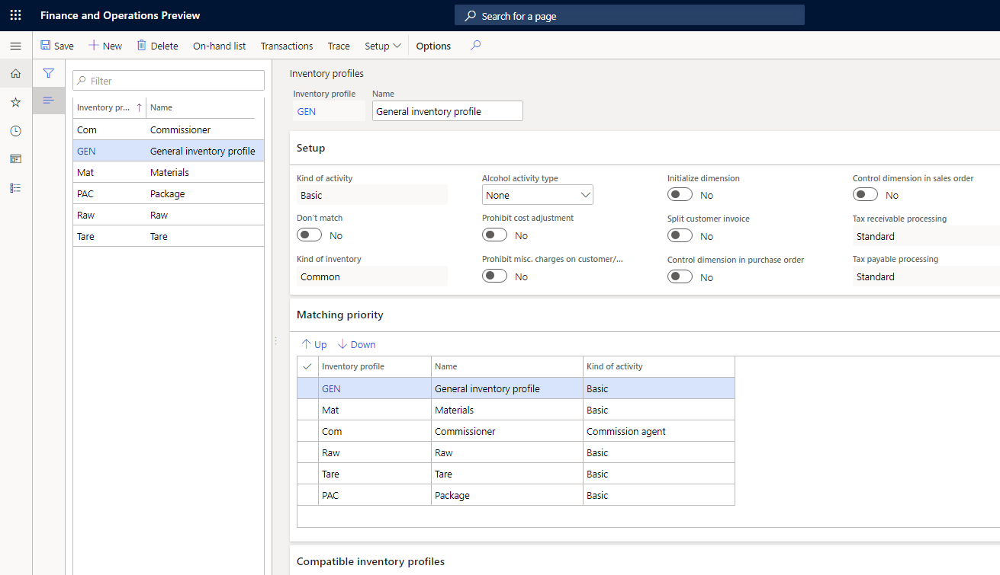

8. Select **Save**.

> [!NOTE]
> You can delete an inventory profile only if there are no balances on it.

## Set up compatible inventory profiles

1. Go to **Inventory management** \> **Setup** \> **Dimensions** \> **Inventory profiles**.
2. Select the inventory profile that you want to set up compatible inventory profiles for.

    - On the **Compatible inventory profiles** FastTab, the **Compatible** list shows the inventory profiles that are compatible with the selected inventory profile. The **Other** list shows other inventory profiles.

3. Set up the list of compatible inventory profiles.

    - Select → to move a selected inventory profile from the **Other** list to the **Compatible** list. The inventory profile is added to the end of the **Compatible** list.
    - Select ← to remove a selected inventory profile from the **Compatible** list and add it to the **Other** list.
    - Select ⊞→ to move all the inventory profiles from the **Other** list to the **Compatible** list. The profiles are consistently added to the end of the **Compatible** list.
    - Select ←⊞ to remove all the inventory profiles from the **Compatible** list and add them to the **Other** list.
    - Use **Up** and **Down** to set the matching order that is used for inventory profiles that are compatible with the selected inventory profile when inventory profiles are automatically selected from the on-hand inventory in the sales order.

4. Select **Save**.

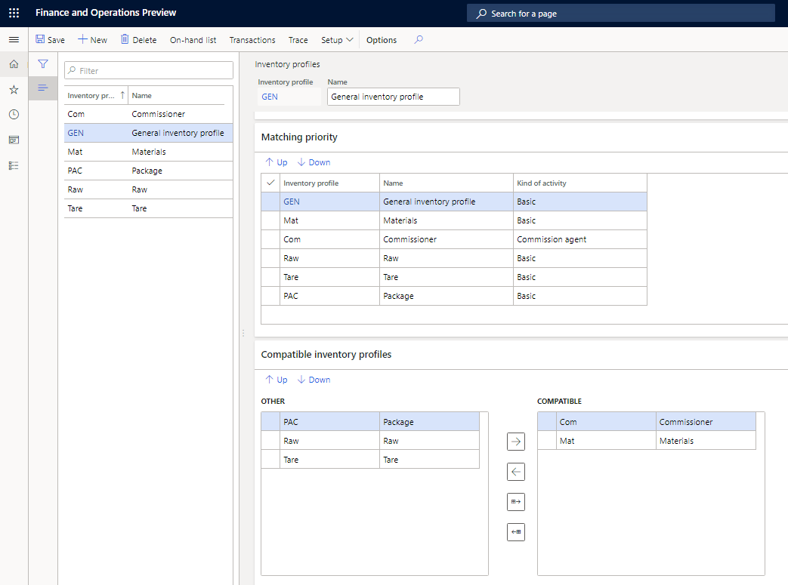

## Set up an inventory profile in tracking dimension groups

1. Go to **Product information management \> Setup \> Dimension and variant groups \> Tracking dimension groups**.
2. In the left pane, select a dimension group, or select **New** to create a new dimension group.
3. In the **Name** field, enter the name of the dimension group.
4. In the **Description** field, enter a description of the dimension group.
5. On the **Tracking dimensions** FastTab, on the **Inventory profile** line, select the **Active** check box to activate the inventory profile.

    The **Primary stocking**, **Physical inventory**, **Financial inventory**, and **Transfer** check boxes are selected by default.

6. Select **Save**.

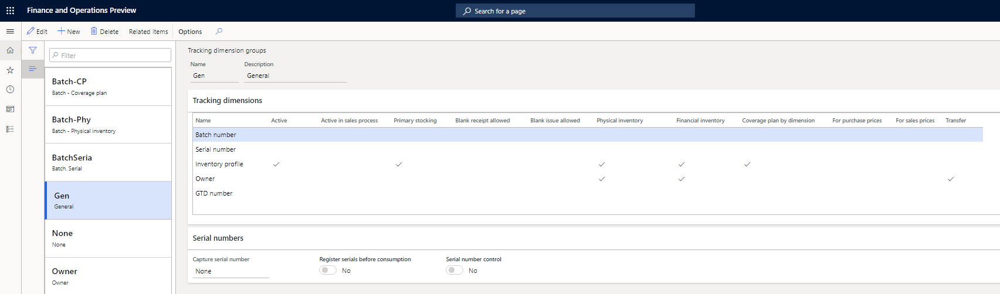

## Activate transaction combinations for inventory profiles

1. Go to **Inventory management \> Setup \> Posting \> Transaction combinations**.
2. Select **Edit**.
3. In the **Inventory profile relation** section, set the following values:

    - Select the **Activate inventory profile relation All** check box if you want to be able to set up inventory posting without specifying an inventory profile.
    - Select the **Activate inventory profile relation Group** check box if you want to be able to set up inventory posting for kinds of activity.
    - Select the **Activate inventory profile relation Table** check box if you want to be able to set up inventory posting for inventory profiles.

4. Select **Save**.

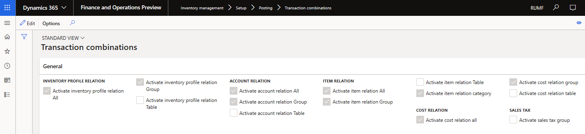

## Set up inventory posting in the context of an inventory profile

1. Go to **Inventory management** \> **Setup** \> **Posting** \> **Posting**.
2. In the left pane, select the posting type, and create a new line.
3. In the **Inventory profile relation** field, select one of the following values:

    - **Profile** – Set up inventory posting for a specific inventory profile.
    - **Type** – Set up inventory posting for a specific kind of activity.
    - **All** – Set up inventory posting without specifying a kind of activity or an inventory profile.

4. In the **Kind of activity** field, select the kind of activity that you want to set up inventory posting for. This field is available only if you selected **Type** in the **Inventory profile relation** field.
5. In the **Inventory profile** field, select the inventory profile that you want to set up inventory posting for. This field is available only if you selected **Profile** in the **Inventory profile relation** field.

> [!IMPORTANT]
> The inventory profile settings in the inventory posting setup have priority over the other settings. For example, you have two sets of posting  settings:
>   
>   - Settings for a specific item and any inventory profile
>   - Settings for a specific inventory profile and all items
>   
>   In this case, the system will select the second set of settings.

## Set up a relation between inventory profiles and customer and vendor posting profiles

1. Go to **Inventory management** \> **Setup** \> **Posting** \> **Inventory profile – posting profile**.
2. Select **New** to create a new line.
3. In the **Inventory profile relation** field, select one of the following values:

    - **Profile** – Set up customer and vendor posting profiles for a specific inventory profile.
    - **Type** – Set up customer and vendor posting profiles for a specific kind of activity.
    - **All** – Set up customer and vendor posting profiles without specifying a kind of activity or an inventory profile.

4. In the **Kind of activity** field, select the kind of activity that you want to set up posting profiles for. This field is available only if you selected **Type** in the **Inventory profile relation** field.
5. In the **Inventory profile** field, select the inventory profile that you want to set up posting profiles for. This field is available only if you selected **Profile** in the **Inventory profile relation** field. When you select a specific inventory profile, the **Kind of activity** field is automatically set to the corresponding kind of activity.
6. Set the **Vendor posting profile** and **Customer posting profile** fields.
7. Select **Save**.

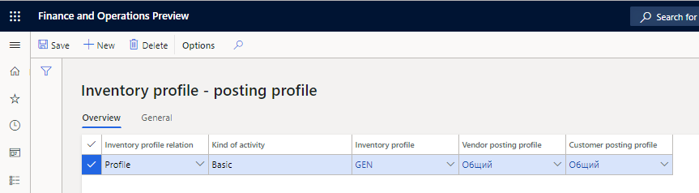

## Set up a default kind of activity and inventory profile for vendors, customers, agreements, and warehouses

You can specify the default kind of activity and inventory profile in a vendor, customer, agreement, or warehouse master record. On the **All vendors**, **All customers**, **Purchase agreements**, **Sales agreements**, or **Warehouses** page, set the following fields.

<table>
<thead>
<tr>
<td width="123">

<strong>Page</strong>

</td>
<td width="123">

<strong>FastTab</strong>

</td>
<td width="104">

<strong>Section</strong>

</td>
<td width="369">

<strong>Fields</strong>

</td>
</tr>
</thead>
<tbody>
<tr>
<td width="123">

All vendors

</td>
<td width="123">

Purchase order defaults

</td>
<td width="104">

Inventory profile

</td>
<td width="369">

&middot;&nbsp;&nbsp;&nbsp;&nbsp;&nbsp;&nbsp;&nbsp;&nbsp; <strong>Kind of activity</strong> &ndash; Select the kind of activity that should be entered by default in purchase orders from the vendor.

&middot;&nbsp;&nbsp;&nbsp;&nbsp;&nbsp;&nbsp;&nbsp;&nbsp; <strong>Inventory profile</strong> &ndash; Select the inventory profile that should be entered by default in purchase orders from the vendor.

</td>
</tr>
<tr>
<td width="123">

All customers

</td>
<td width="123">

Sales order defaults

</td>
<td width="104">

Inventory profile

</td>
<td width="369">

&middot;&nbsp;&nbsp;&nbsp;&nbsp;&nbsp;&nbsp;&nbsp;&nbsp; <strong>Kind of activity</strong> &ndash; Select the kind of activity that should be entered by default in sales orders from the customer.

&middot;&nbsp;&nbsp;&nbsp;&nbsp;&nbsp;&nbsp;&nbsp;&nbsp; <strong>Inventory profile</strong> &ndash; Select the inventory profile that should be entered by default in sales orders from the customer.

</td>
</tr>
<tr>
<td width="123">

Purchase agreements

</td>
<td width="123">

Financial (in the <strong>Header</strong> view)

</td>
<td width="104">

Inventory profile

</td>
<td width="369">

&middot;&nbsp;&nbsp;&nbsp;&nbsp;&nbsp;&nbsp;&nbsp;&nbsp; <strong>Kind of activity</strong> &ndash; Select the kind of activity that should be entered by default in purchase orders from the purchase agreement.

&middot;&nbsp;&nbsp;&nbsp;&nbsp;&nbsp;&nbsp;&nbsp;&nbsp; <strong>Inventory profile</strong> &ndash; Select the inventory profile that should be entered by default in purchase orders from the purchase agreement.

When you create a new purchase agreement with a vendor, the <strong>Kind of activity</strong> and <strong>Inventory profile</strong> fields are automatically filled in from the vendor.

</td>
</tr>
<tr>
<td width="123">

Sales agreements

</td>
<td width="123">

Financial (in the <strong>Header</strong> view)

</td>
<td width="104">

Inventory profile

</td>
<td width="369">

&middot;&nbsp;&nbsp;&nbsp;&nbsp;&nbsp;&nbsp;&nbsp;&nbsp; &nbsp;<strong>Kind of activity</strong> &ndash; Select the kind of activity that should automatically be used in sales orders that use the sales agreement.

&middot;&nbsp;&nbsp;&nbsp;&nbsp;&nbsp;&nbsp;&nbsp;&nbsp; <strong>Inventory profile</strong> &ndash; Select the inventory profile that should automatically be used in sales orders that use the sales agreement.

When you create a new sales agreement with a customer, the <strong>Kind of activity</strong> and <strong>Inventory profile</strong> fields are automatically filled in from the customer record.

</td>
</tr>
<tr>
<td width="123">

Warehouses

</td>
<td width="123">

General

</td>
<td width="104">

Inventory profile

</td>
<td width="369">

&middot;&nbsp;&nbsp;&nbsp;&nbsp;&nbsp;&nbsp;&nbsp;&nbsp; <strong>Kind of activity</strong> &ndash; Select the kind of activity that should be entered by default in transfer orders from the warehouse.

&middot;&nbsp;&nbsp;&nbsp;&nbsp;&nbsp;&nbsp;&nbsp;&nbsp; <strong>Inventory profile</strong> field, select the inventory profile that should be entered by default in transfer orders from the warehouse.

</td>
</tr>
</tbody>
</table>

&nbsp;

> [!NOTE]
> When you select a specific inventory profile, the **Kind of activity** field is automatically set to the corresponding kind of activity.

## Set up a default inventory profile for BOMs

1. Go to **Inventory management \> Journal entries \> Items \> Bills of materials**.
2. Select a BOM journal and its line.
3. On the **Line details** FastTab, on the **Inventory dimensions** tab, in the **Inventory profile** field, select an inventory profile.

> [!NOTE]
> You can't explode or accept the BOM, or create a production order, if all the following conditions are met:
>
>   - The inventory profile is active for the item on the BOM line.
>   - The BOM line doesn't specify the **Inventory profile** dimension.
>   - The **Inventory profile** field on the **Bills of materials** tab of the **Inventory and warehouse management parameters** page is blank.

## Set up a default inventory profile for purchase orders

On the **Procurement and sourcing parameters** page, you can select a default inventory profile. That inventory profile will then automatically be entered in purchase orders if default inventory profiles and kinds of activity aren't selected for the vendor record and purchase agreement record.

1. Go to **Procurement and sourcing \> Setup \> Procurement and sourcing parameters**.
2. On the **General** tab, on the **Default values and parameters** FastTab, in the **Inventory profile** field, select the inventory profile that should automatically be used in purchase orders.

    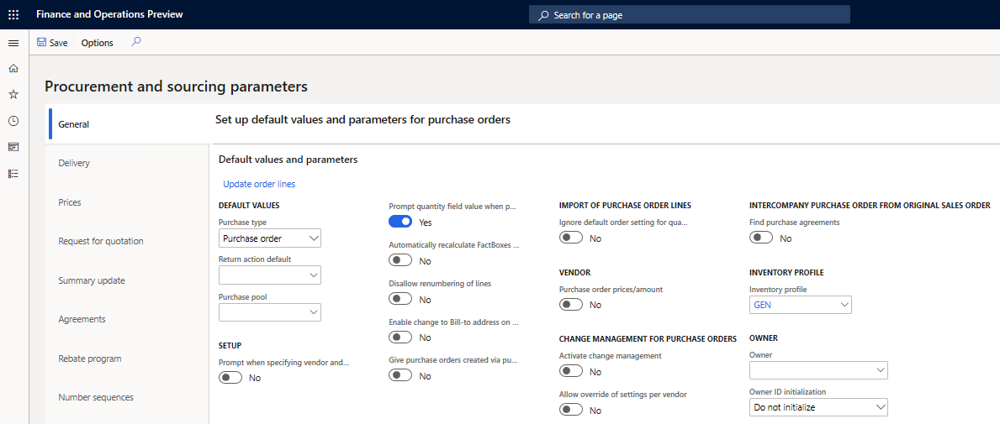

3. Select **Update order lines** to open the **Update order lines** dialog box.

    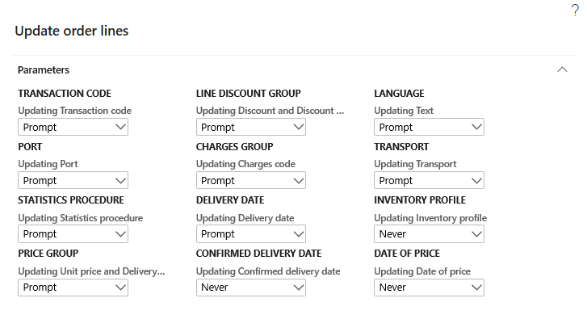

4. In the **Inventory profile** section, in the **Updating Inventory profile** field, select one of the following values to set up the rules that are used to update the **Inventory profile** field on purchase order lines when the corresponding field in the purchase order header is changed:

    - **Never** – The inventory profile on the order lines should not automatically be updated when the inventory profile in the order header is changed.
    - **Always** – The inventory profile on the order lines should always automatically be updated when the inventory profile in the order header is changed.
    - **Prompt** – The system should prompt you to update the inventory profile on the order lines when you change the inventory profile in the order header.

5. Close the **Update order lines** dialog box.
6. On the **Procurement and sourcing parameters** page, on the **Summary update** tab, in the **Split based on** section, set the two **Product receipt** options:

    - Set the option in the **Posting profile** column to **Yes** if you want to split purchase order product receipts by the vendor posting profiles that are specified on the purchase order lines.
    - Set the option in the **Kind of activity** column to **Yes** if you want to split purchase order packing slips by the kinds of activity that include the inventory profiles that are specified on the purchase order lines.

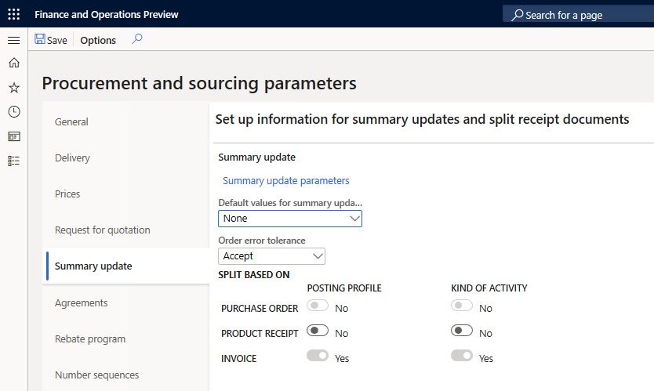

> [!NOTE]
> The **Invoice** option in both the **Posting profile** column and the **Kind of activity** column is always set to **Yes** and can't be changed. Therefore, purchase order invoices are always split by vendor posting profiles and kinds of activity.

## Set up a default inventory profile for sales orders

On the **Accounts receivable parameters** page, you can select a default inventory profile. That inventory profile will then automatically be selected in sales orders if default inventory profiles and kinds of activity for the customer record and sales agreement record aren't selected.

1. Go to **Accounts receivable** \> **Setup** \> **Accounts receivable parameters**.
2. On the **General** tab, on the **Sales setup** FastTab, in the **Inventory profile** field, select the inventory profile that should automatically be used in sales orders.
3. Set the **Use compatible inventory profiles** option to **Yes** if compatible inventory profiles should automatically be used in sales orders.
4. Set the **Split order lines by inventory profiles** option to **Yes** to automatically split sales order lines by the inventory profiles when **Create lines** is used from the available physical quantity.

    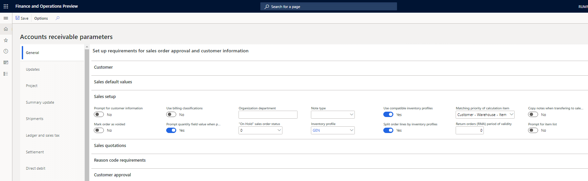

5. On the **Summary update** tab, on the **Split based on** FastTab, set the **Posting profile** option in the **Packing slip** column to **Yes** to split sales order packing slips by the customer posting profiles that are specified on the sales order lines.
6. Set the **Kind of activity** option in the **Packing slip** column to **Yes** to split sales order packing slips by the kinds of activity that the inventory profiles that are specified on the sales order lines correspond to.

    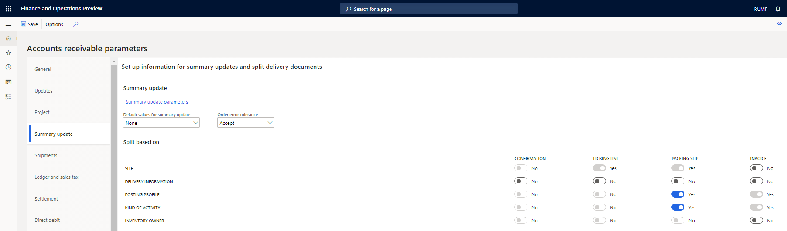

    > [!NOTE]
    > In the **Invoice** column, the **Posting profile** and **Kind of activity** options are always set to **Yes** and can't be changed. Therefore, sales order invoices are always split by customer posting profiles and kinds of activity.

7. On the **Updates** tab, on the **Order lines** FastTab, select **Update order lines** to open the **Update order lines** dialog box.
8. In the **Mode of delivery** section, in the **Updating Inventory profile** field, select one of the following values:

    - **Never** – The inventory profile on the order lines should not automatically be updated when the inventory profile in the order header is changed.
    - **Always** – The inventory profile on the order lines should always automatically be updated when the inventory profile in the order header is changed.
    - **Prompt** – The system should prompt you to update the inventory profile on the order lines when you change the inventory profile in the order header.

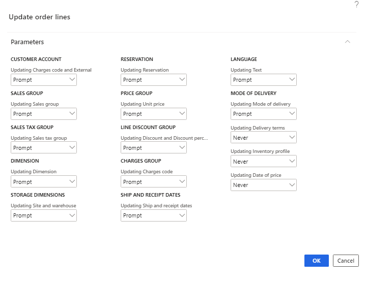

## Set up a default inventory profile for transfer orders

On the **Inventory and warehouse management parameters** page, you can select a default inventory profile. That inventory profile will then automatically be selected in transfer orders if a default inventory profile and kind of activity for the warehouse record aren't selected.

1. Go to **Inventory management** \> **Setup** \> **Inventory and warehouse management parameters**.
2. On the **General** tab, in the **Inventory profile** section, in the **Inventory profile** field, select the inventory profile that should automatically be used in transfer orders.
3. Set the **Use compatible inventory profiles** option to **Yes** if the **Use compatible inventory profiles** option in transfer orders should be set to **Yes** by default.

    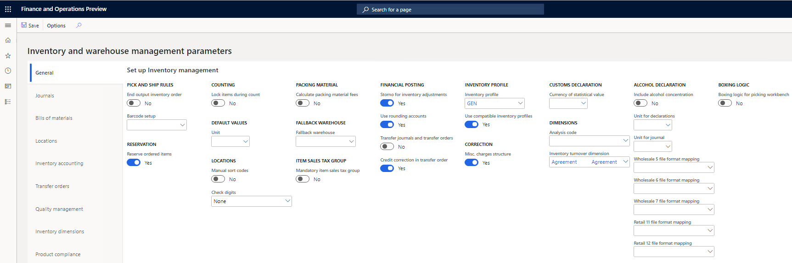

4. On the **Bills of materials** tab, in the **Inventory profile** field, select the inventory profile that should be used by default when BOMs are created and exploded, and when reporting as finished is processed, if an inventory profile isn't specified on the BOM lines.

!Inventory and warehouse management parameters page, Bills of materials tab](media/13_Inventory_and_warehouse_management_parameters.png)

Find more details in the following topics:

- [Inventory profile overview](rus-inventory-profile-overview.md)
- [Use an inventory profile in documents and queries](rus-use-inventory-profile-documents-queries.md)

[!INCLUDE[footer-include](../../includes/footer-banner.md)]