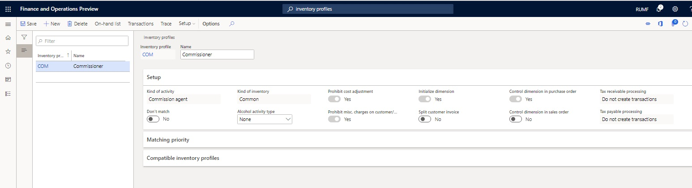
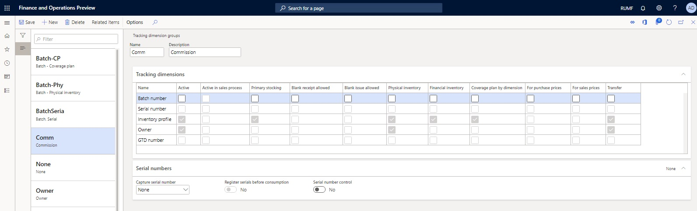

---
# required metadata
title: Transactions through intermediary
description: This topic provides information about the functionality for accounting intermediary deals that are made by an agent. 
author: v-nadyuz
ms.date: 03/03/2020
ms.topic: article
ms.prod: 
ms.technology: 

# optional metadata

# ms.search.form:  
audience: Application User
# ms.devlang: 
ms.reviewer: kfend
# ms.tgt_pltfrm: 
# ms.custom: 
ms.search.region: Russia
# ms.search.industry: 
ms.author: roschlom
ms.search.validFrom: 2018-10-28
ms.dyn365.ops.version: 8.1

---

# Transactions through intermediary
[!include [banner](../includes/banner.md)]

In economic activities that involve an intermediary, there are three participants:

- The person who sells or purchases goods (works or services)
- The third-party supplier or buyer
- The intermediary between the first two participants

Russian legislation defines three legal forms of intermediation:

- A commission agreement, where the committer (also known as the principal) engages a commissioner
- An agency agreement, where the principal engages an agent
- An assignment agreement, where the principal retains an attorney

The intermediary (that is, the commissioner, agent, or attorney) performs legal actions and other actions (transactions) on behalf of the principal. Intermediaries can perform these actions in one of two ways:

- In their own name but at the principal's expense
- In the principal's name and at the principal's expense

Throughout this topic, the term *principal* refers to the party that engages the agent.

## Overview

The current implementation of this functionality has the following limitations:

- Credit notes can be registered only in the module where the original factures were registered.
- Sub-commission isn't supported.
- No commission bonus is calculated.
- No transactions are created in the general ledger, based on the report for the principal.

## Preliminary setup

### Set up an inventory profile for an agent's transactions

1. Go to **Inventory management** \> **Setup** \> **Dimensions** \> **Inventory profiles**.
2. Select **New** to create an inventory profile.
3. In the **Inventory profile** field, enter a name for the inventory profile.
4. In the **Name** field, enter a description.
5. In the **Kind of activity** field, select **Commission agent**.
6. Set the **Don't match** option to **No**.
7. In the **Kind of inventory** field, specify **Common**.
8. Select **Save**.

### Set up the Inventory profile and Owner tracking dimensions

1. Go to **Product information management** \> **Setup** \> **Dimension and variant groups** \> **Tracking dimension groups**.
2. Select **New** to create a dimension group.
3. In the **Name** field, enter a name for the dimension group.
4. In the **Description** field, enter a description.
5. On the **Tracking dimensions** FastTab, set up the Inventory profile and Owner tracking dimensions:

    - On the **Inventory profile** line, select the **Active**, **Primary stocking**, **Physical inventory**, **Financial inventory**, **Coverage plan by dimensions**, and **Transfer** check boxes.
    - On the **Owner** line, select the **Active**, **Physical inventory**, and **Transfer** check boxes.

6. Select **Save**.

### Set up a number sequence for the report for the principal

1. Go to **General ledger** \> **Ledger setup** \> **General ledger parameters**.
2. On the **Number sequences** tab, in the **Number sequence code** field, select a number sequence code for the **Report code** reference.

For more information, see [Purchases on commission](rus-purchases-on-commission.md) and [Sales on commission](rus-sales-on-commission.md).

[!INCLUDE[footer-include](../../includes/footer-banner.md)]