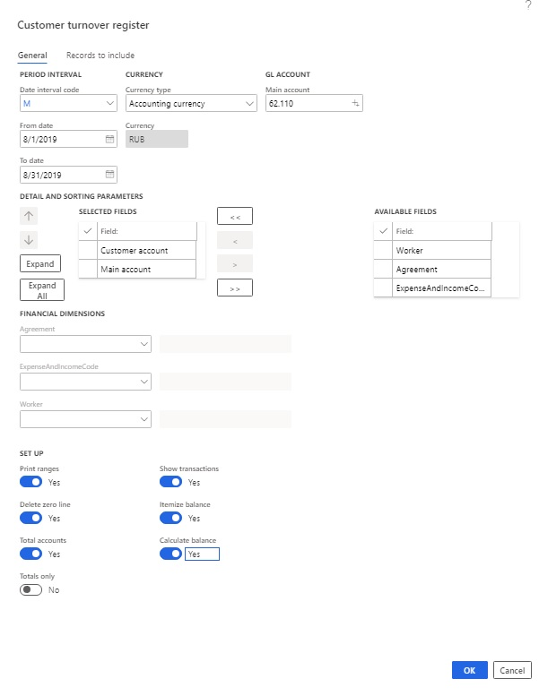
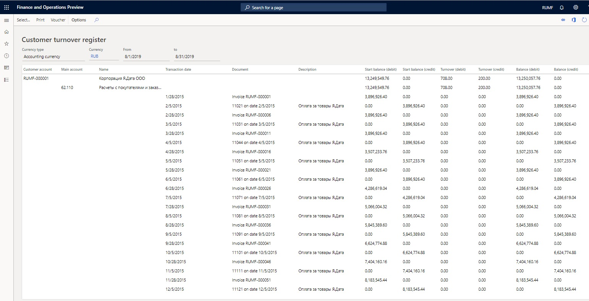
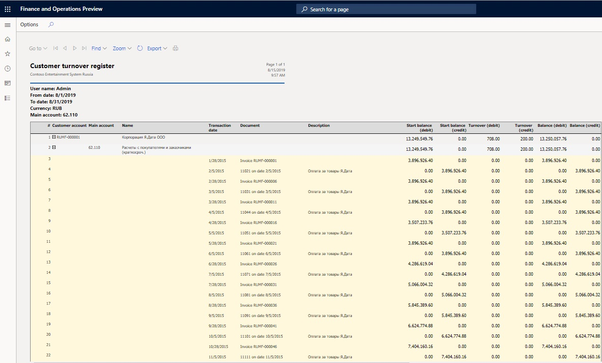
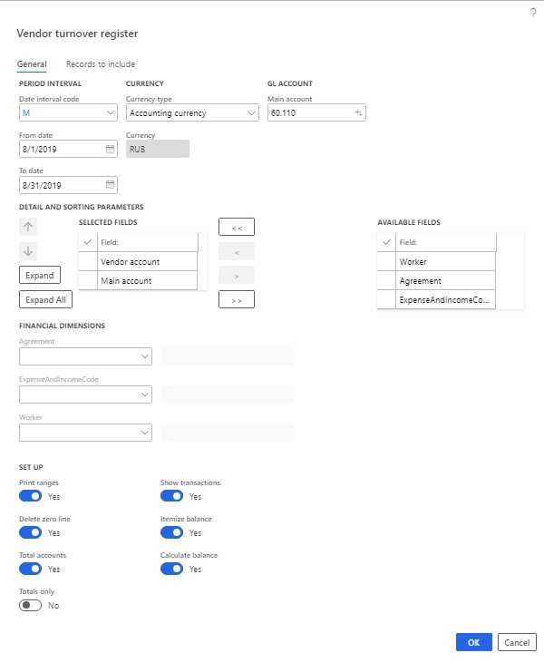
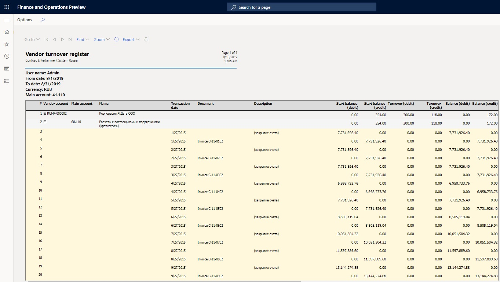
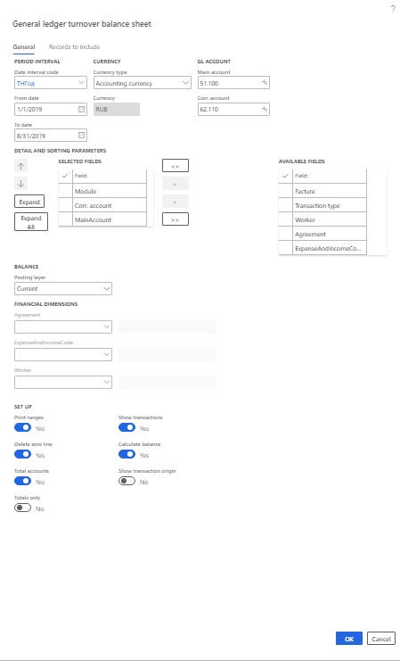
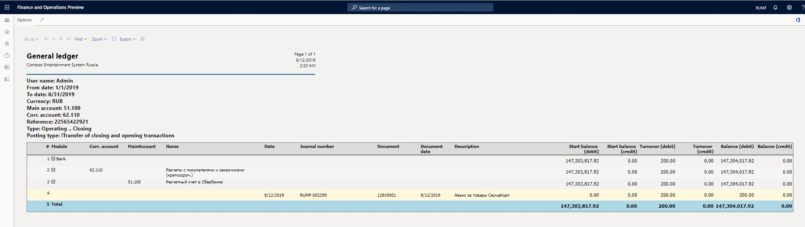

Turnover balance statement reports
==================================

Turnover register reports
-------------------------

Turnover balance sheets for the customer, vendor, and advance holder let you
show information in the context of customers, vendors, and advance holders.

### Customer turnover register

1.  Go to **General ledger \> Inquires and reports \> Turnover balance statement
    \> Customer turnover register**.

2.  On the **General** tab, in the **Date interval code** field, select the date
    interval code from the date interval directory.

3.  In the **From date** and **To date** fields, select the start and end of the
    report generation period.

    >   *Note.* If you don't manually set these fields, values are entered based on
    >   the selected date interval code.

4.  In the **Currency type** field, select the currency type for the report:
    **Accounting currency**, **Reporting currency**, or **Indicated currency**.

5.  In the **Currency** field, select the transaction currency.

    >   *Note.* This field is available only if you select **Indicated currency** in
    >   the **Currency type** field.

6.  In the **Main account** field, select the account to generate the report
    for.

7.  In the **Detail and sorting parameters** section, you can specify the fields
    that are used for grouping by moving them from the **Available fields** list
    to the **Selected fields** list. You can also change the grouping order as
    you require.

8.  In the **Dimension** section, in the **Agreement**,
    **ExpenseAndIncomeCode**, and **Worker** fields, specify dimension codes if
    you want to select transactions that have specific codes for the report.

    >   *Note.* If you leave these fields blank, the system will select transactions
    >   that have *any* dimension code for the report.

9.  Set the **Print ranges** option to **Yes** to view the query terms when you
    print the report.

10. Set the **Delete zero line** option to **Yes** if you don't want to print
    lines or columns that have 0 (zero) values.

11. Set the **Total accounts** option to **Yes** to total the accounts.

12. Set the **Totals only** option to **Yes** to view only total accounts.

    >   *Note.* This option is available only if you set the **Total accounts**
    >   option to **Yes**.

13. Set the **Show transactions** option to **Yes** to show the contractor
    transactions.

14. Set the **Itemize balance** option to **Yes** to send the expanded balance
    to the turnover balance sheet.

15. Set the **Calculate balance** option to **Yes** to calculate and show the
    balance on the report.

    

16.  Select **ОК** to generate the report.

>   *Note.*
>
>   -   Select **Voucher** to view the ledger transactions that generated the
>       activity.
>
>   -   Select **Select** to change the report generation parameters.
>
>   -   Select **Print** to print the report in Microsoft SQL Server Reporting
>       Services (SSRS).

   

### Vendor turnover register

1.  Go to **General ledger \> Inquires and reports \> Turnover balance statement
    \> Vendor turnover register**.

2.  On the **General** tab, in the **Date interval code** field, select the date
    interval code from the date interval directory.

3.  In the **From date** and **To date** fields, select the start and end of the
    report generation period.

    >   *Note.* If you don't manually set these fields, values are entered based on
    >   the selected date interval code.

4.  In the **Currency type** field, select the currency type for the report:
    **Accounting currency**, **Reporting currency**, and **Indicated currency**.

5.  In the **Currency** field, select the transaction currency.

    >   *Note.* This field is activated available only if you select **Indicated
    >   currency** in the **Currency type** field.

6.  In the **Main account** field, select the account to generate the report
    for.

7.  In the **Detail and sorting parameters** section, you can specify the fields
    that are used for grouping by moving them from the **Available fields** list
    to the **Selected fields** list. You can also change the grouping order as
    you require.

8.  In the **Dimension** section, in the **Agreement**,
    **ExpenseAndIncomeCode**, and **Worker** fields, specify dimension codes if
    you want to select transactions that have specific codes for the report.

    >   *Note.* If you leave these fields blank, the system will select transactions
    >   that have *any* dimension code for the report.

9.  Set the **Print ranges** option to **Yes** to view the query terms when you
    print the report.

10. Set the **Delete zero line** option to **Yes** if you don't want to print
    lines or columns that have 0 (zero) values.

11. Set the **Total accounts** option to **Yes** to total the accounts.

12. Set the **Totals only** option to **Yes** to view only total accounts.

    >   *Note.* This option is available only if you set the **Total accounts**
    >   option to **Yes**.

13. Set the **Show transactions** option to **Yes** to show the contractor
    transactions.

14. Set the **Itemize balance** option to **Yes** to send the expanded balance
    to the turnover balance sheet.

15. Set the **Calculate balance** option to **Yes** to calculate and show the
    balance on the report.

    

16. Select **ОК** to generate the report.

>   *Note.*
>
>   -   Select **Voucher** to view the ledger transactions that generated the
>       activity.
>
>   -   Select **Select** to change the report generation parameters.
>
>   -   Select **Print** to print the report in SSRS.

   

### Advance holder turnover register

1.  Go to **General ledger \> Inquires and reports \> Turnover balance statement
    \> Advance holder turnover register**.

2.  On the **General** tab, in the **Date interval code** field, select the date
    interval code from the date interval directory.

3.  In the **From date** and **To date** fields, select the start and end of the
    report generation period.

    >   *Note.* If you don't manually set these fields, values are entered based on
    >   the selected date interval code.

4.  In the **Currency type** field, select the currency type for the report:
    **Accounting currency**, **Reporting currency**, or **Indicated currency**.

5.  In the **Currency** field, select the transaction currency.

    >   *Note.* This field is available only if you select **Indicated currency** in
    >   the **Currency type** field.

6.  In the **Main account** field, select the account to generate the report
    for.

7.  In the **Detail and sorting parameters** section, you can specify the fields
    that are used for grouping by moving them from the **Available fields** list
    to the **Selected fields** list. You can also change the grouping order as
    you require.

8.  In the **Dimension** section, in the **Agreement**,
    **ExpenseAndIncomeCode**, and **Worker** fields, specify dimension codes if
    you want to select transactions that have specific codes for the report.

    >   *Note.* If you leave these fields blank, the system will select transactions
    >   that have *any* dimension code for the report.

9.  Set the **Print ranges** option to **Yes** to view the query terms when you
    print the report.

10. Set the **Delete zero line** option to **Yes** if you don't want to print
    lines or columns that have 0 (zero) values.

11. Set the **Total accounts** option to **Yes** to total the accounts.

12. Set the **Totals only** option to **Yes** to view only total accounts.

    >   *Note.* This option is available only if you set the **Total accounts**
    >   option to **Yes**.

13. Set the **Show transactions** option to **Yes** to show the contractor
    transactions.

14. Set the **Itemize balance** option to **Yes** to send the expanded balance
    to the turnover balance sheet.

15. Set the **Calculate balance** option to **Yes** to calculate and show the
    balance on the report.

16. Select **ОК** to generate the report.

>   *Note.*
>
>   -   Select **Voucher** to view the ledger transactions that generated the
>      activity.
>
>   -   Select **Select** to change the report generation parameters.
>
>   -   Select **Print** to print the report.

General ledger report
---------------------

The **General ledger** report is designed to generate turnover on a specified
account that is in correspondence with other accounts.

1.  Go to **General ledger \> Inquires and reports \> Turnover balance statement
    \> General ledger**.

2.  On the **General** tab, in the **Date interval code** field, select the date
    interval code from the date interval directory.

3.  In the **From date** and **To date** fields, select the start and end of the
    report generation period.

    >   *Note.* If you don't manually set these fields, values are entered based on
    >   the selected date interval code.

4.  In the **Currency type** field, select the currency type for the report:
    **Accounting currency**, **Reporting currency**, or **Indicated currency**.

5.  In the **Currency** field, select the transaction currency.

    >   *Note.* This field is available only if you select **Indicated currency** in
    >   the **Currency type** field.

6.  In the **Main account** field, select the account to generate the report
    for.

7.  In the **Corr. account** field, select the corresponding account to generate
    the report for.

8.  In the **Detail and sorting parameters** section, you can specify the fields
    that are used for grouping by moving them from the **Available fields** list
    to the **Selected fields** list. You can also change the grouping order as
    you require.

9.  In the **Dimension** section, in the **Agreement**,
    **ExpenseAndIncomeCode**, and **Worker** fields, specify dimension codes if
    you want to select transactions that have specific codes for the report.

    >   *Note.* If you leave these fields blank, the system will select transactions
    >   that have *any* dimension code for the report.

10. Set the **Print ranges** option to **Yes** to view the query terms when you
    print the report.

11. Set the **Delete zero line** option to **Yes** if you don't want to print
    lines or columns that have 0 (zero) values.

12. Set the **Total accounts** option to **Yes** to total the accounts.

13. Set the **Totals only** option to **Yes** to view only total accounts.

    >   *Note.* This option is available only if you set the **Total accounts**
    >   option to **Yes**.

14. Set the **Show transactions** option to **Yes** to show the accountable
    person transactions.

15. Set the **Calculate balance** option to **Yes** to calculate and show the
    balance on the report.

    

16. Select **ОК** to generate the report.

>   *Note.*
>
>   -   Select **Voucher** to view the ledger transactions that generated the
>       activity.
>
>   -   Select **Select** to change the report generation parameters.
>
>   -   Select **Print** to print the report in SSRS.

   

Turnover balance statement report archive
-----------------------------------------

On the **Report archive** page, you can view reports and download them in Excel
format.

1.  Go to **General ledger \> Inquires and reports \> Turnover balance statement
    \> Report archive**.

2.  On the **Turnover and balance statement report archive** page, in the
    **Report type** field, specify the type of report.

3.  Select the report.

    

4.  Select **New report** to generate a new report that has the same parameters
    as the selected report.

5.  Select **Report output** to print the report.

6.  Select **Export to Microsoft Excel** to open the **Export to Excel** page,
    and then select **Download** to download the report in Excel format.

7.  Select **View** to view the report.
