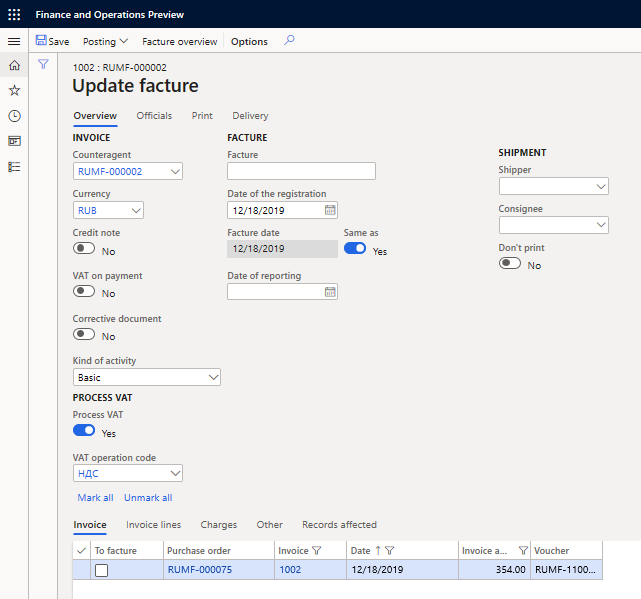

---
# required metadata
title: Use an inventory profile in documents and queries
description: This topic provides information about using inventory profile.
author: v-nadyuz
ms.date: 05/11/2020
ms.topic: article
ms.prod: 
ms.technology: 

# optional metadata

# ms.search.form:  
audience: Application User
# ms.devlang: 
ms.reviewer: kfend
# ms.tgt_pltfrm: 
# ms.custom: 
ms.search.region: Russia
# ms.search.industry: 
ms.author: kfend
ms.search.validFrom: 2018-10-28
ms.dyn365.ops.version: 8.1

---

# Use an inventory profile in documents and queries
[!include [banner](../includes/banner.md)]

## Purchase orders

### Define a posting profile in purchase orders

1. Go to **Accounts payable** \> **Purchase orders** \> **All purchase orders**.
2. Select a purchase order, and switch to the **Header** view.
3. On the **Setup** FastTab, in the **Inventory profile** section, in the **Kind of activity** field, select a kind of activity.
4. In the **Inventory profile** field, select an inventory profile.

    If you set the **Kind of activity** and **Inventory profile** fields in the vendor master record, in the purchase agreement master record, or on the **Accounts payable parameters** page, the values are entered by default in the purchase order.

5. Switch to the **Lines** view.
6. On the **Line details** FastTab, on the **Product** tab, in the **Tracking dimensions** section, in the **Inventory profile** field, you can select only an inventory profile value that corresponds to the kind of activity that you selected in the document header. If you selected and inventory profile in the **Header** view, you can select only the same inventory profile on the line.
7. On the **Setup** tab, in the **Posting** section, note the following details:
    
    - The **Ledger account** field isn't available if the inventory profile is active for the item on the purchase order line. The ledger account is determined by the inventory profile that is specified on a purchase order line.
    - The **Posting profile** field is automatically set, based on the inventory profile on the purchase order line and the relation between the inventory profiles and the vendor posting profiles. If the posting profile can't be defined by the inventory profile, or if an inventory profile isn't selected on the purchase order line, the **Posting profile** field on the purchase order line remains blank. In this case, when you post an invoice, the posting profile that is specified in the purchase order header will be used.

### Rules for automatically splitting product receipts and invoices

When you post a purchase order invoice or product receipt, the system splits the documents by the posting profile and the kind of activity defined on the order lines. For order lines that have items with an inventory profile that isn't active, the **Basic** activity and the posting profile that is specified in the purchase order header are used.

#### Example in the RUMF legal entity

1. On the **Procurement and sourcing parameters** page, on the **Summary update** tab, on the **Summary update** FastTab, in the **Split based on** section, on the **Product receipt** line, set the **Posting profile** and **Kind of activity** options to **Yes**.
2. On the **Accounts payable parameters** page, on the **Ledger and sales tax** tab, on the **Posting** FastTab, in the **Posting profile** field, select **Общий**.
3.  Create two vendor posting profiles: **GEN** and **COM**. Then create inventory profiles for **GEN**, **COM**, and **MAT**. Finally, set up a relation between the inventory profiles and the vendor posting profiles.

    | **Inventory profile relation** | **Kind of activity** | **Inventory profile** | **Vendor posting profile** |
    |--------------------------------|----------------------|-----------------------|----------------------------|
    | Profile                        | Basic                | GEN                   | GEN                        |
    | Profile                        | Commissioner         | COM                   | COM                        |
    | Profile                        | Basic                | MAT                   | GEN                        |

4. Create the following items:

    - Item1
    - Item2
    - Item3
    - Item4

5. Create a purchase order that has the following lines.

    | **Item** | **Inventory profile** | **Quantity** | **Vendor posting profile** |
    |----------|-----------------------|--------------|----------------------------|
    | Item1    | GEN                   | 10           | GEN                        |
    | Item2    | MAT                   | 10           | GEN                        |
    | Item3    | COM                   | 10           | COM                        |
    | Item4    |                       | 10           |                            |

6. Create a product receipt. You should see the following lines on the **Overview** and **Lines** FastTabs of the **Posting product receipt** page.

      - **Overview** FastTab

        |   Product receipt   |  Vendor posting profile    |    Kind of activity  | 
        |---------------------|----------------------------|----------------------|
        | PR1                 | GEN                        | Basic                |
        | PR2                 | COM                        | Commissioner         |
        | PR3                 | Общий                      | Basic                |
        
     - **Lines** FastTab
     
        | Item      |   Inventory profile   |   Quantity   |
        |-----------|-----------------------|--------------|
        | Item1     | GEN                   | 10           |
        | Item2     | MAT                   | 10           |
        | Item3     | COM                   | 10           |
        | Item4     |                       | 10           |
    
    

7. Select **Post**. Three product receipts are generated. A similar split will be done for purchase order invoices.

> [!NOTE]
> If miscellaneous charges are attached to the purchase order header, when you post purchase order invoices that split by kinds of activity and posting profiles, those miscellaneous charges will be attached to each invoice.

### Rules for automatically splitting invoice-factures

If you process the invoice-factures at the same time that purchase order invoices are posted, the invoice-facture split is the same as the invoice split by the kind of activity and the posting profile.

If you process invoice-factures later (for example, from a vendor invoice journal), you can combine the lines of different invoices that have the same kind of activity into one invoice-facture. To use this approach, follow these steps.

1. Go to **Accounts payable** \> **Inquiries and reports** \> **Invoices** \> **Invoice journal**.
2. Select a vendor invoice that doesn't have a processed invoice-facture, and then select **Create facture \> Update facture**.
3. On the **Update facture** page, in the upper pane, in the **Kind of activity** field, select the kind of activity that you want to process factures for. The lower pane shows the invoices that have the selected kind of activity.

   

The system saves the kind of activity that is used for posting in the product receipts, invoices, and invoice-factures for the purchase order. You can view the kind of activity in the following places:

- In the **Kind of activity** field on the **Overview** tab in the upper pane of the **Invoice journal** page (**Accounts payable** \> **Inquiries and reports** \> **Invoices** \> **Invoice journal**).
- In the **Kind of activity** field on the **General** tab in the upper pane of the **Facture journal** page (**Accounts payable** \> **Inquiries and reports** \> **Facture**).

## Sales orders

### Define a posting profile in sales orders

1. Go to **Accounts receivable** \> **Orders** \> **All sales orders**.
2. Select a sales order, and switch to the **Header** view.
3. On the **Setup** FastTab, in the **Inventory profile** section, in the **Kind of activity** field, select a kind of activity.
4. In the **Inventory profile** field, select an inventory profile.
5. Set the **Use compatible inventory profiles** option to **Yes** if inventory profiles that are compatible with the inventory profile that is selected in the sales order header should be used on the sales order lines.

    If you set the **Kind of activity** and **Inventory profile** fields in the customer master record, in the sales agreement master record, or on the **Accounts receivable parameters** page, the values are entered by default in the sales order.

6. Switch to the **Lines** view.
7. On the **Line details** FastTab, on the **Product** tab, in the **Tracking dimensions** section, in the **Inventory profile** field, you can select only an inventory profile that is compatible with the kind of activity that you selected in the header.
8. On the **Setup** tab, in the **Posting** section, note the following details:

    - The **Main account** field isn't editable if the inventory profile is active for the item on the sales order line. The ledger account is determined by the inventory profile that is specified on a sales order line.
    - The **Posting profile** field is automatically set, based on the inventory profile on the sales order line and the relation between the inventory profiles and the posting profiles. If the posting profile can't be defined by the inventory profile, or if an inventory profile isn't selected on the sales order line, the **Posting profile** field on the sales order line remains blank. In this case, when you post an invoice, the posting profile that is specified in the sales order header will be used.

When you post a sales order invoice or packing slip, the system splits the documents by the posting profiles and kinds of activity that are defined in the order lines. For order lines that have items where the inventory profile isn't active, the **Basic** kind of activity and the posting profile that is specified in the sales order header are used.

### Create sales order lines

When you create sales order lines by selecting **Add lines**, if you don't select the inventory profile, the system automatically splits the quantity that will be sold by the inventory profiles that there are physically available balances for.

### Example

1. Set up the following inventory profiles.

| Inventory profile | Kind of activity | Matching priority | Compatible inventory profiles | Physically available balance of item Item1 |
|-------------------|------------------|-------------------|-------------------------------|--------------------------------------------|
| GEN               | Basic            | 1                 | COM, MAT                      | 8                                          |
| MAT               | Basic            | 2                 | GEN                           | 7                                          |
| COM               | Commissioner     | 3                 |                               | 10                                         |

2. On the **Accounts receivable parameters** page, set the **Split order lines by inventory profiles** option to **Yes**.
3. Create a new sales order.
4. On the **Sales order lines** FastTab, select **Add lines**.
5. In the **Create lines** dialog box, set the following fields on the line that has the **Item1** reference in the **Item number** field:

    - In the **Sales quantity** field, enter **20**.
    - Leave the **Inventory profile** field blank.

6. Select **Create**. Depending on the sales order settings, the system creates the following sales order lines:

    - **Option 1:** The sales order has the following settings.

        | **Kind of activity** | **Inventory profile** | **Use compatible inventory profiles** |
        |----------------------|-----------------------|---------------------------------------|
        | Unspecified          |                       | No                                    |

        In this case, the system creates the following lines.

        | **Item number** | **Inventory profile** | **Quantity** |
        |-----------------|-----------------------|--------------|
        | Item1           | GEN                   | 8            |
        | Item1           | MAT                   | 7            |
        | Item1           | COM                   | 5            |

        The system selects the inventory profiles from the balances, based on the priority for the selection of inventory profiles.

    - **Option 2:** The sales order has the following settings.

        | **Kind of activity** | **Inventory profile** | **Use compatible inventory profiles** |
        |----------------------|-----------------------|---------------------------------------|
        | Basic                |                       | No                                    |

        In this case, the system creates the following lines.

        | **Item number** | **Inventory profile** | **Quantity** |
        |-----------------|-----------------------|--------------|
        | Item1           | GEN                   | 13           |
        | Item1           | MAT                   | 7            |

        The system selects inventory profiles from the balances, based on the priority for the selection of inventory profiles and the specified kind of activity. The system adds the quantity that is missing in the balances to the order line that contains the inventory profile has the highest selection priority (**GEN** in this example).

    - **Option 3:** The sales order has the following settings.

        | **Kind of activity** | **Inventory profile** | **Use compatible inventory profiles** |
        |----------------------|-----------------------|---------------------------------------|
        | Unspecified          |                       | Yes                                   |

        In this case, the system creates the following lines.

        | **Item number** | **Inventory profile** | **Quantity** |
        |-----------------|-----------------------|--------------|
        | Item1           | GEN                   | 8            |
        | Item1           | COM                   | 10           |
        | Item1           | MAT                   | 2            |

        The system selects the inventory profiles from the balances, based on the priority for the selection of inventory profiles and the settings of compatible inventory profiles. First, the **GEN** inventory profile is selected, because it has the highest priority. Then the **COM** and **MAT** inventory profiles that are compatible with the **GEN** inventory profile are selected, in accordance with the procedure for selecting compatible inventory profiles.

    - **Option 4:** The sales order has the following settings.

        | **Kind of activity** | **Inventory profile** | **Use compatible inventory profiles** |
        |----------------------|-----------------------|---------------------------------------|
        | Unspecified          | GEN                   | Yes                                   |

        In this case, the system creates the following lines.

        | **Item number** | **Inventory profile** | **Quantity** |
        |-----------------|-----------------------|--------------|
        | Item1           | GEN                   | 13           |
        | Item1           | MAT                   | 7            |

        The system selects the inventory profiles from the balances, based on the inventory profile that is selected in the sales order and the settings of compatible inventory profiles. Only the inventory profiles that correspond to the kind of activity that is specified in the sales order can be selected.

## Transfer orders

1. Go to **Inventory management** \> **Inbound orders** \> **Transfer order** or **Inventory management** \> **Outbound orders** \> **Transfer order**.
2. Select a transfer order, and switch to the **Header** view.
3. On the **Setup** FastTab, in the **Inventory profile** section, in the **Kind of activity** field, select a kind of activity.
4. In the **Inventory profile** field, select an inventory profile.
5. Set the **Use compatible inventory profiles** option to **Yes** if inventory profiles that are compatible with the inventory profile that is selected in the transfer order header should be used on the transfer order lines.

If you set the **Kind of activity** and **Inventory profile** fields in the warehouse master record or on the **Inventory and warehouse management parameters** page, the values are entered by default in the transfer order. By default, the **Use compatible inventory profiles** option is set to the same value that it's set to on the **Inventory and warehouse management parameters** page.

## Inventory journals and production orders

You can use the inventory profile in the following inventory journals, just as you can use other inventory dimensions:

- Movement (**Inventory management** \> **Journal entries** \> **Items** \> **Movement**)
- Inventory adjustment (**Inventory management** \> **Journal entries** \> **Items** \> **Inventory adjustment**)
- Bills of materials (**Inventory management** \> **Journal entries** \> **Items** \> **Bills of materials**)
- Counting (**Inventory management** \> **Journal entries** \> **Item counting** \> **Counting**)

In the Transfer journal (**Inventory management** \> **Journal entries** \> **Items** \> **Transfer**), on the **Line details** FastTab, in the **From inventory dimensions** and **To inventory dimensions** sections, you can select only inventory profiles that have the same kind of activity. When you post the journal, general ledger vouchers are created only if these inventory profiles differ. In this case, the transfer journal line is posted to the general ledger, regardless of the value of the **Transfer journals and transfer orders** field in the **Financial posting** section on the **General** tab of the **Inventory and warehouse management parameters** page.

When you create a production order, if the BOM line contains an item where the inventory profile is active, the corresponding BOM line in the production order will have the inventory profile from one of the following places:

- The BOM line, if the inventory profile is specified there
- The **Inventory and warehouse management parameters** page, if the inventory profile is specified there

If the value of the **Inventory profile** dimension for the production order BOM line can't be determined, an error message is generated, and creation of the production order is canceled.

## Filter the On-hand list page by the kind of activity

On the **On-hand list** page, you can filter by the kind of activity.

1. Go to **Inventory management** \> **Inquiries and reports** \> **On-hand list**.
2. In the upper pane, in the **Kind of activity** field, select the kind of activity that you want to see item balances for.

The query shows only the item balances for the inventory profiles that are related to the selected kind of activity. Only items where the **Inventory profile** inventory dimension is active are shown. To show all balances, regardless of the kind of activity, select **Unspecified** in the **Kind of activity** field.

## Cash flow forecasts on purchase and sales orders

You can generate cash flow forecasts for purchase orders and sale orders, based on the kind of activity and posting profile. On the cash flow forecast lines, the **Kind of activity** and **Posting profile** fields are set when the forecast is generated. The inventory profiles that are specified on the order lines are considered, to determine the posting accounts of inventory movements, and also the posting accounts of customer and vendor transactions. For order lines where an inventory profile isn't specified, the **Basic** kind of activity and the posting profile that is specified in the order header are used.

### Example

1. Create the following inventory profiles.

      | **Inventory profile** | **Kind of activity** |
      |-----------------------|----------------------|
      | GEN                   | Basic                |
      | MAT                   | Basic                |
      | COM                   | Commissioner         |

2. Create a purchase order that has the following lines.

      | **Item number** | **Inventory profile** | **Quantity** | **Unit price** | **Posting profile** |
      |-----------------|-----------------------|--------------|----------------|---------------------|
      | Item1           | GEN                   | 8            | 10             | GEN                 |
      | Item1           | COM                   | 10           | 9              | COM                 |
      | Item1           | MAT                   | 2            | 12             | GEN                 |
      | Item2           |                       | 5            | 20             | Общий               |

3. Set the current date to January 7, 2019, and specify that the purchase order has payment terms that use a delay of five days.
4. Add miscellaneous charges in the amount of 50 rubles (RUB) to the purchase order header. For the miscellaneous charge code, debit posting is set up for the item, and credit posting is set up for the vendor.

The cash flow forecast for the purchase order will contain the following lines.

<table>
<tbody>
<tr>
<td width="79">

<strong>Posting profile</strong>

</td>
<td width="125">

<strong>Kind of activity</strong>

</td>
<td width="96">

<strong>Ledger account</strong>

</td>
<td width="91">

<strong>Date</strong>

</td>
<td width="92">

<strong>Posting</strong>

</td>
<td width="76">

<strong>Currency</strong>

</td>
<td width="94">

<strong>Amount in currency</strong>

</td>
<td width="95">

<strong>Amount</strong>

</td>
</tr>
<tr>
<td width="79">

COM

</td>
<td width="125">

Commissioner

</td>
<td width="96">

41.COM

</td>
<td width="91">

01.07.2019

</td>
<td width="92">

Purchase, receipt

</td>
<td width="76">

RUB

</td>
<td width="94">

90.00

</td>
<td width="95">

90.00

</td>
</tr>
<tr>
<td width="79">

COM

</td>
<td width="125">

Commissioner

</td>
<td width="96">

51.TEST

</td>
<td width="91">

06.07.2019

</td>
<td width="92">

Vendor balance

</td>
<td width="76">

RUB

</td>
<td width="94">

-140.00

</td>
<td width="95">

-140.00

</td>
</tr>
<tr>
<td width="79">

COM

</td>
<td width="125">

Commissioner

</td>
<td width="96">

60.1.COM

</td>
<td width="91">

01.07.2019

</td>
<td width="92">

Vendor balance

</td>
<td width="76">

RUB

</td>
<td width="94">

-140.00

</td>
<td width="95">

-140.00

</td>
</tr>
<tr>
<td width="79">

COM

</td>
<td width="125">

Commissioner

</td>
<td width="96">

60.1.COM

</td>
<td width="91">

06.07.2019

</td>
<td width="92">

Vendor balance

</td>
<td width="76">

RUB

</td>
<td width="94">

140.00

</td>
<td width="95">

140.00

</td>
</tr>
<tr>
<td width="79">

MAT

</td>
<td width="125">

Basic

</td>
<td width="96">

41.MAT

</td>
<td width="91">

01.07.2019

</td>
<td width="92">

Purchase, receipt

</td>
<td width="76">

RUB

</td>
<td width="94">

24.00

</td>
<td width="95">

24.00

</td>
</tr>
<tr>
<td width="79">

MAT

</td>
<td width="125">

Basic

</td>
<td width="96">

51.TEST

</td>
<td width="91">

06.07.2019

</td>
<td width="92">

Vendor balance

</td>
<td width="76">

RUB

</td>
<td width="94">

-74.00

</td>
<td width="95">

-74.00

</td>
</tr>
<tr>
<td width="79">

MAT

</td>
<td width="125">

Basic

</td>
<td width="96">

60.1.MAT

</td>
<td width="91">

01.07.2019

</td>
<td width="92">

Vendor balance

</td>
<td width="76">

RUB

</td>
<td width="94">

-74.00

</td>
<td width="95">

-74.00

</td>
</tr>
<tr>
<td width="79">

MAT

</td>
<td width="125">

Basic

</td>
<td width="96">

60.1.MAT

</td>
<td width="91">

06.07.2019

</td>
<td width="92">

Vendor balance

</td>
<td width="76">

RUB

</td>
<td width="94">

74.00

</td>
<td width="95">

74.00

</td>
</tr>
<tr>
<td width="79">

Общий

</td>
<td width="125">

Basic

</td>
<td width="96">

10.100

</td>
<td width="91">

01.07.2019

</td>
<td width="92">

Purchase, receipt

</td>
<td width="76">

RUB

</td>
<td width="94">

100.00

</td>
<td width="95">

100.00

</td>
</tr>
<tr>
<td width="79">

Общий

</td>
<td width="125">

Basic

</td>
<td width="96">

51.101

</td>
<td width="91">

06.07.2019

</td>
<td width="92">

Vendor balance

</td>
<td width="76">

RUB

</td>
<td width="94">

-150.00

</td>
<td width="95">

-150.00

</td>
</tr>
<tr>
<td width="79">

Общий

</td>
<td width="125">

Basic

</td>
<td width="96">

60.030

</td>
<td width="91">

01.07.2019

</td>
<td width="92">

Vendor balance

</td>
<td width="76">

RUB

</td>
<td width="94">

-150.00

</td>
<td width="95">

-150.00

</td>
</tr>
<tr>
<td width="79">

Общий

</td>
<td width="125">

Basic

</td>
<td width="96">

60.030

</td>
<td width="91">

06.07.2019

</td>
<td width="92">

Vendor balance

</td>
<td width="76">

RUB

</td>
<td width="94">

150.00

</td>
<td width="95">

150.00

</td>
</tr>
<tr>
<td width="79">

GEN

</td>
<td width="125">

Basic

</td>
<td width="96">

41.GEN

</td>
<td width="91">

01.07.2019

</td>
<td width="92">

Purchase, receipt

</td>
<td width="76">

RUB

</td>
<td width="94">

80.00

</td>
<td width="95">

80.00

</td>
</tr>
<tr>
<td width="79">

GEN

</td>
<td width="125">

Basic

</td>
<td width="96">

51.TEST

</td>
<td width="91">

06.07.2019

</td>
<td width="92">

Vendor balance

</td>
<td width="76">

RUB

</td>
<td width="94">

-130.00

</td>
<td width="95">

-130.00

</td>
</tr>
<tr>
<td width="79">

GEN

</td>
<td width="125">

Basic

</td>
<td width="96">

60.1.GEN

</td>
<td width="91">

01.07.2019

</td>
<td width="92">

Vendor balance

</td>
<td width="76">

RUB

</td>
<td width="94">

-130.00

</td>
<td width="95">

-130.00

</td>
</tr>
<tr>
<td width="79">

GEN

</td>
<td width="125">

Basic

</td>
<td width="96">

60.1.GEN

</td>
<td width="91">

06.07.2019

</td>
<td width="92">

Vendor balance

</td>
<td width="76">

RUB

</td>
<td width="94">

130.00

</td>
<td width="95">

130.00

</td>
</tr>
</tbody>
</table>

The miscellaneous charges for the purchase order or sales order header are repeated in the cash flow forecast for all combinations of a kind of activity and a posting profile.

Find more details in the following topics:

-  [Inventory profile overview](rus-inventory-profile-overview.md)
-  [Set up an inventory profile](rus-set-up-inventory-profile.md)

[!INCLUDE[footer-include](../../includes/footer-banner.md)]