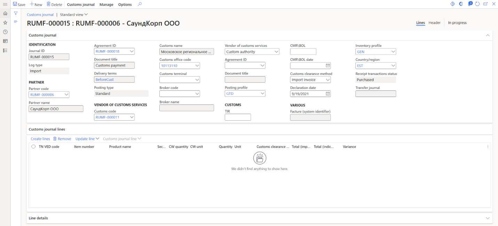
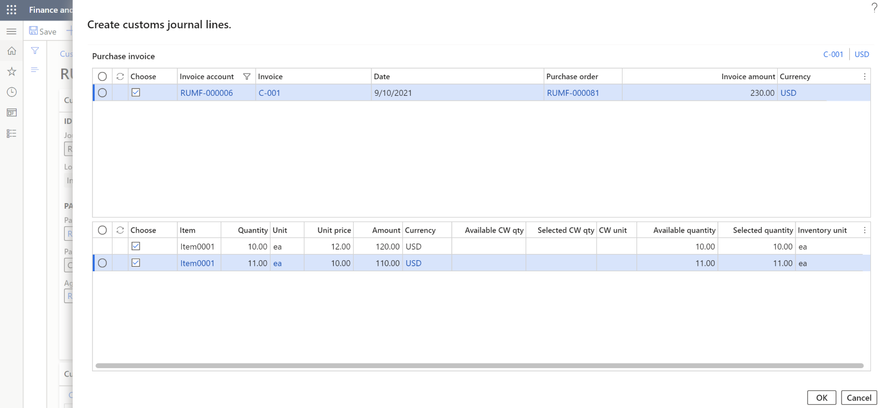
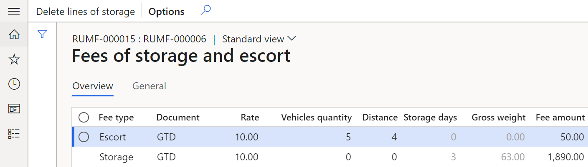
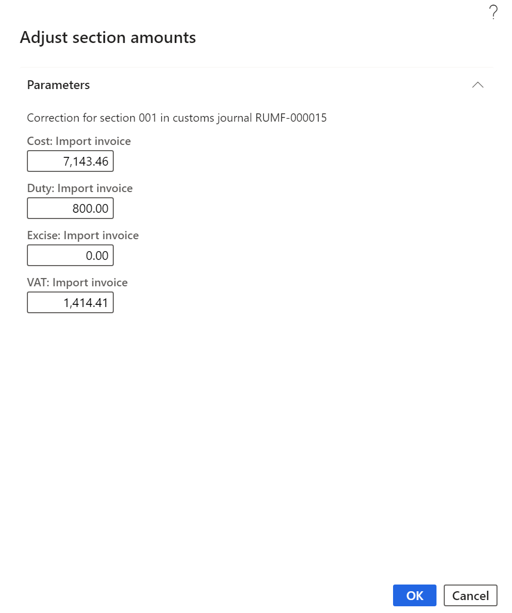
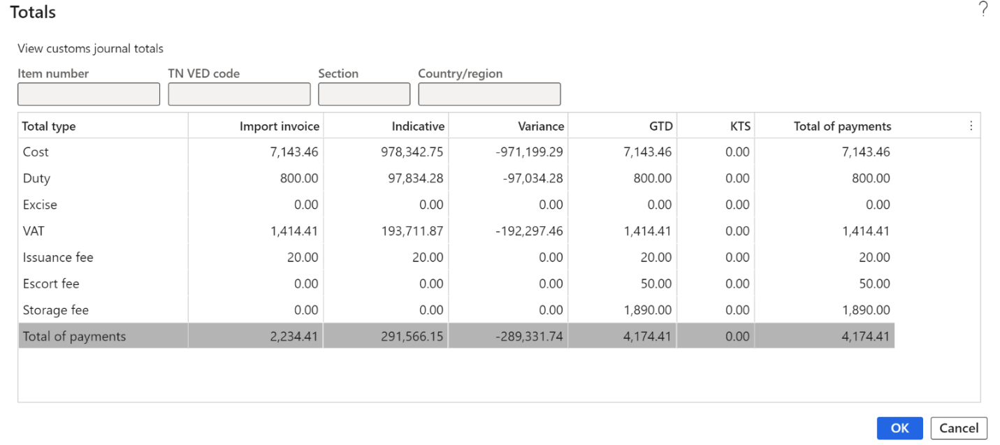
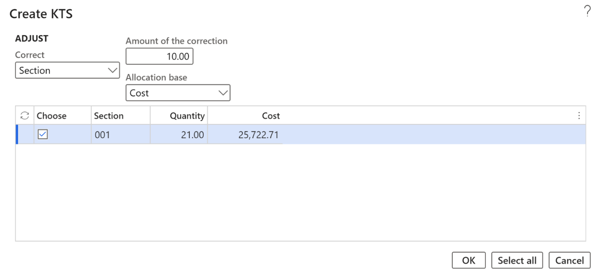
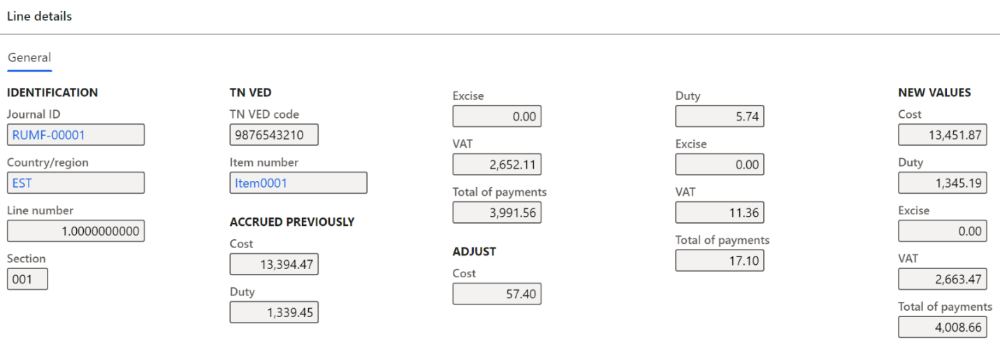

---
# required metadata

title: Work with customs clearance
description: This topic provides information about how to work with customs clearance of products transported across the border of the Russian Federation.
author: akroshkina
ms.date: 06/27/2022
ms.topic: article
ms.prod: 
ms.technology: 

# optional metadata

#ms.search.form:
audience: IT Pro, Application User
# ms.devlang: 
ms.reviewer: kfend
# ms.suite: 
# ms.tgt_pltfrm: 
# ms.custom: 
ms.search.region: 
# ms.search.industry: 
ms.author: anasyash
ms.dyn365.ops.version: 
ms.search.validFrom: 
---

# Work with customs clearance

The registration of the customs clearance procedure is carried out in new journals: the customs journal and the KTS journal. In these journals, the information about the composition of the GTD or KTS is shown, customs payments are calculated based on the transaction amount or the indicative price of products, and factures with the type of GTD or KTS are registered.

The formation of a customs journal is created by considering whether the products are imported or exported, and the delivery conditions that determine the moment of transfer of ownership. Either before or after the customs clearance procedure.

When the import journal and transfer of ownership occur after the customs clearance procedure, purchase orders must be registered. The lines of the customs journal are generated based on inventory transactions with the **Ordered** status. After posting a customs journal or KTS journal, the amounts of customs duties and fees adjust the cost of products or are debited to the expense account, depending on the parameter of the journal. Transactions are generated for the amount of VAT, excise and debt to the customs service provider. Adjustment of the cost price for the amount of duties and fees occurs in two iterations: a transaction is generated to the transit account when the customs journal is posted, and a cost adjustment transaction is generated when a purchase order invoice is posted. In the inventory transactions, the analytics of the **GTD number** is registered and the status of the inventory transactions changes to **Registered**.

When the import journal and transfer of ownership occur before the customs clearance procedure, invoices for purchase orders must be registered. The lines of the customs journal are generated based on inventory transactions with the **Purchased** status. After posting a customs journal or KTS journal, the amounts of customs duties and fees adjust the cost of products or are debited to the expense account, depending on the parameter of the journal. Transactions are generated for the amount of VAT, excise, and debt to the customs service provider. In the inventory transactions, the analytics of the **GTD number** is registered.

When the export journal and transfer of ownership occur after the customs clearance procedure, invoices for purchase orders with the **Postponed passing of property** posting type must be registered. The lines of the customs journal are generated based on inventory transactions with the status **Deducted** or **Sold**. After posting a customs journal or KTS journal, the amounts of customs duties and fees are debited to the expense account. The debt is also generated to the customs service provider.

When the export journal and transfer of ownership occur before the customs clearance procedure, invoices for purchase orders with the **Standard** posting type must be registered. The lines of the customs journal are generated based on inventory transactions with the status **Deducted** or **Sold**. After posting a customs journal or KTS journal, the amounts of customs duties and fees are debited to the expense account. The debt is also generated to the customs service provider.

## Create and set up customs journal

The registration of information on customs clearance is made on the of the **All customs journals** page.

The page of the customs journal consists of two parts, the header and the lines of the journal.

### Create customs journal header

1. Go to **Inventory management** > **Journal entries** > **All customs journals**.
2. To manage an existing journal, select a line, and on the Action Pane, select **Customs journal** > **Edit**.
3. To create new customs journal, on the Action pane, select **Customs journal** > **New**.
4. In the **Create customs journal** dialog box, set the following fields:

   - In the **Partner** section:

      - In the **Log type** field, select **Import** or **Export**.
      - In the **Partner code** field, select a counteragent account for journals with **Import** type or customer account for journals with **Export** type.

      > [!NOTE] 
      > You can choose a counteragent with the **Foreign counteragent** option set to **Yes**.

       - The **Partner name** field are automatically filled in.
       - In the **Agreement ID** field, select an agreement number for this partner. The **Document title** field is automatically filled in.
       - The **Delivery terms** field is automatically filled in from the agreement or from the partner’s account details.

   - In the **Customs requisites** section:
   
       - In the **Customs code** field, select a customs code. The **Customs name** and the **Customs office code** fields is automatically filled in.
       - In the **Vendor of customs services** field, select **Custom authority** or **Custom broker** depending on who the debt for customs clearance will be.
   
   - In the **Requisites of customs services vendor** section:

       - In the **Broker code** field, select a broker code. The **Broker name** field is automatically filled in.
       - In the **Agreement ID** field, select a registration number of the contract of the customs services provider, taking into account the value in **Vendor of customs services** field. The **Document title** field is automatically filled in.

   - In the **Delivery and pay** section:

       - In the **CMR\\BOL** field, select a CMR/BOL number.
       - In the **CMR\\BOL date** field, select a date of CMR/BOL.
       - In the **TIR** field, select a TIR number.
       - In the **Declaration date** field, select a declaration date.
       - In the **Posting type** field, select the posting type for sales order invoices to reflect a sale with a deferred transfer of ownership. This field is available only for journals with **Export** type.
       - In the **Inventory profile** field, select an accounting profile to change the accounting profile of products after the customs clearance procedure. This field is taken from the terms of delivery and available only for journals with **Import** type.
       - In the **Customs clearance method** field, select the method of customs clearance, which determines based on which prices the customs duty will be calculated: **Import invoice** or **Indicative**. If this field is filled in in the customs journal, it's automatically applied to all lines of the journal.
       - In the **Country/region** field, select the country of origin of the products. If this field is filled in in the customs journal, it's automatically applied to all lines of the journal.
       - Set **Include to the cost price** option to **Yes**, if you need to include duties and fees for customs clearance in the cost of the product. This field's available only for journals with **Import** type.

5. Select **OK**. The journal ID is automatically created and displayed in the **Journal ID** field.

    

6. In the **Header** tab you can correct the fields you filled in on the **Create customs journal** dialog box. Additionally, on the customs journal header, you can set the following fields:

    - On the **General** FastTab, in the **Vendor of customs services** section:
        
        - The **Posting profile** field reflects the posting profile for the formation of debts to the customs service provider. This field is defined based on the selected agreement of the customs service provider.
        - The **Customs terminal** field reflects the warehouse associated with the customs office. This field must be filled in if the **Warehouse change** option is set to **Yes** when generating the GTD issuance.

    - In the **Various** section:

        - The **Facture (system identifier)** field reflects the number of the facture generated from the KTS journal.
        - The **Receipt transactions status** field shows the terms of delivery for customs clearance of products. This is only for journals with **Import** type.
        - The **Transfer journal** field shows the number of the journal with **Transfer** status, which can be created when issuing GTD.

    - On the **Settings** FastTab, in the **Fees setup** section, in the **Allocation base of fee** field, select the base for the allocation of the fee to the lines of the customs journal. This field is available if the **Include to the cost price** option is set to **Yes**.
    - In the **GTD** section, the **GTD number** and **GTD issue date** fields are filled in when posting the GTD journal.
    - In the **Pay** section:
        
        - In the **Payment due date** field, select the deadline for payment of customs payments.
        - In the **Method of payment** field, select a method of payment.
    
    - In the **Posting** section, the **Voucher** field shows the number of the journal’s voucher. This field is automatically filled in after posting GTD.
    - In the **Status** section:

        - The **Status** field reflects the status of the journal. For the created journal, the initial status is **In Progress**. After the operation of issuing a GTD, the status changes to **Issued**. After the customs journal is posted, the status value becomes **Posted**.
        - The **Manually correction** option reflects the manual adjustment of the calculated customs payments in the journal lines.

    - On the **Financial dimensions** FastTab you can see financial analysts of the customs journal, which are determined by the selection of the customs service provider and can be manually changed.

    

### Create customs journal lines

1. Go to **Inventory management** > **Journal entries** > **All customs journals**.
2. Select a line with customs journal and on the Action Pane, select **Customs journal** > **Edit**.
3. On the **Customs journal** FastTab, you can see the data about the journal that was entered when it was created.
4. On the **Customs journal lines** FastTab, you can see the following fields:

    - **TN VED code**: A TN VED code that was set on the **Item relation with TN VED** page, considering the date of the declaration and customs specified in the customs journal header.
    - **Item number**: The product number for which the journal line is generated.
    - **Product name**: The name of the product.
    - **Section**: The number of the section that is filled in automatically when creating lines. This field can be changed manually.
    - **Quantity**: The quantity of the product.
    - **Unit**: The unit of the product.
    - **Customs clearance method**: The customs clearance method which is taken from the customs journal header. If it isn’t specified in the customs journal header, then the value is defined from the last posted customs journal for these TN VED code and customs.
    - **Total (import invoice)**: The amount of customs payments calculated according to the invoice cost.
    - **Total (indicative)**: The amount of customs payments calculated according to the indicative cost.
    - **Variance**: The difference between the values from the **Total (import invoice)** and **Total (indicative)** fields.

5. On the **Customs journal lines** FastTab, you can see the following buttons:

    | **Button**                                               | **Function**                                                                                                                                                                                                  |
    |----------------------------------------------------------|---------------------------------------------------------------------------------------------------------------------------------------------------------------------------------------------------------------|
    | **Create lines**                                         | Create a new line.                                                                                                                                                                                               |
    | **Remove**                                               | Delete the current line.                                                                                                                                                                                       |
    | **Update line** > **Adjust section amounts**            | Adjust the value of the duty for the section.                                                                                                                                                                  |
    | **Customs journal line** > **Overview of section data** | Reflect the data for the current section.                                                                                                                                                                      |
    | **Customs journal line** > **Order**                    | Transition to the order that the current line is based on.                                                                                                                                           |
    | **Customs journal line** > **Invoice**                  | Navigate to the invoice for the current line. The request is available only for journals with the **Import** type that are formed according to the terms of delivery with the transfer of ownership before the border. |
    | **Customs journal line** > **Product receipt**          | Navigate to the qualifying invoice for the current line. The request is available only for journals with the **Export** type.                                                                                  |

6.  On the **Line details** FastTab, you can see the details of the created customs journal line:

    - On the **General** tab:

        - In the **Identification** section, you can view the **Journal ID** and **Line number** fields.
        - In the **General** section, in the **Section** field, you can change the section number. For example, this field is used when distributing duties.
        - The **Customs clearance method** and **Country/region** fields are taken from the customs journal header.
        - In the **Item** section, you can see **Item number** and **TN VED code** fields. Their relation was set on the **Item relation with TN VED** page.
        - In the **References** and **Invoice** section, there are links to the original purchase or sales order number, invoice, or packing slip.

    - On the **Setup** tab, there is information about the calculation of customs payments based on the invoice and indicative values, and the amount of the calculated storage fee. The indicative cost is determined based on the settings on the **Indicative prices of TN VED** page.

    

    - On the **Financial dimensions** tab, you can see financial information of the line that is defined from the line of the linked purchase order. invoice, sales order, or packing slip line.

To create a new line, follow these steps.

1. On the **Customs journal lines** FastTab, select **Create lines**.

    The inventory transactions available for creating customs journal lines are described in the table below.

    | **Customs journal type** | **Conditions**   | **Source**  | **Inventory transaction status** |
    |--------------------------|------------------|-------------|----------------------------------|
    | **Import**   | The value in the **Receipt transactions status** field in the terms of delivery is **Ordered**.  | Purchase order | **Ordered**    |
    | **Import**   | The value in the **Receipt transactions status** field in the terms of delivery is **Purchased**. | Purchase order invoice  | **Purchased**  |
    | **Export**   | The posting type is **Standard**.  | Packing slip for a sales order   | **Deducted** or **Sold**  |
    | **Export**   | THe oosting type is **Postponed passing of property**.  | Sales order invoice with posting type **Deferred transfer of ownership** | **Deducted** or **Sold** |

    The **Create customs journal lines** page consists of two main parts, upper and lower.

    - Upper: This part of the page includes the source of the payment. The view of this part depends on the **Log type** field. For **Import** type, it depends on the terms of transfer of ownership, which is reflected in the terms of delivery. For **Export** type, it depends on the terms of the transfer of ownership reflected in the posting type. Filters are applied to this part of the page. In the **Invoice account** field, there is an account that is the same as the **Partner code** field in the customs journal header. If the **Agreement ID** in the customs journal header has a value, you can see orders and invoices with the same agreement ID. If this field is empty, you can see all orders and invoices of this partner.
    - Lower: This part of the page shows the quantity of products available for selection according to the warehouse transaction associated with the purchase order line, supplier's invoice, customer's packing slip, or customer's invoice. The following conditions must be met:

        - For **Import** journal type, GTD number isn't specified in the warehouse transaction.
        - For **Export** journal type, the warehouse transaction isn't included in another customs journal.
        - The source of the transaction isn't a credit note.
        - The status of the warehouse transaction matches the type of the customs journal and the terms of the transfer of ownership.
        - For the **Export** journal type, the lines have a sales tax code with the value **VAT 0%** in the **Type of tax** field and the **Tax code for domestic market** field isn't empty.

3. Mark the required lines. You can also change the quantity to be included in the customs journal in the **Selected quantity** field.
4. Select **OK**.

    

5. Optional: To recalculate the journal lines, on the Action Pane, select **Manage** > **Recalculate lines**. For example, if you created journal lines and then changed the indicative prices for those products, to use the actual information in the customs journal, you should recalculate the lines.

    > [!NOTE] 
    > You can create and change lines as many times as necessary for the journal with a status of **In Progress**.

6. If you created lines for the journal with **Export** type, the information about including a warehouse transaction in the customs journal is added to its source. In the **Grouping reference type** field, you can see a value of **Custom journal line** or **Customs journal line (goods in transit)**. In the **Grouping reference** field, you can see the packing slip or invoice number.

When you calculate the import overhead cost, in addition to the order cost, the settings charges code for customs payments are also analyzed. To the invoice cost on the line is added the amount of the registered (for the purchase order or invoice) overhead charges that have been configured for the value of the **Delivery terms** field in the header of the customs journal.

  > [!NOTE] 
  > If overhead expenses were set in the purchase order, they must be allocated.

After you post the customs journal, you can add only those overhead expenses that don’t increase the customs cost of the products to the purchase order line or invoice line from the customs journal. In other words, these are overhead expenses that aren’t related to the delivery condition from the customs journal header.

The values of customs payments (VAT, duty, excise) are calculated based on the settings on the **TN VED code relation with customs payment** page. You can correct **VAT** and **Excise** fields on the **Line details** FastTab, in the **Import invoice amount** and **Indicative amount** sections. In this case, the **Manually correction** option is set to **Yes** in the customs journal header.

The duty is calculated for the section and distributed to the lines depending on the value specified in the **Complex rate** field of the sales tax code. If the value isn’t setor set to **Summation**, the distribution is made in proportion to the cost. If the value is set to **Maximum**, the distribution is made in proportion to weight, quantity, or volume based on the value in the **Method of duty calculation** field.

### Calculation of customs fees for issuance, storage, and escort 

**Calculation of customs fees for issuance**

The customs fee for issuance is automatically calculated depending on the type of customs journal, the customs value, and in accordance with the value specified in the settings of the tax code for the customs fee for issuance.

> [!NOTE] 
> If the **Include to the cost price** option in the customs journal header is set to **Yes**, the calculated customs fee for issuance is distributed based on the method specified in the **Allocation base of fee** field.

**Calculation of customs fees for storage and escort**

To calculate the customs fee for storage or escort, open the customs journal and on the Action Pane, select **Manage** > **Fees calculation**.

   > [!NOTE]
   > The status of the customs journal must be **In progress** or **Issued**.

    

1. To calculate the customs fee for escort, on the **Customs fees calculation** page, in the **Vehicles quantity** field, enter the number of escort vehicles.
2. In the **Distance** field, enter the escort distance.
3. In the **Sales tax code** field, select the sales tax code that's associated with the customs fee for escort.
4. If in the customs journal header the **Include to the cost price** option set to **Yes**, the calculated customs fee for escort is distributed based on the method specified in the **Allocation base of fee** field.
5. Select **OK.** The fee will be calculated according to the settings of the tax codes.

To calculate the customs fee for storage, follow these steps:

1. On the **Customs fees calculation** page, in the **Storage days** field, enter the number of days of storage.
2. In the **Sales tax code** field, select the sales tax code that's associated with the customs fee for storage.
3. Mark the **Choose** check boxes of the lines, based on the weight of which the total storage weight will be calculated. The calculated amount of the storage fee will be distributed to the selected lines.
4. Select **OK**. The fee will be calculated according to the settings of the tax codes.
5. To see calculated fees for storage and escort, on the Action Pane, select **Customs journal** > **Fees**.

    

6. To adjust the value of the storage fee for non-posted customs journal, on the Action Pane, select **Customs journal** \> **Fees**. 
7. On the Action Pane, select **Delete lines of storage**. All lines of the storage fees for this journal will be deleted. 
8. Create new fees for storage.

### Adjust the amount of duty of the section

The adjustment of the duty for the section is possible only for a customs journal with a status of **In progress** or **Issued**.

1. Open the customs journal and on the **Customs journal lines** FastTab, select **Update line** > **Adjust section amounts**. 
2. On the **Adjust section amounts** page, change the required amounts for the section according to the selected customs clearance method.
3. Select **OK**. The amounts will be changed and recalculated for all lines in the section.

    

### Analysis of the totals of the customs journal 

1. Open the customs journal or the **All customs journals** page.
2. On the Action Pane, select **Customs journal** > **Totals**.
3. In the **Inquiry** page, set a filter on the lines of the customs journal.

    

4. On the **Totals** page, you can see calculations in the following columns:

    - **Import invoice**: The value of the basis for calculating customs payments based on the transaction value (invoice value) and the value of customs payments according to the lines of the customs journal from the **Total type** column.
    - **Indicative**: The value of the basis for calculating customs payments at the indicative cost and the value of customs payments on the lines of the customs journal from the **Total type** column.
    - **Variance**: The difference between the values from the **Import invoice** and **Indicative** fields.
    - **GTD**: The total value of customs payments by journal lines, considering customs clearance methods.
    - **KTS**: The value of customs payments by KTS.
    - **Total of payments**: The total result of the calculation of customs payments by GTD and KTS.

    

5. Fees for escort and storage are calculated regardless of the method that determines the customs value (invoice, indicative). Therefore, for these lines, only the **GTD** and **Total of payments** columns are filled in.

### Analysis of the results of the customs journal section 

- Open the customs journal, and on the **Customs journal lines** FastTab, select **Customs journal line** > **Overview of section data**. The **Section overview** page for the section that owns the current journal line opens.

   > [!NOTE]
   > Fees for escort and issuance are not shown on this form.

    

    The **Declaration** section includes the following fields and field information:

     - **GTD number**: GTD number.
     - **Declaration date**: Date of declaration.
     - **Delivery terms**: Delivery terms.
     - **Section**: The number of the section.
     - **Currency of statistical value**: The statistical value currency that was configured earlier in the **Set up currency of statistical value and number sequences** section.
     - **Exchange rate**: Currency exchange rate of statistical value on the date of declaration.

    The first table is a total table with the following columns:

     - **Total type**: The type of total is displayed. For example, cost, duty, excise, VAT, storage fee, or payment total.
     - **GTD**: The value of the amounts of payments for the section in the main currency of the company.
     - **KTS**: The value of the KTS amounts by section in the main currency of the company.
     - **Total**: The total payments.
     - **GTD in currency**: The value of the payment amounts for the section in the selected currency of the statistical value.
     - **KTS in currency**: The value of the KTS amounts for the section in the selected currency of the statistical value.
     - **Currency total**: Total payments in the selected statistical value currency.

    The second table reflects information about the products from this section with the following columns:

     - **Item number**: The product number from the declaration line belonging to the section.
     - **Product number**: The product number.
     - **Quantity**: The product quantity from the customs journal line.
     - **Unit**: The unit of measurement of the product from the customs journal line.
     - **Net weight**: The value is defined by the formula K = q \* m, where *q* is the value of the **Quantity** field, *m* is the value of the **Net weight** field from the **Released product details** page.
     - **Gross weight**: The value is defined by the formula K = q \* m, where *q* is the value of the **Quantity** field, *m* is the value of the **Gross weight** field from the **Released product details** page.
     - **Volume**: The value is defined by the formula K = q \* m, where *q* is the value of the **Quantity** field, *m* is the value of the **Volume** field from the **Released product details** page.
     - **Storage fee**: The fee for the storage of products.
     - **Amount in transaction currency**: The product cost from the order or invoice line.
     - **Currency**: The order or invoice currency.
     - **Order number**: The purchase or sales order number from the declaration line that belongs to the section.
     - **Invoice**: The nvoice number from the declaration line that belongs to the section.
     - **Invoice date**: The date of invoice.

    The third table reflects information about the overhead expenses related to the selected products and considered in the calculation of customs payments with the following columns:

    - **Charges code**: The overhead code.
    - **Description**: The text of the miscellaneous transaction.
    - **Category**: The miscellaneous transaction category.
    - **Charges value**: The amount of the overhead expense per line.
    - **Currency**: The currency of the overhead expense.

### GTD issuance 

If you need to generate a GTD number without GTD issuance, open the customs journal or **All customs journals** page, on the Action Pane, select **Manage** > **GTD number registration**. Then, when issuing a GTD, you can change **GTD number** and **Issuance date** fields.

Otherwise, complete the following steps.

1. Open the customs journal, which has the status **In progress**.
2. On the Action Pane, select **Manage** > **GTD issue**.

    

3. On the **GTD issue** page, in the third **GTD number** field, enter a seven-digit code. The first **GTD number** field is a customs office code that is specified in the customs journal header. The second **GTD number** field is the date of declaration.
4. In the **Issue date** field, enter a date of the issue.
5. To automatically post the customs journal, set **Posting** to **Yes**. The status of the journal changes to **Posted**.

    > [!NOTE] 
    > You can't cancel a GTD issue if you post a journal.

6. The **Warehouse change** option is available only for journals with **Import** type and with a transfer of ownership before crossing the customs border. Set this option to **Yes** to create a journal with the **Transfer** status, in which the products will be transferred from the posting warehouse according to the invoice to the customs warehouse specified in the **Customs terminal** field. To open transfer journal, on the Action Pane select **Manage** > **Transfer journal**.
6. Select **OK**. The GTD will be issued.

    - The status of the journal changes to the **Issued**.
    - For journals with **Import** type, the GTD Number is generated for all products of the customs journal and the warehouse operations are updated depending on the type of journal and the conditions for the transfer of ownership.

       - With the transfer of ownership before crossing the customs border, the **Warehouse change** option is set to **Yes** when generating a customs journal. A warehouse journal with the **Transfer** status is generated. The **Inventory profile** field and information about the warehouse is changed according to the customs journal header. The GTD number is added to the description of the transfer journal. If the quantity on the warehouse transaction line is greater than that in the customs journal, the inventory transaction is split. In the transaction associated with the customs journal, the GTD number is filled in.
       - With the transfer of ownership after crossing the customs border, the GTD number is filled in the purchase or sale order lines. The status of warehouse transactions in purchase orders changes to **Registered**. If the quantity on the order line is greater than that on the customs journal line, the purchase order line will be split and the GTD number on the created line is filled in by the quantity specified in the customs journal line. If miscellaneous charges have been entered for the line to be split, they are split proportionally to the quantity.

- For export delivery invoices, the export date is updated with the value of the GTD issue date.

### Cancellation of GTD issuance 

A GTD issuance can't be canceled if a Customs Value adjustment (KTS) has been created for the receipt transactions related to the customs journal.

Complete the following steps to cancel a GTD issuance.

1. Open the customs journal with a status of **Issued**.
2. On the Action Pane, select **Manage** > **GTD issue cancelling**.
3. On the **GTD issue cancelling** form, set the **Delete value of inventory dimension** option to **Yes.** If the inventory dimension is present only in inventory transactions associated with the current customs journal, the inventory dimension value is deleted. This option is available only for journals with **Import** type with the transfer of ownership after crossing the customs border.
4. Select **OK**. The GTD issuance is canceled. The status of the customs journal is **In progress**. For journals with **Import** type with the transfer of ownership before crossing the customs border, a reversal journal with the **Transfer** type will be generated if this journal was generated earlier when issuing a GTD.

### Post the customs journal 

1. Open the customs journal with a status of **Issued**.
2. On the Action Pane, select **Manage** > **GTD posting**.
3. Select **OK**. The status of the journal will change to **Posted** and transactions are generated on customs payments and debts to the customs counterparty.
4. On the Action Pane, select **Manage** > **Ledger transactions** to see ledger transactions created when posting the journal.

    

There are multiple algorithms for generating transactions. They include:

- Formation of debt to the customs counter agent
- Formation of transactions for VAT and Excise
- Formation of transactions for duties and fees

**Formation of debt to the customs counteragent**

Depending on the value of the **Vendor of customs services** field in the customs journal header, debt transactions are generated either to the customs authority specified in the **Customs code** field, or to the broker specified in the **Broker code** field.

**Formation of transactions for VAT and Excise**

VAT and excise tax transactions are formed for journals with the **Import** type according to the settings of the corresponding sales tax codes. Debit and credit accounts are defined as follows.

| Debit  | Credit  |
|--------|---------|
| The account defines from the field **Sales tax receivable** in the ledger postings group for the tax code defined as VAT, Excise on the **TN VED code relation with customs payment** page. | The account defines from the **Posting profile** field in the customs journal header, based on the posting profile for the customs service provider. |

**Formation of transactions for duties and fees**

The formation of transactions for customs duties and fees depends on the **Include to the cost price** option setting in the customs journal header and the conditions for transfer of ownership.

For the **Import** journal type, the **Include to the cost price** option is set to **Yes**. The transfer of ownership is carried out before the customs clearance procedure.

The cost correction transactions are generated for duty and fees. Debit and credit accounts are defined as follows.

| Type     | Debit   | Credit  |
|----------|---------|---------|
| Duty/fee | The account of the receipt of the product, considering the value of the **Inventory profile** in the customs journal header. | The account defines from the **Posting profile** field in the customs journal header, based on the posting profile for the customs service provider. |

The **Include to the cost price** option set to **Yes**. The transfer of ownership is carried out after the customs clearance procedure.

Invoice lines are generated for duty and fees. Editing or deleting missed charge data on purchase order lines is prohibited. When posting a customs journal, a transaction is generated to a transit account. Debit and credit accounts are defined as follows.

| Type | Debit    | Credit |
|------|----------|--------|
| Duty | The general ledger account is determined from the **Account** field of the **Credit** section with **Ledger account** type (when creating charges code) for the overhead expense with the duty type.  | The account defines from the **Posting profile** field in the customs journal header, based on the posting profile for the customs service provider. |
| Fee  | The general ledger account is determined from the **Account** field of the **Credit** section with **Ledger account** type (when creating charges code) for the overhead expense with the type of the corresponding customs fee. | The account defines from the **Posting profile** field in the customs journal header, based on the posting profile for the customs service provider. |

After the invoice is posted, product cost adjustment transactions are made from the transit account.

| Type | Debit   | Credit  |
|------|---------|---------|
| Duty | The account of the receipt of the product, considering the value of the **Inventory profile** in the customs journal header. | The general ledger account is determined from the **Account** field of the **Credit** section with **Ledger account** type (when creating charges code) for the overhead expense with the duty type. |
| Fee  | The account of the receipt of the product, considering the value of the **Inventory profile** in the customs journal header. | The general ledger account is determined from the **Account** field of the **Credit** section with **Ledger account** type (when creating charges code) for the overhead expense with the type of the corresponding customs fee. |

The **Include to the cost price** option set to **No**. The transfer of ownership is carried out before or after the customs clearance procedure. Transactions to the expense account are generated for duty and fees. Debit and credit accounts are defined as follows.

| Type | Debit  | Credit   |
|------|--------|----------|
| Duty | The account is defined based on the value in the **Sales tax receivable** field in the ledger posting group for the tax code that's defined as customs duty in the **Customs duty** field when setting up customs payments relation with TN VED. | The account is defined from the **Posting profile** field in the customs journal header, based on the posting profile for the customs service provider. |
| Fee  | The account is defined based on the value in the **Sales tax receivable** field in the ledger posting group for the tax code that's selected when calculating the escort, storage and import issuance fees.  | The account is defined from the **Posting profile** field in the customs journal header, based on the posting profile for the customs service provider. |

For the **Export** journal type, transactions to the expense account are generated for duty and fees. Debit and credit accounts are defined as follows.

| Type | Debit    | Credit   |
|------|----------|----------|
| Duty | The account is defined based on the value in the **Sales tax receivable** field in the ledger posting group for the tax code that's defined as the customs duty in the **Customs duty** field when setting up customs payments relation with TN VED. | The account is defined from the **Posting profile** field in the customs journal header, based on the posting profile for the customs service provider. |
| Fee  | The account is defined based on the value in the **Sales tax receivable** field in the ledger posting group for the tax code that's selected when calculating the escort, storage and export issuance fees.| The account is defined from the **Posting profile** field in the customs journal header, based on the posting profile for the customs service provider. |

## Processing customs value corrections

### Create a customs value correction for import or export operations

Follow these steps to create a customs value correction (KTS) for import or export transactions that are completed. In accordance with a customs value correction that is created to update the customs payments, a company must pay or return additional customs payments.

> [!NOTE]
> The status of the customs journal must be **Posted**.

1. Go to **Inventory management** > **Common** > **All customs journals**.
2. Select the customs journal, and then on the Action Pane, select **Manage** > **KTS creation**. 
3. On the **Create KTS** page, in the **Parameters** section, set the following fields:

    - In the **KTS number** and **KTS date** fields, enter an identification number for the KTS and the date when the KTS is created.
    - In the **Description** field, enter a short description for the customs value correction.
    - In the **Origin** field, select the reason for which you are creating the KTS: **Exigency** (order of the customs authority) or **Error**.
    - If the **Include to the cost price** option is set to **Yes**, the transactions for correction of the cost of customs duties will be formed. This option is available only for customs journals with **Import** type
    - If the **Credit correction** option is set to **Yes**, the transactions for negative correction will be formed.

4. In the **Adjust** section, set the following fields:

    - In the **Correct** field, select the allocation method to use for the KTS: **TN VED**, **Line** or **Section**. Based on this field, the lines will be displayed below.
    - In the **Amount of the correction** field, enter the correction amount for the product on the customs journal line.
    - In the **Allocation base** field, select the payment allocation base to use for the KTS in proportion to the cost, weight, or quantity.

5. Select the **Choose** check box to mark the customs journal line for correction and then select **OK**. On the customs journal header, on the **General** FastTab, in the **Various** section, the **Facture (system identifier)** field will be filled in automatically.
6. Select **Customs journal** to open the **Customs journal** page. The **KTS** check box of this customs journal will be marked.
7. To open the created KTS journal, on the Action Pane, select **Manage** > **KTS**. The **Status** field reflects status of the KTS journal: **Open** for created journal or **Posted** for posted journal.
8. To see KTS journal lines,select the **Journal ID** number.
9. On the **Customs value correction** FastTab, you can see the following information:

    - The journal information, that you filled in when creating KTS journal.
    - The status of the journal is in the **Status** field.
    - The amount of the issuance fee adjustment in the **Fee correction** section, in the **Issuance fee** field. This amount is automatically calculated when creating the KTS journal lines.
    - The number of the customs journal on the base of which the KTS was created in the **References** section, in the **Customs journal** field.
    - The facture created based on the KTS journal in the **References** section, in the **Facture (system identifier)** field.

10. On the **KTS lines** FastTab, on the toolbar:

     - Select the **Create KTS lines** tool to adjust KTS journal lines. Set up the fields in the same way as when creating the KTS journal and select **OK**.

       

     - Select the **Remove** tool to remove the selected line from the KTS journal.

11. On the **Line details** FastTab, you can see the values of the **Cost**, **Duty**, **Excise**, **VAT** and **Total of payments** fields in the following sections:

     - **Accrued previously**: For the initial values of customs payments.
     - **Adjust**: For adjustment values.
     - **New values**: For the values of customs payments considering the adjustments.

      

12. To see KTS journal totals, on the Action Pane, select **Customs value correction** > **Totals**.
13. To go to the customs journal, corrected by this KTS journal, on the Action Pane, select **Customs value correction** > **Customs journal**.

### Post a customs value correction for a customs journal

Follow these steps to post a customs value correction (KTS) for a customs journal. After you post a customs value correction, a facture is created. You can view the details of the facture on the **Facture journal** page.

1.  Go to **Inventory management** > **Common** > **All customs journals**.
2.  Select the customs journal with a status of **Open**, and on the Action Pane, select **Customs value correction** > **KTS posting**.
3.  Select **OK**.
4.  The status of the KTS journal changes to **Posted**. Transactions for the amount of customs payments adjustment are generated in the same way as for posting a customs journal.
5.  To see these transactions, on the Action Pane, select **Customs value correction** > **Facture**.

## Create facture with GTD or KTS type 

When posting a customs journal or a KTS journal with the **Import** type, a facture is automatically generated for a GTD or KTS.

1. Go to **Inventory management** > **Common** > **All customs journals**.
2. Select the customs journal.
3. To see the created factures, on the Action Pane, select **Manage** > **Facture** or **Customs value correction** > **Facture** from the header of the customs journal (facture with GTD type) or the KTS journal (facture with KTS type) accordingly.

## Input VAT processing and purchase book generation

All factures with GTD or KTS type have the standard **Incoming VAT processing** functionality .
The printed form of the purchase book for factures with GTD or KTS type includes the country of origin of the products (from the lines of the customs journal or the KTS journal), and the number of the GTD, based on which this facture was generated.
