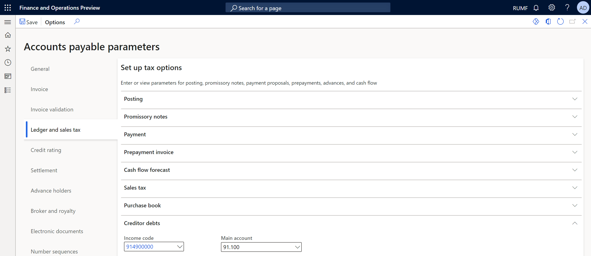
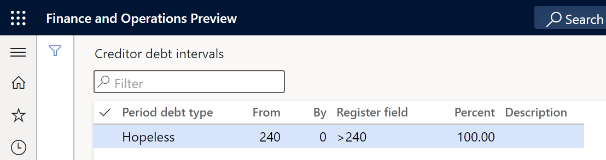
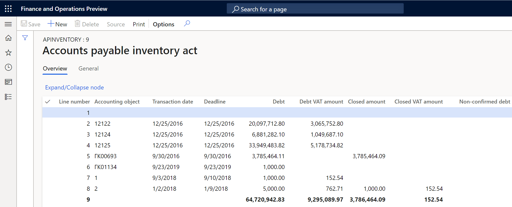
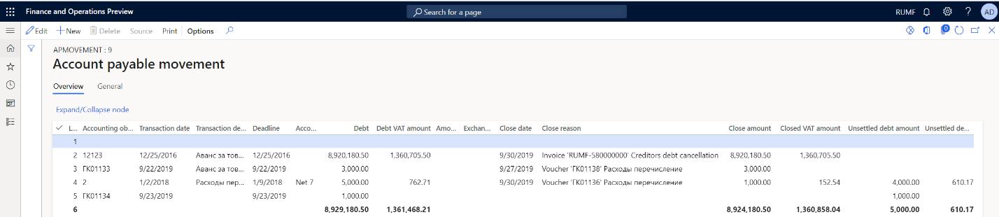
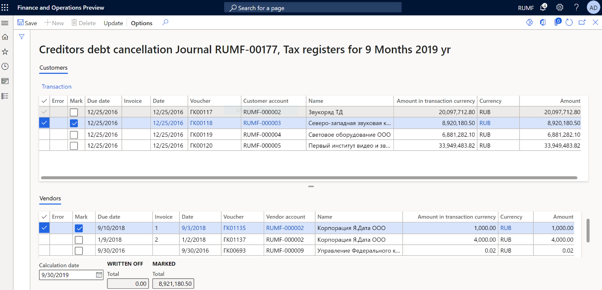
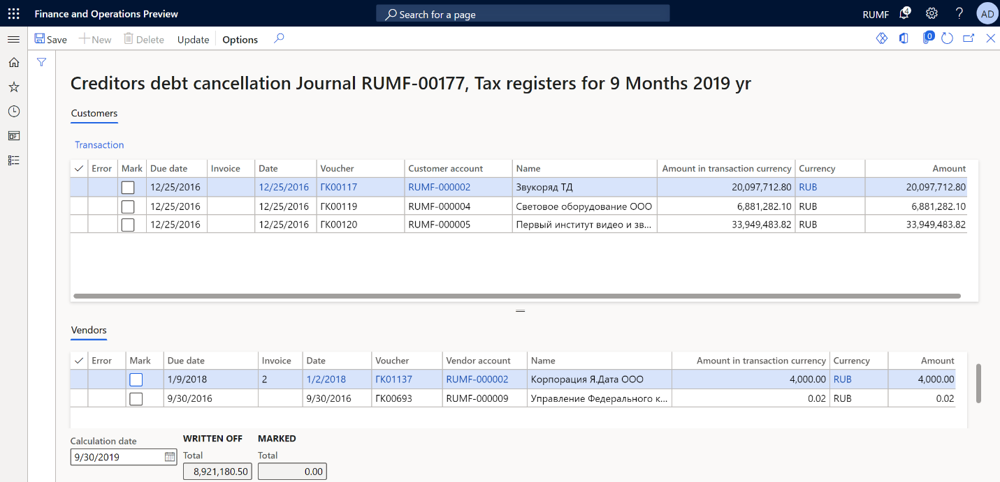
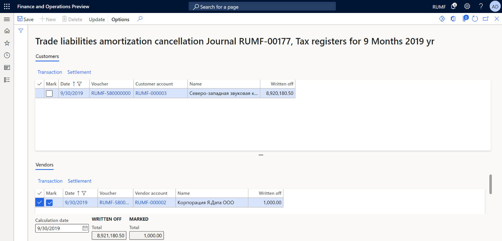

# Accounts payable debt tax registers and debt write-offs

[!include [banner](../../includes/banner.md)]

This article provides information about accounts payable bad debts, write-offs for them, and the following tax registers:
-   Accounts payable inventory act
-   Accounts payable movement

Accounts payable are formed based on outstanding invoices for purchases of goods and services, and on advance payments that are received from
customers.

Accounts payable amounts that are written off because of expiration of the limitation period are considered non-operating income.

## Setup

### Set up Accounts payable parameters

1. Go to **Accounts payable** > **Setup** > **Accounts payable parameters**.
2. On the **Ledger and sales tax** tab, on the **Creditor debts** FastTab, in the **Income code** field, specify the income code to assign to transactions for writing off bad accounts payable debt.
3. In the **Main account** field, specify an account for non-operating income.

    

4. On the **Number sequences** tab, in the **Number sequence code** field, select the number sequence code for the **Ledger voucher for debts amortization** reference.

### Set up the debt interval for hopeless debts

1. Go to **Accounts payable** > **Setup** > **Debt interval**.
2. In the **From** field, enter the lower limit of the debt interval, in days. For example, enter **240**.
3. In the **By** field, enter the upper limit of the debt interval, in days. For example, enter **0** if there is no upper limit.
4. In the **Description** field, enter a detailed description of the debt interval.

    

## Tax registers

You must create and set up tax registers. For more information, see [Create tax registers and the tax register journal](rus-profit-tax-registers.md#create-a-tax-register). The following sections provide more information about each tax register.

### Accounts payable inventory act tax register

The **Accounts payable inventory act** tax register is based on the inventory of accounts as of the reporting date. It reflects the existence of accounts payable amounts.

The register is required to account for non-operating income and expenses for the reporting (tax) period.

   

The register lines show the following information:

- **Accounting object**: The number of the vendor invoice or the number of the customer advance payment that was received.
- **Transaction date**: The date of the invoice or advance payment.
- **Deadline**: The payment due date according to the payment terms.
- **Debt**: The outstanding amount of the invoice or advance payment that was received on the date of inventory, if the aging period of the debts is within the debt interval limits that you configured earlier.
- **Debt VAT amount**: The amount of value-added tax (VAT) on outstanding accounts payable on the date of inventory.
- **Closed amount**: The total amount of accounts payable that were written off during the reporting (tax) period.
- **Closed VAT amount**: The total amount of VAT on accounts payable that were written off during the reporting (tax) period.
- **Non-confirmed debt**: Enter the amount of unconfirmed debt by vendor.

### Accounts payable movement tax register

The **Accounts payable movement** tax register is formed to summarize information about operations on the movement of accounts payable.

Entries are made in the register for all occurrences of accounts payable, and all repayments (full or partial) and write-offs of them by the taxpayer, between the beginning of the tax period and the reporting date.

This register doesn't reflect the amounts of the taxpayer's accounts payable to the budgets of different levels.

For reporting purposes, records on transactions in foreign currency are also made for each fact about the revaluation of debt.

   

The register lines show the following information:

- **Accounting object**: The number of the vendor invoice or the number of the customer advance payment that was received.
- **Transaction date**: The date of the invoice or advance payment.
- **Transaction description**: A description of the document.
- **Deadline**: The payment due date according to the payment terms.
- **Accounting order**: The invoice payment terms.
- **Debt**: The outstanding amount of the invoice or advance payment that was received on the date of inventory, if the aging period of the debts is within the debt interval limits that you configured earlier.
- **Debt VAT amount**: The amount of VAT on outstanding accounts payable.
- **Close date**: The closing date of the invoice, write-off, or payment transaction.
- **Close reason**: A description of the transaction for writing off or paying the debt.
- **Close amount**: The total amount of written-off accounts payable for the reporting (tax) period.
- **Closed VAT amount**: The total amount of VAT on accounts payable that were written off for the reporting (tax) period.
- **Unsettled debt amount**: The total amount of outstanding accounts payable after the movement.
- **Unsettled debt amount VAT**: The total amount of VAT on outstanding accounts payable after the movement.

## Write off hopeless debts

Before you can write off hopeless debts, you must create a register journal for the same period as the write-off and calculate the registers.

In the journal, you should approve the **Accounts payable inventory act** register.

> [!NOTE]
> Don't approve the **Accounts payable movement** register.

### Recognize and write off hopeless debt

1. Calculate and approve the tax register journal for the previous period. For more information, see [Create tax registers and the tax register journal](rus-profit-tax-registers.md#create-and-work-with-a-tax-register-journal).
2. Go to **Accounts payable** > **Periodic tasks** > **Amortization** > **Trade liabilities amortization**.
3. In the **Calculation date** field, select a date that indicates the required calculation period.

    The page shows the debts that have expired as of the indicated reporting date:

    -   The **Customers** tab shows the list of customer prepayments.
    -   The **Vendors** tab shows the list of vendor invoices.

4. To review the original customer or vendor transactions, select **Transactions** on the appropriate tab.
5. Select the debts to write off. The **Total** field in the **Marked** section shows the total amount of the transactions that have been marked for debiting.

    

6. On the Action Pane, select **Update**. The marked transactions are no longer shown. In the **Written off** section, the amounts are increased to the value that appeared in the **Total** field in the **Marked** section before you selected **Update**. Transactions for customers/vendors are created. Additionally, transactions for writing off each debt are created in the general ledger. The date of the write-off operations corresponds to the date that you selected in the **Calculation date** field.

    

### Cancel the write-off of hopeless debt

To cancel the write-off of hopeless debts, follow these steps.

1. Go to **Accounts payable** > **Periodic tasks** > **Amortization** > **Trade liabilities amortization cancellation**.
2. In the **Calculation date** field, select a date that indicates the required calculation period.

    The page shows the written-off debts that have expired as of the indicated reporting date:

    - The **Customers** tab shows the list of written-off customer prepayments.
    - The **Vendors** tab shows the list of written-off vendor invoices.

3. To review the original customer or vendor transactions, select **Transactions** on the appropriate tab.
4. Select the written-off debts to cancel. The **Total** field in the **Marked** section shows the total amount of the transactions that have been marked for debiting.

    

5. On the Action Pane, select **Update**. The marked transactions are no longer shown. In the **Written off** section, the amounts are decreased to the value that appeared in the **Total** field in the **Marked** section before you selected **Update**. Transactions that cancel the write-off of accounts payable are generated.
