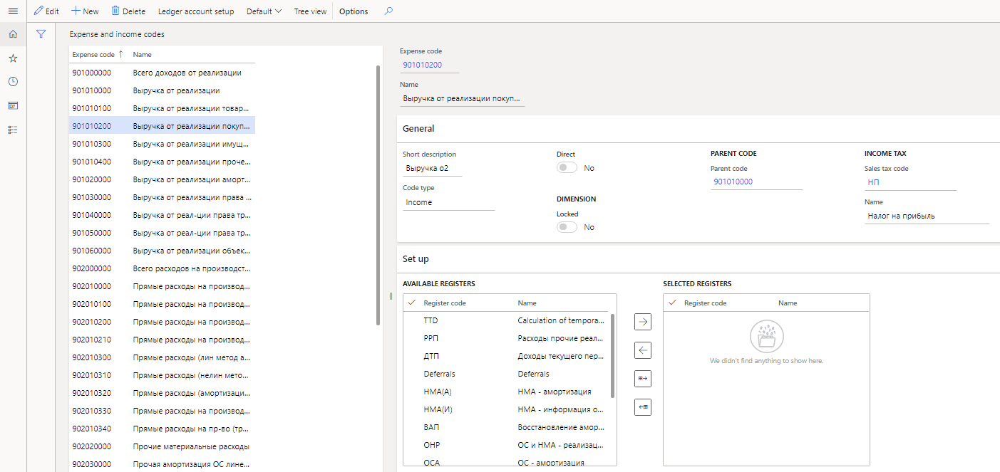
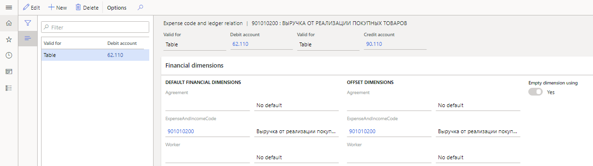

# Expense and income codes
[!include [banner](../../includes/banner.md)]

Expense and income codes are created on the **Expense and income codes** page. The hierarchical structure lets you group income and expenses according to the lines of the profit tax declaration. Therefore, the list of expense and income codes contains all the income and expense codes that are used in tax reporting. Turnovers on parent income and expense codes consist of the turnovers on child income and expense codes. The list of expense and income codes is synced with the list of financial dimensions selected in the **Tax dimension** field on the **Profit tax** tab of the **General ledger parameters** page. This mechanism is used to calculate the profit tax declaration. For more information, see [Profit tax declaration](rus-profit-tax-declaration.md).

You should set the value of the **ExpenseAndIncomeCode** field in the following places:

- In primary documents such as purchase orders, sales orders, advance reports, and inventory journals, and in master records such as main accounts and fixed assets.
- In vendor, customer, ledger, and inventory transactions.

## Create an expense or income code

1.  Go to **Tax** \> **Setup** \> **Profit tax** \> **Expense codes**.

    

2.  On the Action Pane, select **Tree view** to view expense and income codes as a tree, and then select **New** to create a code.
3.  In the **Expense code** field, enter the expense or income code. The code should be unique.

    Typically, when codes are numbered, you should adhere to a hierarchical principle. For example, if you create a child code for code **90100000**, it should start with **901**, such as **901010000** or **901020000**.

4.  In the **Name** field, enter a detailed description of the expense or income code.
5.  On the **General** FastTab, set the following fields:

    - In the **Short description** field, enter the short name of the expense or income code.
    - In the **Code type** field, select the type of code: **Income**, **Issue** or **Unknown**.
    - In the **Dimension** section, set the **Locked** option to **Yes** to stop synchronization of the selected expense or income code.
    - Optional: In the **Parent code** section, in the **Parent code** field, select a parent code to create a hierarchical structure.
    - In the **Income tax** section, in the **Sales tax code** field, select the sales tax code that should be used to calculate the amount of tax assets and tax liabilities for the expense or income code.

6.  On the **Set up** FastTab, you can select the registers that will be used to calculate the amounts and totals for expense or income codes.

    > [!NOTE]
    > You can select registers only for codes that aren't parent codes.

    In the **Available registers** section, select the registers, and then select the right arrow button to move them to the **Selected registers** section.

    Alternatively, on the Action Pane, select **Default \> Default**. In this case, the system automatically suggests registers and moves them to **Selected registers** section. A register will be suggested for an income or expense code in the following situations:

    -   The income or expense code, or its parent code, was selected in the register settings.
    -   The income or expense code, or its parent code, was used in the sequence of calculation for rated expense register settings.
    -   The register is preconfigured so that it's used by default when totals are calculated for the expense or income code. You can find an example list of expense and income codes in the **RUMF** legal entity.

7.  On the Action Pane, select **Ledger account setup** to select the ledger accounts that transactions will be assigned to for the income or expense code.

    For example, amounts for ledger transactions **Debit 62.110** and **Credit 90.110**, where the **ExpenseAndIncomeCode** financial dimension is either set to **901010200** or left blank, will be assigned to income code **901010200** (**Revenue from sales of goods**).

    

8.  On the **Expense code and ledger relation** page, in the header, set the following values:

    - In each of the two **Valid for** fields, select one of the following values:

       - **Table** – The setting applies to a separate account.
       - **Group** – The setting applies to an account interval group.
       - **All** – The setting applies to all accounts.

    -   Set the **Debit account** and **Credit account** fields, based on the value of the corresponding **Valid for** field:

        - If the **Valid for** field is set to **Table**, select a ledger account.
        - If the **Valid for** field is set to **Group**, select the code for an account interval group.
        - If the **Valid for** field is set to **All**, leave the field blank.

9.  On the **Financial dimensions** FastTab, in the **Default financial dimensions** and **Offset dimensions** sections, you can specify financial dimension codes that account entries will be used for when totals are calculated on the expense or income code, in addition to the setup of ledger accounts that you selected earlier.

    For example, in the **Agreement**, **ExpenseAndIncomeCode**, and **Worker** fields, select the dimensions for the account and the offset account.

    > [!NOTE]
    > The **ExpenseAndIncomeCode** dimension is selected as the dimension for expense and income codes on the **General ledger parameters** page. It can’t be changed. If you set the **Empty dimension using** option to **Yes**, the expense or income code will also include transactions that have the same ledger accounts, but the **ExpenseAndIncomeCode** field is blank.

[!INCLUDE[footer-include](../../../includes/footer-banner.md)]
