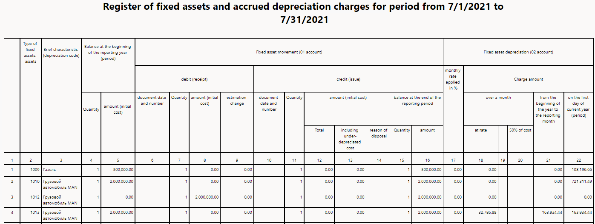

# Fixed asset inquiries and reports

This article provides information about the inquiries and reports for fixed asset acquisitions for Russia.

## Inquiries

The following three types of inquiries are available from a fixed asset value model. To work with these inquiries, go to **Fixed assets (Russia)** \> **Fixed asset record**, and select **Value model**.

- Transactions
- Budget transactions
- Balance

The following inquiries are available at **Fixed assets (Russia)** \> **Inquiries**:

- Transactions
- Budget transactions
- Voucher transactions
- Documents
- Working clothes/Special riggings on-hand

### Transactions

To view all transactions, go to **Fixed assets (Russia)** \> **Inquiries** \> **Transactions**. The **Transactions** page shows all transactions, regardless of the module that they were posted in. Transactions can be posted in the following modules:

- Fixed assets (Russia)
- General ledger
- Accounts payable
- Accounts receivable

The **General** tab provides transaction details. Select **Voucher** for an overview of the voucher transactions that are related to the fixed asset transaction, the source, and the original document for the fixed asset transaction.

### Budget transactions

To view budget transactions, go to **Fixed assets (Russia)** \> **Inquiries** \> **Budget transactions**. The **Budget transactions** page shows the details of fixed asset budget records.

To review the budget transaction in the **General ledger** module, select **Budget account entries**.

### Voucher transactions

To view voucher transactions, go to **Fixed assets (Russia)** \> **Inquiries** \> **Voucher transactions**. The **Voucher transactions** page shows all voucher transactions that are related to the fixed asset transactions. Before you run this inquiry, you can apply a filter. For example, you can filter based on the fixed asset inventory number or value model.

### Documents

To view fixed asset documents, go to **Fixed assets** \> **Inquiries** \> **Documents**. The **Documents** page shows all the different types of local documents, such as the Acceptance report (\#FA-1) and the Statement about fixed assets object acceptance-transference (\#FA-1). For more information, see [Unified printing forms for fixed assets (Russia)](printing-forms-fixed-assets.md).

### Working clothes/Special riggings on-hand

To view working clothes and special riggings, go to **Fixed assets** \> **Inquiries** \> **Working clothes/Special riggings on-hand**. The **Working clothes/Special riggings on-hand** page shows all the selected Working clothes/Special riggings cards by worker, together with information about the lifetime, issued, and disposal date on a specified date. You can select cards based on the value model, the type of card (Working clothes or Special riggings), or the department. You can group the data by division, issue rate, item group, and item.

## Reports

There are many reports in the **Fixed assets (Russia)** module. The following sections list the reports and provide a short description of each.

### FA list

Go to **Fixed asset (Russia)** \> **Reports** \> **FA list**.

This report shows the fixed asset list together with the net book value on the report date.

### Inventory FA list

Go to **Fixed asset (Russia)** \> **Reports** \> **Inventory FA list**.

This report shows the fixed asset data that is required for legal form \#FA-6.

### FA movement report

Go to **Fixed asset (Russia)** \> **Reports** \> **FA movement report**.

This report shows the net book value on the start date of the period, operations in the period (putting in operation, depreciation, changing of cost, and disposal), and the net book value on the end date of the period. You can view the total data by fixed asset group for the specified period.

### Inventory FA list

Go to **Fixed asset (Russia)** \> **Reports** \> **Inventory FA list**.

This report shows a list of fixed assets together with an indication of the acquisition cost and net book value, and data about the disposal of fixed assets.

### FA putting into operation

Go to **Fixed asset (Russia)** \> **Reports** \> **FA putting into operation**.

This report shows information about the acquisition of fixed assets. This information includes the acquisition date and price.

### FA disposal

Go to **Fixed asset (Russia)** \> **Reports** \> **FA disposal**.

This report shows information about the disposal of fixed assets. This information includes the date of disposal, the net book value, and profit and loss information.

### FA barcodes

Go to **Fixed asset (Russia)** \> **Reports** \> **FA barcodes**.

This report provides a list of bar codes on the basis of fixed asset records.

### Balance by FA

Go to **Fixed asset (Russia)** \> **Reports** \> **Balance by FA**.

This report shows the acquisition amount and the net book value of fixed assets together with a total amount by transaction type. Here are some of the transaction types:

- Revaluation
- Major repair
- Depreciation revaluation
- Partial dismantlement
- Disposal (sales)
- Disposal (dismantlement)
- Writing-off

### FA transactions

Go to **Fixed asset (Russia)** \> **Reports** \> **FA transactions**.

This report shows a list of operations by fixed asset together with transaction amounts and other data.

### History of lease

Go to **Fixed asset (Russia)** \> **Reports** \> **History of lease**.

This report shows a history of fixed asset leasing together with the date of the lease, the expected return date, the actual return date, and other data from the **FA leased** page. To open that page, go to **Fixed asset** \> **History** \> **Lease** from the fixed asset record.

### Lease (report)

Go to **Fixed asset (Russia)** \> **Reports** \> **Lease (report)**.

This report shows data about leased fixed assets that weren't returned from lease and that a lease was posted for.

### Sheet of FA and depreciation charges

Go to **Fixed asset (Russia)** \> **Reports** \> **Sheet of FA and depreciation charges**.

This report shows data for the selected fixed assets in a selected date range.

### Insurance

Go to **Fixed asset (Russia)** \> **Reports** \> **Insurance**.

This report shows data about fixed asset insurance. The information includes the policy number, insurance amount, and date.

### NVFA accounting card (No. MB-2)

Go to **Fixed asset (Russia)** \> **Reports** \> **NVFA accounting card (No. MB-2)**.

This report shows the MB-2 forms for all net value fixed assets as of a specified date.
