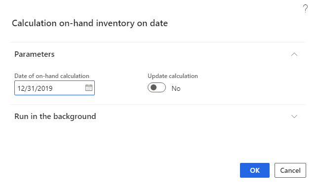
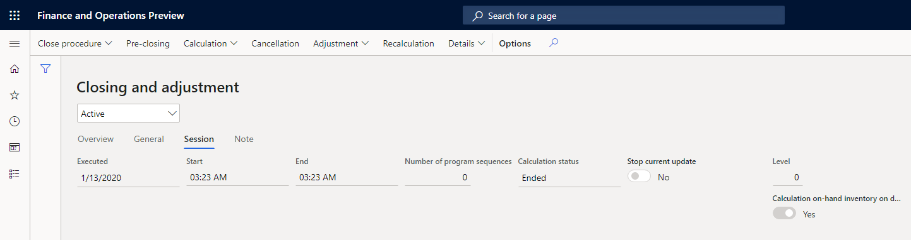
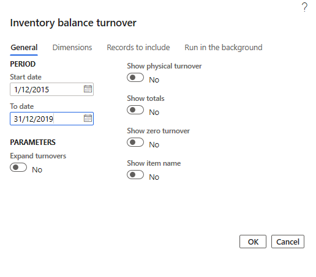
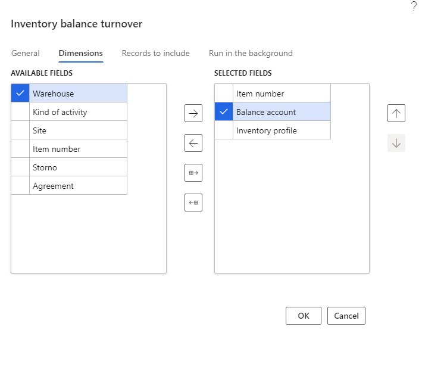
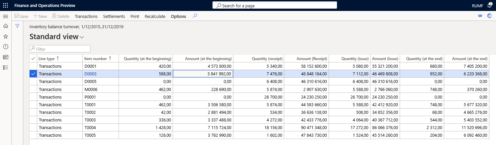
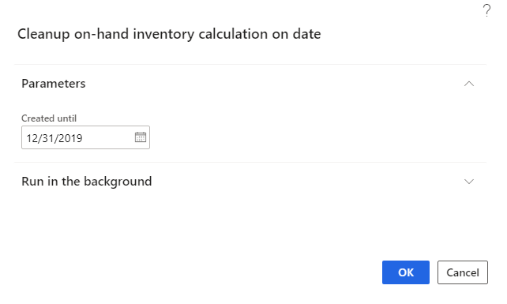
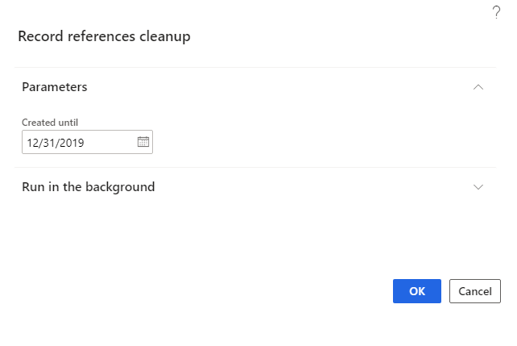
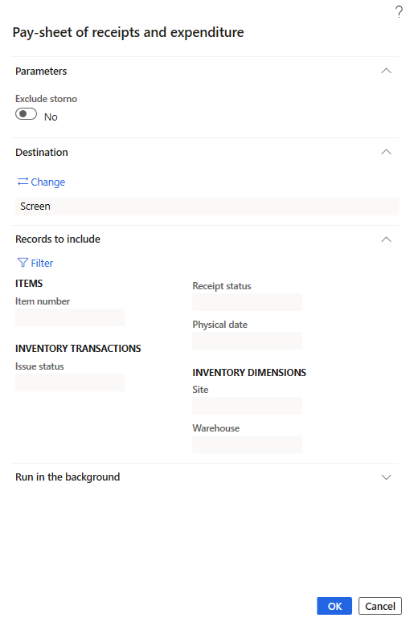
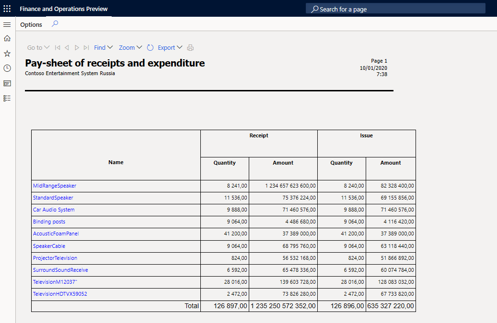
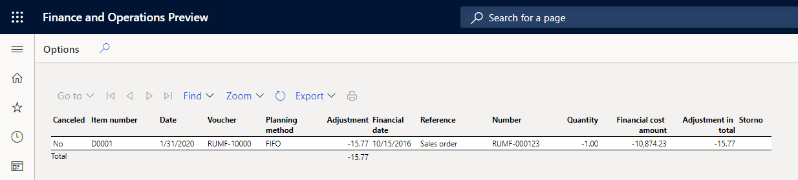

# Inventory reports
[!include [banner](../../includes/banner.md)]

There are four local inventory reports available in Russia:

- Inventory balance turnover
- Pay-sheet of receipts and reports expenditure
- Adjustments
- Adjustment (cur.)

## Preliminary setup

Before you can generate the local inventory reports, complete the following steps to set up number sequences for on-hand inventory dimension combination.

1. Go to **Inventory management** \> **Setup** \> **Inventory and warehouse management parameters**.
2.  On the **Number sequences** tab, select a number sequence code for the **On-hand inventory on date dimension combination** reference, and then assign the number sequence in the **Number sequence code** field.

## Inventory balance turnover

Using the **Inventory balance turnover** inquiry, you can view balances and turnovers in the context of dimensions. You can select dimensions to include in the report, and specify the selection criteria for dimensions when you use filters.

### Calculate on-hand inventory on inventory closing date

To optimize the performance of the **Inventory balance turnover** inquiry, use the periodic procedure, **On-hand inventory on date**. It calculates on-hand inventory on the date when the inventory was previously closed.

1. Go to **Inventory management \> Periodic tasks \> On-hand inventory on date**.
2. On the **Calculation on-hand inventory on date** page, on the **Parameters** tab, in the **Date of on-hand calculation** field, specify the inventory closing date for which the inventory calculation must be performed. By default, this is the first date the inventory was closed without an inventory calculation.
3. Set the **Update calculation** toggle to **Yes** if you want to clear the results of the previous inventory calculation on the specified inventory closing date and perform a full inventory calculation.

    

4. When the inventory calculation is complete, on the **Closing and adjustment** page, for the corresponding inventory closure line, on the **Session** tab, the **Calculation on-hand inventory on date** option will be set to **Yes**.

    

If you try to run the inventory calculation again to close an inventory that has the **Calculation on-hand inventory on date** option set to **Yes**, and the **Update calculation** option is set to **No**, an error will occur.

The results of the on-hand inventory calculation on the inventory closing date are deleted from the system when the corresponding inventory closing is canceled.

### Inventory balance turnover inquiry

1. Go to **Inventory management** \> **Inquires and reports** \> **Transactional reports (Russia)** \> **Inventory balance turnover**.

    

2. On the **Inventory balance turnover** dialog box, on the **General** tab, in the **Start date** and **To date** fields, specify the period of report.
3. Set the **Expand turnovers** option to **Yes** to divide the turnover columns into two groups in the inquiry results:

    - Internal turnovers that *don’t* change the total balances of the company. This includes inventory movements on inventory transfer journals and transfer orders.

        >[!NOTE]
        > The following documents are not considered internal turnovers because the item from the warehouse can be written off:
        >
        > - Quarantine orders
        > - Transfer order scarp
        > - Quality orders

    - External turnovers that *do* change the total balances of the company. This includes inventory movements on purchase or sales orders and inventory journals.

4. Set the **Show physical turnover** option to **Yes** to separate physical turnovers from financial turnovers. Physical turnovers include packing slips and production orders, picking lists, by-product journals and report-as-finished journals for production orders. Financial turnovers include purchase or sales invoices, inventory journals, and the calculation of production orders. The physical turnover will be allocated to a separate group of columns. If you set the **Show physical turnover** option to **No**, the physical turnover is added to the financial turnover.

  > [!NOTE]
  > If you use the physical storno mechanism for inventory transactions during a financial update, the physical turnover and storno physical turnover for financially updated inventory transactions are reflected in the same column as a receipt or issue, but with opposite signs. That is, they are summarized to zero, if both the physical and financial dates of the inventory transaction are included in the inquiry period. If the physical date is included in the inquiry period, and the financial is not, the inquiry will contain only physical movement, but the reverse/storno of physical movement and financial movement will not be considered.
  >
  > For example, for the following inventory transactions, the purchase and credit note for the purchase are listed.

  >  | Document type                | Type of inventory transaction | Credit correction (physical) | Quantity |
  >  |------------------------------|-------------------------------|------------------------------|----------|
  >  | Purchase order               | Receipt                       | No                           | 10       |
  >  | Credit note for the purchase | Issue                         | Yes                          | \-3      |
  >
  > If the **Storno** dimension is not selected, the report will show the line with the following quantities:
  >
  >  | Quantity (Receipt) | Quantity (Issue) |
  >  |--------------------|------------------|
  >  | 7                  | 0                |
  >
  > If the physical or financial update of inventory transaction wasn’t posted to the general ledger, the value in the **Balance account** dimension for the inventory transactions is empty.

5. Set the **Show totals** option to **Yes** to view lines with subtotals on dimensions.
6. Set the **Show zero turnover** option to **Yes** to view lines with zero turnovers (but a non-zero initial balance) for the period. This option is automatically selected if the **Show totals** option is selected.
7. Set the **Show item name** option to **Yes** to view the product name in addition to the product code.
8. On the **Dimensions** tab, select dimensions to include in the report.

    

    The following dimensions are available:
    
     - **Item number**
     - **Inventory dimensions**
     - **Kind of activity**: The value **Unspecified** is displayed if the inventory movement does not have an **Inventory profile** dimension.
     - **Balance account**
     - **Agreement**
     - **Storno** allows you to separate storno transactions.
       
      - If the **Storno** dimension is selected, then storno inventory transactions are displayed separately in the report on separate lines. These lines have the value **Yes** in the **Storno** column. The transactions are displayed with different direction and amount sign. Storno of incoming inventory transactions are shown in the **Issue** column with a negative sign, and storno of outgoing inventory transactions are shown in the **Receipt** column with a negative sign.        
      - If the **Storno** dimension is not selected, the storno inventory transactions decrease the value of the initial transaction in the corresponding columns. Storno of incoming inventory transactions have a decreased value in the **Issue** column, where storno of outgoing inventory transactions have a decreased value in the **Receipt** column.
      
      For example, the following inventory transactions show the purchase and credit note for the purchase:

      | Document type                | Type of inventory transaction | Credit correction (physical) | Quantity |
      |------------------------------|-------------------------------|------------------------------|----------|
      | Purchase order               | Receipt                       | No                           | 10       |
      | Credit note for the purchase | Issue                         | Yes                          | \-3      |

      If the **Storno** dimension is selected, the report will show the lines with the following quantities:

      | Storno | Quantity (Receipt) | Quantity (Issue) |
      |--------|--------------------|------------------|
      | No     | 10                 | 0                |
      | Yes    | \-3                | 0                |

9. On the **Records to include** tab, use the filter to define the transactions to include in the report.
10. Click **OK** to generate a report.

    

> [!NOTE]
> In the **Line type** column, you can see the type of the line: **Transactions** or **Totals**
>
> The quantity columns (**Quantity (at the beginning)**, **Quantity (at the end)**, **Quantity (receipt)**, **Quantity (issue)**) are displayed only if the **Item number** is selected as one of the report dimensions. In these fields, the data are is displayed in the inventory unit of measurement for the item.
> 
> If the date of the corresponding inventory settlements falls within the inquiry period, the fields with amounts, **Amount (at the beginning)**, **Amount (Receipt)**, **Amount (Issue)**, **Amount (at the end)** contain the financial amount of the corresponding inventory transactions in the accounting currency and the adjustments of the financial amount.
>
> The report quantities and amounts also include inventory transactions that have been updated physically. The physical amount of the inventory transaction is used. Inventory transactions that are updated financially are included in the inquiry with the financial transaction date. Inventory transactions that are updated only physically are included in the inquiry with the physical transaction date. Inventory settlements are reflected in the report with the date of the inventory settlement.

11. Depending on the type of inventory transaction, the inquiry determines the direction of the inventory turnover as follows:

    | Type of inventory transaction         | Direction                                                             |
    |---------------------------------------|-----------------------------------------------------------------------|
    | Purchase order                        | Receipt                                                               |
    | Sales order                           | Issue                                                                 |
    | Production                            | Receipt                                                               |
    | Production line                       | Issue                                                                 |
    | By-products                           | Receipt                                                               |
    | Other types of inventory transactions | Receipt for incoming transactions and Issue for outgoing transactions |

12. If the **Item number** dimension is selected, you can select a line with the line type, **Transaction**, and on the **Action pane**, select **Transaction**. On the opened **Inventory transactions** page, you can see the list of transactions that generated turnovers in the selected line. If the financial date does not fall within the inquiry period, but there are inventory settlements within the inquiry period, the transaction is not reflected on this page.
13. Select **Recalculate** to set new inquiry parameters and recreate the results.
14. Select **Print** to view or save the report as a Microsoft Excel document. On the **Parameters** FastTab, set the **Print ranges** to **Yes** if you want the report to display the filters specified in the inquiry parameters, as well as the filters applied to the inquiry results.

### Clean up temporary data

When calculating data for an **Inventory balance turnover** inquiry, the system generates temporary data but stores the data in permanent database tables. After closing the inquiry form, the data is deleted from the system. However, temporary data may not be completely deleted (for example, in case of system failures). To clear the temporary data, the **On-hand inventory calculation on date** and **Record references cleanup** periodic operations are used.

1. Go to **Inventory management** \> **Periodic tasks** \> **Clean up** \> **On-hand inventory calculation on date**.

    

2. On the **Parameters** FastTab, in the **Created until** field, specify the date. The temporary data with a creation date before the specified date will be deleted. Specify the date equal to current date minus one (1) day to avoid deleting the data currently used by another user.
3. Select **OK**.
4. Go to **Organization administration** \> **Periodic** \> **Record references cleanup**.

    

5. On the **Parameters** FastTab, in the **Created until** field, specify the date. All temporary data with creation date before the specified date will be deleted.
6. Select **OK**.

## Pay-sheet of receipts and expenditure report

This report displays receipts and issues for all items.

1. Go to **Inventory management** \> **Inquires and reports** \> **Transactional reports** \> **Pay-sheet of receipts and reports expenditure**.

    

2.  On the **Pay-sheet of receipts and expenditure** dialog box, on the **Parameters** FastTab, specify the value of **Exclude storno** parameter:

    - If the **Exclude storno** option is set to **Yes**, the system displays the storno turnovers in the total inventory movements without allocating the storno turnovers as a separate line.
    - If the **Exclude storno** option is set to **No**, the system displays a line with initial transactions for each item and a line with storno transactions, if there were any. If the original and storno transactions are in the same reporting period, they do not add turnovers for the item, but if they are in different periods, the transaction that falls within the inquiry period will affect the period's turnovers.
    
3. On the **Records to include** FastTab, select the **Filter** to apply filters for the report.
4. Select **OK** to generate a report.

    

## Adjustments report

This report shows all adjustments that were done during the inventory recalculation or closing. To do this, go to **Inventory management** \> **Inquires and reports** \> **Transactional reports** \> **Adjustments**. Specify the parameters, and then select **OK** to generate a report.

## Adjustments in currency report

This report shows all adjustments that were done during the inventory recalculation or closing in the reporting currency. To do this, go to **Inventory management** \> **Inquires and reports** \> **Transactional reports** \> **Adjustment (cur.)**. Specify the parameters, and select **OK** to generate a report.

[!INCLUDE[footer-include](../../../includes/footer-banner.md)]
