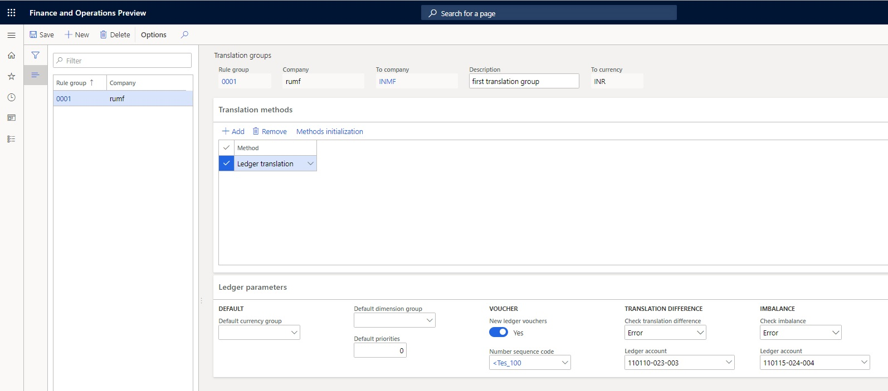
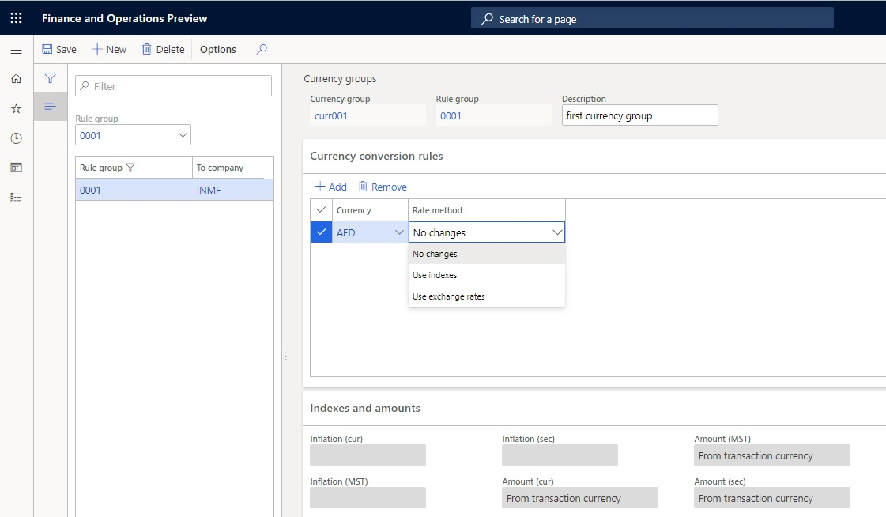
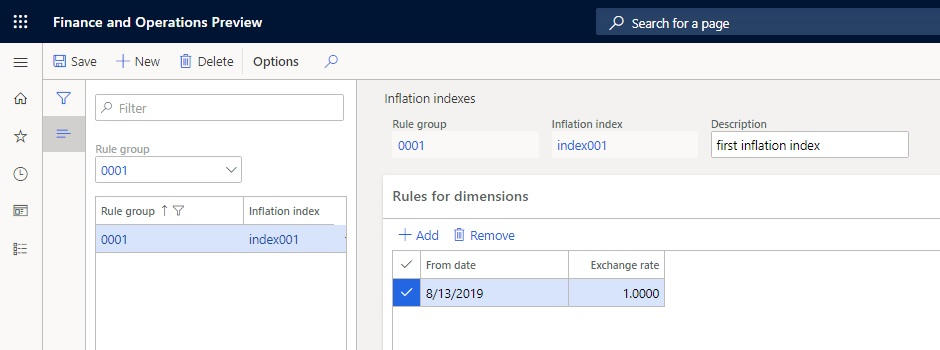
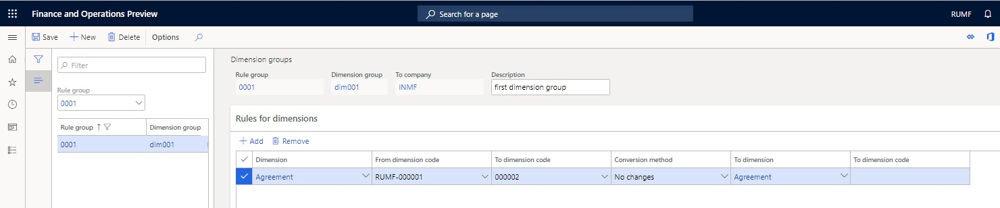
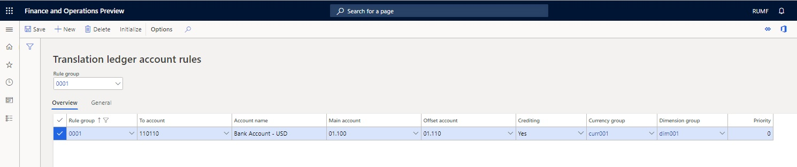
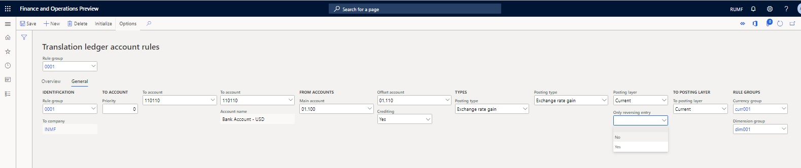
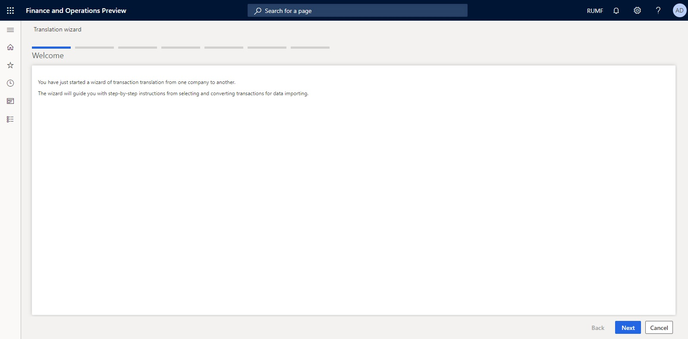
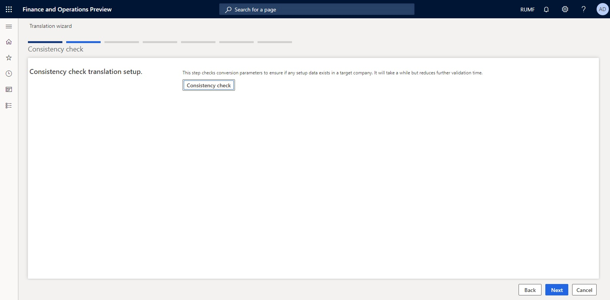
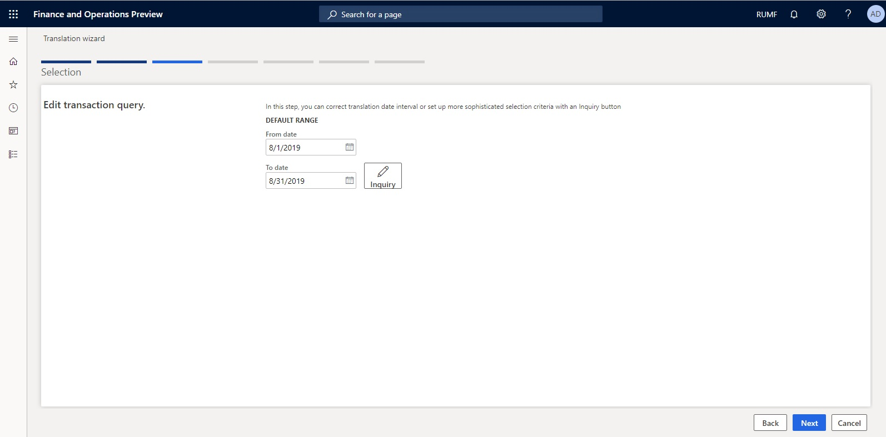
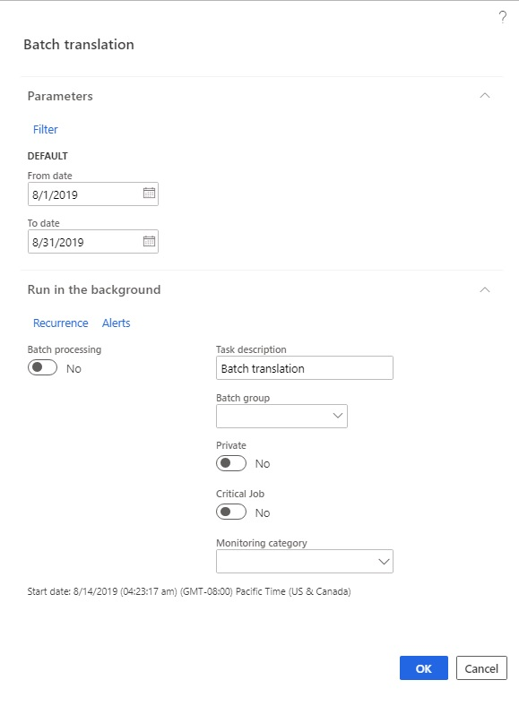

# Ledger translation (Russia)

[!include [banner](../../includes/banner.md)]

Translation is used to transfer accounting transactions from one company to another and, at the same time, to transform the transactions so that they comply with standards for business or international reporting. During translation, ledger accounts are usually consolidated according to a specific rule. Sometimes, data must be recalculated from one currency to another, or financial dimensions must be changed. For example, the accounting in one company might be done in rubles, whereas the business reporting is done in dollars.

Translation can be done between one company and multiple other companies. For example, the company that does the accounting might translate data to one company for international reporting but another company for business reporting.

Translation can be done only for ledger transactions.

The following types of voucher translation are available:

- **One-to-one** – If the national currency and the reporting currency are the same, translate transactions from a source company to a target company that use the same currency.
- **Historical** – If the national currency and the reporting currency differ, do the voucher translation by using the exchange rate that is in effect on the date when the voucher is posted.
- **Weighted** – Do the voucher translation by using the weighted average exchange rate for the period.
- **Current** – Do the voucher translation by using the exchange rate that is in effect on the date of translation.
- **Special** – Do the voucher translation by using the exchange rate that is specified in the transaction instead of the exchange rate that is in effect on the voucher date or the translation date.
- **User specified** – Do the voucher translation by using the exchange rate that is specified by the user.

A company sets up translation rules based on its accounting policies. The translation rules describe which ledger account in the Russian chart of accounts transaction must be transferred, which ledger account in the International Financial Reporting Standards (IFRS) chart of accounts the transactions must be transferred to, which exchange rate must be used, and which financial dimensions the transactions must be transferred with. Transactions are transferred from the source company, which uses Russian accounting, to the target company, which uses international or managerial accounting.

You must create target companies that do the translation. Before you create target companies, complete the following prerequisites:

1. Set up a chart of accounts.
2. Create financial dimensions.
3. Set up the currencies and exchange rates.
4. Create fiscal periods.

You can translate the transactions together with or without the saved correspondence of the source company.

The translation procedure is done periodically. It transfers transactions from the source company (which is the database for Russian accounting) to a target company (which is either IFRS or a business company).

## Preliminary setup
The translation parameters must be set in the source company.

### Set up a translation group
You can create translation group rules to specify all translation settings.

1. Go to **General ledger** \> **Translation setup** \> **Translation groups**.
2. Create a line.
3. In the **Rule group** field, enter a unique code for the translation rule group.
4. In the **Company** field, enter the code for the source company.
5. In the **To company** field, select the code for the target company.

> [!NOTE]  
> The value of the target company's standard currency is automatically updated in the **To currency** field.

6. In the **Description** field, enter a description of the translation rule group.
7. On the **Translation methods** FastTab, select **Methods initialization** to create a list of translation methods.
8. Select **Add**, and then, in the **Method** field, select **Ledger translation**.

    

9. On the **Ledger parameters** FastTab, in the **Default currency group** field, select the currency group that should be used by default for the account translation rules.
10. In the **Default dimension group** field, select the dimension group that should be used by default for the account translation rules.
11. In the **Default priorities** field, enter the priority that should be used by default for the account translation rules.
12. Set the **New ledger vouchers** option to **Yes** to create new ledger voucher numbers when you do translations. If the **New ledger vouchers** option is set to **No**, ledger account transactions are translated to the ledger account of the target company by using the voucher number of the source company.
13. In the **Number sequence code** field, select the number sequence for the vouchers.

> [!NOTE]  
> The **Number sequence code** field is available only if you set the **New ledger vouchers** option to **Yes**.

14. In the **Translation difference** section, you define the level that the translation difference should be checked to and the account where translation difference amounts should be put. The translation difference is the imbalance that occurs in the target company's primary and secondary currencies because the valuation of the corresponding entries is done at different rates.
15. In the **Check translation difference** field, select one of the following validation methods for the translation difference:

    - **Error** – When the transaction is posted to the translation difference account, an error message is shown, and the translation session is canceled.
    - **Warning** – When the translation session is completed, a message about the amounts that are posted to the translation difference account is shown. All transactions are translated to the ledger account of the target company.

16.  In the **Ledger account** field, select the main account number that should reflect the translation differences for the target company's default and secondary currencies.

> [!NOTE]  
> A translation difference can occur when the debit and credit lines of the transaction have been translated to the target company at different exchange rates. A translation difference can also occur because of rounding errors.
>
> In the **Imbalance** section, you define the level that the imbalance should be checked to and the account where the imbalance amounts should be put. The imbalance is the difference that occurs in the transaction amount in the target company because the valuation of the corresponding transactions is done at different rates.

17. In the **Check imbalance** field, select the validate method for the imbalance:

    - **Error** – When the transaction is posted to the imbalance account, an error message is shown, and the translation session is canceled.
    - **Warning** – When the translation session is completed, a message about the amounts that are posted to the imbalance account is shown. All transactions are translated to the ledger account of the target company.

18. In the **Ledger account** field, select the account number that should be used to accumulate the imbalance amounts in the target company's transaction currency.

> [!NOTE]  
> An imbalance can occur during translation, when the debit side of the transaction is translated to the target company, but the credit side of the transaction isn't translated.

19. Select **Save**, and then close the page.

## Set up currency groups so that they have currency conversion rules
Set up currency groups to specify the currency conversion rules that are used during translation.

1. Go to **General ledger \> Translation setup \> Currency groups**.
2. In the left pane, in the **Rule group** field, select the rule group that you're setting up the currency conversion rule for.

> [!NOTE]  
> You can set up multiple currency conversion rules for one rule group.

3. Create a currency group.
4. In the **Currency group** field, enter a unique code for the currency group.
5. In the **Description** field, enter a description of the currency group.
6. On the **Currency conversion rules** FastTab, select **Add** to create a line.
7. In the **Currency** field, select the code for the currency in the source company that the conversion method is being set up for.
8. In the **Rate method** field, select the currency conversion method that should be used when transactions are translated from the source company to the target company:

    - **No changes** – In the target company, a translated transaction is created, where the transaction amount and currency equal the transaction amount and currency in the source company. In the translated transaction, the amounts in the accounting and reporting currencies are calculated by using the exchange rate of the target company.
    - **Use indexes** – If you select this option, on the **Indexes and amounts** FastTab, define the rules for using indexes to determine the transaction amounts (in the transaction currency, default currency, and secondary currency) for the target company:
    
        - In the **Inflation (cur)** field, select the conversion index for the transaction currency.
        - In the **Inflation (MST)** field, select the conversion index for the accounting currency.
        - In the **Inflation (sec)** field, select the conversion index for the reporting currency.

    - **Use exchange rates** – If you select this option, on the **Indexes and amounts** FastTab, define the rules for using exchange rates to determine the transaction amounts (in the transaction currency, default currency, and secondary currency) for the target company:

        - In the **Amount (cur)** field, select the rule for converting the transaction amount into the transaction currency.
        - In the **Amount (MST)** field, select the rule for converting the transaction amount into the accounting currency.
        - In the **Amount (sec)** field, select the rule for converting the transaction amount into the reporting currency.
        - In these three **Amount...** fields, you can select the following rules:

            - **From transaction currency** – The amount is calculated from the amount of the source transaction through conversion at the exchange rate of the target company.
            - **Zero** – The value **0** (zero) is substituted.
            - **Amount in transaction currency** – The amount is copied from the amount in the transaction currency of the source transaction.
            - **The amount in the accounting currency** – The amount is copied from the amount in the accounting currency of the source transaction.
            - **The amount in the reporting currency** – The amount is copied from the amount in the reporting currency of the source transaction.
            - **1 (one)** – The value **1** (one) is substituted.

9.  Select **Save**, and then close the page.

## Set up an inflation index

1. Go to **General ledger \> Translation setup \> Inflation indexes**.
2. In the left pane, in the **Rule group** field, select the translation group that you're setting up the inflation index for.

> [!NOTE]  
> You can set up multiple inflation indexes for one rule group.

3. Select **New** to create an inflation index.
4. In the **Inflation index** field, enter a unique code for the inflation index.
5. In the **Description** field, enter a description of the inflation index.
6. On the **Rules for dimensions** FastTab, select **Add** to create a line.
7. In the **From date** field, select the start date when the index becomes valid.

>  [!NOTE]  
>  The configured index starts to work on the selected start date and continues to work until the next start date of another configured index. You can also set up an index without specifying a start date. In this case, the index works for all transactions before the start date of another index.

8. In the **Exchange rate** field, enter the index value that should be used during the index validity period.

9. Select **Save**, and then close the page.

## Set up a dimension group and conversion rules for dimensions
You can use the **Dimension groups** page to set up rules for translating dimensions from the source company to the target company. A separate rule group is created to convert dimensions for each translation group, and then a set of dimension conversion options is specified for this group.

1. Go to **General ledger** \> **Translation setup** \> **Dimension groups**.
2. In the left pane, in the **Rule group** field, select the translation group that you're setting up dimension conversion rules for.

> [!NOTE]  
> You can set up multiple conversion rules for the dimensions of one rule group.

3. Select **New** to create a dimension group.
4. In the **Dimension group** field, enter a unique code for the dimension group.
5. In the **To company** field, enter the code for the target company that should be used for transactions during translation.
6. In the **Description** field, enter a description of the dimension group.
7. On the **Rules for dimensions** FastTab, select **Add** to create a line.
8. In the **Dimension** field, select the dimension in the source company that the conversion rule is being configured for.
9. In the **From dimension code** and **To dimension code** fields, define the range of dimension values.
10. In the **Conversion method** field, select the method that is used to convert the dimension of the translated transaction from the source company:

    - **No changes** – The source dimension is transferred without changes.
    - **Company code** – The current dimension is changed to the code for the source company.
    - **Value** – The current dimension is replaced with the value that is entered in the **To dimension code** field.
    - **Customer/Vendor** – The current dimension is replaced with the customer or vendor code.

11. In the **To dimension** field, select the type of dimension in the target company that the values should be transferred to.
12. In the **To dimension code** field, select the code for the dimension in the target company that the transaction dimension in the source company should be moved to during translation.

> [!NOTE]  
> This field is available only if you select **Value** in the **Conversion method** field.

13.  Select **Save**, and then close the page.

The following table shows examples of dimension conversion settings and their effects on translation.

| Dimension (in the source company) | Conversion method | To dimension (in the target company) | To dimension code | Result                                                                                                                                                                                  |
|-----------------------------------|-------------------|--------------------------------------|-------------------|-----------------------------------------------------------------------------------------------------------------------------------------------------------------------------------------|
| Dimension type (Department)       | No changes        | Dimension type (Department)          | None              | The dimension value is transferred. The Department dimension is unchanged in the target company.                                                                                        |
| Dimension type (Department)       | No changes        | Dimension type (Purpose)             | None              | The dimension value is transferred. The Department dimension is transferred to the Purpose dimension in the target company.                                                             |
| Dimension type                    | Company code      | Dimension type                       | None              | Dimensions are converted to a value that equals the source company code.                                                                                                                |
| Dimension type                    | Value             | Dimension type                       | Dimension value   | Dimensions are converted to the specified value.                                                                                                                                        |
| Dimension type                    | Customer/Vendor   | Dimension type                       | None              | Dimension are converted to the specified customer/vendor code (that is, if the transaction went to the customer or vendor, the account number is substituted instead of the dimension). |

## Set up account translation rules
Use the **Translation ledger account rules** page to set up translation rules for ledger accounts. These rules are used to correlate a source company's accounts to a target company's accounts, and they include conversion rules for currency and dimensions.

1. Go to **General ledger \> Translation setup \> Ledger account rules**.
2. In the upper part of the page, in the **Rule group** field, select the translation group that you're setting up the account conversion rules for.

> [!NOTE]  
> You can set up multiple conversion rules for one rule group.

3. Select **New** to create a line.
4. On the **Overview** tab, in the **To account** field, select the ledger account from the target company's chart of accounts that transactions in the source company should be translated to. After you save your changes to the line, the name of the target company is automatically selected in the **Account name** field.
5. In the **Main account** field, select the ledger account in the source company that should be used to translate transactions to the target company.
6. In the **Offset account** field, select the offset account in the source company that should be used to translate transactions that have the specified correspondence. Leave this field blank to select all transactions, regardless of the offset account.
7. In the **Crediting** field, select the type of transactions to translate:

    - **No** – Translate only debit account transactions.
    - **Yes** – Translate only credit account transactions.

Leave this field blank to translate both credit and debit transactions.

Depending on the values of the **Offset account** and **Crediting** fields, the following transactions are translated:

   - All transactions
   - Only debit transactions
   - Only credit transactions
   - Account transactions that correspond to the specified offset account
   - Debit account transactions that correspond to the specified credit offset account
   - Credit account transactions that correspond to the specified debit offset account

The following table shows examples for the various possible values of the **Main account**, **Crediting**, and **Offset account** fields.

| Main account | Crediting | Offset account | Result                                                                              |
|--------------|-----------|----------------|-------------------------------------------------------------------------------------|
| А            | Blank     | Blank          | All transactions on account А are translated.                                       |
| А            | No        | Blank          | Debit transactions on account А are translated.                                     |
| А            | Yes       | Blank          | Credit transactions on account А are translated.                                    |
| А            | Blank     | В              | Transactions on account А that correspond to account В are translated.              |
| А            | No        | В              | Debit transactions on account А that correspond to credit account В are translated. |
| А            | Yes       | В              | Credit transactions on account А that correspond to debit account В are translated. |

-   Debit A, Credit \*

-   Debit \*, Credit A

-   Debit A, Credit \*

-   Debit \*, Credit A

-   Debit A, Credit B

-   Debit B, Credit A

-   Debit A, Credit B

-   Debit B, Credit A

8. In the **Currency group** field, select the code for the currency conversion group. If a default currency group is configured for the translation rule group that is selected in the **Rule group** field, the value is automatically entered. However, you can change the value as you require.
9. In the **Dimension group** field, select the code for the dimension conversion group. If a default dimension group is configured for the translation rule group that is selected in the **Rule group** field, the value is automatically entered. However, you can change the value as you require.
10. In the **Priority** field, enter the priority of the rule. If a default priority is selected for the translation rule group that is selected in the **Rule group** field, the value is automatically entered. However, you can change the value as you require.

> [!NOTE]  
> The priority determines the order that rules are processed in during translation. The rule that has the lowest priority is processed first. We recommend that you specify the priority if there are several mutually exclusive rules.

11. On the **General** tab, in the first **Posting type** field, select a voucher type to translate only transactions that have that voucher type. For example, if you select **Petty cash**, only transactions in the bank module are translated.
12. In the second **Posting type** field, select a voucher type to translate only transactions that have that voucher type for the offset account.
13. In the **Posting layer** field, select a posting layer to translate only transactions that have that posting layer.
14. In the **Only reversing entry** field, select **Yes** to translate only reversing transactions, or select **No** to translate only regular transactions. Leave this field blank to translate both regular transactions and reversing transactions.
15. In the **To posting layer** field, select the posting layer that the translated transactions should be assigned to in the target company.

16. Select **Initialize** to automatically create a line that has an account translation rule for all the ledger accounts in the target company. In the **Initialize** dialog box, you can select **Filter** to filter the required accounts.
17. Select **OK**. The system creates a line that has a rule for each selected ledger account.

## Set up translation parameters

1. Go to **General ledger** \> **Ledger setup** \> **General ledger parameters**.
2. On the **Translation** tab, set the **Stop on the first error** option to**Yes** to interrupt the translation session when the first error is detected.
3. In the **Rule group** field, select the translation rule group that should be used by default when the translation session is started.
4. On the **Number sequences** tab, in the **Number sequence code** field, select a number sequence code for the **Translation session** reference.
5. Close the page.

## Do a single translation
When you create a new translation session, the **Translation** wizard is opened. Use this wizard to complete the following operations:

1. Validate the correctness of the conversion parameters.
2. Select translation dates.
3. Apply translation rules to all operations in the specified period.
4. Show the transaction conversion results on a **Preview** page.
5. Save the translation results to the target company.

Follow these steps to use the **Translation** wizard to do a single translation.

1. Go to **General ledger** \> **Periodic tasks** \> **Translation sessions**.
2. In the upper part of the page, in the **Rule group** field, select a translation group.
3. Select **Translation wizard** to open the **Translation** wizard.
4. On the **Welcome** page, select **Next**.

5. On the **Consistency check** page, select **Consistency check** to validate the conversion parameters.

6. In the **Consistency check** dialog box, specify the details, and then select **OK**.

> [!NOTE]  
> If the **Stop on the first error** option on the **Translation** tab of the **General ledger parameters** page is set to **Yes**, you can't move on to the next page of the wizard until the conversion parameters are checked for additional errors.

7. Select **Next**.
8. On the **Selection** page, in the **From date** and **To date** fields, define the period that the translation should be done for.
9. Select **Inquiry** to specify additional transaction selection criteria.

10. Select **Next**.
11. On the **Transaction processing** page, select **Next** to run the data conversion.

12. Select **Preview** to view the conversion results.
13. Select **Next** two times to import the translation data into the target company.
14. After the translation is completed, select **Finish**.

When the translation session for the source company is successfully completed, the following actions occur:

   - The **Translation sessions** page automatically creates a line for the status of the translation session. The **Export status** and **Import status** fields are automatically updated to **Completed**.
   - The **Translation session** field is updated to the number of the translation session.
   - The **From date** and **To date** fields are updated to the start and end dates of the period that the translation was done for.
   - The **Number of transactions** field is updated to the number of vouchers that were successfully processed during the translation session.

15. Go to the target company, and verify that the transactions have been successfully transferred. The date of the transactions that are transferred to the target company will be the date when the transactions were posted in the source company.

> [!NOTE]  
> In the target company, if **Translation difference** is selected in the **Posting type** field on the **General** tab of the **Translation ledger account rules** page (**General ledger \> Translation setup \> Ledger account rules**), the correspondence is saved when the transactions are translated. Otherwise, the transactions are translated without correspondence.

## Batch translation
You can configure translation so that it's periodically run according to specific rules in batch mode.

1. Go to **General ledger** \> **Periodic tasks** \> **Translation sessions**.
2. In the upper part of the page, in the **Rule group** field, select a group for batch translation.
3. Select **Batch translation** to open the **Batch translation** dialog box.
4. On the **Parameters** FastTab, in the **From date** and **To date** fields, define the period that the batch translation should be done for.

5. On the **Run in the background** FastTab, select **Recurrence** to open the **Define recurrence** dialog box, where you can set up the recurrence of the batch translation.

6. In the **Batch translation** dialog box, select **OK** to do the batch translation.

## Translation cancellation
A completed translation can't be processed more than one time. To rerun translation, you must first cancel the processed translation.

1. Go to **General ledger \> Periodic tasks \> Translation sessions**.
2. In the lower part of the page, select the translation to cancel.
3. Select **Cancellation**. The **Export status** and **Import status** fields are automatically updated to **Canceled**.

[!INCLUDE[footer-include](../../../includes/footer-banner.md)]
