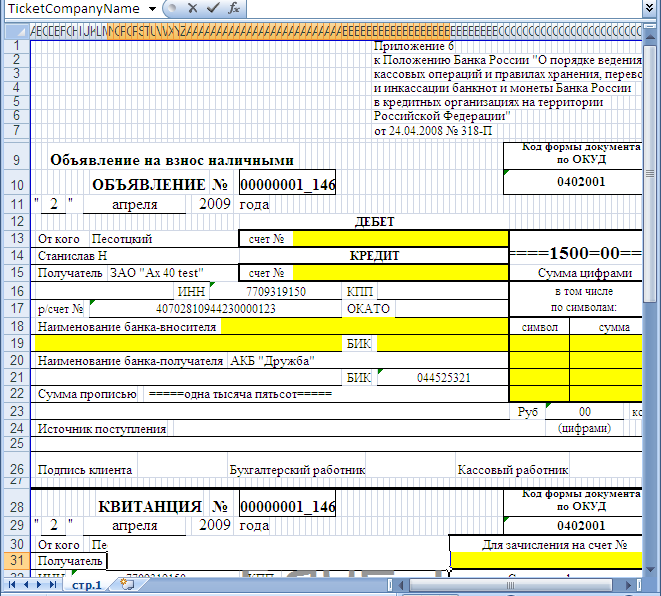
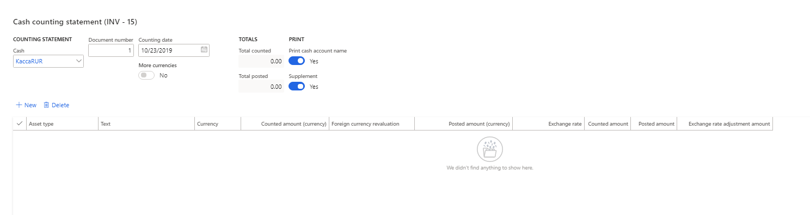
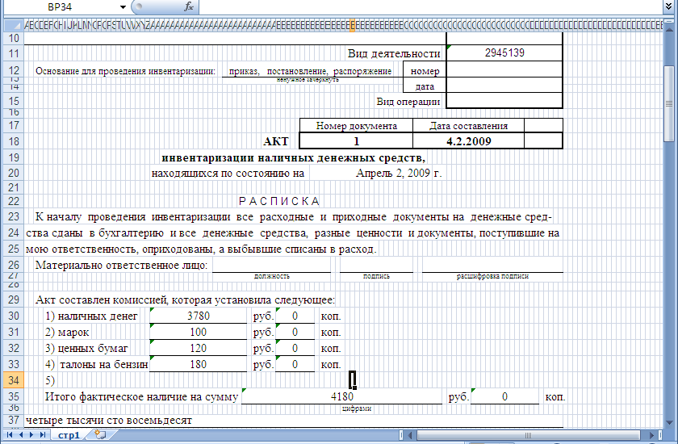

# Cash - Local primary forms and unified reports
[!include [banner](../../includes/banner.md)]

Several reports about cash transactions are available in companies that have Russian context.

The [Petty cash for Eastern Europe and Russia](../europe/emea-petty-cash.md) article provides information about the following reports:

- Slip journal
- Cash book report
- Cash – Ledger reconciliation
- Cash statement report
- Cash transactions report
- Journal of registration of documents report

This article provides information about following additional reports:

- Cash due announcement
- Cash counting statement (INV-15)

## Preliminary setup

### Set up a number sequence

1. Go to **Cash and bank management \> Setup \> Cash and bank management parameters**.
2. On the **Number sequences** tab, in the **Number sequence code** field for the **Cash due announcement** reference, select a number sequence code.

### Set up a bank transaction type to allow for a Cash due announcement report

1. Go to **Cash and bank management \> Setup \> Bank transaction types**.
2. In the row for the transaction type, select the **Allow cash due announcement** check box so that a **Cash due announcement** report can be generated and printed for vouchers that use that transaction type.

## Cash due announcement report

The **Cash due announcement** report is used to send petty cash to the bank.

You can print a **Cash due announcement** report from either the **General journals** page or the **Slip journal** page.

### Generate and print a Cash due announcement report from the General journals page

1. Go to **General ledger \> Journal entries \> General journals**.
2. Select a journal, and then, on the Action Pane, select **Lines**.
3. Create a line for sending petty cash to the bank. Select a bank account in either the **Account** field or the **Offset account** field.
4. On the **Payment** tab, in the **Bank transaction type** field, select the transaction type that you selected the **Allow cash due announcement** check box for earlier in this article.
5. On the Action Pane, select **Print \> Cash due announcement** to generate and print the report. The report is generated as a Microsoft Excel document that uses the template for form **0402001**.

    
    
    On the line that you created, the **Cash due announcement** field is set and can't edited.

6. On the Action Pane, select **Functions \> Cancel cash due announcement** to cancel the document that was generated for the line. The field that contains a link to the document is cleared, and the line becomes editable.

### Generate and print a Cash due announcement report from the Slip journal page

1. Go to **Cash and bank management \> Cash transactions \> Slip journal**.
2. Create a slip journal line for sending petty cash to the bank, and then approve it.
3. To print the **Cash due announcement** report, use the same steps that you used to print the report from the **General journals** page.

### View and reprint a Cash due announcement report

1.  Go to **Cash and bank management \> Inquiries and reports \> Cash due announcement**.
2.  The **Cash due announcement journal** page shows all the **Cash due announcement** reports that have been generated. Select a document, and then, on the Action Pane, select one of the following buttons:

    - **Journal** – Open the journal where you generated the document.
    - **Print** – Print the document.
    - **Cancel** – Cancel the document.

> [!NOTE]  
> On the **Bank accounts** page, you can view and reprint **Cash due announcement** reports that were generated for a specific bank account. On the Action Pane, on the **Manage payments** tab, in the **Related information** group, select **Cash due announcement** to open the **Cash due announcement journal** page.

## Cash counting statement (INV-15) report

The **Cash counting statement (INV-15)** report is used for the cash counting act. You might want to generate and print the inventory counting act in the following situations:

-  A single petty cash account includes different currencies.
-  A single cash account includes different asset types, such as **Cash**, **Stamps**, or **Securities**.

Before you generate the cash counting act, calculate the exchange rate adjustment. Then follow these steps.

1. Go to **Cash and bank management \> Inquiries and reports \> Cash reports \> Cash counting statement report**.
2. In the upper part of the **Cash counting statement (INV – 15)** page, follow these steps:
    
      a. In the **Cash** field, select the cash account to count.  
     
      b. In the **Document number** field, specify the number of the document that the inventory that is done should be based on.
      
      c. In the **Counting date** field, specify the date of counting.
      
      d. Set the **Print cash account name** option to **Yes**.
      
      e. Set the **Supplement** option to **Yes** to create the supplement to the counting act.
            
If the cash account allows for accounting in different currencies, the **More currencies** option is set to **Yes**.

3. The lower part of the page shows the lines where calculated data about cash is available. You can also manually create lines. This part of the page includes the following fields:

    - **Asset type** – By default, this field is set to **Cash**. To add a line that uses a different asset type, select **New**. When you create a new line, you can select one of the following values: **Cash**, **Stamps**, **Securities**, or **Other**.
    - **Text** – Specify the asset type. This field is available only if you select **Other** in the **Asset type** field.
    - **Currency** – The currency for the selected asset type.
    - **Counted amount (currency)** – The balance of the specified asset type in the specified currency. You can edit this field.
    - **Posted amount (currency)** – Enter the posted amount, based on the results of the inventory.
    - **Exchange rate** – The exchange rate of the specified currency on the counting date.
    - **Counted amount** – The balance of the specified asset type in the company's primary currency.
    - **Posted amount** – The amount that is specified in the **Posted amount (currency)** field, in the company's primary currency.
    - **Exchange rate adjustment amount** – If the exchange rate adjustments for the specified currency were calculated on the date of inventory, this field is flagged. For the primary currency, the **Exchange rate adjustment amount** field is always flagged.

4. Select **OK** to generate the cash counting act.

    

[!INCLUDE[footer-include](../../../includes/footer-banner.md)]
