# Local reports and primary forms in Accounts receivable and Accounts payable

[!include [banner](../../includes/banner.md)]

This article explains how to work with the primary forms that are used in the Russian Federation and supported by Microsoft Dynamics 365. Here is a list of the supported primary forms:

- [Invoices](#invoices)
  - M-15
  - TORG-12

- [Product receipts](#product-receipts)
  - M-4
  - M-7
  - TORG-1
  - TORG-2
  - TORG-3

- [Acts of adjustment](#acts-of-adjustment)
- [Transportation reports](#1-t-bill-of-lading-reports-transportation-invoices-and-job-tickets)
  - 1-T bill of lading report
  - Transportation invoice
  - Job ticket

- [Customer acceptance reports](#customer-acceptance-reports)
- [Counting act (INV-17) and Certificate (Appendix to INV-17) reports for customers](#counting-act-inv-17-and-certificate-appendix-to-inv-17-reports-for-customers)

## Invoices

The form **M-15** invoice for the release of materials is a document that is the basis for the movement of material values from one organization to another.

The form **TORG-12** invoice is a document that is the basis for the transfer of inventory items from one organization to another.

### Set up number sequences for invoices

You can use the **Accounts receivable parameters** page to set up number sequences for sales invoices and corrective invoices that are posted in the **M-15** and **TORG-12** formats. For all the selected number sequences, the **Continuous** option should be set to **Yes**.

1. Go to **Accounts receivable** > **Setup** > **Accounts receivable parameters**.
2. On the **Number sequences** tab, in the **Number sequence code** field, select a number sequence code for the following references.

<table>
<tbody>
<tr>
<td>

<strong>Reporting form</strong>

</td>
<td>

<strong>Number sequence reference types</strong>

</td>
</tr>
<tr>
<td>

M-15

</td>
<td>
<ul>
<li>Invoice (M-15) (system ID)</li>
<li>Invoice (M-15)</li>
<li>Corrective invoice (M-15) (system ID)</li>
<li>Corrective invoice (M-15)</li>
</ul>
</td>
</tr>
<tr>
<td>

TORG-12

</td>
<td>
<ul>
<li>Customer invoice</li>
<li>Customer invoice voucher</li>
</ul>
</td>
</tr>
</tbody>
</table>

### Generate an M-15 or TORG-12 report for a sales order

You can generate the **M-15** and **TORG-12** reports by using the **Posting invoice** page.

1. Go to **Accounts receivable** > **Orders** > **All sales orders**.
2. Create a sales order.
3. On the Action Pane, on the **Invoice** tab, in the **Generate** group, select **Invoice**.
4. On the **Parameters** FastTab, in the **Print options** section, in the **Printout** field, select **M-15** to print the **M-15** form on the report or **TORG-12** to print the **TORG-12** form on the report.
5. Set the **Print invoice** option to **Yes** to print the report.
6. Select **OK** to post the invoice and print the selected report.

The following illustration shows an example of an **M-15** report.

   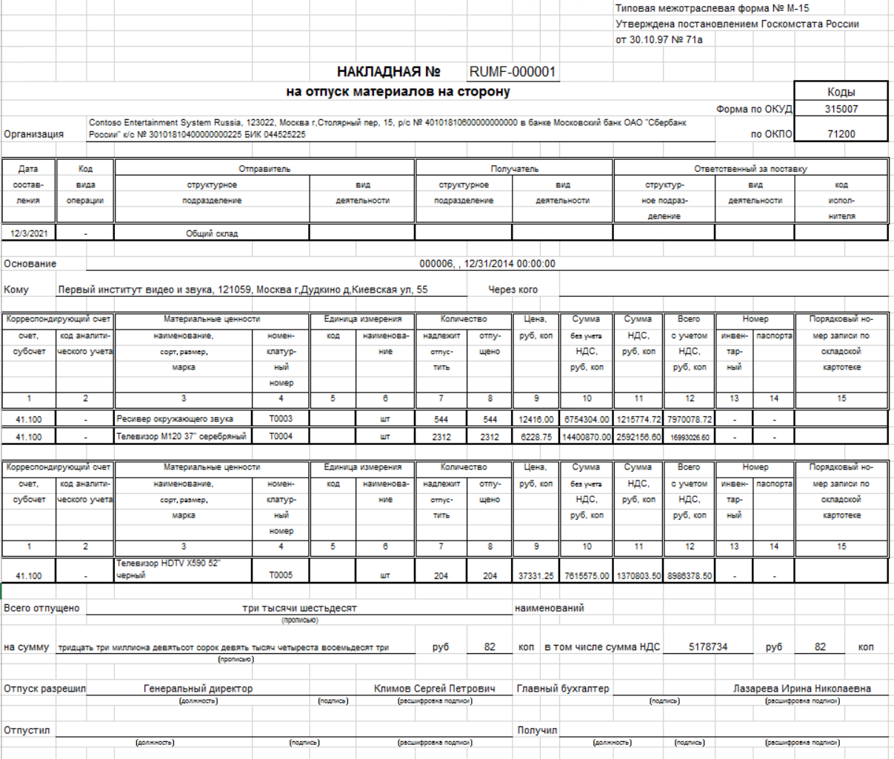

The following illustration shows an example of a **TORG-12** report.

   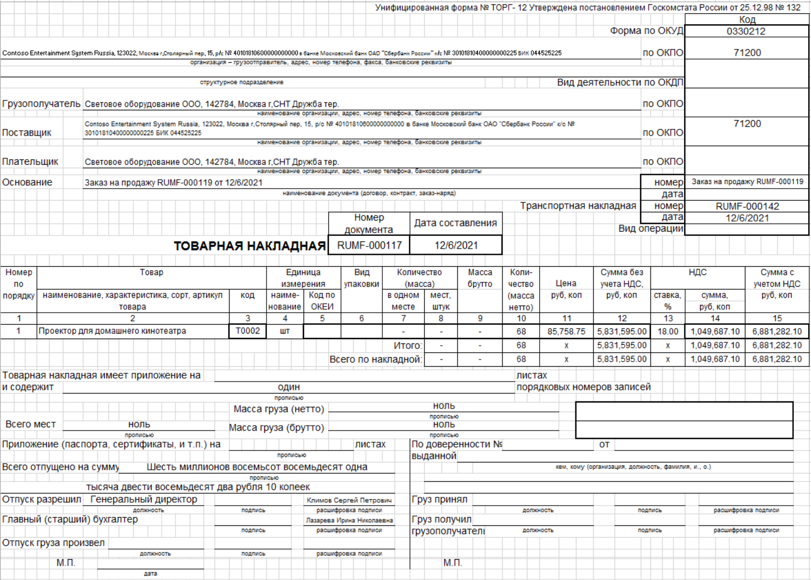

## Product receipts

For product receipts, the reporting forms are forms **M-4** and **M-7** when you work with materials, and forms **TORG-1**, **TORG-2**, and **TORG-3** when you work with items. Forms **M-7**, **TORG-2**, and **TORG-3** are used if there is a discrepancy between the order volume and the delivered volume. Forms **M-4** and **TORG-1** are used in all other cases.

### Set up number sequences for product receipts

Before you work with product receipts, you must set up number sequences for them. The number sequence that you select for a product receipt is assigned when the document is posted. When the product receipt is generated, it's shown in the **Document number** field. For all the selected number sequences, the **Continuous** option should be set to **Yes**.

1. Go to **Inventory management** > **Setup** > **Inventory and warehouse management parameters**.
2. On the **Number sequences** tab, in the **Number sequence** field, select a number sequence for the following references.

    | Reporting form | Number sequence reference types |
    |-------------------------|-------------------------|
    | TORG-1 | Receipt items statement voucher |
    | TORG-2 | Receipts list voucherReceipt items statement voucher |
    | TORG-3 | Receipts list voucherReceipt items statement voucher |
    | M-4 | Reimbursement slip voucher |
    | M-7 | Receipts list voucher |

### Post a product receipt for a purchase order

Follow these steps to generate and print the reports for a purchase order.

1. Go to **Accounts payable** > **Purchase orders** > **All purchase orders**.
2. On the Action Pane, select **New** to create a purchase order.
3. In the **Create purchase order** dialog box, on the **Vendor** FastTab, in the **Vendor account** field, select a vendor account.
4. On the **General** FastTab, in the **Site** field, select a site. Then, in the **Warehouse** field, select a warehouse.
5. Select **OK** to close the **Create purchase order** dialog box.
6. On the **Purchase order lines** FastTab, select **Add line** to create a purchase order line.
7. In the **Item number** field, select the item.
8. On the Action Pane, select **Save**.
9. On the Action Pane, on the **Purchase** tab, in the **Action** group, select **Confirm**.
10. On the Action Pane, on the **Receive** tab, in the **Generate** group, select **Product receipt**.
11. In the **Receipt statement form type** field, select one of the following options to indicate whether the receipt statement is related to items or materials:

    - **Receipt statement for materials** – The receipt statement is related to materials (forms **M-4** and **M-7**).
    - **Receipt statement for items** – The receipt statement is related to items (forms **TORG-1**, **TORG-2**, and **TORG-3**).

    > [!NOTE]
    > If you select **Receipt statement for materials**, either an **M-4** statement or an **M-7** statement will be printed. An **M-7** statement will be printed only if you specify discrepancies in the **Quantity** and **Deviation** fields.

12. If you selected **Receipt statement for items** in the **Receipt statement form type** field, in the **Document about deviation** field, select one of the following options to indicate whether a **TORG-1**, **TORG-2**, or **TORG-3** report should be generated:

    - Receipt statement for items TORG-1
    - Receipt list for items TORG-2
    - Receipt list for items TORG-3

    > [!NOTE]
    > A **TORG-2** or **TORG-3** statement will be printed only if you specify discrepancies in the **Quantity** and **Deviation** fields.

13. On the **Overview** FastTab, in the **Product receipt** field, enter the product receipt number.
14. Select **OK** to post the invoice and print the product receipt.

The following illustration shows an example of an **M-4** report.

   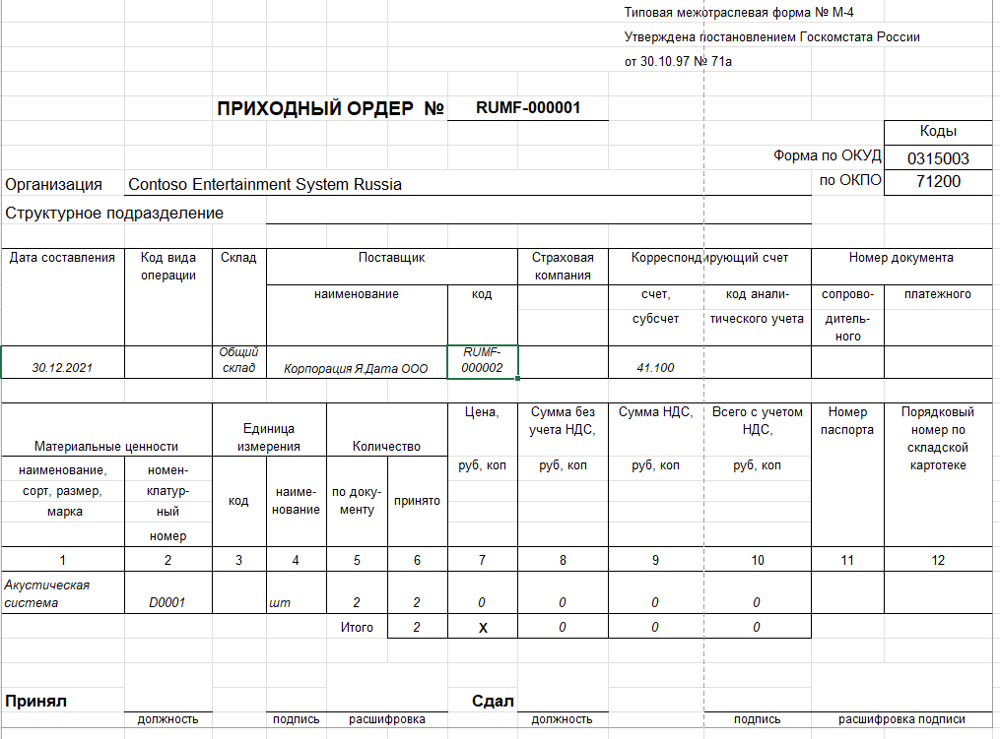

The following illustration shows an example of an **M-7** report.

   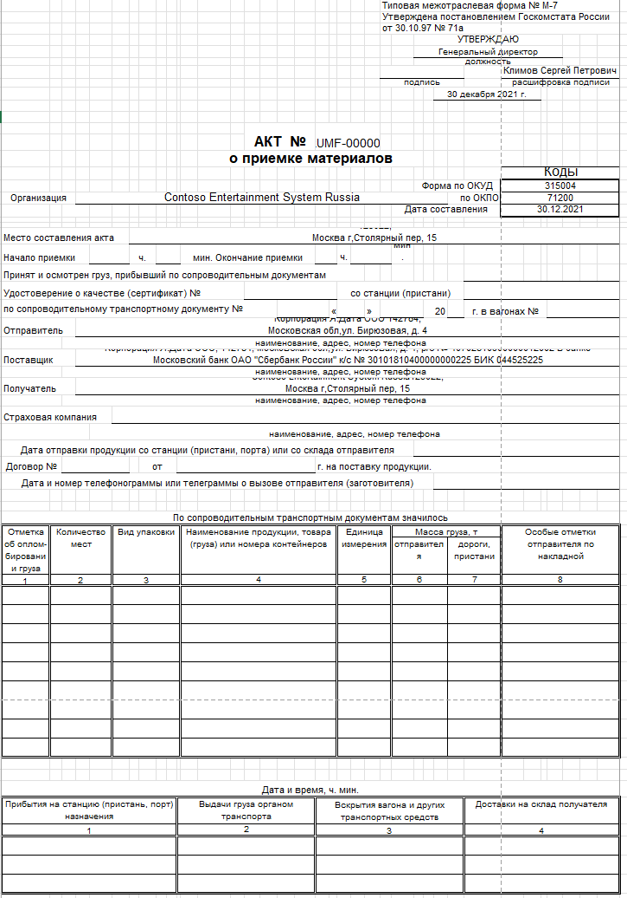

The following illustration shows an example of a **TORG-1** report.

   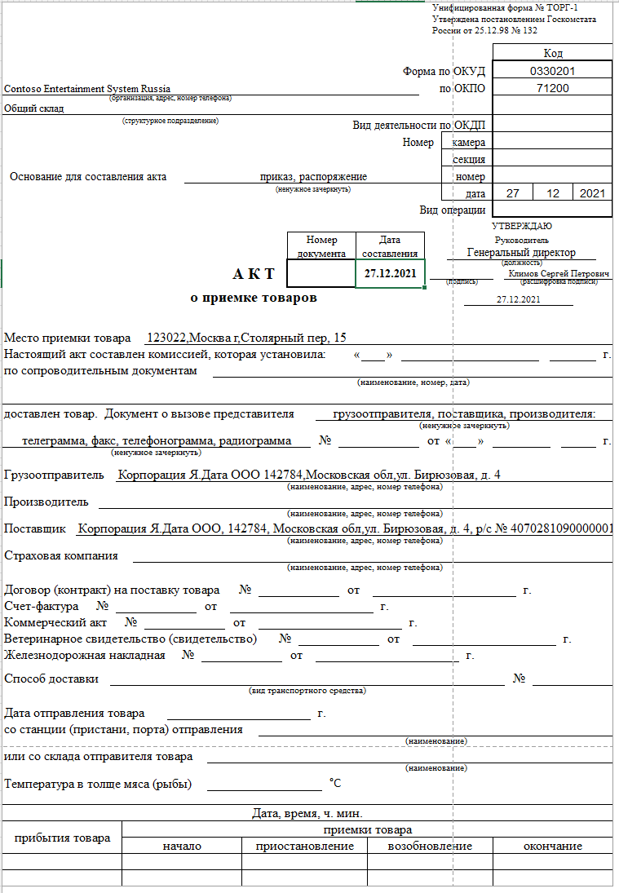

The following illustration shows an example of a **TORG-2** report.

   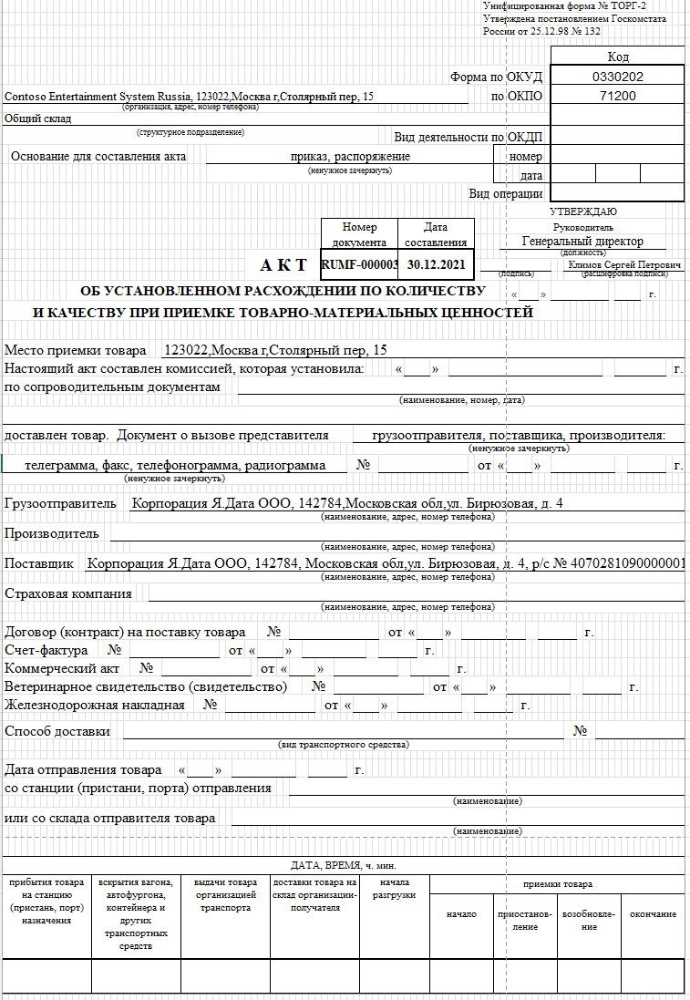

The following illustration shows an example of a **TORG-3** report.

   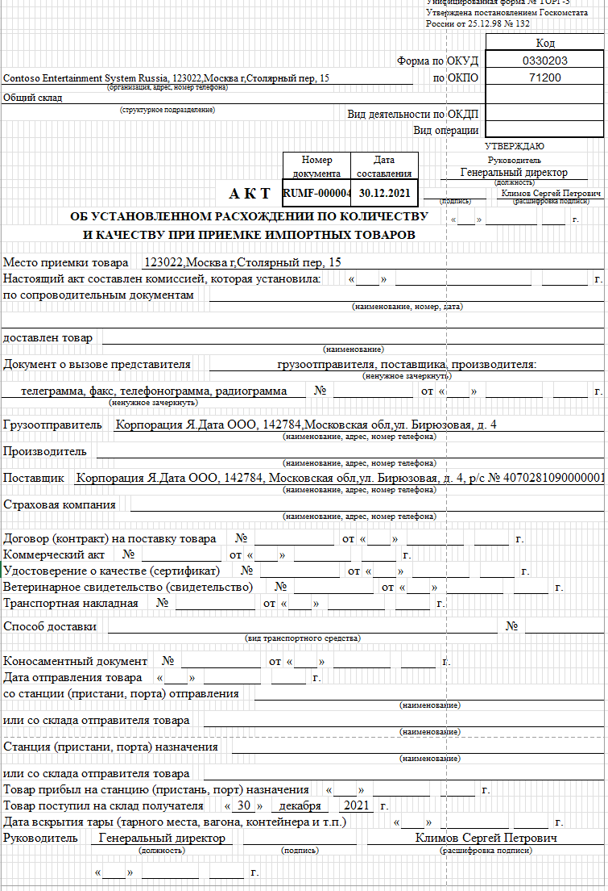

### Product receipt corrections

You can correct a product receipt that has already been posted for a purchase order. The corrected product receipt contains information about the discrepancy between the quantity of items that was ordered on the original purchase order and the quantity that was received.

When you post a corrected product receipt, the original product receipt is canceled. If the corrected receipt contains at least one line that has a non-zero received quantity, a new version of the **M-4**, **M-7**, **TORG-1**, **TORG-2**, or **TORG-3** receipt statement report is generated. You can print the new version of the receipt statement report.

You can retain the receipt statement document type and the number of the original product receipt for the corrected product receipt.

1. Follow one of these steps:

    - Go to **Accounts payable** > **Purchase orders** > **All purchase orders**. Select a purchase order that a product receipt is posted for, and then, on the Action Pane, on the **Receive** tab, in the **Journals** group, select **Product receipt**. Select a product receipt, and then select **Correct**.

    - Go to **Accounts payable** > **Inquiries and reports** > **Product receipt**. Select a product receipt line, and then select **Correct**.

2. In the **Product receipt correction** dialog box, set the **Preserve receipt statement** option to **Yes** to use the receipt statement document type and the number of the original product receipt for the corrected product receipt.
3. If you set the **Preserve receipt statement** option to **No**, you can follow these steps to manually enter the information for the product receipt correction.
4. In the **Receipt statement form type** field, select whether the receipt statement is related to items or materials.
5. If you selected **Receipt statement for items** in the **Receipt statement form type** field, in the **Document about deviation** field, select whether a **TORG-1**, **TORG-2**, or **TORG-3** report should be generated.
6. Select **OK** to print the corrected product receipt.

## Acts of adjustment

An act of adjustment is a document that is used for financial analysis. It contains the following information.

- The open total balance per counteragent (contract) at the start and end of the period. This balance includes the balance of invoices and credit notes, and the balance of advances and returns.
- Information about unpaid invoices from the previous period (credit and debit liabilities), and their payment and mutual reimbursement in the current period.
- Information about received and shipped invoices or credit notes for the selected period, together with information about payment and mutual reimbursement.
- Information about advances and returns of cash (unsettled payments for the current period).
- Information about advances and returns of cash (unsettled payments for the previous periods).

You can generate acts of adjustment for vendors and customers. Use the **Act of adjustment** page to generate an **Act of adjustment** report.

1. Follow one of these steps:

    - To generate an act of adjustment for a vendor, go to **Accounts payable** > **Inquiries and reports** > **Act of adjustment**. Then, in the **Vendor account** field, select the vendor account.
    - To generate an act of adjustment for a customer, go to **Accounts receivable** > **Inquiries and reports** > **Act of adjustment**. Then, in the **Customer account** field, select the customer account

2. If the counteragent is both a vendor and customer, you can set the **Counteragent** option to **Yes** to include the counteragent's transactions as a vendor and as a customer in the act of adjustment.
3. In the **Date interval code** field, select the interval code for the report period.
4. In the **From date** and **To date** fields, update the start and end dates of the report period as required.
5. In the **Currency type** field, select **Accounting currency** to use the company's accounting currency for the act of adjustment or **Indicated currency** to manually set the currency.
6. If you selected **Indicated currency** in the **Currency type** field, in the **Currency** field, select the currency that should be used for the act of adjustment.
7. Set the **Totals only** option to **Yes** to include only totals on the report that is printed.
8. Set the **By data of counteragent** option to **Yes** to automatically fill in the sections of the act of adjustment that must be completed by the counteragent.
9. Set the **Delete zero balance** option to **Yes** if the report should exclude invoice lines that have either a 0 (zero) balance or a balance that equals the amount of the invoice.
10. Set the **Agreements** option to **Yes** to include information about agreements.
11. Set the **Documents** option to **Yes** to include information about documents that create debts.
12. Select **OK** to open the **Act of adjustment** report for the selected vendor or customer.
13. On the Action Pane, select **Select**, make any required changes to the report setup that is defined on the **Act of adjustment** report page, and then select **OK**.
14. Select the transaction line, and then, on the Action Pane, select **Transaction**.
15. On the **Vendor transaction** page, review the vendor transaction information.
16. Select **Print** to review the report.

    The following illustration shows an example of an act of adjustment for a customer.

   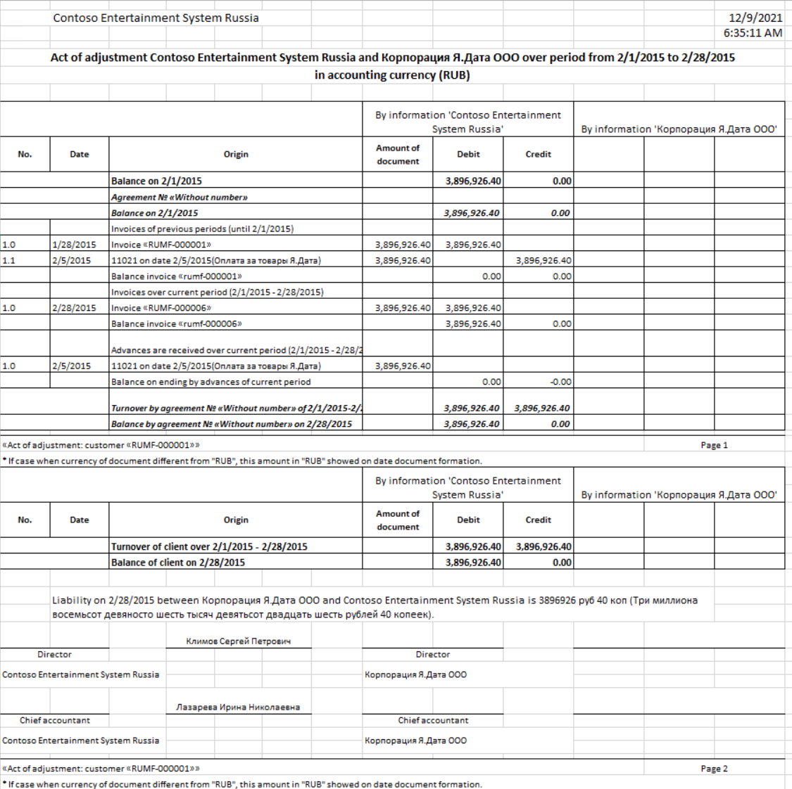

## 1-T bill of lading reports, transportation invoices, and job tickets

The **1-T bill of lading** report is designed to account for the movement of inventory items when they are transported by using vehicles. You can generate and print the **1-T bill of lading** report when you generate the sales order.
In the Russian Federation, all cargo that is transported by using an automobile carrier must be accompanied by one of the following documents:

  - **Transportation invoice** – The documented proof of a transportation agreement.
  - **Job ticket** – The documented proof of a vehicle chartering agreement.

You can generate and print a transportation invoice and a job ticket for a sales order or a transfer order. You can print a transportation invoice and a job ticket from the **Bill of lading** page, which you can access from multiple pages. These pages include the packing slip journal, invoice journal, and transfer order pages.

### Set up Accounts receivable parameters

1. Go to **Accounts receivable** > **Setup** > **Accounts receivable parameters**.
2. On the **Shipments** tab, on the **Bill of lading** FastTab, in the **Bill of lading** field, select one of the following options to specify the circumstances that a bill of lading is created in when a shipment is dispatched:

    - **None** – No bill of lading is created.
    - **Packing slip update** – A bill of lading is created when a packing slip is updated.
    - **Invoice posting** – A bill of lading is created when an invoice is posted.
    - **Both** – A bill of lading is created both when a packing slip is updated and when an invoice is posted.

3. On the **Transportation document** FastTab, in the **Document type** field, select **Transportation invoice** or **Job ticket** as the default type of the report. You can change the type of the printed document during document creation.
4. On the **Number sequences** tab, set up number sequence codes for the **Transportation document number** and **Job ticket number** number sequences.

### Set up fixed unit parameters

The **1-T bill of lading** report calculates weight in tons. Therefore, you must set up units for tons.

1. Go to **Organization administration** > **Setup** > **Units** > **Units**.
2. In the grid, select the unit for tons.
3. On the Action Pane, select **Edit**.
4. Set the **Fixed unit assignment** option to **Yes**.
5. In the **Fixed unit** field, select **Metric tons**.
6. You should also define system units for of the **Mass** and **Dry** **volume** unit classes. For more information, see [Manage units of measure](../../../supply-chain/pim/tasks/manage-unit-measure.md#create-or-edit-a-unit-of-measure).

### Print a 1-T bill of lading report, transportation invoice, or job ticket

You can generate and print a **1-T bill of lading** report for a sales order.
You can generate and print a transportation invoice and a job ticket from the sales order, packing slip, and transfer order pages.
To set up information for a bill of lading, follow one of these steps, depending on the type of document that you're working with.

- If you are working with the sales order, follow these steps:

  1. Go to **Accounts receivable** > **Orders** > **All sales orders**.
  2. Create an invoice.
  3. On the Action Pane, on the **Invoice** tab, in the **Generate** group, select **Invoice**.
  4. In the **Posting invoice** dialog box, on the **Parameters** tab, in the **Print options** section, set the **Bill of lading** option to **Yes** to print the **1-T bill of lading** report for the sales order.
  5. Set the **Transportation document** option to **Yes** to print a transportation invoice or a job ticket for the sales order.

- If you're working with the packing slip, follow these steps:

  1. Go to **Accounts receivable** > **Orders** > **All sales orders**.
  2. Create an invoice.
  3. On the Action Pane, on the **Pick and pack** tab, in the **Generate** group, select **Post packing slip**.
  4. On the **Parameters** tab, in the **Print options** section, set the **Transportation document** option to **Yes** to print a transportation invoice or a job ticket for the sales order.

- If you are working with the transfer order, follow these steps:

  1. Go to **Inventory management** > **Inbound orders** > **Transfer orders**.
  2. Create an order.
  3. On the **Header** tab, on the **Bill of lading** FastTab, in the **Carrier** section, in the **Carrier type** field, select the type of carrier:

    - **Invoice account** – The carrier is the customer that is selected as the invoice account on the sales order.
    - **Customer** – The carrier is the customer account that is specified in the **Carrier** field.
    - **Vendor** – The carrier is the vendor account that is specified in the **Carrier** field.

  4. In the **Carrier** field, select the registration number of the carrier. This field is available only if you selected **Customer** or **Vendor** in the **Carrier type** field.

To generate and print a **1-T bill of lading** report, transportation invoice, or job ticket, follow these steps.

1. On the sales order, packing slip, or transfer order page, in the **License card** section, in the **Registration number**, **Series**, and **Number** fields, enter information for the license card.
2. In the **Transportation** section, in the **Carrier type** field, select the type of carrier:

      - **Invoice account** – The carrier is the customer that is selected as the invoice account on the sales order.
      - **Customer** – The carrier is the customer account that is specified in the **Carrier** field.
      - **Vendor** – The carrier is the vendor account that is specified in the **Carrier** field.

3. In the **Carrier** field, select the registration number of the carrier. This field is available only if you selected **Customer** or **Vendor** in the **Carrier type** field.
4. In the **Delivery date** field, select the date of delivery.
5. In the **Model** field, select the model of the vehicle.
6. In the **Registration number** field, enter the registration number of the vehicle.
7. In the **Waybill** field, enter the waybill number of the vehicle.
8. In the **Driver name**, **Driving license**, and **Driver contact data** fields, enter information about the driver.
9. In the **Type** field, enter the type of transport.
10. In the **Transportation documents** section, in the **Document type** field, review the default value that you set earlier. You can change the value by selecting **Transportation invoice** or **Job ticket**.
11. In the **Cargo description** and **Cargo packing** fields, enter information about the shipping description of the cargo.
12. Select **OK** to post and print the packing slip that includes the details from the transportation invoice or job ticket.

#### Review the 1-T bill of lading report, transportation invoice, or job ticket

You can review the **1-T bill of lading** report, transportation invoice, or job ticket from the **Bill of** **lading** page.

To access the **Bill of lading** page, follow one of these steps, depending on the type of document that you're working with.

- If you're working with the sales order, follow these steps:

  1. Go to **Accounts receivable** > **Orders** > **All sales orders**.
  2. Select the posted sales order, and then, on the Action Pane, on the **Invoice** tab, in the **Journals** group, select **Invoice**.
  3. On the Invoice journal page, on the Action Pane, in the **Ship** group, select **Bill of lading**.

- If you're working with the packing slip, follow these steps:

  1. Go to **Accounts receivable** > **Orders** > **All sales orders**.
  2. Select the posted sales order, and then, on the Action Pane, on the **Pick and pack** tab, in the **Journals** group, select **Packing slip**.
  3. On the Action Pane, select **Inquiries** > **Bill of lading**.

- If you're working with the transfer order, follow these steps:

  1. Go to **Inventory management** > **Inquiries and reports** > **Transfer orders** > **Transfer order history**.
  2. On the **Overview** tab, select the posted transfer invoice.
  3. On the Action Pane, on the **Transfer order** tab, in the **View** group, select **Bill of lading**.

On the **Bill of lading** page, on the Action Pane, select **Transportation document** > **Original preview** or **Copy preview**. Then review the transportation invoice or job ticket.

For the sales order, on the Action Pane, select **Preview/Print** > **Original preview** or **Copy preview**. Then review the **1-T bill of lading** report.

The following illustration shows an example of a transportation invoice.

   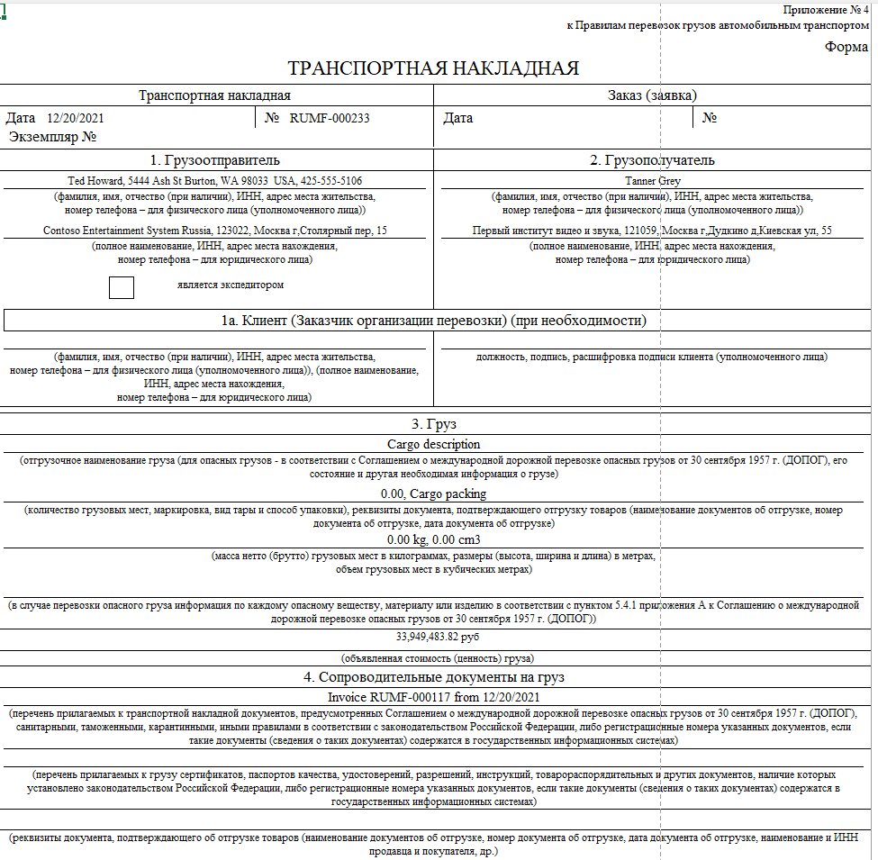

The following illustration shows an example of a job ticket.

   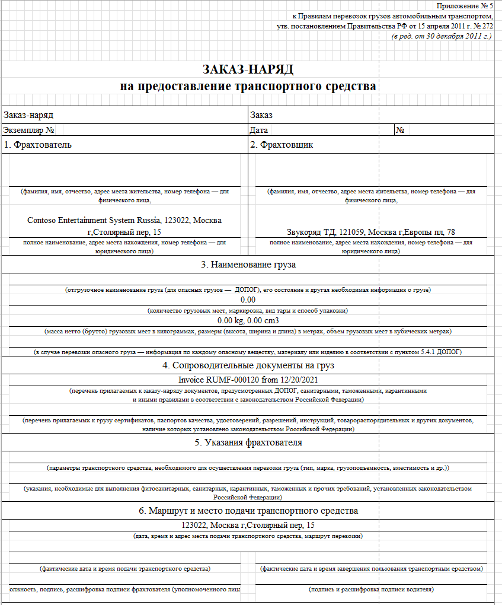

The following illustration shows an example of a **1-T bill of lading** report.

   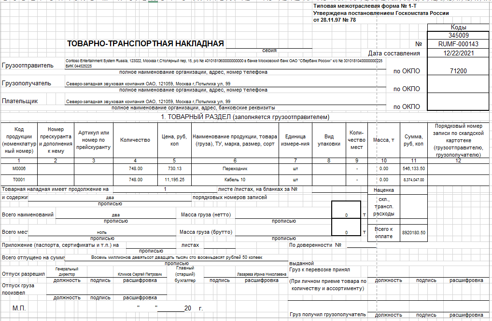

## Customer acceptance reports

The **Customer acceptance** report confirms the transfer of the result of the work and the absence of claims from the customer. To print the **Customer acceptance** report, follow these steps.

1. Go to **Accounts receivable** > **Invoices** > **Open customer invoices**.
2. Select an open customer invoice, and then, on the Action Pane, on the **Invoice** tab, in the **Document** group, select **Print** > **Range**.

   Alternatively, you can print the acceptance report by selecting **View** > **Acceptance report**.

3. In the **Print customer invoice** dialog box, on the **Parameters** FastTab, in the **Invoice selection criteria** section, in the **Account type** field, select **Customer account**.
4. In the **From account** and **To account** fields, select the range of customer accounts that the acceptance reports are printed for.
5. In the **Type of date used** field, select a type of date range for the invoices that are printed on the report.
6. In the **From date** field, select or enter the first day of the date range.
7. In the **To date** field, select or enter the last day of the date range.
8. In the **Print options** section, in the **Print option** field, select **Acceptance report** to print an acceptance report for the customer invoice.
9. Select **OK** to print the report.

   The following illustration shows an example of a **Customer acceptance** report.

   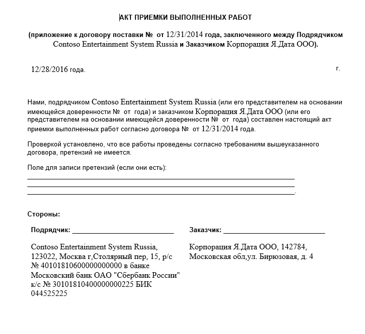

## Counting act (INV-17) and Certificate (Appendix to INV-17) reports for customers

The Counting act (INV-17) report shows the results of the inventory settlements with counterparties. The report contains information about accounts receivable and accounts payable debt. Use the **Accounts payable counting** page to generate the **Inventory act** report.

1. Set up the **Accounting receivable inventory act** register. For more information, see [Tax registers](rus-bad-debts.md#tax-registers).
2. Go to **Accounts payable** > **Periodic** **tasks** > **Accounts payable counting**.
3. In the **Counting act** dialog box, on the **Parameters** FastTab, in the **Date** section, in the **Counting date** field, select the inventory date.
4. In the **Set up** section, set the **Agreements** option to **Yes** to add detailed agreement information.
5. Set the **Documents** option to **Yes** to sort the lines by customer or vendor, and to show a total sum for each customer or vendor.
6. Select **OK**.
7. On the **Accounts receivable counting lines** page, review the inventory data that was collected from the **Accounts receivable inventory act** register.
8. In the **Non-confirmed debt** field, enter the non-confirmed debt.
9. On the Action Pane, on the **Print** tab, select **Counting act (INV-17)** to generate a **Counting act (INV-17)** report or **Certificate (Appendix to INV-17)** to generate a **Certificate (Appendix to INV-17)** report.
10. In the **Counting date** field, select the inventory date.
11. In the **Document** field, enter the document number that identifies the reason for the inventory.
12. On the **Officials** tab, in the **Position** field, select the position title of the official.
13. In the **Title** field, select the job title of the official.
14. In the **Employee name** field, in the list of company employees, select the name of the official.
15. Select **OK** to print the **Counting act (INV-17)** or **Certificate (Appendix to INV-17)** report.

[!INCLUDE[footer-include](../../../includes/footer-banner.md)]
