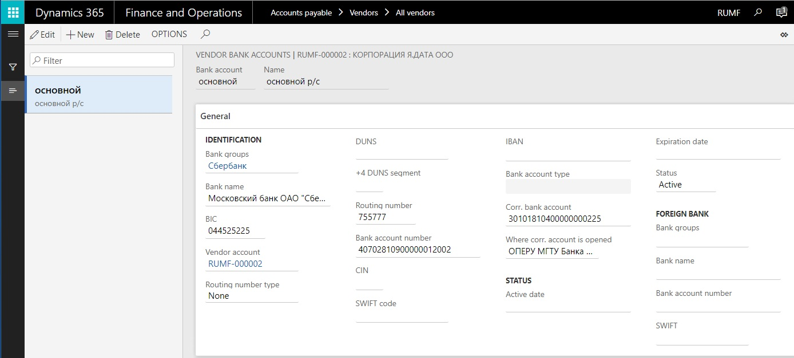
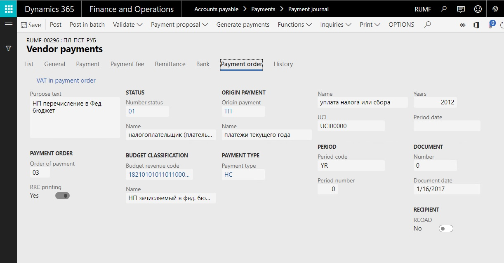

# Set up and process payment orders for Russia

[!include [banner](../../includes/banner.md)]

This article explains how to set up and process payment orders for Russia in Microsoft Dynamics 365 Finance.

## Setup for generating payment orders

Before you can generate payment orders, you must complete the following setup steps.

1. Set up banks and bank accounts for the company. For more information, see [Set up bank accounts (Russia)](rus-local-settings-requisites-bank-module.md).
1. In Dynamics 365 Finance, on the **All customers** page or the **All vendors** page, on the **VENDOR** tab, select **Bank accounts**.
1. Create a bank account, and fill in all the required information.
1. To set up foreign customer or vendor bank accounts, follow these steps:
    1. On the **General** FastTab, in the **Foreign bank** section, in the **Bank groups** field, select the code of the foreign bank that the customer bank account is registered with.
    1. In the **Bank account number** field, enter the foreign bank account number for the account that receives payments.
    1. In the **SWIFT** field, enter the Society for Worldwide Interbank Financial Telecommunication (SWIFT) code of the bank that receives payments.

   

1. To generate payments to vendors, set up a method of payment at **Accounts payable \> Payment setup \> Methods of payment**. To generate payment returns to customers, set up a method of payment at **Accounts receivable \> Payment setup \> Methods of payment**.
1. To print payment orders in Russian rubles according to the paper format, follow these steps:
    1. On the **Methods of payment** page, on the **File formats** FastTab, in the **Export format** field, select **Payment order in RUB**.
    1. To print payment orders in a foreign currency according to a bank-specific template, in the **Export format** field, select **Payment order in currency**. (The bank-specific template is defined in the bank account.)

## Generate a payment order in Russian rubles for a payment to a vendor

### Create payment order lines

Before you can generate a payment order, you must create payment order lines.

To create payment order lines, follow these steps:

1. In Dynamics 365 Finance, go to **Accounts payable \> Payments \> Payment journal**.
1. Create a journal, and then, on the Action Pane, select **Lines** to open the **Vendor payments** page.
1. Create a vendor payment line.
1. In the **Date** field, select the date of payment.
1. In the **Account** field, select the vendor account.
1. In the **Transaction text** field, enter text that describes the transaction.
1. In the **Debit** field, enter the sum of the payment.
1. In the **Currency** field, select the currency code.
1. In the **Offset account type** field, select the account type for the selected account.
1. In the **Offset account** field, select the offset account for the transaction.
1. In the **Currency** field, select the currency code.
1. In the **Method of payment** field, select the method of payment to use for the vendor.
1. In the **Agreement ID** field, select the registration number of the contract.
1. In the **Sales tax group** and **Item sales tax group** fields, select the tax groups for the calculation of value-added tax (VAT).
1. On the **Bank** tab, in the **Bank transaction type** field, select the transaction type.
1. In the **Account identification** field, select the bank account of the recipient.

    > [!IMPORTANT]
    > If you're generating a payment order for a legal representative of the vendor, you must enter the vendor account in the **Payment documented on** field. In this case, the payment order slip will refer to the bank of the vendor that is specified in the **Payment documented on** field. However, the transaction will be performed for the vendor that is specified in the **Account** field.

1. On the **Payment order** tab, in the **Purpose text** field, enter any text that must be reflected on the payment order. If you select **VAT in payment order**, the text will be entered. This text includes the VAT amount in the **Purpose text** field.
1. Set the following fields: **Order of payment**, **Number status**, **Budget revenue code**, **Origin payment**, **Payment type**, **UCI**, and the fields in the **Period** section (**Period code**, **Period number**, **Year**, **Period date**). The values will be printed in the corresponding boxes on the payment order for the vendor or tax authority.

   

### Generate a payment order

After you've created payment order lines, you can generate the payment order.

To generate a payment order, follow these steps:

1. In Dynamics 365 Finance, on the **Vendor payments** page, on the Action Pane, select **Generate payments** to open the **Generate payments** dialog.
1. In the **Method of payment** field, select the method of payment. Alternatively, in the **Export format** field, select **Payment order in RUB**.
1. In the **Bank account** field, select the bank account that the payment should be made from.
1. Select **OK** to open the **Payment order setup** dialog. 
1. Set the **Document** option to **Yes** to print the payment order, and set the **Proxy text** option to **Yes** to print the text.
1. Select **OK**. The payment order is generated, and the payment status of the appropriate payment journal line is changed to **Sent**.

### Void a payment order

You can void a payment order in the payment journal. On the **Vendor payments** page, on the Action Pane, select **Functions \> Void payment order**. The payment status of the payment journal line for the voided payment order is changed to **None**, and the voided payment order is deleted from the registry of payment orders.

### Reprint a payment order

You can reprint a payment order. On the **Vendor payments** page, on the Action Pane, select **Print \> Print payment order**. You can also reprint payment orders from the **Bank transactions** page. Select the voucher for the payment order, and then select **Print \> Payment order** to print the document.

### View generated payment orders

You can review generated payment orders on the **Registry of payment orders** page (**Accounts payable \> Inquiries and reports \> Payment \> Payment order register**). On the **Essential elements** tab, review the information about the payer and the recipient.

## Generate a payment order for a payment return to a customer

To generate a payment order for a payment return to a customer, follow these steps:

1. In Dynamics 365 Finance, go to **Accounts receivable \> Payments \> Payment journal**.
1. Create a journal, and then, on the Action Pane, select **Lines** to open the **Customer payments** page.
1. Create a customer payment line. Enter information as you did when you created a vendor payment line earlier in this article.
1. On the **Bank** tab, in the **Account identification** field, enter the bank account number of the customer account that should receive the payment return.
1. In the **Payment documented on** field, select the customer account that should receive the payment return.
1. On the Action Pane, select **Functions \> Generate payments** to generate a payment order.

You can review generated payment orders for customers on the **Registry of payment orders** page (**Accounts receivable \> Inquiries \> Payment \> Payment order register**). 

## Review registry of payment orders

The registry of payment orders report contains the list of payment orders for a bank account in a period. This report includes the following data for each payment order:

- Number and date
- Name and bank account number of counteragent
- Payment purpose
- Payment amount and currency code
- Status of payment
- Note indicating if the payment is electronic

To run the report, follow these steps:

1. In Dynamics 365 Finance, go to **Accounts payable** \> **Inquiries and reports** \> **Payment** \> **Payment order register** or **Accounts receivable** \> **Inquiries** \> **Payment** \> **Payment order register**.
1. Select **Print** \> **Registry of payment orders**.
1. Select the **From date** and **To date**.
1. Define the following filters for payment orders: **Payment order status**, **Curreny code**, **Bank account** and **Electronic payment** remark (All, Electronic, Printout form).
1. Select **OK** to generate the report.

[!INCLUDE[footer-include](../../../includes/footer-banner.md)]
