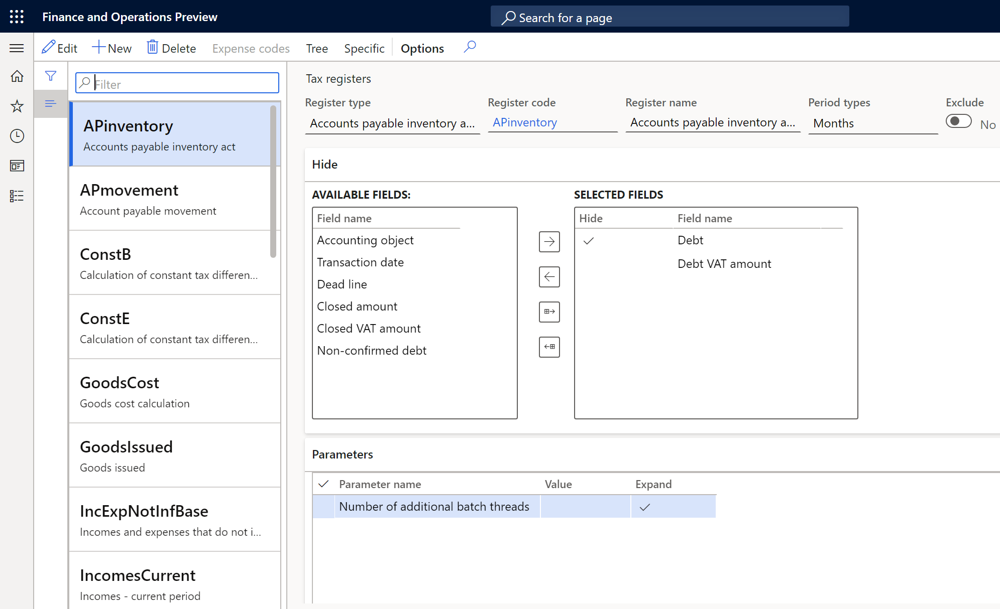
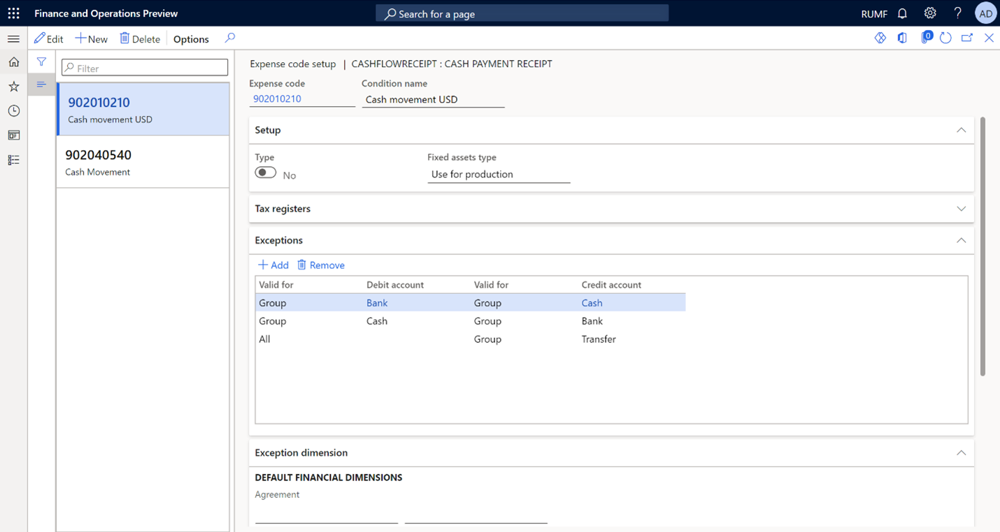
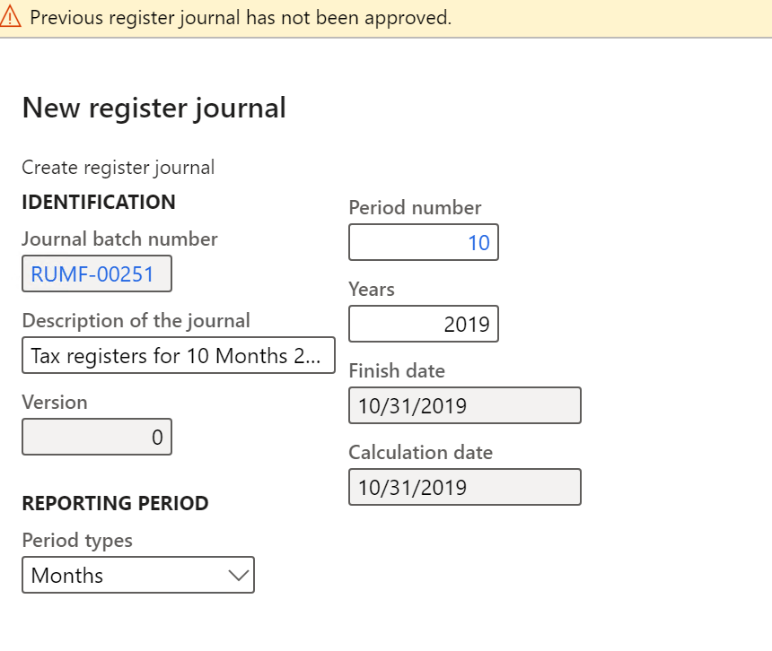
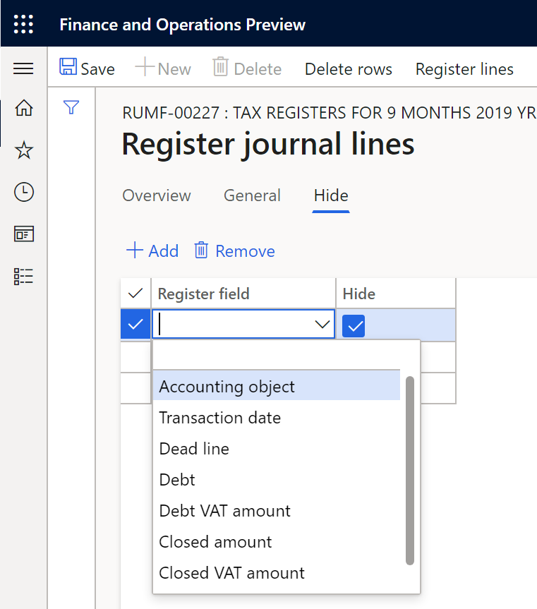
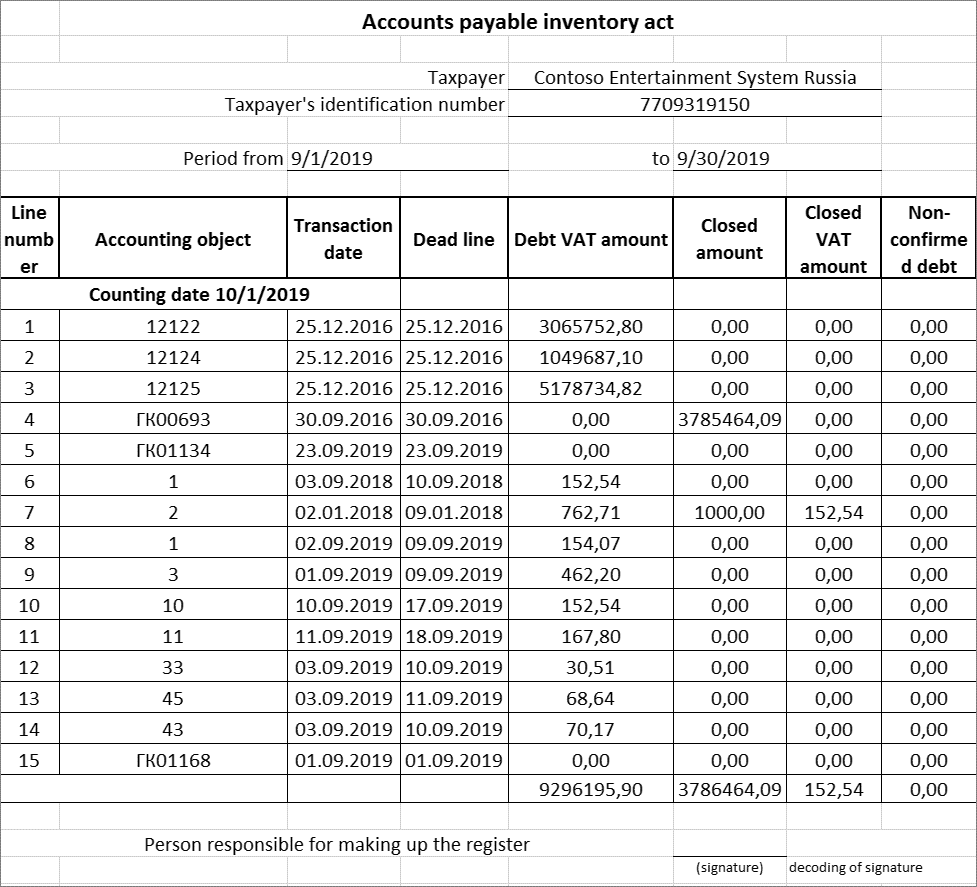
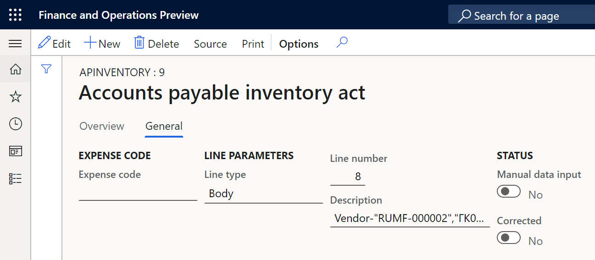

# Create tax registers and the tax register journal

[!include [banner](../../includes/banner.md)] 

To organize the accounting of profit for an organization in Russia, a system that consists of a list of tax registers is recommended. The tax registers track the types of income and expenses for the organization, from the time when primary documents (invoices and factures) are calculated until the time when the cost price of finished products is calculated. The data in the tax registers is used to confirm the declared amount of the organization's profit.

The following modules are the data sources for tax registers:

- **Fixed assets (Russia)**
- **Inventory management**
- **Production control**
- **General ledger**
- **Accounts payable**
- **Accounts receivable**

The following types of tax registers exist:

- **First-level tax registers, or "operations" tax registers**: These registers are generated based on operations (transactions) in the system.
- **Second-level tax registers**: These registers use the results of the first-level ("operations") tax registers.
- **Resulting tax registers**: These registers use data from the second-level tax registers.

The data structure of every tax register is almost unique.

Register calculation results are related by the **Expense and income code** value.

In the system, tax registers are grouped according to the information that is shown in them:

- **Tax registers of intermediate calculations**: These tax registers show and store the results of intermediate calculations. Data from these tax registers doesn't have corresponding lines in the tax declaration. The results are used to calculate resulting tax registers.
- **Tax registers of the tax accounting object status**: These tax registers show information about the status of tax accounting objects for each reporting date, and changes in that status.
- **Tax registers for generating reporting data**: These tax registers show values that can be transferred to specific tax declaration lines.

## Available tax registers

The following table shows the full list of available tax registers, grouped by tax register type.

**Tax registers of intermediate calculations**

| Tax register type | Comment |
|-------------------------|-------------------------|
| - Calculation of temporary tax differences - Calculation of temporary tax differences by balance method | These tax registers calculate temporary tax differences. |
| - Calculation of constant tax differences - Calculation of constant tax differences by balance method | These tax registers calculate constant tax differences. |
| - Accounts receivable inventory act - Accounts receivable inventory act (business accounting) | These tax registers reflect the balance of accounts receivable at the end of the reporting period. |
| - Accounts receivable movement - Accounts receivable movement (business accounting) | These tax registers summarize information about operations for the movement of receivables. |
| - Accounts receivable – bad debt reserve movement - Accounts receivable – reserve movement (business accounting) - Accounts receivable – reserve movement details - Accounts receivable – reserve movement details (business accounting) | These tax registers summarize information about the movement and use of the reserve for bad debts. |
| - Accounts receivable – bad debts reserve - Accounts receivable – reserve (business accounting) - Accounts receivable – reserve details - Accounts receivable – reserve details (business accounting) | These tax registers reflect the amount of the reserve that is calculated for the current reporting period. This reserve will be used to write off hopeless debts later. |
| Cash payment receipt | This cash inflow tax register consolidates cash inflow information to identify either income that is related to current and future periods, or transactions that determine future expenses. |
| Cash payment issue | This cash outflow tax register consolidates cash outflow information to identify either expenses that are related to current and future periods, or transactions that determine future income. |
| Accounts payable movement | This tax register summarizes information about operations on the movement of accounts payable. Entries in the register are made for all the facts about the occurrence of accounts payable, full or partial repayment of that occurrence, and write-off by the taxpayer from the beginning of the tax period to the reporting date. |
| Accounts payable inventory act | This tax register is based on the inventory of accounts as of the reporting date. It reflects the existence of amounts of accounts payable that are liable to be written off. For example, the amounts might be written off because the statute of limitations has expired. |
| IA depreciation | This tax register determines the amount of depreciation for intangible assets. The amount of depreciation is included in indirect expenses that are recognized in the current tax period for tax purposes. |
| IA depreciation (nonlinear method) | This tax register calculates the depreciation of intangible assets by using the tax nonlinear method. |
| Standard expenses rate for deferred periods | This tax register contains the results of calculating norms for the deferred periods. |
| Standard expenses rate for current period | This tax register contains the results of calculating norms for the current period. |
| Standard expenses in current period | This tax register shows the amount of depreciation for each object. It also shows the total amount of depreciation that is included in the direct cost or indirect cost. |
| Incomes and expenses that do not influence the tax base | This tax register contains information about income and expenses that don't influence the tax base. This information is used when the register of constant tax differences is calculated. |
| FA/IA sale | This tax register is used for the following purposes: <ul> <li>Summarize information about sales of depreciable property.</li> <li>Generate the amount of loss that is caused by the sale of depreciable property and recognized as deferrals for tax purposes.</li> </ul> |
| Depreciation bonus recovery | This tax register shows data about depreciation bonus recovery transactions for fixed assets if the following conditions are met: <ul> <li>The fixed asset was put into operation after January 1, 2008.</li> <li>The disposal (sale) operation was performed for the fixed asset.</li> <li>Fewer than five years passed between the date when the fixed asset was put into operation and the disposal date.</li> <li>The fixed asset was sold to the affiliated customer.</li> </ul> |
| FA depreciation | This tax register determines the amount of depreciation for fixed assets. The amount of depreciation is required to create direct expenses and other expenses that are recognized in the current tax period for tax purposes. The register shows the amount of depreciation for each object. It also shows the total amount of depreciation that is included in the direct cost or indirect cost. |
| FA depreciation (nonlinear method) | This tax register calculates the depreciation of fixed assets by using tax nonlinear method. |
| Outlay – realized tax | This tax expense register contains all the taxes and duties, grouped by tax type. |
| Goods cost calculation | This tax register generates the cost of the accounting object (that is, the fixed asset or intangible asset). |
| WIP and FP estimation in tax accounting | This tax register estimates the balances of work in process (WIP) and finished products. |
| Profit allocation by separate divisions | This tax register calculates the amount of profit allocation for separate divisions. |
| Exchange adjustment in accounting | This tax register is obsolete. |
| Exchange adjustment in tax accounting | This tax register is obsolete. |
| Amount difference in tax accounting | This tax register is obsolete. |

**Tax registers of the tax accounting object status**

| Tax register type | Comment |
|-------------------------|-------------------------|
| FA – information about object | This tax register collects information about the existence and movement of property that belongs to an organization, and that is recognized, for tax purposes, as fixed assets as part of depreciable property. |
| IA – object information | This tax register collects information about the existence and movement of property that belongs to an organization, and that is recognized, for tax purposes, as intangible assets as part of depreciable property. |
| Deferrals | This tax register summarizes information about expenses that can be included in expenses for tax purposes in future periods. These expenses are known as deferred expenses. |

**Tax registers for generating reporting data**

| Tax register type | Comment |
|-------------------------|-------------------------|
| Goods issued | This tax register summarizes information about the income from the disposal of the taxpayer's property, the sale of works, services, and rights, and the formation of the amounts of corresponding income from sales that are included in the tax base. |
| Incomes – current period | This tax register contains information about revenue vouchers that are used to track revenue for a specific reporting period. The revenue that is tracked includes unrealized revenue. The register is used when taxes are calculated on the declared profit. |
| Outlay – realized | This tax register shows the total amount of other expenses that are recognized as other expenses of the current period, expenses of future periods that are considered in the reporting tax period, and the amounts of specific types of other expenses, based on the data of analytical accounting of the corresponding types of expenses. |
| Outlays – Unrealized | This tax register calculates unrealized expenses that are incurred during a tax reporting period. The register is calculated at the end of the accounting period, based on expenses that are accrued from the beginning of the tax period until the reporting date. The entries that are registered for each unrealized expense category are derived from data from tax registers at the end of the reporting period. |
| Outlays – other unrealized | This tax register shows the amount without sales tax and the sales tax amount, based on the general ledger transactions or expenses that are manually entered in the register. |
| Non-warehoused items | This tax register shows information about the movement of items, works, services, and rights that are written off at actual cost. The assumption is that this property isn't connected with the main activity of the company. Instead, its acquisition is a general economic expense and is accepted for tax accounting in the period when the expense was made. |
| Warehoused items | This tax register contains the following information: <ul> <li>Movement of raw materials and other materials into production</li> <li>Invoices for the sale of raw materials and other materials</li> <li>Items that are returned to the vendor</li> <li>Item write-offs</li> </ul> |
| Warehoused items (totals) | This tax register shows the total amount of each type of income or expense, based on the receipts in the **Warehoused items** register. |

The set of tax registers that must be provided for the reporting period is generated in the tax register journal. Each tax register journal consists of lines that reflect the status of the calculation of individual registers for the selected period.

## Create a tax register

1. Go to **Tax** > **Setup** > **Profit tax** > **Registers**.
2. Select **New** to create a tax register, and set the following fields:

    - **Register type**: Select the tax register type.
    - **Register code**: Enter the unique tax register code.
    - **Period types**: Select how often tax registers are created.

3. On the **Hide** FastTab, move the fields that you want to hide from the **Available fields** column to the **Selected fields** column, and then select the **Hide** checkbox for those fields.

    When new tax register journal lines are created, the fields that you hide are automatically excluded from the tax register.
    The list of fields that are included in the calculation for each tax register can be adjusted on the tax register lines.
    If the list of hidden fields is changed, the fields will be saved for all data that was created before those changes were made.

4. On the **Parameters** FastTab, you can set up additional parameters for the tax register. On the line for each parameter, specify a value in the **Value** field. The parameters are different for every register. For more information about parameters, see the article for each tax register.

    

### Set up expense and income codes for the tax register

For some tax registers, you must determine which expense and income codes form the information in the tax register.

1. On the **Tax registers** page, in the left pane, select a tax register. Then, on the Action Pane, select **Expense codes** to set up expense and income codes for the tax register.
2. On the **Expense code setup** page, in the left pane, select an expense or income code, or create a new line.
3. In the **Expense code** field, select the expense or income code that is used for the account entries that should be transferred to the tax register.
4. In the **Condition name** field, enter the name of the expense code.
5. On the **Setup** FastTab, set the **Type** option and the **Fixed assets type** field. For more information, see [Fixed assets and intangible assets registers](rus-assets-tax-registers.md).
6.  On the **Exceptions** and **Exception dimension** FastTabs, specify the ledger accounts, dimensions, and entries that should be excluded when the tax register is calculated.

    

### View the tax registers tree

1. On the **Tax registers** page, in the left pane, select a tax register. 
2. On the Action Pane, select **Tree** to view the structure of the tax register tree.

    Here is an example of a tree structure for tax registers:
    
    - Cash payment receipt
    - Cash payment issue
    - **Goods cost calculation**
        - **Warehoused items (totals)**
            - Warehoused items
        - **FA/IA sale**
            - FA – information about object

The tree structure shows that some tax registers are calculated by using information from other tax registers. Bold text indicates tax registers that exist in the system and are configured on the **Tax registers** page. Regular text indicates tax registers that exist in the system but aren't configured for calculation on the **Tax registers** page.

## Create and work with a tax register journal

### Create a tax register journal

A new journal can be created only if all journals for previous periods have been approved.

1. Go to **Tax** > **Journal entries** > **Tax register journal**. The page shows the list of tax register journals that have been created.
2. On the Action Pane, select **New**.
3. In the **New register journal** dialog box, in the **Reporting period** section, set the following fields:

    - Period types
    - Period number
    - Years

    

4. On the Action Pane, select **Lines**, and then select **Yes** to approve the creation of the tax register journal lines. The **Register journal lines** page is opened.

The journal lines contain tax registers where the calculation period is the same as or less than the journal's period type. Tax registers where the calculation period is more than the journal's period type are excluded from the calculation. For example, if the period of the register journal is **Quarter**, journal lines will contain tax registers that have the **Month** and **Quarter** periods. However, it won't contain tax registers that have the **Yearly** period.

### Change the register fields

Field display parameters are loaded from the register settings, but the list of hidden fields can be set in the tax register journal.

To hide a field, follow these steps.

1. On the **Register journal lines** page, select the register line.
2. On the **Hide** tab, select **Add** to add a line.
3. In the **Register field** field, select the field to hide, and then select the **Hide** checkbox. Only the fields that have been selected in the corresponding register settings are available for selection.
4. Select **Save**.

    

To add a field, follow these steps.

1. On the **Register journal lines** page, select the column header, and then select **Insert columns**.
2. In the **Insert columns** dialog box, in the **Select** column, select the fields to add.
3. Select **Update**.

### Update the tax register journal

If the composition of the tax register journal has changed, follow these steps to update its lines. The composition might change if, for example, a new register is created after the journal has already been created.

1. Go to **Tax** > **Journal entries** > **Tax register journal**.
2. On the Action Pane, select **Lines**.
3. On the Action Pane, select **Delete rows**, and then select **Yes**.

    > [!NOTE] 
    > You can't delete register journal lines if approved registers exist. To delete lines, you must first cancel the approval of the registers.

4. Close the **Register journal lines** page.
5. On the Action Pane, select **Lines** to create a new set of lines.

### Calculate and print tax registers

1. Go to **Tax** > **Journal entries** > **Tax register journal**.
2. On the Action Pane, select **Lines**.
3. On the Action Pane, select **Calculate all** to calculate all registers.

    Alternatively, to calculate only one tax register, select the line for the register, and then, on the Action Pane, select **Calculate current**. If the register uses data from other registers, calculate those registers first.

4. Select **OK**. After the calculation is completed, register lines are created.
5. On the **Register journal lines** page, select the register line.
6. On the Action Pane, select **Print**. Then, in the dialog box that appears, select **OK**. The register is printed in Microsoft Excel format.

    Here is an example of the tax register that is printed.

    

### Recalculate tax registers

Follow these steps to recalculate the tax register.

1. Go to **Tax** > **Journal entries** > **Tax register journal**.
2. On the Action Pane, select **Lines**.
3. On the Action Pane, select **Reset status** to reset all tax registers, and then select **OK**.

    Alternatively, to reset only one register, select the line for the register, and then, on the Action Pane, select **Edit**. In the **Status** field, select **Not calculated**. If data from the register is used in other registers, those registers are also reset.

4. Calculate the tax registers as described in the previous section.

### View and print the register lines

1. On the **Register journal lines** page, select the register line, and then, on the Action Pane, select **Register lines** to view the lines of the tax register. The content and the list of columns differ for each tax register. For detailed information, see the article for each register.
2. Select **Expand/Collapse node** to view all lines or just the last line.
3. Select the **General** tab to view the following information about the selected line:

    - **Expense code**: The expense code that the register line belongs to.
    - **Line type**: This field can have the following values:

         - **Header**: The header line.
         - **Body**: The register line.
         - **Footer**: The total line.

    - **Line number**
    - **Description**: The description of the register line. For the **Header** and **Footer** line types, this field is automatically set. For the **Body** line type, the field is editable.
    - **Manual data input**: This option is set to **Yes** if the line was manually created. This option isn't editable.
    - **Corrected**: This option is set to **Yes** if the line has been manually edited. This option isn't editable.

    

4. On the Action Pane, select **Source** to go to the primary document that the line was based on when it was created. Depending on the tax register, the primary document can be, for example, a fixed asset card or a posted vendor or customer invoice. The **Source** button isn't available if the register line was created by summing the transactions.
5. To print the tax register, on the Action Pane, select **Print**. The register is printed in Excel format.

### Manually adjust the tax register lines

Automatically created register lines can be manually edited or deleted. Lines can also be manually added to the register. However, lines can be added or edited only for calculated tax registers.

#### Edit the register lines

- On the **Register lines** page, on the Action Pane, select **Edit**.
- Edit the lines as required, and then, on the Action Pane, select **Save**.
- On the **General** tab, notice that the **Corrected** option is set to **Yes**.

#### Delete a register line

- On the **Register lines** page, select the line, and then on the Action Pane, select **Delete**.

To restore a line after you delete it, you must recalculate the tax register.

#### Manually add a line to the tax register

1. On the **Register lines** page, on the Action Pane, select **New**.
2. Set the fields for the new line, and then, on the Action Pane, select **Save**.
3. On the **General** tab, notice that the **Manual data input** option is set to **Yes**.

### Approve the tax registers

After you calculate all tax registers and review the data, the registers must be approved. When you approve all calculated tax registers, the tax register journal automatically selects the **Approved** checkbox. The tax register journal is automatically approved if all the tax registers that are included in it are approved.

1. To approve a tax register, on the **Register journal lines** page, on the Action Pane, select **Edit**.
2. Select the **Approved** checkbox, and then, in the **Worker** field, select the user who approved the register.

To cancel the approval of a register, clear the **Approved** checkbox. The **Worker** field is automatically cleared.

### Print the tax register by using the Register lines report

1. Go to **Tax** > **Inquiries and reports** > **Sales tax reports** > **Register lines**.
2. In the **Register lines** dialog box, in the **Default** section, define the criteria for selecting a tax register for the report. The values must match each other. Otherwise, the register won't be printed.
3. Select **OK**. The tax register is printed in Excel format.

[!INCLUDE[footer-include](../../../includes/footer-banner.md)]
