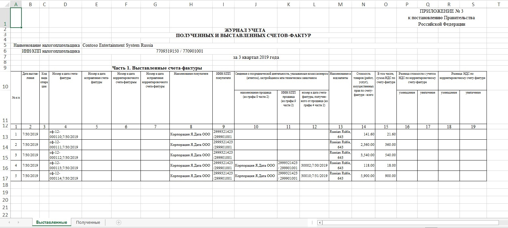

# Purchases on commission
[!include [banner](../../includes/banner.md)]

The principal engages the agent to find, in the agent's own name but at the principal's expense, a suitable supplier, and to agree on the supply of goods (works or services) to the principal.

Factures that an agent receives from a supplier have these characteristics:

- The agent must register them on the **Received** worksheet of the facture accounting journal.
- They don't have to be entered in the agent's purchase book, because the agent has no right to value-added tax (VAT) deduction.
- They must be copied, and the copies must be certified and given to the principal.
- The agent must reissue them to the principal.

Factures that an agent reissues have these characteristics:

- They must be registered on the **Issued** worksheet of the facture accounting journal.
- They don’t have to be entered in the sales book because the agent has no obligation to charge VAT.

The following illustration shows the business process for registering intermediary deals. Rectangular elements are reflected in the system. Oval elements are present in the business process but aren't reflected in the system.

## Create a sales agreement for a purchase by an agent

1. Go to **Accounts receivable** \> **Orders** \> **Sales agreements**.
2. Select **New** to open the **Create sales agreement** dialog box.
3. On the **Customer** FastTab, specify the customer account, and then, in the **Sales agreement classification** field, select **Blanket sales agreement**.
4. On the **General** FastTab, in the **Document** section, in the **Sales agreement ID** field, specify the identifier of the sales agreement.
5. Specify other details, and then select **OK**.

    

6. On the **Sales agreements** page, switch to the **Header** view.
7. On the **General** FastTab, in the **Document** section, in the **Commission agreement** field, select **Purchase by commissioner**.
8. On the **Financial** FastTab, in the **Inventory profile** section, specify the following details:

    - In the **Kind of activity** field, select **Commission agent**.
    - In the **Inventory profile** field, select the inventory profile that you created earlier.

    

9. On the Action Pane, on the **Sales agreement** tab, in the **Generate** group, select **Confirmation** to update status of the agreement to **Effective**.

## Create inventory owners (suppliers) for a commissioner

1. Go to **Inventory** \> **Setup** \> **Dimensions** \> **Inventory owners**.
2. Select **New** to create an inventory owner.
3. In the **Owner** field, enter the code for the owner.
4. In the **Account type** field, select **Vendor**.
5. In the **Account** field, select the code for the supplier. The **Name** field is automatically filled in.
6. Select **Save**.

## Create inventory owners (principals) for a commissioner

1. Go to **Inventory management** \> **Setup** \> **Dimensions** \> **Inventory owners**.
2. Select **New** to create an inventory owner.
3. In the **Owner** field, enter the code for the owner.
4. In the **Account type** field, select **Customer**.
5. In the **Account** field, select the code for the principal. The **Name** field is automatically filled in.
6. Select **Save**.

## Create a purchase order and update the facture on goods that are purchased for a principal

1. Create a purchase order.
2. On the purchase order line, select an item number.

> [!NOTE]
> The **Tracking dimension** field for the item should be set to the inventory profile that you created earlier.

3. On the **Line details** FastTab, on the **Product** tab, in the **Tracking dimensions** section, in the **Inventory profile** field, select the inventory profile that you created earlier.
4. If you don't plan to post the invoice, in the **Owner** field, select the owner (supplier) that you created earlier. In this way, you identify the supplier on the report for the principal when the facture is reissued.

    

5. Specify other purchase order parameters, and create a facture.

## Create a sales order and generate a sales invoice for goods that are purchased for a principal

1. Create a new sales order.
2. In the **Sales agreement ID** field, select the agreement for a purchase by the agent that you created earlier.
3. On the sales order line, select the item number that was purchased earlier.

   > [!NOTE]
   > The **Tracking dimension** field for the item should be set to the inventory profile that you created earlier.

4. On the **Line details** FastTab, on the **Setup** tab, in the **Inventory** section, in the **Reservation** field, select **Automatic**.

    

5. On the **Line details** FastTab, on the **Product** tab, in the **Tracking dimensions** section, make sure that the **Inventory profile** field is automatically set to the inventory profile that you created earlier.
6. In the **Owner** field, select the owner (principal) that you created earlier.
7. On the **Sales order lines** FastTab, select **Inventory \> Marking**.
8. Select a purchase transaction, select **Set mark now**, and then select **OK**.
9. Post the invoice.

## Create and print a report for a principal, and reissue the seller's factures to the principal

1. Go to **General ledger** \> **Periodic tasks** \> **Commission trade** \> **Report for principal**.
2. Select **New** to open the **Create report for principal** dialog box**.**
3. In the **From date** and **To date** fields, specify the period for the report.

   > [!NOTE]
   > You can leave the **From date** field blank.

4. In the **Principal type** field, select **Customer**.
5. In the **Partner code** field, select the customer account.
6. In the **Agreement ID** field, select the sales agreement.
7. Select **OK**.

   > [!NOTE]
   > To create the headers for all the reports for the principal that are required in the specified period, select **Functions \> Create report headers on shipments**.

8. Select **Functions \> Update lines on shipment** to open the **Generate report for principal on shipments** dialog box, and then select **OK** to create the lines for every report.
9. Based on the factures that are received from the seller (vendor), you, as an agent, should reissue the factures on the shipped part of the goods to the principal (customer) on behalf of the seller. These new factures are numbered according to the facture's number sequence.
10. On the **Report for principal** page, use the **Approved** check box to approve the appropriate lines of the seller's factures. To approve all the lines on the report, select **Approval \> Approve All**.

    

11. Select **Facture \> Update facture** to generate reissued factures for the principal.
12. On the **Update facture** page, in the **Commission trade** section, make sure that the **Seller** and **Facture** fields are automatically set. If they are blank, select the supplier in the **Seller** field and the number of the purchase facture that was created in the **Facture** field.
13. Specify other required details, and create the facture.

    

14. On the **Report for principal** page, follow these steps:

    - Select **Principal** \> **Invoice journal** to view the principal's invoice.
    - Select **Principal** \> **Facture** to view the principal's facture.
    - Select **Inquiries** \> **Invoice journal** to view the seller's original invoice.
    - Select **Inquiries** \> **Facture** to view the seller's original facture.

15. Select **Print** to open the **Report for principal to Microsoft Excel** dialog box, and then select **OK** to print the report for the principal.

## Print a facture accounting journal

1. Go to **General ledger** \> **Inquiries and reports** \> **Journal reports** \> **Facture** to open the **Facture accounting journal** dialog box.
2. Specify the period for the report, and then select **OK** to print the facture accounting journal.

The **Issued** worksheet of the facture accounting journal shows the reissued vendor's factures. The information about the sellers is presented in columns 10 through 12.

The **Received** worksheet of the Facture accounting journal shows the original seller's factures that were approved in the report for the principal.

## Prepayments

Prepayments that are received from a principal aren't a source for charging VAT. They must be re-sent to one or more sellers. These re-sent prepayments must be included on the report for the principal. Prepayments that are received from two or more principals can be re-sent to one seller. These re-sent prepayment must be included on the reports for the principals.

### Create prepayments, a purchase order, a sales order, and a report for a principal

1. On the **Customer payment journal** page, create a customer prepayment, and then select **Lines**.
2. On the **Customer payments** page, in the **Kind of activity** column, select **Commission agent** to indicate that the prepayment will be re-sent to the sellers.

    > [!NOTE]
    > If you don't see the **Kind of activity** column, right-click in the row that has the column names, and then select **Add columns**. Select the check box for the **Kind of activity** column, and then select **Insert**.

      

3. On the **Vendor payment journal** page, create a vendor prepayment, and then select **Lines**.
4. On the **Vendor payments** page, in the **Kind of activity** column, select **Commission agent**.

    

5. Create a facture for the vendor prepayment.
6. Create a purchase order and a facture.
7. Create a sales order and an invoice.
8. Create a report for the principal, and update the lines on shipments.
9. In the bottom part of the **Report for principal** page, on the **Prepayments** tab, in the **Voucher** field, select the vendor prepayment voucher to include the prepayment on the report for the principal.

    

10. Select **Transactions** to view the allocated amount in the **Amount in reporting currency** field.

    

11. On the **Report for principal** page, approve lines on the **Overview** tab and vouchers on the **Prepayments** tab.
12. You can create a facture, and view the principal's invoice (or facture) or the original invoice (or facture).

### Print a report for the principal

Print a report for the principal. The report for the principal has two sections: one for shipments and one for prepayments.

### Create a prepayment facture

1. On the **Report for principal** page, on the **Prepayments** tab, select the **Approve** check box, and then select **Create facture** to register the principal's facture on the prepayment.
2. On the **Facture create** page, use the **Mark** check box to select the relevant prepayments.
3. Select **Create facture** to open the **Facture create** dialog box.
4. Specify the date of the registration, and then select **OK**.

    

5. On the **Report for principal** page, on the **Prepayments** tab, select **Principal \> Facture** to view the registered principal's facture for prepayment.

    

6. Select **Print \> Original** to print the original facture, or select **Print \> Copy** to print the facture copy.

### Create a facture accounting journal

The facture accounting journal shows approved lines. You can print a facture accounting journal.

The prepayments that are received from the principal will be transferred to the seller. When the seller issues the prepayment facture to the agent, the agent registers the seller's factures on the **Received** worksheet of the facture accounting journal. The **Issued** worksheet of the facture accounting journal reflects the factures that have been reissued to the principal.

The original factures on the delivery of goods from sellers can be allocated among the principals. The **Received** worksheet of the facture accounting journal reflects the original factures.

The **Issued** worksheet of the facture accounting journal reflects the reissued factures (that is, the allocated parts of sellers' factures). The information about the sellers is presented in columns 10 through 12.

Find more details in the following topics:

- [Transactions through intermediary](rus-transactions-through-intermediary.md) 
- [Sales on commission](rus-sales-on-commission.md)

[!INCLUDE[footer-include](../../../includes/footer-banner.md)]
