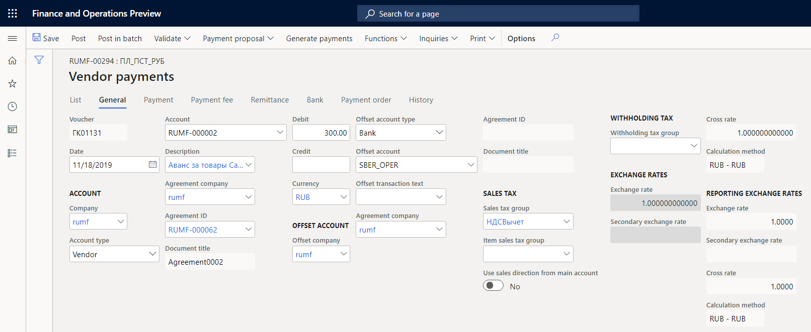
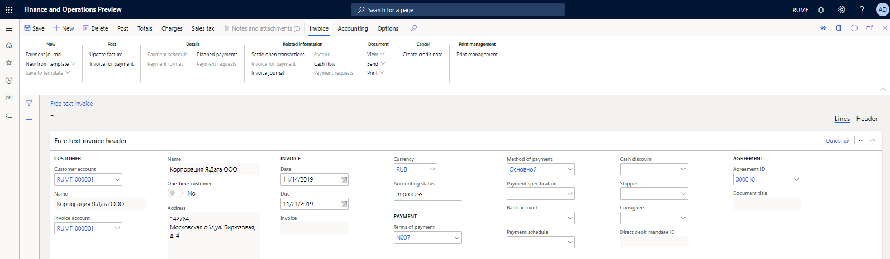
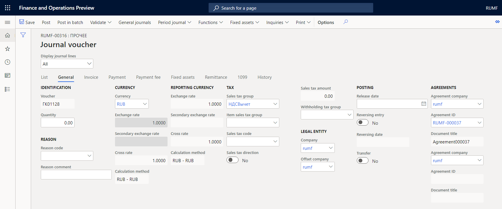
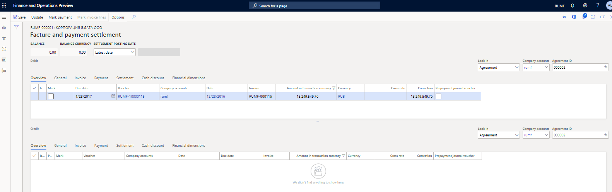

# Register transactions with reference to agreements
[!include [banner](../../includes/banner.md)]

When you register sales, purchases, or incoming or outgoing payments, you can perform the following operations:

- Specify a reference to the agreement that the operation is performed according to.
- Settle customer and vendor transactions in the context of agreements that are specified during the registration of transactions.

After these operations are completed, you can analyze the turnover and balance of the agreement.

## Registering a payment from a customer or a payment to a vendor, and including an indication of the agreement

In the Russian localization, the **General journal**, **Slip journal**, **Vendor payment journal**, and **Customer payment journal** pages include a section that has information about the agreement. By using the journals that are listed, you can register a payment from a customer or a payment to a vendor, and include a reference to the agreement that the transaction is made according to.

As an example, the following procedure shows how to register a payment to a vendor through the vendor payment journal. However, the reference to the agreement is similar for all the other journals.

### Register a payment by using the vendor payment journal

1. Go to **Accounts payable** \> **Payments** \> **Vendor payment journal**.
2. On the Action Pane, select **Lines**.
3. On the **General** tab, in the **Account** section, in the **Agreement ID** field, select the number of the agreement that the transaction is registered for.

The **Document title** field is automatically set to the title of the agreement.

The transaction for the counterparty will have a link to the agreement number.

To view transactions for a counterparty, follow one of these steps.

   - On the **All vendors** page, on the Action Pane, on the **Vendor** tab, in the **Transactions** section, select **Transactions**. On the **Financial dimensions** tab, the **Agreement** field shows information about the agreement that the transaction is registered for.
   -  On the **All customers** page, on the Action Pane, on the **Customer** tab, in the **Transactions** section, select **Transactions**. Then, in the upper pane, in the **Page options** section, select **Change view \> Details view**. On the **Financial dimensions** FastTab, the **Agreement** field shows information about the agreement that the transaction is registered for.

## Registering accounts receivable or accounts payable, and including an indication of the agreement

You can register accounts receivable or accounts payable, and include a reference to the agreement in the sales order or the purchase order. For more information, see [Fulfill sales agreements](../../../supply-chain/sales-marketing/tasks/fulfill-sales-agreements.md) and [Create a purchase release order from a purchase agreement](../../../supply-chain/procurement/tasks/create-purchase-release-order-purchase-agreement.md).

You can also register accounts receivable or accounts payable on the **Free text invoice** and **General journals** pages. In the Russian localization, you can specify a customer or vendor agreement.

### Register accounts receivable by using a free text invoice

1. On the **Free text invoice** page, create a free text invoice.
2. On the **Free text invoice header** FastTab, in the **Agreement** section, in the **Agreement ID** field, select the number of the agreement.

    The **Document title** field is automatically set to the title of the agreement.

    

3. Specify other details, and post the invoice.

### Register accounts receivable and accounts payable from general journals

1. Go to **General ledger** \> **Journal entries** \> **General journals**.
2. On the Action Pane, select **Lines**.
3. Create a line, and then, on the **General** tab, in the **Agreements** section, in the **Agreement ID** field, select the number of the agreement that the transaction is registered for.

    The **Document title** field is automatically set to the title of the agreement.

    

4. Specify other details, and then, on the Action Pane, select **Post** to post the transaction.

## Settling factures on a counterparty in the context of agreements

For more information about dimension control for settlements, see [Set up dimension control for settlements (Russia)](rus-transactions-settlement-date.md).

### Settle factures on a customer in the context of agreements

1. Go to **Accounts receivable \> Customers \> All customers**.
2. On the **Collect** tab, in the **Settle** section, select **Facture and payment settlement**.

    

3. In the upper and lower panes, set the following options to select transactions:

   - In the **Look in** field, select **Agreement**.
    - In the **Agreement ID** field, select an agreement that you want to settle transactions for.
    
    The transactions that include the selected agreement are shown.

4. Use the **Mark** check boxes to select the reimbursement transaction for settlement in the upper pane and the disbursement transaction in the lower pane.
5. On the Action Pane, select **Update** to settle the counteragent transaction.

### Settle factures on a vendor in the context of agreements

1. Go to **Accounts payable \> Vendors \> All vendors**.
2. On the **Invoice** tab, in the **Settle** section, select **Facture and payment settlement**.
3. Settle transactions in the context of agreements as described in the previous section of this article, [Settle factures on a customer in the context of agreements](#settle-factures-customer-agreements).

### Periodically settle sales or purchase transactions

You can do periodic settlement of counteragent transactions by using the **Periodic settlement** page if the **Allow automatic settlement** option is set to **Yes**. You can reverse the settlement on the **Periodic reverse** page.

As an example, this procedure shows how to do periodic settlement of sales transactions.

1. Go to **Accounts receivable** \> **Setup** \> **Customer posting profiles**.
2. Select a customer posting profile, and then, on the **Table restrictions** FastTab, set the **Allow automatic settlement** option to **Yes** to allow for automatic settlement of sales transactions.
3. Go to **Accounts receivable** \> **Periodic tasks** \> **Settlement** \> **Periodic settlements**.
4. On the **Periodic settlements** page, specify the details, and then select **OK** to do the settlement.

To reverse the settlement, go to **Accounts receivable** \> **Periodic tasks** \> **Settlement** \> **Periodic reverse**. On the **Periodic reverse** page, specify the details, and then select **OK**.

Find more details in the following topics:

- [Agreements](rus-agreements.md)
- [Set up and create agreements](rus-set-up-and-create-agreements.md)
- [Inquiries and reports with agreements](rus-inquiries-reports-agreements.md)

[!INCLUDE[footer-include](../../../includes/footer-banner.md)]
