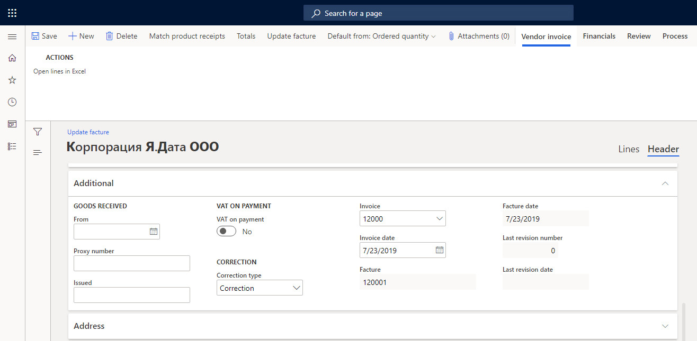
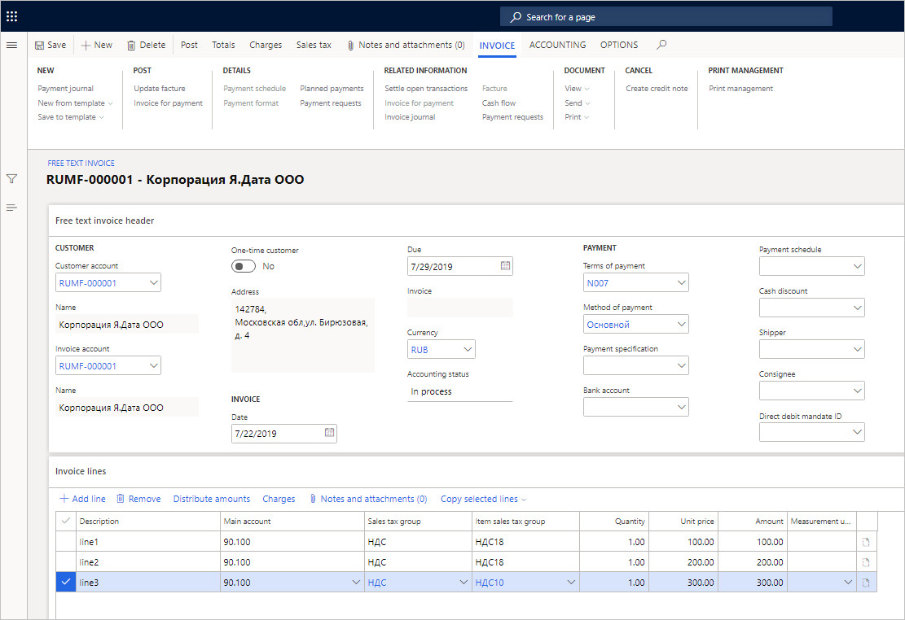
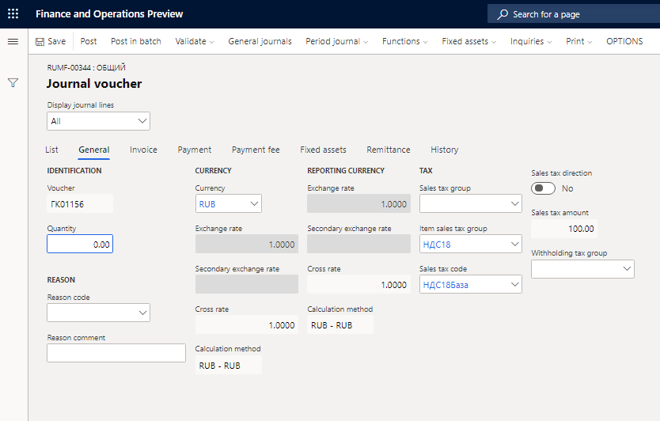
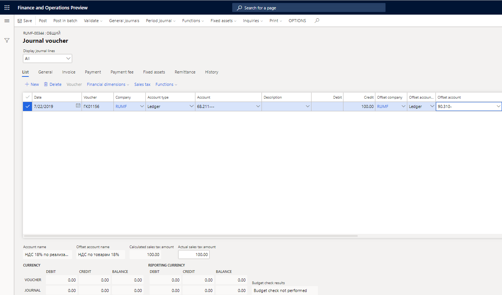
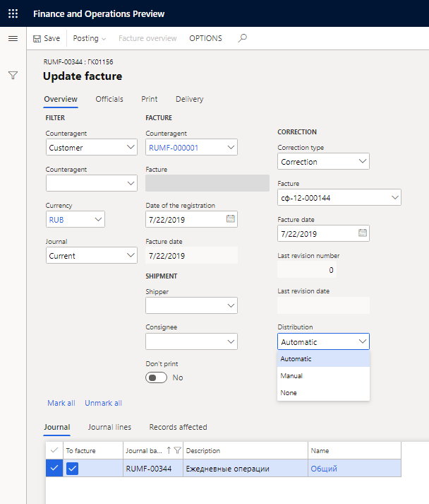
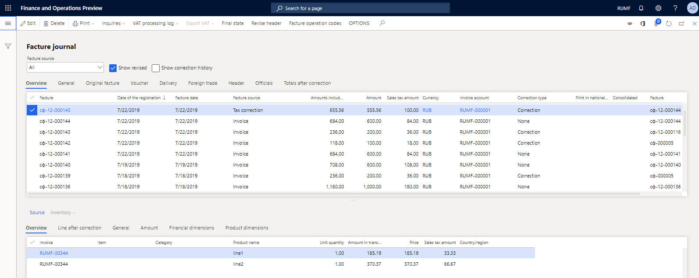
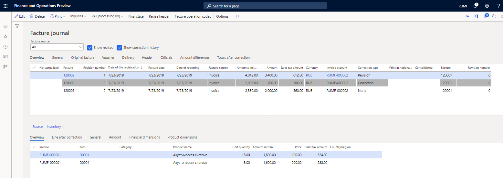

# Revision factures and corrective factures

[!include [banner](../../includes/banner.md)]

A corrective facture is issued in addition to an original facture in the following cases:

- The cost of goods changes. For example, a supplier provides a discount to the buyer.
- The quantity of shipped goods must be clarified. For example, the actual quantity of received goods doesn't correspond to the data in the facture, or upon receipt of the goods, it's found that some of the goods are damaged.

A revision facture is a new facture that is issued to replace an original, incorrect facture. It reflects the number and date of the original facture, the number and date of the revision facture. A revision facture is typically issued when one of the following accounting mistakes is made:

- Technical mistakes. For example, the facture has the wrong amount, or the accountant entered the address, the seller, or the buyer's name incorrectly.
- Arithmetic mistakes.

You can create and print corrective and revision factures that are based on credit notes, corrective factures, and tax transactions. Revision factures can also be based on previously created factures.

For corrections and revisions, we recommend that you create factures on the basis of credit notes, corrective factures, and previously created factures. In this way, you change the header fields of the facture You should limit the creation of corrective factures on the basis of tax transactions, because when prices that have an accuracy of two characters are recalculated based on the amount of value-added tax (VAT), a significant rounding difference can arise.

## Set up parameters to create corrective and revision factures

### Set up Accounts receivable parameters for corrective and revision factures

1.	Go to **Accounts receivable** \> **Setup** \> **Accounts receivable parameters**.
2.	On the **Ledger and sales tax** tab, on the **General** FastTab, set the **Control item dimension for correction lines** option to **Yes**.
3.	On the **Number sequences** tab, in the **Number sequence code** field, select a number sequence code for the following references:

 - Corrective facture
 - Corrective free text invoice
 - Corrective free text credit note
 - Corrective free text invoice voucher
 - Corrective free text credit note voucher
 - Corrective customer invoice
 - Corrective sales credit note
 - Corrective customer invoice voucher
 - Corrective sales credit note voucher
 - Corrective invoice (M-15) (system ID)
 - Corrective invoice (M-15)
 - Revising sales invoice Corrective bill of landing

 > [!NOTE]
 > To meet the requirement for a single, continuous number sequence for all factures that are issued to customers, you should use the same number sequence code for both the following references:
> 
 > - **Facture** – This reference is used for regular customer factures.
 > - **Corrective facture** – This reference is used for factures of the **Correction type**.

### Set up Accounts payable parameters for corrective and revision factures

1. Go to **Accounts payable** \> **Setup** \> **Accounts payable parameters**.
2.	On the **Ledger and sales tax** tab, on the **Sales tax** FastTab, set the **Control item dimension for correction lines** option to **Yes**.
3.	On the **Number sequences** tab, in the **Number sequence code** field, select a number sequence code for the following references:

 - Corrective invoice voucher
 - Corrective credit note voucher
 - Revising invoice internal number

### Set up General ledger parameters

1.	Go to **General ledger** \> **Ledger setup** \> **General ledger parameters**.
2.	On the **Sales tax** tab, on the **Tax options** FastTab, in the **Facture operation code delimiter** field, enter the symbol that should be used as a delimiter for facture operation codes.

> [!NOTE]
> This delimiter is a single-digit delimiter that is used when a value is entered in the **Operation codes** field on the **General** tab of the **Facture journal** page.

3.	In the **Sales/purchase book date and number delimiter** field, enter the symbol that should be used as a delimiter for the facture date and number in the sales and purchase books.

> [!NOTE]
> To use a space as the delimiter, put the cursor in the field, and then press the **Spacebar** key.

4.	On the **Number sequences** tab, in the **Number sequence code** field, select a number sequence code for the **Facture** reference. This reference is used for tax transaction factures (factures that have a tax adjustment transaction as their source).

## Create facture operation codes
Operation codes are regulated by law and should be shown in the Facture journal.

1.	Go to **Tax** \> **Setup** \> **Sales tax** \> **Facture operation codes**.
2.	Select **New** to create an operation code.
3.	In the **Code** field, enter a facture operation code.
4.	In the **Name** field, enter the name of the facture operation.
5.	In the **Default operation type** field, select the default operation type. The facture operation code can then be filled in automatically when factures are registered in the journal. The following operation types are available: **Shipment**, **Prepayment journal voucher**, **Return of goods**, **Revision**, **Correction**, **Revision of correction**, **Prepayment on commission**, **Commission**, **Shipment not liable for VAT**, and **Tax agent**.
6.	Select the **Inherit** check box to indicate that the facture operation code for corrective and revision factures can be inherited from the original facture.

> [!NOTE]
> No more than two codes can be inherited as the second and third codes after the code that identifies the correction or revision.

7.	Select **Save**.

## Create a corrective or revision facture
You can create and print corrective and revision factures that are based on credit notes, corrective factures, and tax transactions.

### Create a corrective or revision facture based on credit notes or corrective invoices
Corrective and revision factures can be created on the basis of documents (invoices and credit notes) where the document header indicates the corrected or revised document. In this case, the system establishes an automatic connection with the lines of the corrected or revised document. If a one-to-one correspondence between the lines of the original document and the corrected or revised document can't be determined automatically, the user should manually establish it on the document lines.

#### Create a corrective or revision facture for a purchase order

1.	Go to **Accounts payable** \> **Purchase orders** \> **All purchase orders**.
2.	Create a purchase order.
3.	On the Action Pane, on the **Invoice** tab, in the **Generate** group, select **Facture**.
4.	Switch to the **Header** view.
5.	On the **Additional** FastTab, in the **Correction type** field, select **Correction** or **Revision**, as appropriate.
6.	In the **Invoice** field, select the number of the invoice that must be corrected or revised.
7.	In the **Invoice date** field, select the invoice date.
8.	In the **Facture** field, select the facture that requires correction or revision.
9.	In the **Facture date** field, select the facture date.
 
  
 
10.	Select **Update facture** to post the corrective or revision facture.

#### Create a corrective or revision facture for a vendor invoice

1.	Go to **Accounts payable** \> **Invoices** \> **Open vendor invoices**.
2.	Create a vendor invoice, and specify all the fields that are required in order to update the corrective or revision facture (see the steps in the previous section, Create a corrective or revision facture for a purchase order).

#### Create a corrective or revision facture for a sales order

1.	Go to **Accounts receivable** \> **Orders** \> **All sales orders**.
2.	Create a sales order.
3.	On the Action Pane, on the **Invoice** tab, in the **Generate** group, select **Facture**.
4.	On the **Update facture** page, on the **Additional** FastTab, in the **Correction type** field, select **Correction** or **Revision**, as appropriate.
5.	In the **Invoice** field, select the number of the invoice that must be corrected or revised.
6.	In the **Invoice date** field, select the invoice date.
7.	In the **Facture** field, select the facture that requires correction or revision.
8.	In the **Facture date** field, select the facture date.
9.	Select **Update facture** to post the corrective or revision facture.

#### Create a corrective or revision facture for a free text invoice

1.	Go to **Accounts receivable** \> **Invoices** \> **All free text invoices**.
2.	Create a free text invoice.
3.	Switch to the **Header** view.
4.	In the **Correction type** field, select **Correction** or **Revision**, as appropriate.
5.	In the **Invoice** field, select the number of the invoice that must be corrected or revised.
6.	In the **Invoice date** field, select the invoice date.
7.	In the **Facture** field, select the facture that requires correction or revision.
8.	In the **Facture date** field, select the facture date.
9.	On the Action Pane, on the **Invoice** tab, in the **Post** group, select **Update facture**.
10.	On the **Post facture** page, select **OK** to post the corrective or revision facture.

### Create a corrective or revision facture based on a tax transaction
Corrective and revision factures can be created based on a tax transaction. In this case, the amount excluding VAT and the amount including VAT are calculated based on the tax transaction amount.

Correction or revision amounts are distributed to the lines of the original facture subject to the previous corrections or revisions. Distribution can be done either automatically or manually:

- Automatic distribution provides a proportional change in price, amount excluding VAT, and amount including VAT for those lines of the corrected or revised facture where the tax code matches the tax code of the tax transaction.
- Manual distribution is done on a user-selected line of the original facture.

#### Example of automatic correction distribution
This example shows the process of automatic correction distribution for an original sales facture that contains three lines.

1.	Go to **Accounts receivable** \> **Invoices** \> **All free text invoices**.
2.	Create a free text invoice that has three lines. For the first two lines, set the item sales tax group to **VAT18**. For the third, set it to **VAT10**.

  
 
3.	Post the invoice and update facture in the usual way.
4.	Go to **General ledger** \> **Journal entries** \> **General journal**.
5.	Select **New** to create a journal.
6.	Select **Lines**.
7.	Create tax transactions in the usual way. On the **List** tab, set the **Account**, **Credit**, and **Offset account** fields.
8.	On the **General** tab, set the **Sales tax code** field.

  
 
> [!NOTE]
> Depending on the setup of the Ledger posting group account that you selected in the **Sales tax code** field, you must select values in the **Account** and **Offset account** fields.
>
> 
 
9.	Select **Post** to post the journal.
10.	Select **Functions** \> **Sales book** to open the **Update facture** page. (For a purchase facture correction based on a tax transaction, select **Functions** \> **Purchase book**.).
11.	In the **Correction type** field, select **Correction** or **Revision**, as appropriate.
12.	In the **Facture** field, select the number of the facture that requires correction or revision. The Facture date field is automatically set.
13.	In the **Distribution** field, select **Automatic**.

  
 
14.	In the lower part of the page, use the To facture check box to select the journal.
15.	Select **Posting** \> **Update and print** to update and print the facture.
16.	Go to **Accounts receivable** \> **Inquires and reports** \> **Facture**. The upper part of the **Facture journal** page shows the facture that was created. The lower part of the page shows only two lines of the facture, where the item sales tax group equals **VAT18**. Facture lines show the amounts of deviations that are calculated as a result of the distribution.
 
  
 
## Revise a facture header on the Facture journal page
Use the **Revise header** button to correct the header fields of the facture.

1.	Go to **Accounts payable** \> **Inquires and reports** \> **Facture**.

    –or–

    Go to **Accounts receivable** \> **Inquires and reports** \> **Facture**.

2.	Select a facture, and then select **Revise header** to open the **Update facture** page.
3.	In the **Shipper** field, select the account number of the customer or vendor who is the shipper.
4.	In the **Consignee** field, select the account number of the customer or vendor who is the consignee.
5.	Select **Posting** \> **Update** to update and post the facture.

## Review a history of corrective or revision factures in the Facture journal
1.	Go to **Accounts payable** \> **Inquires and reports** \> **Facture**.

    –or–

    Go to **Accounts receivable** \> **Inquires and reports** \> **Facture**.

2.	Select the **Show correction history** check box to view the history of all facture corrections or revisions. The original facture and the associated corrective or revision factures are shown.
 
   
 
 In the upper part of the page, documents are sorted by the **Date of the registration** value, in descending order.
 The **Facture** and **Revision number** fields on the left side of the grid show information about the current document. The **Facture** and **Revision number** fields on the right side of the grid show information about the original document.

 A warning symbol in the Not actualized field indicates that the original facture was revised after the invoice was corrected. Therefore, the corrective document is no longer accurate. The warning symbol will disappear after a revision for the corrective facture is created that has a date that is later than the correction of the original facture.

3.	Select the **Show revised** check box to view the history of facture revisions. All revision facture lines are shown in gray.
4.	Select the **Totals after correction** tab to view the details of the total facture amount after the correction or revision. In the lower part of the page, select the **Line after correction** tab to view the amount for each facture line after the correction or revision.
5.	On the Action Pane, select **Final state** to open the **Facture final state** page, where you can view the final status of all facture lines. The lines for all corrective and revision factures are included.

## Print a corrective or revision facture
1.	Go to **Accounts payable** \> **Inquires and reports** \> **Facture**.
  
    –or–

    Go to **Accounts receivable** \> **Inquires and reports** \> **Facture**.

2.	Select a facture, and then select **Print** \> **Correction** to print a corrective or revision facture.
3.	Select **Print** \> **Original** to print the original facture.

    –or–

    Select **Print** \> **Copy** to print the original facture.

[!INCLUDE[footer-include](../../../includes/footer-banner.md)]
