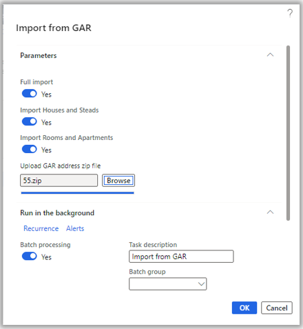
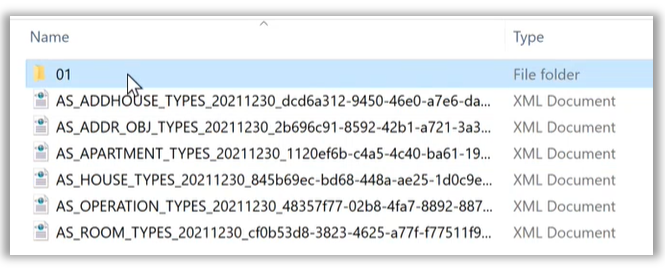
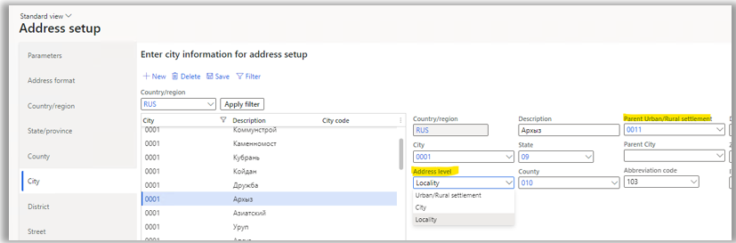
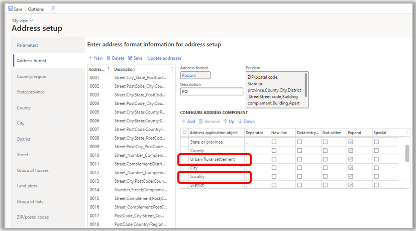
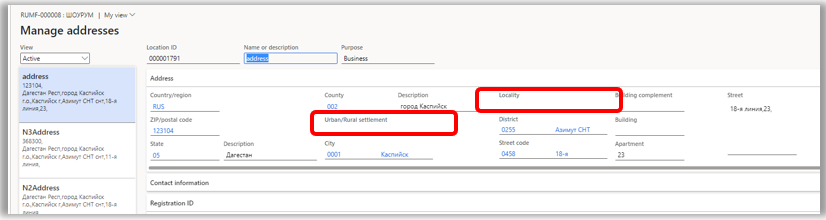
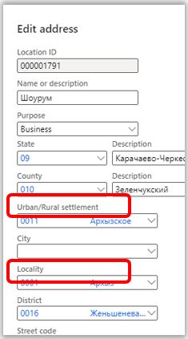

# Import from State Address Register (GAR)

[!include [banner](../../includes/banner.md)]

Starting in Microsoft Dynamics 365 Finance version 10.0.29, address import is available in a new State Address Register (GAR) format: Import from GAR. This article explains how to import addresses in the GAR format.

The GAR format that is provided by the Federal Tax Service (FTS) contains information about addresses in administrative-territorial and municipal divisions. Current GAR functionality enables the import of addresses in the municipal division only.

The [Federal Informational Address System (FIAS) functionality](rus-russian-address-format-and-import-from-FIAS.md) enables the import of states, counties, cities, districts, streets, groups of houses, groups of flats, ZIP/postal codes, and land plots. In addition, the GAR functionality enables the import of urban/rural settlements and localities, which are the components of the municipal division.

The GAR functionality doesn't support parking lots (spaces), room numbers, and rooms numbers in the premises.

The following table provides information about GAR levels, and the corresponding tabs and tables on the **Address setup** page.

| Level | Name in GAR | Tab on the Address setup page | Table |
|---|---|---|---|
| 1 | Subject of the Russian Federation | State/Province | LogisticsAddressState |
| 2 | Administrative area | City （Address level - City）|LogisticsAddressCity |
| 3 | Municipal district | County | LogisticsAddressCounty |
| 4 | Rural / Urban Settlement | City （Address level - Rural / Urban Settlement）| LogisticsAddressCity |
| 5 | City | City （Address level - City) | LogisticsAddressCity |
| 6 | Locality |City （Address level - Locality) | LogisticsAddressCity
| 7 | Planning structure element | District | LogisticsAddressDistrict |
| 8 | Road network element | Street | LogisticsAddressStreet\_RU |
| 9 | Steads | Land plots | LogisticsAddressSteadNumber\_RU |
| 10 | House | Group of houses | LogisticsAddressHouseNumber\_RU |
| 11 | Apartments and Rooms | Group of flats | LogisticsAddressFlatNumber\_RU |

## Enable the Import from GAR feature

1. Go to **Workspaces** \> **Feature management**.
2. In the feature list, find and select the **(Russia) Import addresses from the State Address Register (GAR)** feature.
3. Select **Enable now**.

After you enable the feature, the **Import from FIAS** functionality is no longer available. A new **Import from GAR** menu item is available instead.

## Import ER configurations

The **GAR import** feature uses the [Electronic Reporting (ER) functionality](../../../fin-ops-core/dev-itpro/analytics/general-electronic-reporting.md). You must import the following ER configurations:

1. Import configurations for GAR address metadata files:

    - GAR metadata import ADDHOUSE(RU)
    - GAR metadata import ADDR\_OBJ(RU)
    - GAR metadata import APARTMENT(RU)
    - GAR metadata import HOUSE(RU)
    - GAR metadata import OPERATION(RU)
    - GAR metadata import ROOM(RU)

2. Import configurations for the GAR MUN hierarchy file:

    - GAR hierarchy import MUN\_HIERARCHY(RU)

3. Import configurations for GAR address files:

    - GAR address import ADDR\_OBJ(RU)
    - GAR address import APARTMENTS(RU)
    - AR address import HOUSES(RU)
    - GAR address import ROOMS(RU)
    - AR address import STEADS(RU)

4. Import configurations for GAR address parameters files:

    - GAR parameters import ADDR\_OBJ(RU)
    - GAR parameters import APARTMENTS(RU)
    - GAR parameters import HOUSES(RU)
    - GAR parameters import ROOMS(RU)
    - GAR parameters import STEADS(RU)

For more information about how to import ER configurations, see [Download ER configurations](../../../fin-ops-core/dev-itpro/analytics/er-download-configurations-global-repo.md).

## GAR import

1. Download the database from [https://fias.nalog.ru/Updates](https://fias.nalog.ru/Updates).
2. Go to **Organization administration** \> **Global address book** \> **Import from GAR**.
3. Select **Import from GAR**.
4. In the **Import from GAR** dialog box, on the **Parameters** FastTab, select **Browse** to select the zip archive.
5. If you're importing a full database, set the **Full import** option to **Yes**. If you're importing a delta file, set it to **No**.
6. If you intend to import houses and steads, set the **Import Houses and Steads** option to **Yes**.
7. If you intend to import rooms, set the **Import Rooms and Apartments** option to **Yes**.
8. Select **OK** to start the import.

    > [!IMPORTANT]
    > Currently, there is a size limit of 2 gigabyte(GB) for address import. The state can't be imported if it contains an XML file that exceeds the 2-GB size limit.

    

Because of the size limit for address import, you must unzip the downloaded database and create a zip file for the states that are required. You can import one state or several states. If you want to import several states, the zip file should contain folders that have those states. Follow these steps to create a zip file that has the required states.

1. Unzip the downloaded database into a folder.
2. Create a new zip file that contains the folders that correspond to the required states and the metadata files.

    - AS\_ADDHOUSE\_TYPES\_\*
    - AS\_ADDR\_OBJ\_TYPES\_\*
    - AS\_APARTMENT\_TYPES\_\*
    - AS\_HOUSE\_TYPES\_\*
    - AS\_OPERATION\_TYPES\_\*
    - AS\_ROOM\_TYPES\_\*

    

    > [!NOTE]
    > Don't change the folder names in the zip file. The names should remain the codes of states.
    >
    > Metadata files are optional for all imports except the first. For the first import, make sure the zip file contains metadata. After the import is completed, validate the imported data on the **Address setup** page.

The urban/rural settlement and locality are imported to the **City** level with the corresponding **Address level** value. The **Parent Urban/Rural settlement** field will be set to the corresponding code of the urban/rural settlement if it exists.

> [!NOTE]
> Filtering by the **Urban/Rural settlement**, **City**, and **Locality** address levels isn't supported. Codes for cities (including urban/rural settlements and localities), districts, and streets are automatically generated during import. The codes are unique in the parent address component level. If the current parent level component has no children, either **001** or **0001** will be assigned, depending on the object type. If there are child records, the new code will be incremented by 1.

### Importing GAR in a batch

The process of importing addresses can take time. For example, if the address data size is about 800 (MB) for state 01, the import might take one to two hours. We recommend that you use the batch job mode by enabling the **Batch processing** option.

You can review the status of the **Import from GAR** batch on the **Batch jobs** page. You can review the log on the **Batch job** tab by selecting the **Log** button. The import can be completed with errors. For example, if the version of the file is older than the version that was already imported, the following error message will be shown: "Address version validation failed: the version is older than the latest imported version."

## Address format setup

Follow the steps in [Address setup](../../../fin-ops-core/dev-itpro/organization-administration/global-address-book-address-setup.md#set-up-address-formats).

To comply with the GAR address format, on the **Address setup** page, on the **Address format** tab, add the new **Urban/Rural settlement** and **Locality** address components that are available in the **Address application object** enumeration (enum).

These address components are also available on the **Manage addresses** page, and in the **New Address** and **Edit address** dialog boxes.

[!INCLUDEfooter-include]
