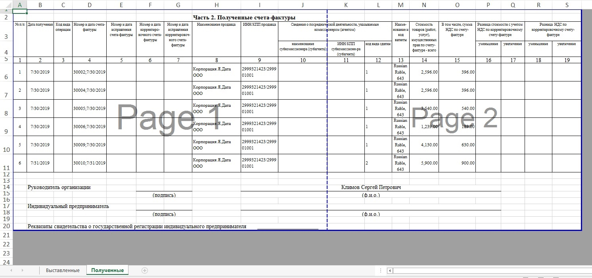
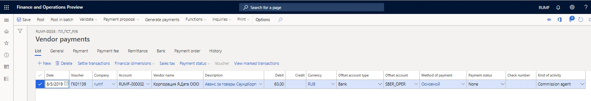

# Sales on commission
[!include [banner](../../includes/banner.md)]

The principal engages the intermediary (commissioner) to sell, in the commissioner's own name, the principal's goods (works or services) to third parties.

The intermediary performs the following actions:

- Register a facture that was issued to a third-party buyer on the **Issued** worksheet of the facture accounting journal when goods are shipped.
- Don't register a facture in the sales book, because the goods belong to the principal, and the intermediary doesn't have the obligation to charge VAT.
- Inform the principal about the facture details, so that the principal can reissue the facture in their own name.

After the reissued facture is received from the principal, the commissioner registers it on the **Received** worksheet of the facture accounting journal. However, the commissioner doesn't make an entry in the purchase book.

If the agreement includes prepayment terms, the registration procedure for reissuing a facture is similar.

The following illustration shows the business process for registering intermediary deals. Rectangular elements are reflected in the system. Oval elements are present in the business process but aren't reflected in the system.

## Create a purchase agreement for a sale by a commissioner

1. Go to **Accounts payable** \> **Purchase orders** \> **Purchase agreements** or **Procurement and sourcing** \> **Purchase agreements** \> **Purchase agreements**.
2. Select **New** to open the **Create purchase agreement** dialog box.
3. On the **Vendor** FastTab, specify the vendor account, and then, in the **Purchase agreement classification** field, select **Blanket purchase agreement**.
4. On the **General** FastTab, in the **Document** section, in the **Purchase agreement** field, specify the identifier of the purchase agreement.
5. Specify other details, and then select **OK**.

    

6. On the **Purchase agreements** page, switch to the **Header** view.
7. On the **General** FastTab, in the **Document** section, in the **Commission agreement** field, select **Sale by commissioner**.
8. On the **Financial** FastTab, in the **Inventory profile** section, specify the following details:

    - In the **Kind of activity** field, select **Commission agent**.
    - In the **Inventory profile** field, select the inventory profile that you created earlier.

    

9. On the Action Pane, on the **Purchase agreement** tab, in the **Generate** group, select **Confirmation** to update the status of the agreement to **Effective**.

## Create inventory owners (principals)

1. Go to **Inventory management** \> **Setup** \> **Dimensions** \> **Inventory owners**.
2. Select **New** to create an inventory owner.
3. In the **Owner** field, enter the code for the owner.
4. In the **Account type** field, select **Vendor**.
5. In the **Account** field, select the code for the principal. The **Name** field is automatically filled in.
6. In the **Agreement ID** field, select the purchase agreement that you created earlier, to associate the owner with the agreement.
7. Select **Save**.

## Create a purchase order and generate a purchase invoice

1. Create a purchase order.
2. In the **Purchase agreement** field, select the agreement for a sale by the commissioner that you created earlier.
3. On the purchase order line, select the item number that was sold earlier.

  > [!NOTE]
  > The **Tracking dimension** field for the item should be set to the inventory profile that you created earlier.

4. On the **Line details** FastTab, on the **Product** tab, in the **Tracking dimensions** section, make sure that the **Inventory profile** field is automatically set to the inventory profile that you created earlier.
5. In the **Owner** field, select the owner (principal) that you created earlier.

    

6. Post the invoice.

## Create a sales order and update the facture

1. Create a sales order.
2. On sales order line, select the item number.

   > [!NOTE]
   > The **Tracking dimension** field for the item should be set to the inventory profile that you created earlier.

3. On the **Line details** FastTab, on the **Product** tab, in the **Tracking dimensions** section, select the inventory profile and owner (principal) that you created earlier.
4. On the **Sales order lines** FastTab, select **Inventory \> Marking**.
5. Select a purchase transaction, select **Set mark now**, and then select **OK**.

    

6. Specify other sales order parameters, and create a facture.

## Create and print a report for a principal, and reissue the buyer's factures to the principal

1. Go to **General ledger** \> **Periodic tasks** \> **Commission trade** \> **Report for principal**.
2. Select **New** to open the **Create report for principal** dialog box.
3. In the **From date** and **To date** fields, specify the period for the report.

   >[!NOTE]
   > You can leave the **From date** field blank.

4. In the **Principal type** field, select **Vendor**.
5. In the **Partner code** field, select the vendor account.
6. In the **Agreement ID** field, select the purchase agreement.
7. Select **OK**.

   > [!NOTE]
   > To create the headers for all the reports for the principal that are required in the specified period, select **Functions** \> **Create report headers on shipments**.

8. Select **Functions** \> **Update lines on shipment** to open the **Generate report for principal on shipments** dialog box, and then select **OK** to create the lines for every report.
9. Select **Print** to open the **Report for principal to Microsoft Excel** dialog box, and then select **OK** to print the report for the principal.
10. The principal reissues the facture to the agent, based on the factures that the agent issues to the buyer. The principal learns about these factures from the printed report for the principal. Use the **Approved** check box to select the lines that the principal reissues the facture for, and then select **Approval** \> **Approve all** to approve the lines on the report.

    

11. Select **Facture** \> **Update facture** to generate the factures that were reissued by the principal.
12. On the **Update facture** page, in the **Commission trade** section, make sure that the **Buyer** and **Facture** fields are automatically set. If they are blank, select the customer in the **Buyer** field and the number of the sales order facture that was created in the **Facture** field.
13. Specify other required details, and create the facture.

    

14. On the **Report for principal** page, do the following:

    - Select **Principal** \> **Invoice journal** to view the principal's invoice.
    - Select **Principal** \> **Facture** to view the principal's facture.
    - Select **Inquiries** \> **Invoice journal** to view the original invoice to the buyer.
    - Select **Inquiries** \> **Facture** to view the original facture to the buyer.

## Print a facture accounting journal

The approved lines of the report for the principal are registered on the **Received** worksheet of the facture accounting journal. The information reflects the information about the principal in the original factures on the **Issued** worksheet of the facture accounting journal.

1. To print the facture accounting journal, go to **General ledger** \> **Inquiries and reports** \> **Journal reports** \> **Facture accounting journal** to open the **Facture accounting journal** dialog box.
2. Specify the period for the report, and then select **OK** to print the facture accounting journal.

In the printing format of the facture accounting journal, the original factures to buyers are allocated among the principals. The **Issued** worksheet of the facture accounting journal reflects the allocated parts of the customer's factures. The information about the principals is presented in columns 10 through 12.

The **Received** worksheet of the facture accounting journal reflects the
factures that are confirmed by the principal.

## Prepayments

### Create prepayments, a sales order, a purchase order, and a report for a principal

The amount of prepayment that is received from the customer can be allocated among different principals. The payment sum can also be edited. The system makes sure that the amount that is allocated among principals doesn't exceed the original prepayment. The remaining prepayment amount can be allocated to another principal or to the same principal on another principal report. No VAT transactions will be posted in the general ledger, in spite of the vendor prepayment facture that is created.

1. On the **Customer payment journal** page, create a customer prepayment, and then select **Lines**.
2. On the **Customer payments** page, in the **Kind of activity** column, select **Commission agent** to indicate that the prepayment is subject to transfer to the principal.

  > [!NOTE]
  > If you don't see the **Kind of activity** column, right-click in the row that has the column names, and then select **Add columns**. Select the check box for the **Kind of activity** column, and then select **Insert**.

   

3. On the **Vendor payment journal** page, create a vendor prepayment that has a facture, and then select **Lines**.
4. On the **Vendor payments** page, in the **Kind of activity** column, select **Commission agent**.

    

5. Create a purchase order and an invoice.
6. Create a sales order and a facture.
7. Create a report for the principal, and update the lines on shipments.
8. In the bottom part of the **Report for principal** page, on the **Prepayments** tab, in the **Voucher** field, select the customer prepayment voucher to include the prepayment on the report for the principal that is responsible for VAT prepayment.

    

9. Select **Transactions** to view the allocated amount in the **Amount in reporting currency** field.

    

10. On the **Report for principal** page, approve lines on the **Overview** tab and vouchers on the **Prepayments** tab.
11. You can create a facture, and you can view the principal's invoice or facture, or the original invoice or facture.

### Print a report for a principal

Print a report for a principal. The report for the principal has two sections: one for shipments and one for prepayments.

### Create a prepayment facture

1. On the **Report for principal** page, on the **Prepayments** tab, select the **Approve** check box, and then select **Create facture** to register a principal's facture on the prepayment.
2. On the **Create prepayment facture** page, select **Select** to open the **Select prepayments** dialog box.
3. In the **From date** and **End date** fields, specify the period.
4. In the **Vendor account** field, select a vendor account. All the sources for factures from the selected vendor are included in the dialog box (approved lines from the report for the principal and prepayments from vendor payment journals).

  > [!NOTE]
  > If you leave the **Vendor account** field blank, all prepayments will be selected for processing.

5. Select **OK**.

    

6. On the **Create prepayment facture** page, use the **Marked** check box to select the relevant prepayment.
7. Specify the date of the registration and facture, and then select **Create**.

    

8. On the **Report for principal** page, on the **Prepayments** tab, select **Principal \> Facture** to view the registered principal's facture for prepayment.

    
    
9. Select **Print** \> **Original** to print the original facture, or select **Print** \> **Copy** to print the facture copy.

    

### Create a facture accounting journal

You can register approved lines on the **Facture accounting journal** page and print a facture accounting journal.

## Review the owner that is assigned to an agreement

1. Go to **Accounts payable \> Purchase orders \> Purchase agreements** or **Procurement and sourcing \> Purchase agreements \> Purchase agreements**.
2. Select the agreement, and then, on the Action Pane, on the **Purchase agreement** tab, in the **Setup** group, select **Inventory owners** to review the owner that is assigned to the agreement.
3. Select **Transactions** to review the inventory transactions that are associated with the inventory owner.

    

4. Select **Transaction details**. On the **Inventory dimensions** FastTab, you can see the owner and the inventory profile.

    

The settings that are described here let you track the commission goods by the owner of the goods according to the agreement.

Find more details in the following topics:

- [Transactions through intermediary](rus-transactions-through-intermediary.md) 
- [Purchases on commission](rus-purchases-on-commission.md)

[!INCLUDE[footer-include](../../../includes/footer-banner.md)]
