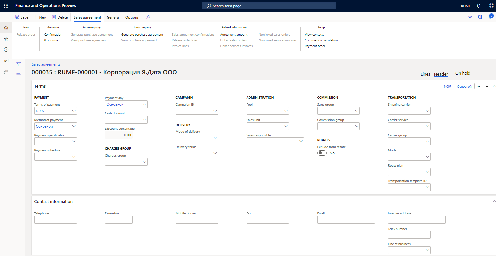

# Set up and create agreements

[!include [banner](../../includes/banner.md)]

This article explains how to create purchase and sales agreements for Russia in Microsoft Dynamics 365 Finance.

You can view all purchase agreements on the **Purchase agreements** list page and all sales agreements on the **Sales agreements** list page. These list pages store data such as the dates and amounts of the agreements, and the payment terms. All agreements are grouped into agreement classifications.

## Create sales agreement classifications

To create sales agreement classifications, follow these steps:

1. In Dynamics 365 Finance, go to **Sales and marketing** \> **Setup** \> **Sales agreements** \> **Sales agreement classifications** or **Accounts receivable** \> **Setup** \> **Sales agreement classifications**.
1. Create a sales agreement classification.
1. On the **General** FastTab, in the **Associated classification** field, select the agreement classification group that is associated with the agreement classification.
1. In the **Number sequence code** field, select the code for the number sequence that should be used to number agreements that belong to the agreement classification.
1. Select **Save**.

> [!NOTE]
> You can't delete an agreement classification that is used for existing agreements.

## Create purchase agreement classifications

To create purchase agreement classifications, follow these steps:

1. In Dynamics 365 Finance, go to **Procurement and sourcing** \> **Setup** \> **Purchase agreement classification**.
1. Specify the details as described in the previous section of this article, [Create sales agreement classifications](#create-sales-agreement-classifications).

## Create a sales agreement

For more information about how to create sales agreements, see [Enter sales agreements](../../../supply-chain/sales-marketing/tasks/enter-sales-agreements.md).

To create a sales agreement, follow these steps:

1. In Dynamics 365 Finance, go to **Accounts receivable** \> **Orders** \> **Sales agreements** or **Sales and marketing** \> **Sales agreements** \> **Sales agreements**.
1. On the Action Pane, select **New** to create a sales agreement.
1. In the **Create sales agreement** dialog, on the **Customer** FastTab, in the **Customer account** field, select a customer account.
1. In the **Document** section, in the **Sales agreement classification** field, select the sales agreement classification to which the agreement belongs.

    > [!NOTE]
    > On the **General** FastTab, in the **Document** section, the **Sales agreement ID** field is set based on the number sequence that is specified for the agreement classification.

1. Select **OK**.

   

1. On the **Sales agreements** page, on the **Sales agreement header** FastTab, in the **Currency** field, specify the currency for the agreement.
1. In the **Effective date** field, specify the effective date for the agreement.
1. In the **Expiration date** field, specify the expiration date for the agreement.
1. In the **Status** field, select the status of the agreement: **On-hold**, **Effective**, or **Closed**.

    > [!NOTE]
    > Transactions can be posted only for agreements that have a status of **Effective**.

    

1. Switch to the **Header** view.
1. On the **General** FastTab, in the **Document** section, in the **Document title** field, specify the title for the agreement.
1. In the **Date** field, specify the date of the agreement.
1. In the **Subject of an agreement** section, in the **Subject of an agreement** field, enter a comment or notes about the agreement.

   

1. On the **Financial** FastTab, in the **Agreement sum** section, in the **Agreement sum** field, specify the sum of the agreement.
1. In the **Credit** section, in the **Credit limit** field, specify the credit limit for the agreement. The credit limit is comprehensively checked for all counterparty agreements and for the total counterparty limit.

    > [!NOTE]
    > When you settle invoices with payments that belong to different agreements, limit control is done according to the agreement that the payment is assigned to.
    > - If you cancel the settlement of invoices and payments that belong to different agreements, limit control is done according to the agreement that the invoice is assigned to.
    > - When you settle invoices with payments that don't indicate that they belong to the agreement, limit control is done by the counterparty.
    > - When you settle invoices that don't indicate that they belong to the agreement with payments that belong to the agreement, limit control is done according to the agreement to which the payment is assigned.
    > - If you cancel the settlement of invoices that don't indicate that they belong to the agreement and payments that belong to the agreement, limit control is done by a contractor. Invoices that have an open balance and don't indicate an agreement are included.

1. In the **Posting profile** section, specify the following details:
1. In the **Posting profile** field, if you specify an agreement for transactions, you can select the counterparty posting profile that should be used when transactions are posted.
1. In the **Posting profile with prepayment journal voucher** field, you can select a separate posting profile that should be used when a prepayment is registered for the agreement. If you don't set this field, a default value is taken from the **Accounts receivable parameters** page.

   

1. On the **Terms** FastTab, in the **Payment** section, set the fields for payment terms. In the **Payment day** field, select a calendar of payment days.
1. On the **Contact information** FastTab, specify contact information for the agreement.

    

1. On the **Financial dimensions** FastTab, specify financial dimensions. When you specify an agreement in a document, the financial dimensions of the agreement are entered into the document dimension.
1. Select **Save**.

### Set up a commission

To set up a commission, follow these steps:

1. On the **Sales agreements** page, select the agreement that you want to set up a commission for.
1. On the **Sales agreement** tab, in the **Setup** section, select **Commission calculation**.
1. On the **Commission calculation** page, set up a commission for the selected agreement. Learn more in [Register sales commissions](../../../supply-chain/sales-marketing/tasks/register-sales-commissions.md).

## Create a purchase agreement

For more information about how to create purchase agreements, see [Create a purchase agreement](../../../supply-chain/procurement/tasks/create-purchase-agreement.md).

To create a purchase agreement, follow these steps:

1. In Dynamics 365 Finance, go to **Accounts payable** \> **Purchase orders** \> **Purchase agreements** or **Procurement and sourcing** \> **Purchase agreements** \> **Purchase agreements**.
1. On the Action Pane, select **New** to create an agreement.
1. In the **Create purchase agreement** dialog, on the **Vendor** FastTab, in the **Vendor account** field, select a vendor account.
1. In the **Document** section, in the **Purchase agreement classification** field, select the purchase agreement classification to which the agreement belongs.

   > [!NOTE]
   > On the **General** FastTab, in the **Document** section, the **Purchase agreement** field is set based on the number sequence that is specified for the agreement classification.

1. Select **OK**.

    

1. On the **Purchase agreements** page, specify the details as described in the [Create a sales agreement](#create-sales-agreement) section earlier in this article.

## Set up agreement dimension control for settlements

You can set up dimension control for settlements. Learn more in [Set up dimension control forsettlements](rus-transactions-settlement-date.md) 

To set up agreement dimension control for settlements, follow these steps:

1. In Dynamics 365 Finance, go to **General ledger** \> **Ledger setup** \> **General ledger parameters**. 
1. On the **Agreements** tab, set the **Disable agreement dimension control** option to **No**.

## Additional resources

[Agreements](rus-agreements.md)

[Register transactions with reference to agreements](rus-register-transactions-with-reference-to-agreements.md)

[Inquiries and reports with agreements](rus-inquiries-reports-agreements.md)

[!INCLUDE[footer-include](../../../includes/footer-banner.md)]
