# Set up customs clearance

This article explains how to set up the registration information that reflects the customs clearance process for products that are transported across the border of the Russian Federation. The customs clearance process includes the following tasks:

- Calculate customs payments. These payments include import and export customs fees, customs duties, value-added tax (VAT), and excise tax that is collected on products that are imported into the customs territory of the Russian Federation.
- Reflect the fact that the customs authorities have issued the cargo customs declaration (GTD) and the adjustment of the customs value (KTS).
- Generate postings for debts to customs or a customs broker, based on the amount of customs payments.
- Adjust the cost of imported products, based on the amount of customs duties and fees.
- Write off duties and fees for expenses.

## Set up the statistical value currency and number sequences

1. Go to **Inventory management** \> **Setup** \> **Inventory and warehouse management parameters**.
2. On the **General** tab, in the **Customs declaration** section, in the **Currency of statistical value** field, select a currency code for the statistical value that reflects the totals for customs payments. For example, select **USD**.

    > [!NOTE]
    > If you leave the **Currency of statistical value** field blank, the main currency of the company will be used as the currency of the statistical value. This currency is listed on the **Section overview** page.

3. On the Action Pane, select **Save**.
4. On the **Number sequences** tab, set number sequences for customs journals, KTS numbers, and operations for posting GTD and KTS.

    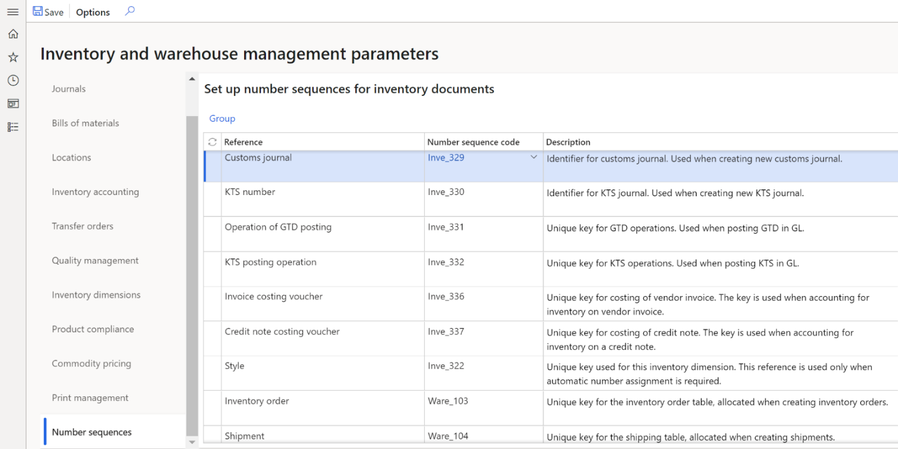

## Set up an inventory profile and GTD number

1. Go to **Product information management** \> **Setup** \> **Dimension and variant groups** \> **Tracking dimension groups**.
2. Create and set up a customs declaration number. For more information, see [Customs declaration numbers](rus-custom-declaration-number.md#set-up-customs-declaration-numbers-in-tracking-dimensions). 
3. On the **Tracking dimensions** FastTab, select the following checkboxes to activate the inventory profile and the GTD number:

    - On the **Inventory profile** line, select the **Active** and **Coverage plan by dimension** checkboxes.
    - On the **GTD number** line, select the **Active**, **Blank receipt allowed**, **Blank issue allowed**, and **Physical inventory** checkboxes.

4. On the Action Pane, select **Save**.

    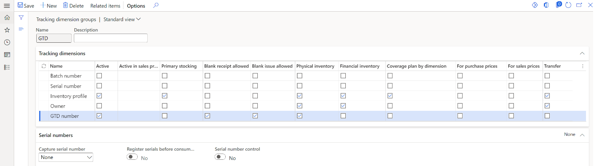

## Set up ledger posting groups

1. Go to **Tax** \> **Setup** \> **Sales tax** \> **Ledger posting groups**.
2. Create a ledger posting group for each of the following types of customs duties and fees:

    - Customs duty for import
    - Customs duty for export
    - Customs fee for escort
    - Customs fee for storage
    - Customs fee for export issuance
    - Customs fee for import issuance

3. In the **Sales tax receivable** field, select an expense account for the type of tax.

    For example, for customs duty for import, customs duty for export, or customs fee for escort, select account **91** together with subaccounts. For customs fee for storage, customs fee for export issuance, or customs fee for import issuance, select account **44** together with subaccounts.

    > [!NOTE]
    > For import deliveries, the configured account is used only if duties and fees aren't included in the cost of the product.

4. On the Action Pane, select **Save**. The following table shows the value of the **Sales tax receivable** field for each ledger posting group.

    | Ledger posting group            | Sales tax receivable value |
    |---------------------------------|----------------------------|
    | Customs duty for import         | 91                         |
    | Customs duty for export         | 91                         |
    | Customs fee for escort          | 91                         |
    | Customs fee for storage         | 44                         |
    | Customs fee for export issuance | 44                         |
    | Customs fee for import issuance | 44                         |

### Set up a fixed unit

To calculate customs payments for the **Weight** or **Volume** calculation method, set up fixed units by following these steps.

1. Go to **Organization administration** \> **Setup** \> **Units** \> **Units**.
2. Create a unit. For more information, see [Manage units of measure](../../../supply-chain/pim/tasks/manage-unit-measure.md).
3. On the **General** FastTab, in the **Classification** section, in the **Unit class** field, select the quantity, volume, or weight indicator.
4. In the **Roles** section, set the **System unit** option to **Yes**.
5. On the Action Pane, select **Save**.

    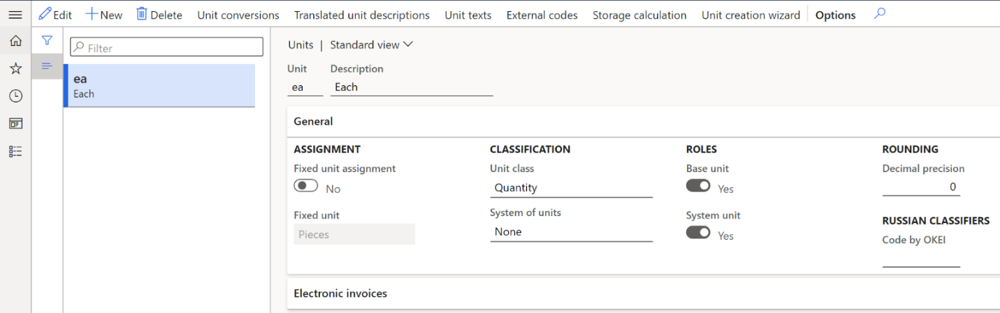

### Set up sales tax codes

Follow these steps to set up a sales tax code that can be used to automatically calculate customs payments.

1. Go to **Tax** \> **Indirect taxes** \> **Sales tax** \> **Sales tax codes**.
2. Create and set up a sales tax code. For more information, see [Set up sales tax codes](../../general-ledger/tasks/set-up-sales-tax-codes.md).
3. In the **Type of tax** field, select **Customs duty** or **Customs fee**.
4. On the **General** FastTab, in the **Ledger posting group** field, select the ledger posting group that you created earlier.
5. If you selected **Customs fee** in the **Type of tax** field, follow these steps:

    1. On the **Calculation** FastTab, in the **Origin** field, select **Amount per unit**.
    2. In the **Unit** field, select the unit value.
    3. On the **General** FastTab, in the **Fee type** field, select the type of customs fee.

        > [!NOTE]
        > You can create only one sales tax code for the **Export issuance** and **Import issuance** fee types.

    4. Optional: For the **Escort** and **Storage** fee types, on the Action Pane, select **Sales tax code** \> **Limits**, and configure limits for the escort or volume of stored products.
    5. On the Action Pane, select **Save**. Then close the page.

       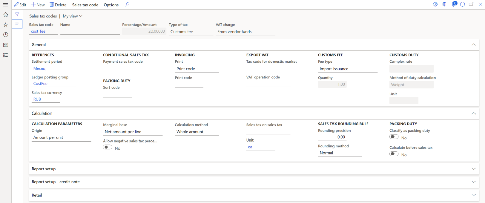

    –or–

    If you selected **Customs duty** in the **Type of tax** field, follow these steps:

    1. On the **General** FastTab, in the **Complex rate** field, select the complex rate value that is applied to the customs duty:

        - If you leave this field blank, the complex rate value is an *ad valorem* duty and is calculated as a percentage of the customs value of the products. In this case, the distribution of the duty on the lines in the section of the customs journal is proportional to the value.
        - If you select **Maximum**, the rate is determined by comparing the calculated value of the customs duty (from the customs value) with the result of the formula *K* = (*r* &times; *m*) &divide; *q*, where *r* is the value of the **Amount rate** field, *m* is the quantity, weight, or volume in the customs journal, based on the **Method of duty calculation** field, and *q* is the value of the **Calculated quantity** field. The larger of the two values is used as the duty value. In this case, the distribution of the duty on the lines in the section of the customs journal is based on the value of the **Method of duty calculation** field.
        - If you select **Summation**, the calculated value of the customs duty (from the customs value) is added to the result of the formula *K* = (*r* &times; *m*) &divide; *q*, where *r* is the value of the **Amount rate** field, *m* is the quantity, weight, or volume in the customs journal, based on the **Method of duty calculation** field, and *q* is the value of the **Calculated quantity** field. In this case, the distribution of the duty on the lines in the section of the customs journal is proportional to the value.

    2. If you selected a value in the **Complex rate** field, set the following fields:

        - In the **Method of duty calculation** field, select the method that is used to calculate the customs duty.
        - In the **Unit** field, select the unit of measurement that the value of the **Amount rate** field is measured in.

    3. On the Action Pane, select **Sales tax code** \> **Values**.
    4. In the **Amount rate** field, enter the amount for a specific rate of customs duty that is defined by the customs authorities.
    5. In the **Currency** field, select the currency that is used for the calculation of customs duty.
    6. In the **Calculated quantity** field, enter the quantity of products for the customs duty rate.
    7. On the Action Pane, select **Save**.

## Set up an inventory profile

1. Go to **Inventory management** \> **Setup** \> **Dimensions** \> **Inventory profiles**.
2. Create and set up an inventory profile.
3. On the **Setup** FastTab, in the **Kind of activity** field, select **Basic**.
4. On the Action Pane, select **Save**.

    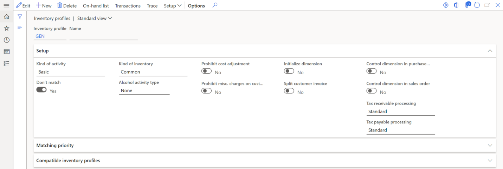

## Set up the terms of delivery for customs clearance of products

Follow these steps to set up the terms of delivery for the customs clearance of imported products. These terms of delivery determine the time of the transfer of ownership and the overhead expenses.

1. Go to **Accounts payable** \> **Setup** \> **Terms of delivery**.

    –or–

    Go to **Procurement and sourcing** \> **Setup** \> **Distribution** \> **Terms of delivery**.

    –or–

    Go to **Sales and marketing** \> **Setup** \> **Distribution** \> **Terms of delivery**.

2. Create and set up a set of terms of delivery.
3. On the **General** FastTab, in the **Receipt transactions status** field, select the status of the receipt transactions that are included in the customs journal of import:

    - **Purchased** – The products in transit are purchased. The transfer of ownership occurs before the products cross the customs border.
    - **On order** – The products in transit are ordered but not purchased. The transfer of ownership occurs after the products cross the customs border.

4. In the **Inventory profile** field, select the inventory profile that is used for inventory transactions after the customs cargo declaration is issued. This field is available only if you selected **Purchased** in the **Receipt transactions status** field.

    > [!NOTE]
    > The inventory profile must have a **Basic** activity.

5. On the Action Pane, select **Save**.

    

## Set up a charges code for customs payments

For imported purchases, if the transfer of ownership occurred after the customs clearance process, the amounts of customs duties and fees adjust the purchase amount. The invoice lines for duties and fees are automatically created when the customs journal or KTS journal is posted.

If the transfer of ownership occurred before the products crossed the customs border, the change in the cost of receipt is made by correcting the overhead expenses for the purchase order invoice when the customs journal or KTS journal is posted.

The cost adjustment is made if the **Include to the cost** option is set to **Yes** on the customs journal header or in the KTS journal. Otherwise, the amount of fees and duties will be charged as expenses to the account that is set up in the posting group of the corresponding tax code.

Follow these steps to set up a charges code that is used to calculate customs payments for import and export operations.

1. Go to **Accounts payable** \> **Charges** **setup** \> **Charges code**.
2. Create and set up a charges code. For more information, see [Create charges codes](/dynamicsax-2012/appuser-itpro/create-charges-codes).
3. In the **Customs payment type** field, select the type of customs payment to establish compliance with the overhead expense.

    > [!NOTE]
    > Charges codes where the **Customs payment type** field is set aren't available for manual selection when you create a purchase order.

4. On the **Posting** FastTab, in the **Debit** section, in the **Type** field, select **Item**. Alternatively, in the **Credit** section, in the **Type** field, select **Ledger account**.
5. In the **Credit** section, set the following fields:

    - In the **Posting** field, select the appropriate posting type. For example, select **Purchase charges duty** for duty.
    - In the **Account** field, select the account that is used as a transit account if the transfer of ownership occurs after the customs clearance process. In this case, the invoice is posted in two iterations: it's posted to the transit account when the customs journal or KTS journal is posted, and it's posted to the nomenclature account when the purchase order invoice is posted.

6. On the Action Pane, select **Save**.

    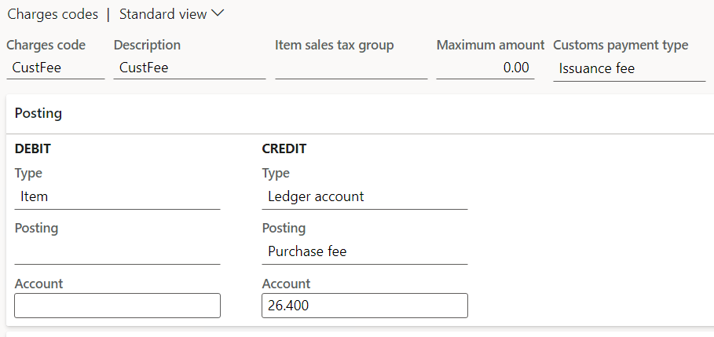

## Assign a charges code to terms of delivery

Follow these steps to relate the terms of delivery to overhead expenses that increase the transaction amount (the cost of imported products).

1. Go to **Inventory management** > **Setup** > **Custom payments** > **Misc. charges relation with terms of delivery**.
2. On the Action Pane, select **New**.
3. In the **Charges code** field, select the charges code that is used when customs payments are calculated for the specified delivery condition. The amount of the overhead expense is automatically added to the invoice value when customs payments are calculated.
4. In the **Delivery terms** field, select a set of terms of delivery for the charges code.

    > [!NOTE]
    > After the customs journal is processed, you can't distribute expenses to customs journal purchase lines or invoice overhead expense lines where the delivery condition corresponds to the delivery conditions on the customs journal header. This restriction exists because those overhead expenses affect the basis for calculating customs payments.

## Set up a product

1. Go to **Product information management** \> **Products** \> **Released products**.
2. Create and set up a product if necessary.

    > [!NOTE]
    > On the **Manage inventory** FastTab, in the **Weight measurements** and **Physical dimensions** sections, specify the volume and weight characteristics of the product to distribute customs payments to the lines of the customs journal.

3. In the **Tracking dimension group** field, select a GTD group that you created earlier.
4. In the **Units of measures** section, in the **Inventory unit**, **Purchase unit**, and **Sales unit** fields, select a unit that you set up earlier.
5. Select **OK**.
6. On the **General** FastTab, in the **Charges** section, in the **Charges code** field, select a charges code for transportation. This field is available only for services.

## Set up a customs counteragent 

Set up a vendor account as a customs authority or a customs broker. You can also set up a customs office code and a posting profile that is used to calculate customs payments. This information is included in customs declarations that are submitted to the customs authority. The codes for the customs offices are defined in the Customs Code of the Russian Federation.

1. Go to **Inventory management** \> **Setup** \> **Custom payments** \> **Customs counteragents**.
2. On the Action Pane, select **New**. 
3. In the **Counteragent account** field, select a vendor account number as the counteragent account number.
4. In the **Counteragent type** field, select the type of counteragent:

    - **Custom authority** – The counteragent can't act as a customs counteragent. The debt on customs payments will be added to customs. The contract must be a type with customs.
    - **Custom broker** – The counteragent acts as a customs counteragent. When you create a customs journal, you can select its contract as a contract with a customs counteragent. In this case, the debt on customs payments will be added to the customs broker.

5. In the **Description** field, enter a brief description of the customs counteragent.
6. In the **Posting profile** field, select the posting profile that is used to calculate the customs payments.
7. In the **Acquit method** field, select the acquit method for the customs services that are provided. The acquit method determines the counteragent that the debt on customs payments and fees will be added to. This field is available only if you selected **Custom broker** in the **Counteragent type** field.

    > [!NOTE]
    > If you select **Broker or customs** in the **Acquit method** field, the debt on customs payments is added to the customs broker or to customs, depending on your selection when you create the customs journal.

8. On the Action Pane, select **Save**.
9. If you selected **Custom authority** in the **Counteragent type** field, follow these steps to set up a customs office code:

    1. On the Action Pane, select **Customs offices**.
    2. On the Action Pane, select **New**.
    3. In the **Customs office code** field, enter an eight-digit code.
    4. On the Action Pane, select **Save**.

The following buttons are available on the Action Pane:

- **Indicative prices** – Set up indicative or estimated prices for a TN VED code.
- **Item relation with TN VED** – Assign a product to a TN VED code.

## Set up TN VED codes

1. Go to **Inventory management** \> **Setup** \> **Custom payments** \> **TN VED codes**.
2. On the Action Pane, select **New**.
3. Select the **Blocked** checkbox to indicate that the selected TN VED code is blocked. Only non-blocked TN VED codes can be associated with a customs payment or an indicative price.
4. In the **TN VED code** field, enter the identifier of a TN VED code. The TN VED code must have 10 characters. TN VED codes are defined in Russian customs legislation documents.
5. In the **Name** field, enter the name of the TN VED code.
6. In the **Description** field, enter a short description for the TN VED code.

The following buttons are available on the Action Pane:

- **Indicative prices** – Set up indicative or estimated prices for a TN VED code.
- **Item relation with TN VED** – Assign a product to a TN VED code.
- **Customs payments relation with TN VED** – Assign a TN VED code to a customs payment.

    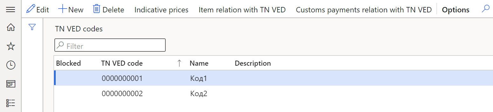

## Set up an item relation with a TN VED code

To make customs declarations reflect the product details when a TN VED code is used, assign a product to a TN VED code.

1. Go to **Inventory management** \> **Setup** \> **Custom payments** \> **Item relation with TN VED**.
2. On the Action Pane, select **New**.
3. In the **From date** field, select the start date of the association between the TN VED code and the product.
4. In the **Action date** field, select the action date for the product that is assigned to a TN VED code.
5. In the **Customs code** field, select the identification code of the customs counteragent. If you leave this field blank, the product relation applies to all customs posts.
6. In the **TN VED code** field, select a TN VED code for the product.
7. In the **Item number** field, select the product number that is assigned to a TN VED code. The product number is set up on the **Released product  details** page.

    The **Product name** field is automatically set to the identification code of the product that is related to the TN VED code.

    If the **Customs code** field is set (that is, it isn't blank), the **Customs name** field is automatically set to the name of the counteragent.

    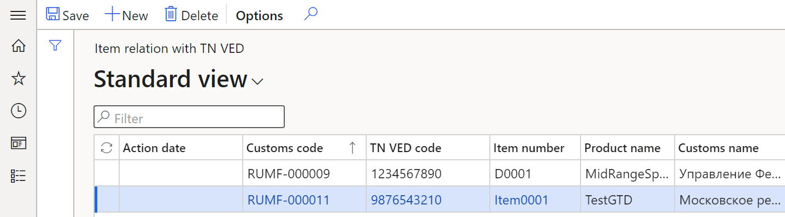

## Set up indicative prices

Follow these steps to set up indicative prices that are determined by customs authorities for customs clearance of products in addition to the transaction (invoice) value.

1. Go to **Inventory management** \> **Setup** \> **Custom payments** \> **Indicative prices of TN VED**.
2. On the Action Pane, select **New**.
3. In the **Description** field, enter the description of the indicative price.
4. In the **From date** field, select the activation date of the indicative price for the import or export of products.

    The **Customs code** field is automatically set to the customs counteragent code that the indicative price is selected for. If this field is blank, the indicative price applies to all customs posts.

    The **Customs name** field is automatically set to the name of the counteragent.

5. In the **TN VED code** field, select the TN VED code that the indicative price is selected for. Only non-blocked TN VED codes are available for selection.
6. In the **Price for import** and **Price for export** fields, enter the indicative prices for import and export.
7. In the **Currency** field, select the currency code for the indicative price.
8. In the **Quantity** field, enter the quantity of products for the import and export prices.
9. In the **Unit** field, select the type of unit for the indicative price.
10. On the Action Pane, select **Save**.
11. To correct indicative prices, follow these steps:

    1. On the Action Pane, select **Change**.
    2. In the **Change of settings** dialog box, you can change the following fields: **From date**, **Price for import**, **Price for export**, **Currency**, **Quantity**, **Unit**.
    3. Select **OK**. The changes that you made are applied to all selected lines.

    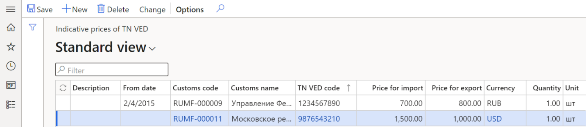

## Set up a customs payment relation with a TN VED code

1. Go to **Inventory management** \> **Setup** \> **Custom payments** \> **TN VED code relation with customs payment**.
2. On the Action Pane, select **New**.
3. In the **From date** field, select the start date of the association between the TN VED code and the customs payment that is calculated based on the customs duty and fees.
4. In the **TN VED code** field, select the TN VED code to associate with the customs payment. Only non-blocked TN VED codes are available for selection.
5. In the **Direction** field, select the direction of the product movement.

    > [!NOTE]
    > When it searches for the configuration line, the system determines the record by the type of the journal (**Import** or **Export**). If there are no values for the corresponding type, the setting that uses the **All** type is used.

6. In the **VAT** field, select the tax code of the **Standard VAT**, **Reduced VAT**, or **VAT 0%** tax type. This field isn't available for the **Export** direction.
7. In the **Excise** field, select the sales tax code that is used to calculate excise duty. This field isn't available for the **Export** direction.
8. In the **Customs duty** field, select the sales tax code that is used to calculate customs duty.
9. Optional: In the **Country/region** field, enter the code for the payment's country or region of origin.
10. On the Action Pane, select **Save**.

    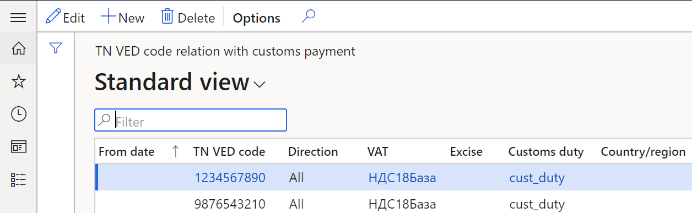

## Set up a vendor as a foreign counteragent

Before you create a customs journal for the import operation, follow these steps to set up a vendor as a foreign counteragent, so that the vendor can transfer products that must be imported.

1. Go to **Accounts payable** \> **Vendors** \> **All vendors**.
2. Create and set up a vendor account if necessary.
3. On the **Action Pane**, select **Edit**. 
4. In the **Vendor account** field, select the vendor account.
5. On the **General** FastTab, in the **Identification** section, set the **Foreign counteragent** option to **Yes**.
6. On the **Invoice and delivery** FastTab, in the **Delivery** section, in the **Delivery terms** field, select a set of terms of delivery that you created earlier.
7. On the Action Pane, select **Save**. 

## Set up a customer as a foreign counteragent

Before you create a customs journal for the export operation, follow these steps to set up a customer as a foreign counteragent, so that the customer can receive products that must be exported.

1. Go to **Accounts receivable** \> **Customers** \> **All customers**.
2. Create and set up a customer account if necessary.
3. On the Action Pane, select **Edit**. 
4. In the **Account** field, select the customer account.
5. On the **General** FastTab, in the **Customer** section, set the **Foreign counteragent** option to **Yes**.
6. On the **Invoice and delivery** FastTab, in the **Delivery** section, in the **Delivery terms** field, select a set of terms of delivery that you created earlier.
7. On the Action Pane, select **Save**. 

## Create and set up a warehouse to calculate customs payments

For import deliveries of products, the transfer of ownership might occur before the customs clearance process is completed. Follow these steps to automatically move a product from the warehouse for products in transit to a customs warehouse.

1. Go to **Inventory management** \> **Setup** \> **Inventory breakdown** \> **Warehouses**.
2. Create and set up a warehouse if necessary.
3. On the **General** FastTab, in the **Customs** section, in the **Customs code** field, select the code of the customs counteragent for the customs office that the warehouse is associated with.
4. On the Action Pane, select **Save**.

    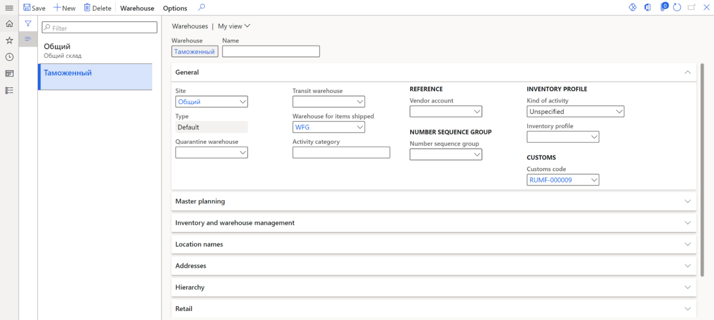
