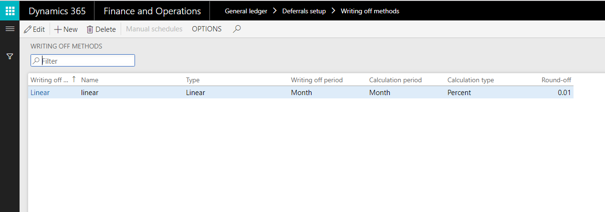
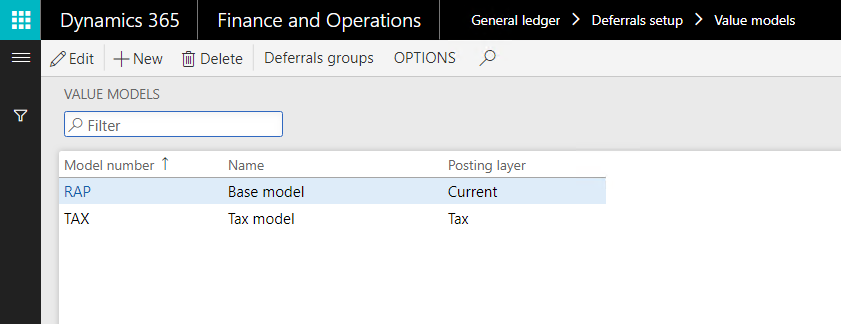
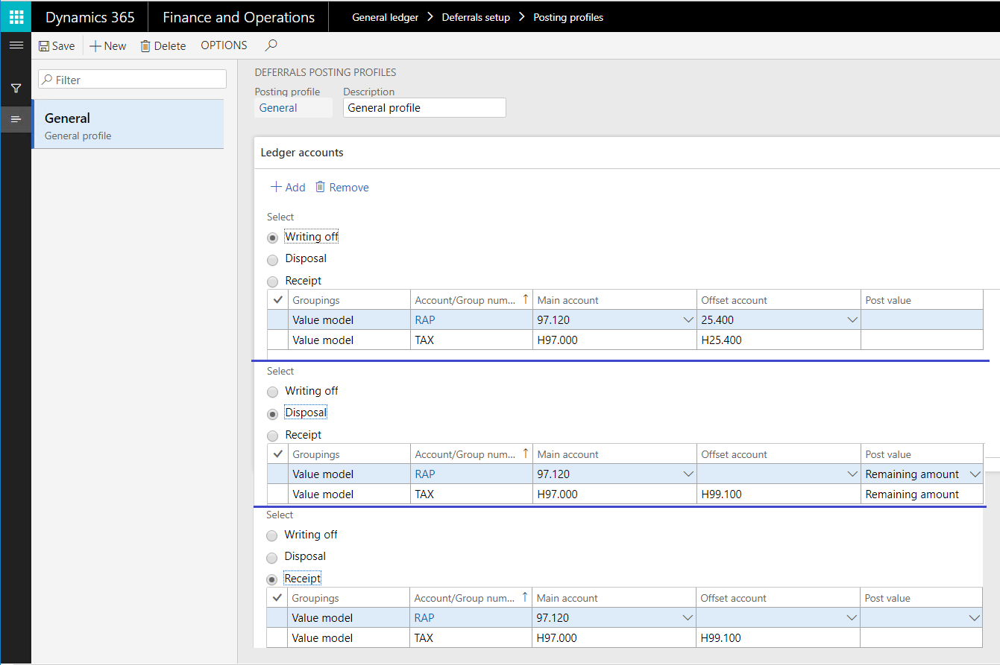
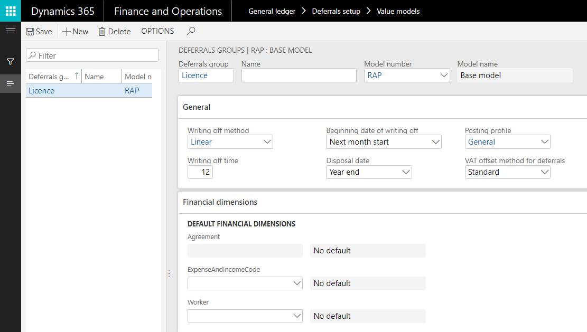
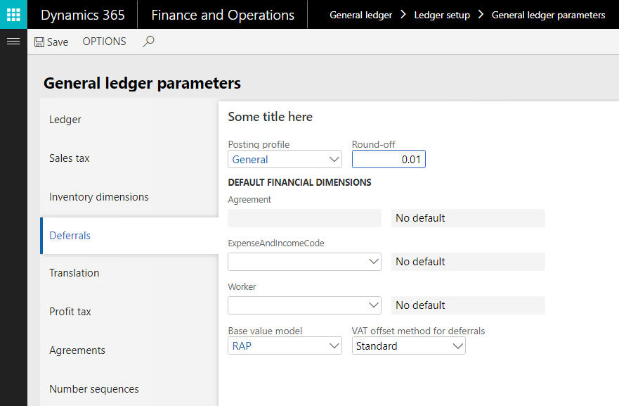
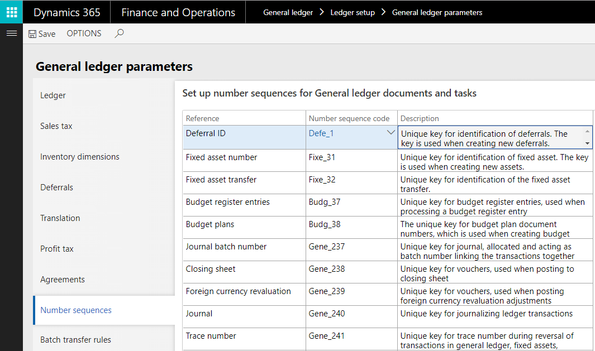
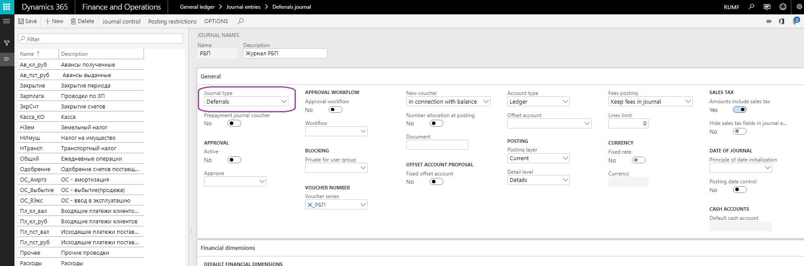

# Set up deferrals (Russia)

[!include [banner](../../includes/banner.md)]

Deferrals are expense types that are stored differently in general accounting principles and tax accounting principles. To use the deferral functionality, you must complete the following setup:

- [Write-off methods](#write-off-methods)
- [Value models](#value-models)
- [Posting profiles](#posting-profiles)
- [Sequence of calculation](#sequence-of-calculation)
- [Deferrals groups](#deferrals-groups)
- [General ledger parameters](#general-ledger-parameters)
- [Deferrals](#deferrals)

## Write-off methods

Follow these steps to create write-off methods for deferred expenses.

1. Go to **General ledger** \> **Deferrals setup** \> **Writing off methods**.
2. On the Action Pane, select **New** to create a write-off method for deferred expenses.

    The following table describes the fields on the **Writing off methods** page.

    <table>
    <thead>
    <tr>
    <th>Field</th>
    <th>Description</th>
    </tr>
    </thead>
    <tbody>
    <tr>
    <td>Writing off method</td>
    <td>Enter the code for the write-off method.</td>
    </tr>
    <tr>
    <td>Name</td>
    <td>Enter a description of the write-off method.</td>
    </tr>
    <tr>
    <td>Type</td>
    <td>Select the type of write-off:
    <ul>
    <li><strong>Linear</strong> – Evenly divide the write-off amount across all intervals in the defined period.</li>
    <li><strong>Manual</strong> – Manually enter either a percentage of the total or the amount to write off in each period, depending on the calculation type that you select in the <strong>Calculation type</strong> field. On the <strong>Manual schedules</strong> page, you can set up a different percentage for each write-off period. On the <strong>Writing off sum</strong> page, you can set up a different amount for each write-off period.</li>
    <li><strong>Linear with factor</strong> – Multiply the calculated result by a calculated factor.</li>
    </ul>
    </td>
    </tr>
    <tr>
    <td>Writing off period</td>
    <td>Select the write-off period for the deferred expense:
    <ul>
    <li>Month</li>
    <li>Quarter</li>
    <li>Half-Yearly</li>
    <li>Years</li>
    </ul>
    </td>
    </tr>
    <tr>
    <td>Calculation period</td>
    <td>Select the calculation period for the deferred expense:
    <ul>
    <li><strong>Month</strong> – The deferrals write-off calculation is done proportionately over the number of months in the given period.</li>
    <li><strong>Day</strong> – The deferrals write-off calculation is done proportionately over the number of days in the given period. This option lets you calculate the deferred expense write-off amount for an incomplete reporting period, based on the number of calendar days in the period.</li>
    <li><strong>Period</strong> – The calculation is done proportionately for the number of periods that are defined in the <strong>Writing off period</strong> field.</li>
    </ul>
    </td>
    </tr>
    <tr>
    <td>Calculation type</td>
    <td>If you selected <strong>Manual</strong> in the <strong>Type</strong> field, select the calculation type for the manual write-off:
    <ul>
    <li><strong>Percent</strong> – A percentage of the total is written off in each period. You manually enter this percentage on the <strong>Manual schedules</strong> page.</li>
    <li><strong>Amount</strong> – An amount is written off. On the <strong>Writing off sum</strong> page, you can set up a separate amount for each write-off period.</li>
    </ul>
    </td>
    </tr>
    <tr>
    <td>Round-off</td>
    <td>Enter the round-off value for the deferred expense write-off amount.</td>
    </tr>
    </tbody>
    </table>

3. If you selected **Manual** in the **Type** field and **Amount** in the **Calculation type** field, on the Action Pane, select **Manual schedules** to create write-off schedules.

## Value models

1. Go to **General ledger** \> **Deferrals setup** \> **Value models**.
2. On the Action Pane, select **New** to create value models for deferrals accounting.

    The following table describes the fields on the **Value models** page.

    | Field         | Description                                               |
    |---------------|-----------------------------------------------------------|
    | Model number  | Enter the deferrals model to associate with the deferral. |
    | Name          | Enter a name for value model.                             |
    | Posting layer | Select a posting layer for the value model.               |

3. On the Action Pane, select **Deferrals groups** to set up deferrals groups that are related to the selected value model.

## Posting profiles

1. Go to **General ledger** \> **Deferrals setup** \> **Posting profiles**.
2. On the Action Pane, select **New** to create posting profiles for deferred expenses.

    The following table describes the fields on the **Deferrals posting profiles** page.

    <table>
    <thead>
    <tr>
    <th>Field</th>
    <th>Description</th>
    </tr>
    </thead>
    <tbody>
    <tr>
    <td>Posting profile</td>
    <td>Enter a name for the posting profile.</td>
    </tr>
    <tr>
    <td>Description</td>
    <td>Enter a description of the posting profile.</td>
    </tr>
    <tr>
    <td>Writing off</td>
    <td>Select this option to set up ledger accounts that are used to write off the value of the asset.</td>
    </tr>
    <tr>
    <td>Disposal</td>
    <td>Select this option to set up ledger accounts that are used to dispose of the asset.</td>
    </tr>
    <tr>
    <td>Receipt</td>
    <td>Select this option to set up ledger accounts that are used to post receipt transactions for deferrals.</td>
    </tr>
    <tr>
    <td>Groupings</td>
    <td>Select the grouping method for the deferred expense profile:
    <ul>
    <li><strong>All</strong> – The <strong>Main account</strong> and <strong>Offset account</strong> fields are applicable to all deferrals.</li>
    <li><strong>Value model</strong> – The <strong>Main account</strong> and <strong>Offset account</strong> fields are applicable to the value model that is selected in the <strong>Account/Group number</strong> field.</li>
    <li><strong>Group</strong> – The <strong>Main account</strong> and <strong>Offset account</strong> fields are applicable to the deferrals group that is selected in the <strong>Account/Group number</strong> field.</li>
    <li><strong>Table</strong> – The <strong>Main account</strong> and <strong>Offset account</strong> fields are applicable to the deferral that is selected in the <strong>Account/Group number</strong> field.</li>
    </ul>
    </td>
    </tr>
    <tr>
    <td>Account/Group number</td>
    <td>Select a value model, deferrals group, or deferral, depending on the value that you selected in the <strong>Groupings</strong> field.</td>
    </tr>
    <tr>
    <td>Main account</td>
    <td>Select the main account for write-off posting or deferred expense disposal.</td>
    </tr>
    <tr>
    <td>Offset account</td>
    <td>Select the offset account for write-off posting or deferred expense disposal.</td>
    </tr>
    <tr>
    <td>Post value</td>
    <td>Select the value to post:
    <ul>
    <li>Remaining amount</li>
    <li>Initial amount</li>
    <li>Amount written off</li>
    </ul>
    
<strong>Note:</strong> This field is available only if you select the <strong>Disposal</strong> option.

    </td>
    </tr>
    </tbody>
    </table>

## Deferrals groups

1. Go to **General ledger** \> **Deferrals** \> **Deferrals groups**.
2. On the Action Pane, select **New** to create groups for deferred expenses.

    The following table describes the fields on the **Deferrals groups** page.

    <table>
    <thead>
    <tr>
    <th>Field</th>
    <th>Description</th>
    </tr>
    </thead>
    <tbody>
    <tr>
    <td>Deferrals group</td>
    <td>Enter the identification code for the deferrals group.</td>
    </tr>
    <tr>
    <td>Name</td>
    <td>Enter the name of the deferrals group.</td>
    </tr>
    <tr>
    <td>Model number</td>
    <td>Select the deferral model number.</td>
    </tr>
    <tr>
    <td>Model name</td>
    <td>The name of the value model.</td>
    </tr>
    <tr>
    <td>Writing off method</td>
    <td>Select the write-off method for the deferrals.</td>
    </tr>
    <tr>
    <td>Writing off time</td>
    <td>Enter the write-off period for the deferrals.</td>
    </tr>
    <tr>
    <td>Beginning date of writing off</td>
    <td>Select the start date for the write-off.</td>
    </tr>
    <tr>
    <td>Disposal date</td>
    <td>Select the date of disposal.</td>
    </tr>
    <tr>
    <td>Posting profile</td>
    <td>Select the posting profile for the transactions.</td>
    </tr>
    <tr>
    <td>VAT offset method for deferrals</td>
    <td>Select the value-added tax (VAT) deduction method for deferrals:
    <ul>
    <li><strong>Standard</strong> – Use the standard VAT deduction method to process incoming VAT for factures that are related to deferrals.</li>
    <li><strong>Proportionate</strong> – Use the proportional VAT deduction method to process incoming VAT for factures that are related to deferrals.</li>
    </ul>
    </td>
    </tr>
    </tbody>
    </table>

The deferrals group that is set up has a one-to-one (1:1) relation to value model that is related to the posting profiles setup.

## Sequence of calculation

You use the **Standard expenses sequence** and **Counter setup** pages to create calculation sequences that are used to create deferrals for vendor invoices.

> [!NOTE]
> Before you can set up the calculation sequence and counters, you must set up expense codes on the **Expense and income codes** page.

1. Go to **General ledger** \> **Deferrals setup** \> **Sequence of calculation**.
2. On the Action Pane, select **New** to set up revenue or expense calculation sequences.

    The following table describes the fields on the **Standard expenses sequence** page.

    | Field             | Description                                                             |
    |-------------------|-------------------------------------------------------------------------|
    | Sequence          | Enter the sequence number.                                              |
    | Description       | Enter a description of the calculation sequence.                        |
    | Channel           | Select the deferral output format for the calculation results.          |
    | Channel reference | Select the deferred expense group to record the calculation results to. If necessary, you can create deferrals for the bookkeeping accounting and tax accounting models at the same time by separating them with commas.|

    

3. On the Action Pane, select **Counters** to open the **Counter setup** page.
4. On the Action Pane, select **New** to create counters for the calculation sequence.

    The following table describes the fields on the **Counter setup** page.

    > [!NOTE]
    > You must select an expense code. When you use the periodic process to generate deferrals, the expense code that is specified for a counter is used to generate deferrals for vendor invoices that have the same expense code.

    <table>
    <thead>
    <tr>
    <th>Field</th>
    <th>Description</th>
    </tr>
    </thead>
    <tbody>
    <tr>
    <td>Sequence</td>
    <td>Select the calculation sequence code.</td>
    </tr>
    <tr>
    <td>Description</td>
    <td>Enter a name for the counter.</td>
    </tr>
    <tr>
    <td>Expense code</td>
    <td>Select an expense code.</td>
    </tr>
    <tr>
    <td>Description</td>
    <td>The description of the expense code.</td>
    </tr>
    <tr>
    <td>Line number</td>
    <td>Enter a unique line number.</td>
    </tr>
    <tr>
    <td>Operator</td>
    <td>Select the mathematical or logical operator for the calculation sequence:
    <ul>
    <li><strong>+ (plus sign)</strong> – Add the values in the range that is defined by the <strong>From</strong> and <strong>To</strong> fields for the line type that is selected in the <strong>Line type</strong> field. The resulting value is used for the calculation sequence.</li>
    <li><strong>– (minus sign)</strong> – Subtract the values in the range that is defined by the <strong>From</strong> and <strong>To</strong> fields for the line type that is selected in the <strong>Line type</strong> field. The resulting value is used for the calculation sequence.</li>
    <li><strong>* (asterisk)</strong> – Multiply the values in the range that is defined by the <strong>From</strong> and <strong>To</strong> fields for the line type that is selected in the <strong>Line type</strong> field. The resulting value is used for the calculation sequence.</li>
    <li><strong>/ (slash)</strong> – Divide the values in the range that is defined by the <strong>From</strong> and <strong>To</strong> fields for the line type that is selected in the <strong>Line type</strong> field. The resulting value is used for the calculation sequence.</li>
    <li><strong>Min</strong> – Use the minimum value in the range that is defined by the <strong>From</strong> and <strong>To</strong> fields for the line type that is selected in the <strong>Line type</strong> field for the calculation sequence.</li>
    <li><strong>Max</strong> – Use the maximum value in the range that is defined by the <strong>From</strong> and <strong>To</strong> fields for the line type that is selected in the <strong>Line type</strong> field for the calculation sequence.</li>
    </ul>
    </td>
    </tr>
    <tr>
    <td>Line type</td>
    <td>Select a line type.</td>
    </tr>
    <tr>
    <td>From</td>
    <td>Select the first value in the range of values that is used for the calculation sequence.</td>
    </tr>
    <tr>
    <td>To</td>
    <td>Select the last value in the range of values that is used for the calculation sequence.</td>
    </tr>
    <tr>
    <td>Register field</td>
    <td>Select the register field to use for the calculation sequence.
    
<strong>Note:</strong> This field is available only if you selected <strong>Register</strong> in the <strong>Channel</strong> field on the <strong>Standard expenses sequence</strong> page.

    </td>
    </tr>
    <tr>
    <td>Table field</td>
    <td>Select a table field.
    
<strong>Note:</strong> This field is available only if you selected <strong>Ratio</strong> in the <strong>Channel</strong> field on the <strong>Standard expenses sequence</strong> page.

    </td>
    </tr>
    <tr>
    <td>Field ID</td>
    <td>The identification number of the register field.</td>
    </tr>
    <tr>
    <td>Note</td>
    <td>Enter an optional comment about the counter setup.</td>
    </tr>
    </tbody>
    </table>

    
    
    If you want to create a sequence of calculations to generate a deferrals master record, on the last line, in the **Output** field, specify **Data output**. The value of this line is the amount of the generated deferral.
    
The following table provides detailed instructions about how to fill in the **From**, **To**, **Period types**, and **Index** fields depending on the value in the **Line type** field.
    
| Line type          | Description                                                                                                                                                                                                                                                                  |
|--------------------|------------------------------------------------------------------------------------------------------------------------------------------------------------------------------------------------------------------------------------------------------------------------------|
| Register           | Select a register in the **From** field or a range of registers in the **From** and **To** fields.                                                                                                                                                                         |
| Line type          | Select a line number in the **From** field.                                                                                                                                                                                                                                  |
| Rates              | Select a rate code in the **From** field.                                                                                                                                                                                                                                    |
| Constant           | Enter a constant in the **From** field.                                                                                                                                                                                                                                      |
| Price              | The price from the source document that is generated in the transaction will be selected. The **From** and **To** fields are not editable.                                                                                                                        |
| Quantity           | The transaction will be selected from the quantity in the generated source document.                                                                                                                                                                                       |
| Expense            | Select a range of expense or income codes in the **From** and **To**   fields to calculate the amount of expenses and income. The range can consist   of a single code.                                                                                                      |
| Debit activity     | Select a range of accounts in the **From** and **To** fields on which the amount of debit activity will be calculated. The amount will be calculated   for the period defined in the **Period** types and **Index** fields. The   range can consist of a single account.   |
| Credit activity    | Select a range of accounts in the **From** and **To** fields on which the amount of credit activity will be calculated. The amount will be calculated   for the period defined in the **Period types** and **Index** fields. The range can consist of a single account. |
| Debit balance      | Select a range of accounts in the **From** and **To** fields on which the   amount of debit balance will be calculated. The amount will be calculated for   the period defined in the **Period types**  and **Index** fields. The range can consist of a single account.   |
| Credit balance     | Select a range of accounts in the **From** and **To** fields on which the   amount of credit balance will be calculated. The amount will be calculated   for the period defined in the **Period types** and **Index** fields. The   range can consist of a single account.   |
| Deferral write-off | Select a deferrals group in the **From** field to calculate the planned   write-off of deferrals in the current period.                                                                                                                                                      |

5. To copy the counter settings from one calculation sequence to another, on the Action Pane, select **Copy counter** to open the **Copy aisle** dialog box.

    The following table describes the fields in the **Copy aisle** dialog box.

    | Field                                       | Description                                                |
    |---------------------------------------------|------------------------------------------------------------|
    | Sequence (in the **Copy from** section)     | Select the sequence to copy the counter settings from.     |
    | Expense code (in the **Copy from** section) | Select the expense code to copy the counter settings from. |
    | Sequence (in the **Copy to** section)       | Select the sequence to copy the counter settings to.       |
    | Expense code (in the **Copy to** section)   | Select the expense code to copy the counter settings to.   |

## General ledger parameters

1. Go to **General ledger** \> **Ledger setup** \> **General ledger parameters**.
2. On the **Deferrals** tab, set the fields by using the information in the following table.

    | Field                           | Description |
    |---------------------------------|-------------|
    | Posting profile                 | Select the posting profile that is used by default. The posting profile is automatically shown on the deferral voucher when it's registered. |
    | Round-off                       | Define the default round-off amount for the deferral write-off methods. For example, if you enter **0.01**, values are rounded to two decimal places. |
    | Expense and income code         | Select default expense and income codes. |
    | Worker                          | Select a default worker. |
    | Base value model                | Select a default value model. |
    | VAT offset method for deferrals | Select a default VAT offset method for deferrals. |

    

3. On the **Number sequences** tab, in the **Number sequence code** field, select the number sequence code for the **Deferral ID** reference.

    

4. Go to **General ledger** \> **Journal setup** \> **Journal names**.
5. On the Action Pane, select **New** to create a journal of the **Deferrals** type to work with deferrals.
6. In the **Name** field, enter the name of the journal.
7. In the **Description** field, enter a short description of the journal.
8. In the **Journal type** field, select **Deferrals**.
9. In the **Voucher series** field, select the number sequence that is used for voucher numbering.

    

## Deferrals

Deferrals can be created manually, or they can be automatically generated by using a periodic operation. For more information about how to create a deferral, see [Create or generate deferrals (Russia)](rus-create-generate-deferrals.md).

1. Go to **General ledger** \> **Deferrals** \> **Deferrals**.
2. You can use the **Deferrals** page to manually create deferrals, or to review and work with deferrals.

    The following table describes the fields on the **Deferrals** page.

    <table>
    <thead>
    <tr>
    <th>Field</th>
    <th>Description</th>
    </tr>
    </thead>
    <tbody>
    <tr>
    <td>Deferral ID</td>
    <td>The identification code for the deferral. This code is updated according to the configured number sequence.</td>
    </tr>
    <tr>
    <td>Name</td>
    <td>Enter a name for the deferral.</td>
    </tr>
    <tr>
    <td>Comment</td>
    <td>Enter a detailed description of the deferral.</td>
    </tr>
    <tr>
    <td>Date attached</td>
    <td>Select the creation date of the deferral.</td>
    </tr>
    <tr>
    <td>Table name</td>
    <td>The name of the table that provides the source data that is used to generate the deferral.</td>
    </tr>
    <tr>
    <td>Reference</td>
    <td>The identifier of the data table that provides the source data that is used to generate the deferral.</td>
    </tr>
    <tr>
    <td>Expense code</td>
    <td>Select the expense code for the deferral.</td>
    </tr>
    <tr>
    <td>VAT offset method for deferrals</td>
    <td>Select the VAT deduction method for deferrals:
    <ul>
    <li><strong>Standard</strong> – Process the incoming VAT for factures that are related to deferrals by using the standard VAT deduction method.</li>
    <li><strong>Proportionate</strong> – Process the incoming VAT for factures that are related to deferrals by using the proportional VAT deduction method.</li>
    </ul>
    </td>
    </tr>
    </tbody>
    </table>

    The following table describes the buttons on the Action Pane of the **Deferrals** page.

    | Button           | Description                                                             |
    |------------------|-------------------------------------------------------------------------|
    | Copy deferral    | Create a deferral that is identical to the selected deferral.           |
    | Deferrals models | Define deferrals models for the selected deferral.                      |
    | Source           | View the source that the deferral registration voucher is created from. |

[!INCLUDE[footer-include](../../../includes/footer-banner.md)]
