# Third party miscellaneous charges

[!include [banner](../../includes/banner.md)]

This article explains how to handle services that are purchased though a separate invoice as miscellaneous charges in Russia in Microsoft Dynamics 365 Finance.

The cost of these services can be included in the cost price of the purchased goods or written off as a cost, like the miscellaneous charges that are defined in the invoice for the purchase of goods. Additionally, the debt on these services can be redrawn to third parties, such as customers or vendors. In this case, a facture is created that won't be included in the sales book or purchase book.

You must purchase an item of the **Service** type to do the accounting as a miscellaneous charge that you will allocate later. You must also specify item-related parameters for the miscellaneous charges code.

There are three modes of miscellaneous charges allocation:

 - **Include to the cost price** – Allocate miscellaneous charges to other item invoices, so that the allocations can be included in an item's cost price. The allocation base is the invoice lines. The allocation causes the item's cost to be adjusted.
 - **Redraw debt** – Allocate miscellaneous charges to redraw debt to third parties. The allocation base is the counteragent (customer or vendor) that the debt is reissued on. The allocation causes the system to create invoices for payment and factures for the selected counteragent.
 - **Write-off to cost** – Allocate miscellaneous charges to the ledger account. The allocation base is the ledger account. The allocation causes the charges amount to be written off to the selected account.
 
## Setup

### Set up a charges code

To set up a charges code, follow these steps.

1. In Dynamics 365 Finance, go to **Accounts payable** \> **Charges setup** \> **Charges code**.
1. Select **New** to create a charges code.
1. In the **Charges code** field, enter a code for the charges.
1. In the **Description** field, enter a description of the charges.
1. Optional: In the **Item sales tax group** field, select an item sales tax group.
1. In the **Maximum amount** field, enter the maximum amount that's allowed for this charges code. This field is used to validate charges for vendor invoices.

    > [!NOTE]
    > To turn on the functionality for validating charges, on the **Accounts payable parameters** page, on the **Invoice validation** tab, set the **Enable invoice matching validation** option to **Yes**.

1. On the **Posting** FastTab, in the **Debit** section, in the **Type** field, select **Ledger account** to post the purchased service as a miscellaneous charge.
1. In the **Posting** field, select **Allocation** as the posting type for the debit account.
1. In the **Account** field, select the account number that the amount on the purchase order or invoice journal line should be debited to.
1. In the **Credit** section, in the **Type** field, select **Customer/Vendor**.
1. Select **Save**.

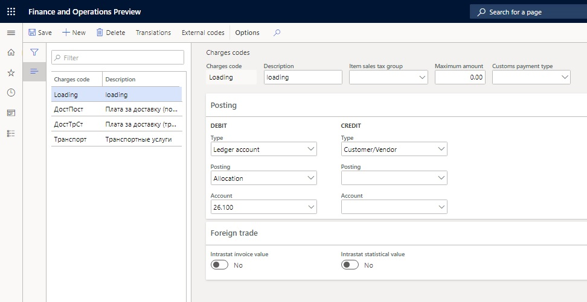
 
### Create a released product for a service item

To create a released product for a service item, follow these steps.

1. In Dynamics 365 Finance, go to **Product information management** \> **Products** \> **Released products** to open the **Released product details** page.
1. Create a product.
1. In the **Product type** field, select **Service**.
1. In the **Item model group** field, select the item model group for non-stocked items, and in the **Item group** field, select the item group for services.
1. In the **Tracking dimension group** field, select a dimension group.
1. In the **Charges code** field, select the charges code that you created earlier.

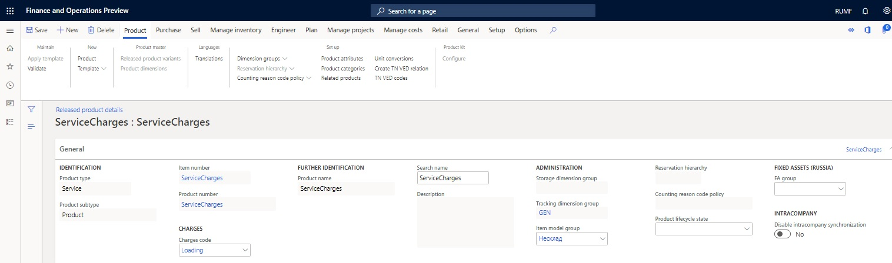
 
### Set up a sales tax group that has exempt tax codes

If you must redraw debt for services that are provided to a third party, you can create a facture for redrawn amounts that'sn't reflected in the purchase book or sales book. Set up the sales tax group so that it has the sales tax codes, and make sure that the **Exempt** checkboxes are selected. After you complete this setup, the system won't generate ledger transactions for tax. However, the appropriate tax rate must be specified for the sales tax codes, to help guarantee that the printed form of the reissued invoice will reflect the tax.

To set up a sales tax group that has exempt tax codes, follow these steps.

1. In Dynamics 365 Finance, go to **Tax** \> **Sales tax** \> **Sales tax** groups.
1. Create a sales tax group.
1. On the **Setup** FastTab, in the **Sales tax code** field, select the sales tax codes for all value-added tax (VAT) rates.
1. For each sales tax code, select the **Exempt** checkbox to indicate that sales tax isn't calculated.
1. Select **Save**.

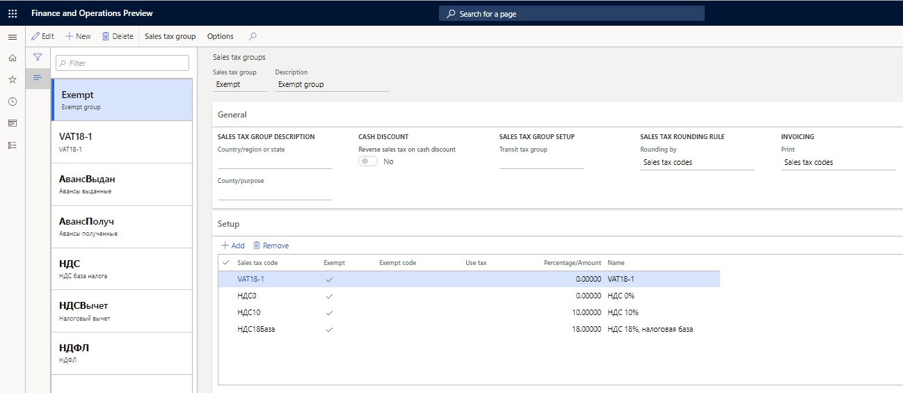
 
### Define a transit tax group for a sales tax group

The transit tax group is used in the invoice that's created during the redraw debt transaction.

To define a transit tax group for a sales tax group, follow these steps.

1. In Dynamics 365 Finance, go to **Tax** \> **Sales tax** \> **Sales tax groups**.
1. Create a sales tax group.
1. On the **General** FastTab, in the **Transit tax group** field, select the sales tax group that has an exempt tax code that's used to redraw the charges.
1. On the **Setup** FastTab, in the **Sales tax code** field, select the sales tax code.
1. Select **Save**.

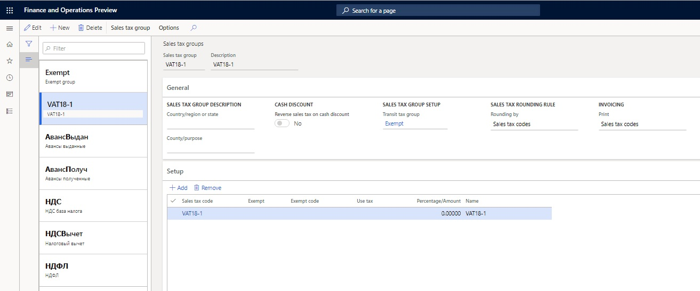
  
### Set up a transit account

The transit general ledger account is the account that will be credited when transactions are redrawn to the third party. You must set up the ledger account to redraw charges to third parties.

To set up a transit account, follow these steps.

1. In Dynamics 365 Finance, go to **Accounts payable** \> **Setup** \> **Accounts payable parameters**.
1. On the **General** tab, in the **Transit account** field, select the transit general ledger account to use during the redraw debt transaction.
1. On the **Number sequence** tab, in the **Number sequence code** field, select a number sequence code for the **Charges voucher**, **Allocation transaction**, **External vendor invoice**, and **Invoice for payment** references.

## Purchase services (charges) for allocation

You can purchase services for allocation either from the invoice journal or through a purchase order.

### Purchase services (charges) from the invoice journal

To purchase services (charges) from the invoice journal, follow these steps.

1. In Dynamics 365 Finance, go to **Accounts payable** \> **Invoices** \> **Invoice journal**.
1. Create an invoice journal.
1. Select **Lines**, and create a line.
1. On the **General** tab, in the **Sales tax** section, select a sales tax group and an item sales tax group.

    > [!NOTE]
    > If you redraw debt to third parties, you might want to select the sales tax group that has exempt tax codes.

1. In the **Charges** section, in the **Charges code** field, select the charges code that you created in the [Set up a charges code](#set-up-a-charges-code) section.
  
  
 
1. Specify other details, and then post the journal.

### Purchase services (charges) through a purchase order

To purchase services (charges) through a purchase order, follow these steps.

1. Create a purchase order.
1. On the purchase order lines, select the service that you created earlier.
1. On the **Setup** tab, in the **Sales tax** section, select an item sales tax group and the sales tax group that you created earlier.
  
    > [!NOTE]
    >  If you redraw debt to third parties, you might want to select the sales tax group that has exempt sales tax codes.

1. In the **Charges** section, in the **Charges code** field, verify that the charges code that you created earlier is selected.
1. In the **Posting** section, in the **Ledger account** field, verify that the debit account that you specified for the charges code that you created earlier is selected.
  
   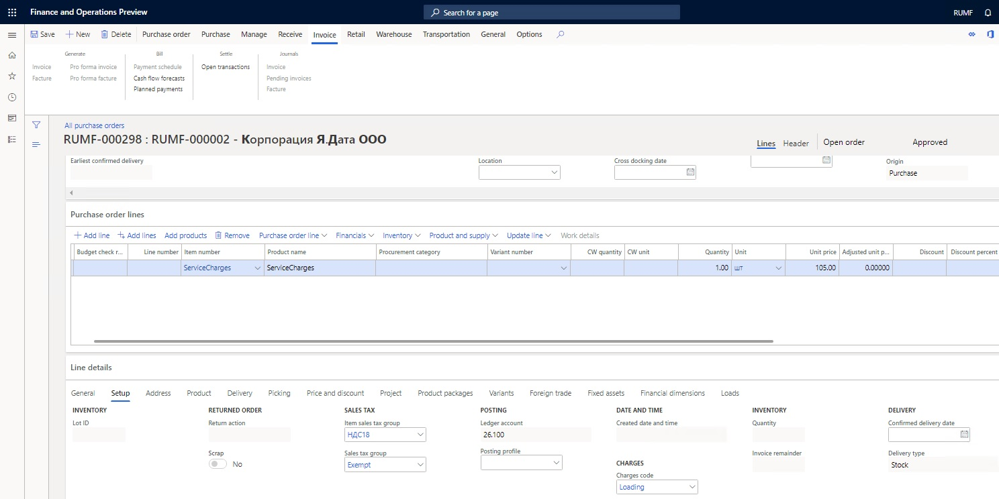
 
1. On the **Product** tab, in the **Inventory profile** field, select an inventory profile.

   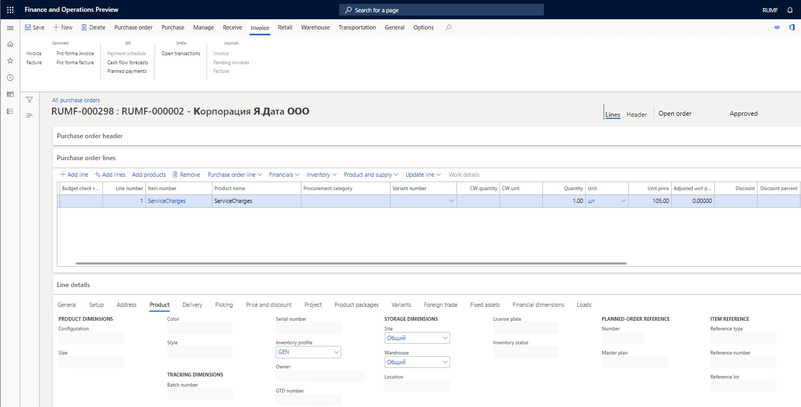

1. Specify other purchase order details, and post the invoice.

## Allocate charges

You can allocate miscellaneous charges on the **Charges allocation** page. This page has three parts:

  - The **Allocation source** section shows the invoice lines that will be allocated.
  - In the **Allocation base** section, you can select the invoice lines that miscellaneous charges from the **Allocation source** section will be allocated to.
  - The lower-right part shows the result of the allocation of source lines amounts on the base line.

### Allocate miscellaneous charges to the item cost price

To allocate miscellaneous charges to the item cost price, follow these steps.

1. In Dynamics 365 Finance, go to **Accounts payable** \> **Inquiries and reports** \> **Invoice** \> **Invoice journal**.
1. Select the invoice for the purchase order that you created earlier that includes the service. Then select **Charges** \> **Allocation**.

   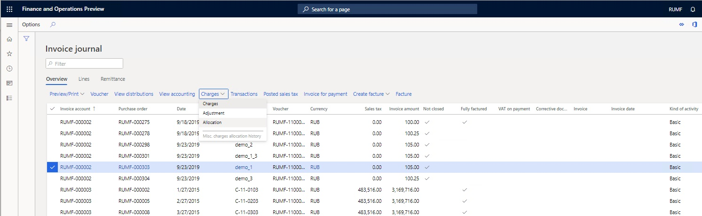

1. On the **Charges allocation** page, select **Edit**.

   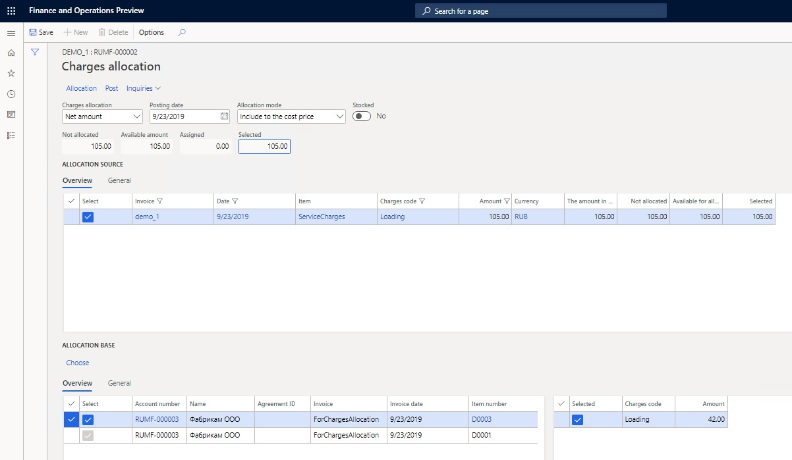

1. In the **Charges allocation** field, select one of the following methods for allocating miscellaneous charges:

      - **Net amount** – Charges are allocated according to each line amount, relative to the total net amount of the service invoice.
      - **Quantity** – Charges are allocated according to the number of units for each line, relative to the total number of units for the service invoice.
      - **Gross weight** – Charges are allocated equally, according to the gross weight of the items that are received.
      - **Volume** – Charges are allocated equally, according to the volume of the items that are received.

1. In the **Posting date** field, select the posting date.
1. In the **Allocation mode** field, select one of the three modes of miscellaneous charges allocation:

      - Include to the cost price
      - Redraw debt
      - Write-off to cost

    To allocate charges to the cost price of the products, select **Include to the cost price**.

1. In the **Allocation base** section, select **Choose** to specify the selection criteria that are used to transfer the invoice lines to the allocation base.
1. In the **Choose** dialog, select **Add** to add a line, and enter the following line details:

      - In the **Table** field, select a value.
      - In the **Field** field, select the field that you're specifying the criteria for. In the **Criteria** field, enter the criteria.

1. Select **OK**. The allocation base lines are created.
1. In the **Allocation source** section, select the **Select** checkbox for a posted miscellaneous charges invoice. In the **Available for allocation** field, you can change the amount that's available for allocation.
1. In the **Allocation base** section, select the **Select** checkbox for the invoice lines that the miscellaneous charges should be allocated to.
1. Select **Allocation** to allocate the miscellaneous charges. The amounts on the selected source lines are allocated to all the selected base lines. You can view the result of the allocation in the lower-right part of the page. For every line from the allocation base, the allocation amount and the miscellaneous charges code are shown.

    > [!NOTE]
    > - You can change the method of allocation in the **Allocation method** field as you require. You will then receive a message that prompts you to recalculate the lines of the allocation result. Select **Yes** to recalculate the result.
    > - You can manually adjust the allocation result in the **Amount** field in the lower-right part of the page. If the value that you enter exceeds the total amount that's available for allocation, you receive an informational message.

1. Select **Post** to post the allocation transaction.
1. Select **Inquiries** \> **Voucher** to view the transactions that are created because of allocation.

### Allocate miscellaneous charges to redraw debt to third parties

To allocate miscellaneous charges to redraw debt to third parties, follow these steps.

1. On the **Invoice journal** page, select the invoice for the purchase order that you created earlier that includes the service. Then select **Charges** \> **Allocation**.

   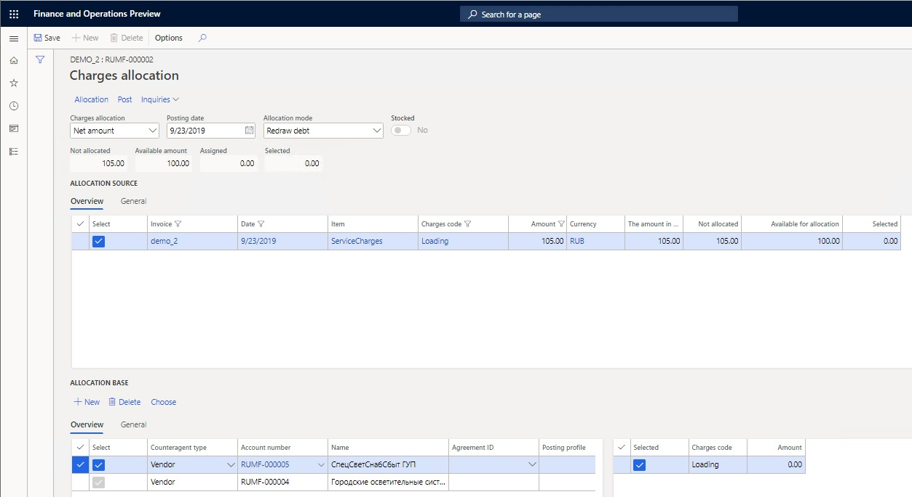
 
1. In the **Charges allocation** field, select a method for allocating miscellaneous charges.
1. In the **Posting date** field, select the posting date.
1. In the **Allocation mode** field, select **Redraw debt**.
1. In the **Allocation base** section, specify whether the customers or vendors can redraw debts automatically or manually:

      1. **Automatic**: Select **Choose**, specify the selection criteria, and then select **OK**. The allocation base lines are automatically created.

      > [!NOTE]
      > Allocation base lines are grouped by the **Counteragent type**, **Agreement ID**, and **Posting profile** fields. If there are invoices for one counteragent, but the values of these parameters differ, there will be several lines for that counteragent in the allocation base.
  
      1. **Manual**: To manually create allocation base lines, select **New**. In the **Counteragent type** field, select **Customer** or **Vendor**. In the **Account number** field, select the number of counteragent account. You can also select values in the **Agreement ID** and **Posting profile** fields.
  
1. Select the source and base lines for the allocation, and then edit the **Available for allocation** field as you require.
1. Select **Allocation** to allocate the miscellaneous charges. The amounts on the selected source lines are allocated to all the selected base lines. You can view the result of the allocation in the lower-right part of the page. For every line from the allocation base, the allocation amount and the miscellaneous charges code are shown.

    > [!NOTE]
    > - For manually created allocation base lines, the result of the allocation is 0 (zero). In this case, you must manually enter the miscellaneous charges amounts in the **Amount** field in the lower-right part of the page. You can also change the amounts for automatically created allocation base lines. If the value that you enter exceeds the total amount that's available for allocation, you will receive an informational message.
    > - You can change the method of allocation in the **Charges allocation** field. For automatically created allocation base lines, the amounts will be recalculated. For manually created allocation base lines, the amounts that you entered will be set to 0 (zero).

1. Select **Post** to post the allocation transaction.
1. In the **Posting** dialog, set the **Credit correction** option to **Yes** to post the allocation as a storno transaction. Otherwise, the allocation is created as a reverse transaction.
1. Set the **Create invoice for payment option** to **Yes** to create an invoice for payment when the allocation is posted.
1. Select **OK**. The operation for reissuing debt to counteragents is performed. Transactions are created for all selected lines in the allocation result.

    Because of posting, one of the following events occur, depending on whether the invoice that includes the service for allocation was    created from the vendor invoice journal or through a purchase order:

    If the invoice was created from the vendor invoice journal:
    - If you redraw debt to vendors, the invoice journals are automatically created and posted. If you set the **Create invoice for payment** option to **Yes**, the invoice for payment will automatically be posted.
    - If you redraw debt to customers, free text invoices are automatically created. The invoices for sales orders and payments are automatically posted.

    If the invoice was created through a purchase order:
    
    - If you redraw debt to vendors, the purchase orders that invoices will be posted on are automatically created. If you set the **Create invoice for payment** option to **Yes**, the invoice for payment will automatically be posted,  
    - If you redraw debt to customers, sales orders are automatically created. The invoices for sales orders and payments are posted automatically.

1. Select **Inquiries** \> **Voucher** to view the transactions that are created because of allocation.

#### Example

To walk through the example procedure, follow these steps.

1. Create a sales tax group that's named **VAT18-1** and that has sales tax code **VAT18**.

   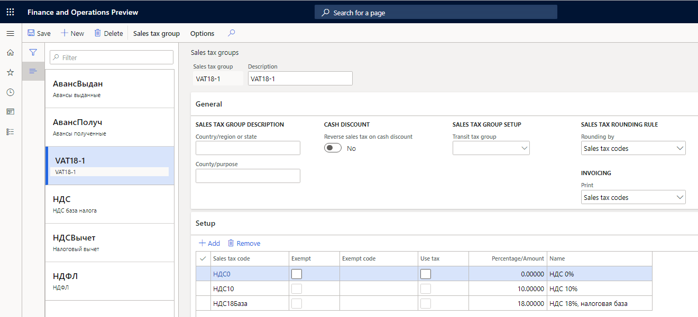

1. Create an exempt sales tax group that has standard sales tax code **VAT18**, and select the **Exempt** checkbox.

   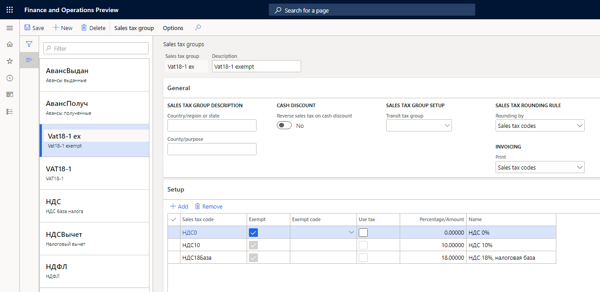

1. For the sales tax group, in the **Transit tax group** field, specify the exempt sales tax group.

   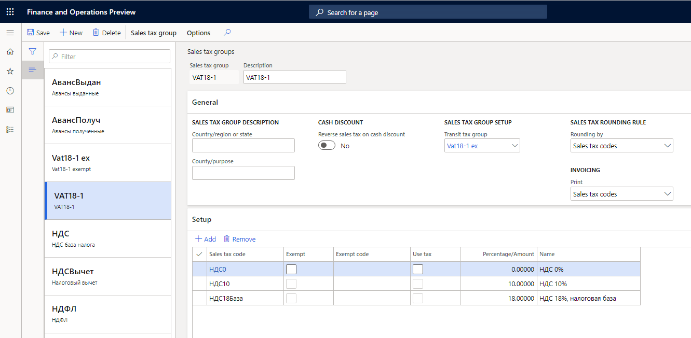

1. Create an item sales tax group that has sales tax code **VAT18**.

   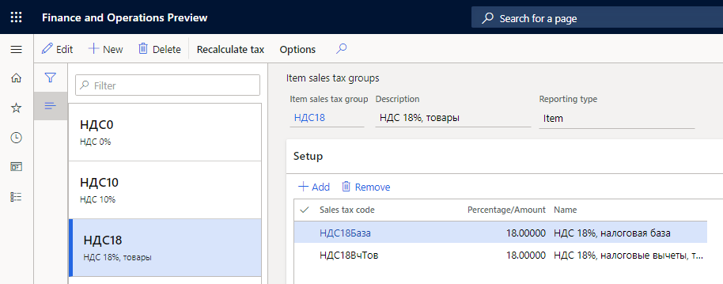

1. Set up transit account **76.511**. For instructions, see the [Set up a transit account](#set-up-a-transit-account) section.
1. Set up the following two charges codes. For instructions, see the [Set up a charges code](#set-up-a-charges-code) section.

    | Charges code | Account |
    |--------------|---------|
    | Loading      | 76.511  |
    | Unloading    | 26.1    |

1. Create two released products that have the same names as the charges codes that you created in the previous step. For each released product, in the **Charges code** field, specify the charges code that has the same name.
1. Create a purchase order for services (miscellaneous charges) that has the following two lines.

    | Item number | Quantity | Unit price | Sales tax group | Item sales tax group |
    |-------------|----------|------------|-----------------|----------------------|
    | Loading     | 1        | 1,000      |                 |                      |
    | Unloading   | 1        | 2,000      | VAT18-1         | VAT18                |

1. Post the invoice for the service (miscellaneous charges) purchase, where the total amount is 3,360 Russian rubles (RUB). This amount includes a VAT amount of 360 RUB. The following transactions are generated on the invoice.
    
    | Ledger account | Corr. Account | Currency | Amount in transaction currency | Amount | Date       |
    |----------------|---------------|----------|--------------------------------|--------|------------|
    | 76.511         | 60.11         | RUB      | 1,000                          | 1,000  | 10/18/2019 |
    | 26.1           | 60.11         | RUB      | 2,000                          | 2,000  | 10/18/2019 |
    | 19.3           | 60.11         | RUB      | 360                            | 360    | 10/18/2019 |

1. On the **Invoice journal** page, select **Charges** \> **Allocation**.
1. On the **Charges allocation** page, in the **Posting date** field, specify **10/18/2019**.

    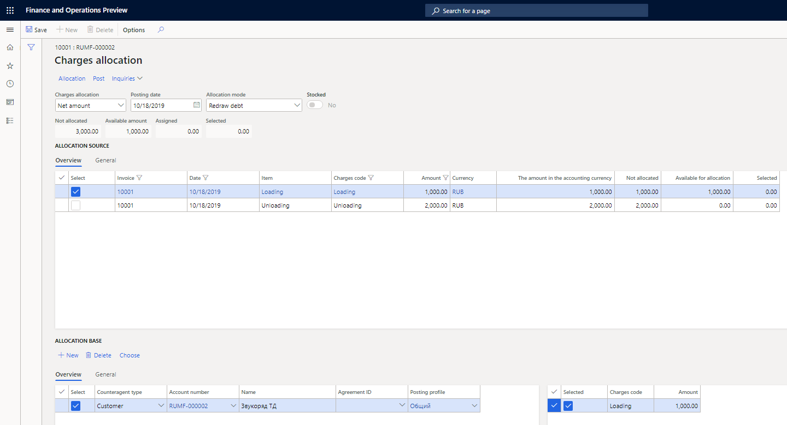

1. In the **Allocation mode** field, select **Redraw debt**.
1. In the **Allocation base** section, manually create the following line.

    | Counteragent type | Account number | Name        | Posting profile |
    |-------------------|----------------|-------------|-----------------|
    | Customer          | RUF-000002     | Звукоряд ТД | Общий           |

1. Select the source line that has the Loading reference in the **Item** field, select the base line for the allocation, and then select **Allocation**.
1. In the lower-right part of the page, in the **Amount** field, enter 1000 for allocation for charges code Loading.
1. Select **Post**.
1. In the **Posting** dialog, set the **Credit correction** option to **No**.
1. Set the **Create invoice for payment** option to **Yes**.  
1. Select **OK**.
  
    After the allocation is posted, you receive a message that contains information about the sales order that was created for the customer. You can then open the sales order to view the invoice transactions that were generated and the following voucher.

    | Date       | Ledger account | Corr. Account | Currency | Amount in transaction currency | Amount   |
    |------------|----------------|---------------|----------|--------------------------------|----------|
    | 10/18/2019 | 62.11          | 76.511        | RUB      | 1,000.00                       | 1,000.00 |  

    Because of posting, the corrective invoice for the amount of redrawn debt was created. This invoice isn't included in the sales book.
  
1. To view the information about the allocation of debt, on the **Invoice journal** page, select **Charges > Misc. charges allocation history**. Then, in the **Allocation mode** field, select **Redraw debt**.

### Allocate miscellaneous charges to the ledger account

To allocate miscellaneous charges to the ledger account, follow these steps.

1. On the **Invoice journal** page, select the invoice for the purchase order that you created earlier that includes the service. Then select **Charges** \> **Allocation**.

   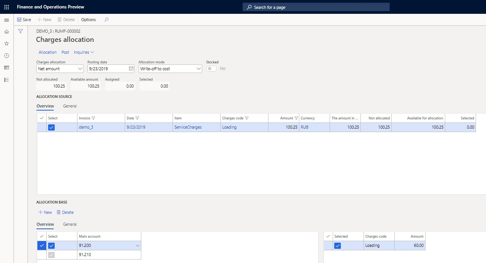

1. In the **Charges allocation** field, select a method for allocating miscellaneous charges.
1. In the **Posting date** field, select the posting date.
1. In the **Allocation mode** field, select **Write-off to cost**.
1. In the **Allocation base** section, specify the ledger accounts that miscellaneous charges will be written off on.
1. Select **New** to create the allocation base line.
1. In the **Main account** field, select a main account.
1. Select the source and base lines for the allocation, and then edit the **Available for allocation** field as you require.
1. Select **Allocation** to allocate the miscellaneous charges. The system creates lines where the amount is 0 (zero). For each selected allocation base line, in the **Amount** field in the lower-right part of the page, enter the amount of the miscellaneous charges.

    > [!NOTE]
    > If the value that you enter exceeds the total amount that's available for allocation, you will receive an informational message.

1.    Select **Post** to post the allocation transaction. The operation for writing off miscellaneous charges to the ledger account is performed. Transactions are created for all selected lines in the allocation result.
1.    Select **Inquiries** \> **Voucher** to view the transactions that are created because of allocation.

## View the miscellaneous charges that are allocated to the item's cost price

The cost price of an item can be adjusted many times by using the functionality for miscellaneous charges allocation. You can view the transactions that adjust the cost of an item on the **Settlements** and **Cost explorer** pages. A warehouse closing operation must be done first.

To view the miscellaneous charges that are allocated to the item's cost price, follow these steps.

1. In Dynamics 365 Finance, go to **Product information management** \> **Products** \> **Released products** to open the **Released product details** page.
1. Select an item, and then, on the Action Pane, on the **Manage Costs** tab, in the **Cost transactions** group, select **Transactions** to open the **Inventory transactions** page.
1. Select the transaction on the receipt item that you want to explore the cost structure for.
1. To view inventory cost adjustment transactions, on the Action Pane, on the **Inventory** tab, in the **Costing** group, select **Settlements**. The **Settlements** page includes the following fields:

      - **Charges code** – The miscellaneous charges code that has been allocated to the item receipt transaction.
      - **Vendor account** – The account of the vendor that the miscellaneous charges were purchased from.
      - **Invoice** – The invoice number of the miscellaneous charges purchase.
  
      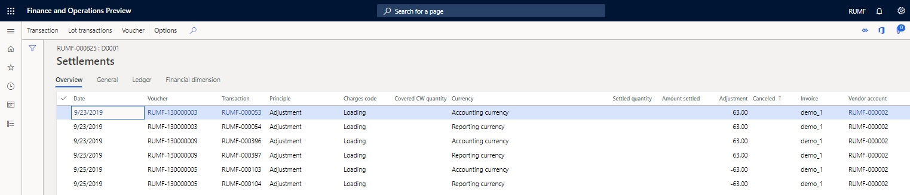
  
      > [!NOTE]
      > If the Vendor account and Invoice fields aren't filled in, the cost adjustment operation was done by the standard method for miscellaneous charges allocation.
  
1. To view more information about the list and the amounts of miscellaneous charges that have been included in the cost price of the posted item, on the **Inventory transactions** page, on the Action Pane, on the **Inventory** tab, in the **Costing** group, select **Cost explorer**.

   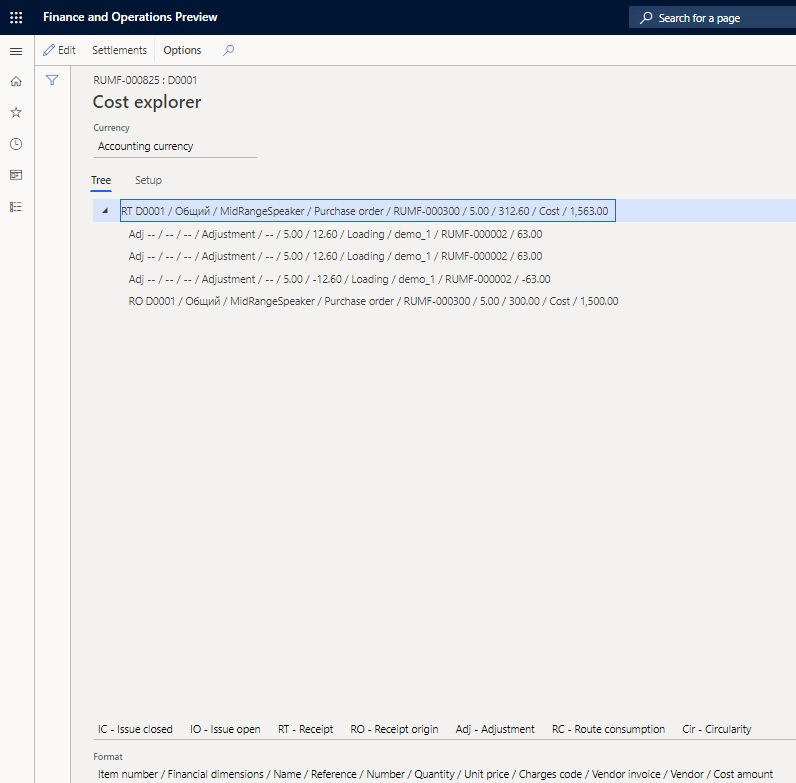
 
## View the allocation history for miscellaneous charges

### View the allocation history from the invoice journal

To view the allocation history from the invoice journal, follow these steps.

1. On the **Invoice journa**l page, select purchase invoice that you created earlier that includes the service.
1. Select **Charges** \> **Misc. charges allocation history** to open the **Charges allocation** page.
The **Allocation base** section shows the allocation base and allocation result, depending on the value in the **Allocation mode** field. To change the allocation mode, select **Edit**, and then, in the **Allocation mode** field, select a new value.

   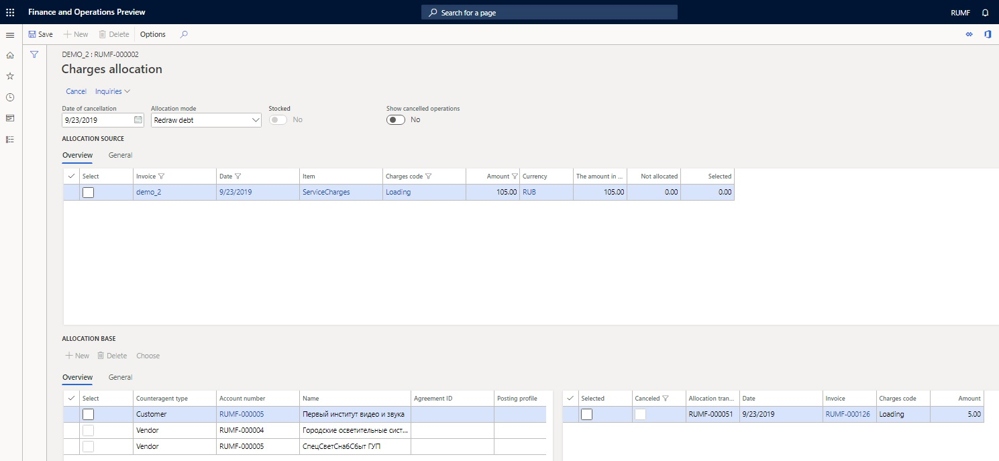

1. On the header of the **Charges allocation** page, set the **Show cancelled operations** option to **Yes** to show the miscellaneous charges allocation transactions that have been canceled and the transactions that adjust them.
1. Select **Inquiries** \> **Voucher** to view the transactions that were created because of allocation.

### View the allocation history

The allocation history can be shown either for a specific invoice or for all invoices that the miscellaneous charges allocation operation was performed on.

To view the allocation history, follow these steps.

1. In Dynamics 365 Finance, go to **Accounts payable** \> **Inquiries and reports** \> **Misc. charges allocation history**.
1. Select **Edit**, and then, in the **Start date** and **End date** fields, specify a period to filter the invoices for the purchase of miscellaneous charges.

   The **Allocation source** section shows the source lines for all invoices from the period. The **Allocation base** section shows     the allocation base and allocation result.

   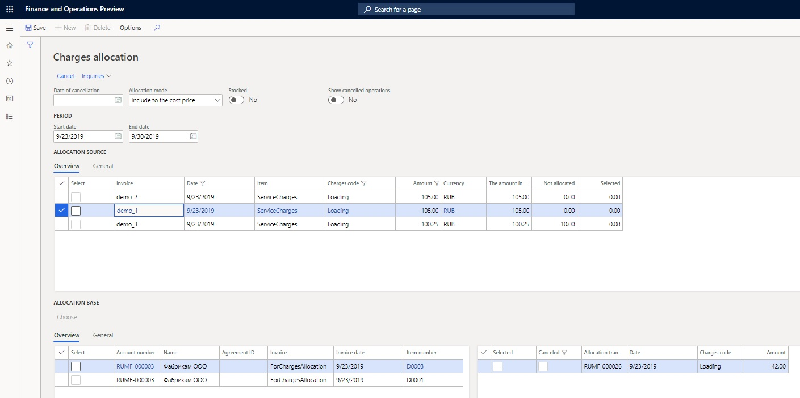
 
## Cancel miscellaneous charges allocation

To cancel miscellaneous charges allocation, follow these steps.

1. In Dynamics 365 Finance, go to **Accounts payable** \> **Inquiries and reports** \> **Misc. charges allocation history**. Alternatively, on the **Invoice journal** page, select **Charges** \> **Misc. charges allocation history**.
1. In the **Allocation mode** field, select the allocation mode to cancel the allocation for.
1. Select the lines to cancel.

    > [!NOTE]
    > Lines that were created by one allocation operation can't be partially canceled. If you select one line from an allocation operation, all lines from that operation are automatically selected.

1. In the **Date of cancellation** field, enter the date of cancellation.

   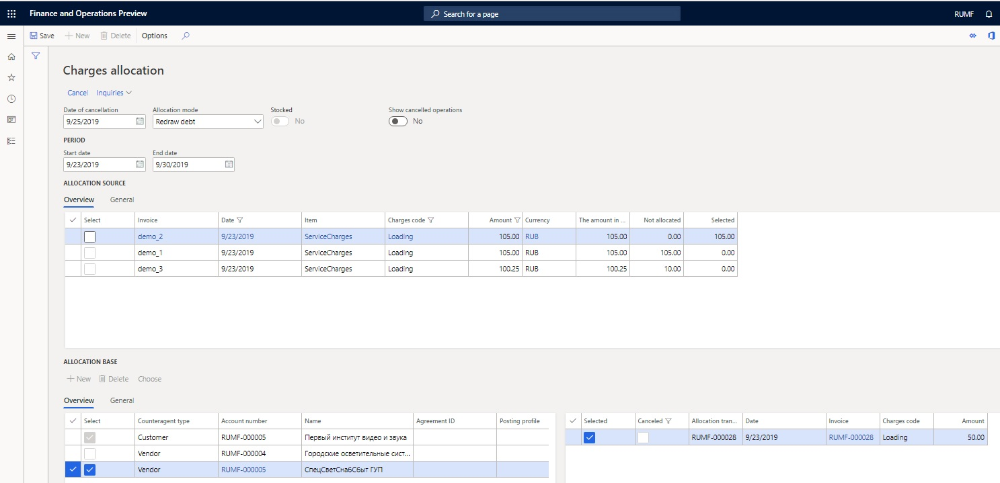

1. Select **Cancel**.

    > [!NOTE]
    > - If the date of cancellation is before the date of at least one transaction that's marked for cancellation, the operation won't be performed, and you will receive an error message.
    > - If the redrawing of debt is being canceled, you will receive an informational message that contains links to the documents that were created for customers or vendors.

1. Select **Inquiries** \> **Voucher** to view the transactions that were created because of allocation cancellation.

[!INCLUDE[footer-include](../../../includes/footer-banner.md)]
