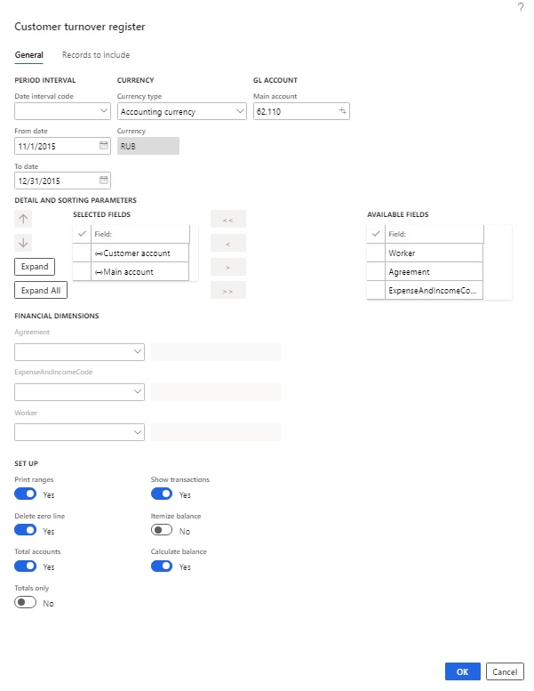
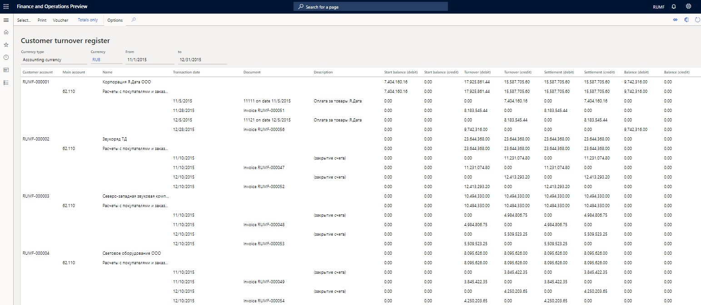
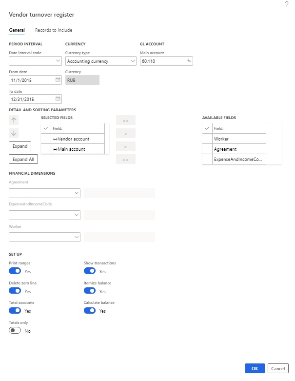
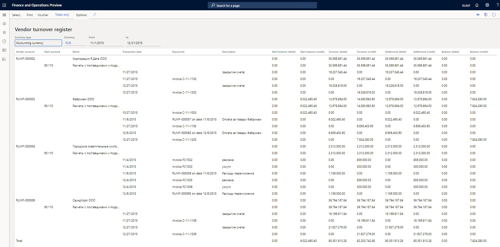
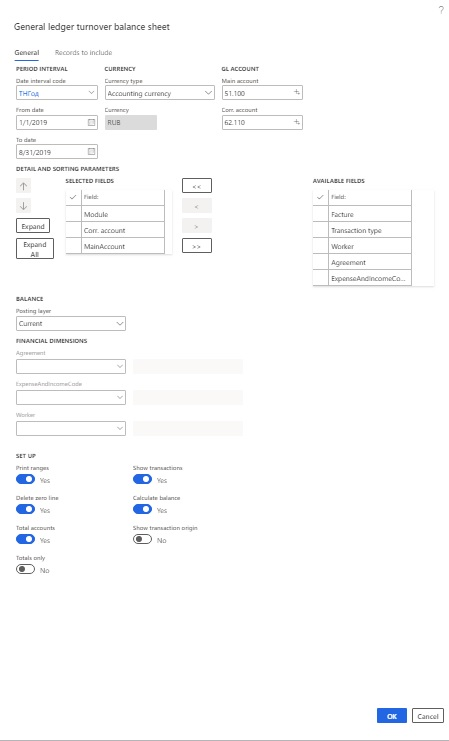
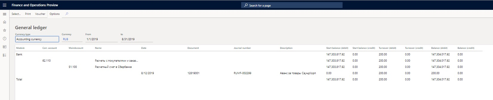
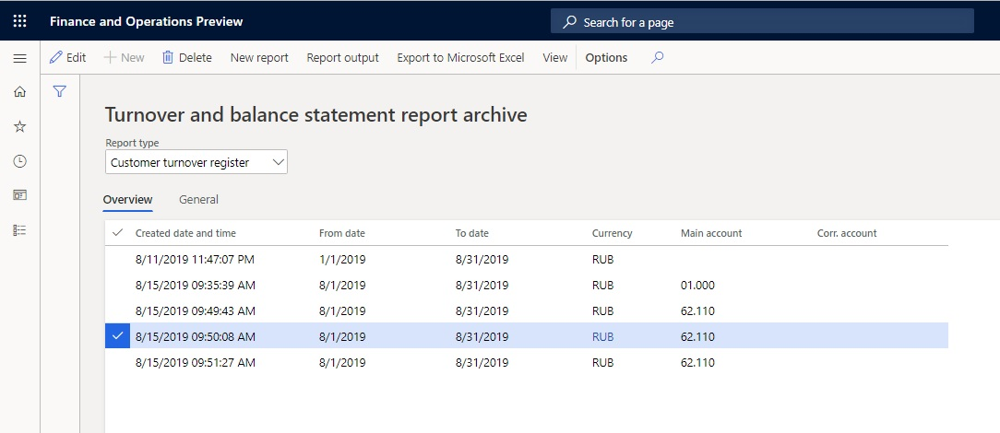

# Turnover balance statement reports
[!include [banner](../../includes/banner.md)]

Turnover balance sheets for the customer, vendor, and advance holder let you show information in the context of customers, vendors, and advance holders.

## Customer turnover register

1. Go to **General ledger** \> **Inquiries and reports** \> **Turnover balance statement** \> **Customer turnover register**.
2. On the **General** tab, in the **Date interval code** field, select the date interval code from the date interval directory.
3. In the **From date** and **To date** fields, select the start and end of the report generation period.

    > [!NOTE] 
    > If you don't manually set these fields, values are entered based on the selected date interval code.

4. In the **Currency type** field, select the currency type for the report: **Accounting currency**, **Reporting currency**, or **Indicated currency**.
5. In the **Currency** field, select the transaction currency.

    > [!NOTE]
    > This field is available only if you select **Indicated currency** in the **Currency type** field.

6. In the **Main account** field, select the account to generate the report for.
7. Select **Expand all** to view additional settlement information.
8. In the **Detail and sorting parameters** section, specify the fields that are used for grouping by moving them from the **Available fields** list to the **Selected fields** list. You can also change the grouping order as you require.
9. In the **Financial dimensions** section, in the **Agreement**, **ExpenseAndIncomeCode**, and **Worker** fields, specify the dimension codes if you want to select transactions that have specific codes for the report.

    > [!NOTE]
    > If you leave these fields blank, the system will select transactions that have *any* dimension code for the report.

10. Set the **Print ranges** option to **Yes** to view the query terms when you print the report.
11. Set the **Delete zero line** option to **Yes** if you don't want to print lines or columns that have 0 (zero) values.
12. Set the **Total accounts** option to **Yes** to total the accounts.
13. Set the **Show transactions** option to **Yes** to show the contractor transactions.
14. Set the **Itemize balance** option to **Yes** to show a detailed view of the balance columns.
15. Set the **Calculate balance** option to **Yes** to calculate and show the balance on the report.

    

16.  Select **ОК** to generate the report.

>  [!NOTE]
>
>   - Select **Voucher** to view the ledger transactions that generated the activity.
>   - Select **Select** to change the report generation parameters.
>   - Select **Print** to print the report in Microsoft SQL Server Reporting Services (SSRS).
>   - Select **Totals only** to show lines only for the first selected dimension.

## Vendor turnover register

1. Go to **General ledger** \> **Inquiries and reports** \> **Turnover balance statement** \> **Vendor turnover register**.
2. On the **General** tab, in the **Date interval code** field, select the date interval code from the date interval directory.
3. In the **From date** and **To date** fields, select the start and end of the report generation period.

    > [!NOTE]
    > If you don't manually set these fields, values are entered based on the selected date interval code.

4. In the **Currency type** field, select the currency type for the report: **Accounting currency**, **Reporting currency**, and **Indicated currency**.
5. In the **Currency** field, select the transaction currency.

    > [!NOTE]
    > This field is activated available only if you select **Indicated currency** in the **Currency type** field.

6. In the **Main account** field, select the account to generate the report for.
7. Select **Expand all** to view additional settlement information.
8. In the **Detail and sorting parameters** section, specify the fields that are used for grouping by moving them from the **Available fields** list to the **Selected fields** list. You can also change the grouping order as you require.
9. In the **Financial dimensions** section, in the **Agreement**, **ExpenseAndIncomeCode**, and **Worker** fields, specify the dimension codes if you want to select transactions that have specific codes for the report.

    > [!NOTE] 
    > If you leave these fields blank, the system will select transactions that have *any* dimension code for the report.

10. Set the **Print ranges** option to **Yes** to view the query terms when you print the report.
11. Set the **Delete zero line** option to **Yes** if you don't want to print lines or columns that have 0 (zero) values.
12. Set the **Total accounts** option to **Yes** to total the accounts.
13. Set the **Show transactions** option to **Yes** to show the contractor transactions.
14. Set the **Itemize balance** option to **Yes** to show a detailed view of the balance columns.
15. Set the **Calculate balance** option to **Yes** to calculate and show the balance on the report.

    

16. Select **ОК** to generate the report.

>  [!NOTE]
>
> - Select **Voucher** to view the ledger transactions that generated the activity.
> - Select **Select** to change the report generation parameters.
> - Select **Print** to print the report in SSRS.
> - Select **Totals only** to show lines only for the first selected dimension.

## Advance holder turnover register

1. Go to **General ledger** \> **Inquiries and reports** \> **Turnover balance statement** \> **Advance holder turnover register**.
2. On the **General** tab, in the **Date interval code** field, select the date interval code from the date interval directory.
3. In the **From date** and **To date** fields, select the start and end of the report generation period.

    > [!NOTE]
    > If you don't manually set these fields, values are entered based on the selected date interval code.

4. In the **Currency type** field, select the currency type for the report: **Accounting currency**, **Reporting currency**, or **Indicated currency**.
5. In the **Currency** field, select the transaction currency.

    > [!NOTE]
    > This field is available only if you select **Indicated currency** in the **Currency type** field.

6. In the **Main account** field, select the account to generate the report for.
7. Select **Expand all** to view additional settlement information.
8. In the **Detail and sorting parameters** section, specify the fields that are used for grouping by moving them from the **Available fields** list to the **Selected fields** list. You can also change the grouping order as you require.
9. In the **Financial dimensions** section, in the **Agreement**, **ExpenseAndIncomeCode**, and **Worker** fields, specify dimension codes if you want to select transactions that have specific codes for the report.

    > [!NOTE]
    > If you leave these fields blank, the system will select transactions that have *any* dimension code for the report.

10. Set the **Print ranges** option to **Yes** to view the query terms when you print the report.
11. Set the **Delete zero line** option to **Yes** if you don't want to print lines or columns that have 0 (zero) values.
12. Set the **Total accounts** option to **Yes** to total the accounts.
13. Set the **Show transactions** option to **Yes** to show the contractor transactions.
14. Set the **Itemize balance** option to **Yes** to show a detailed view of the balance columns.
15. Set the **Calculate balance** option to **Yes** to calculate and show the balance on the report.

16. Select **ОК** to generate the report.

> [!NOTE]
>
> - Select **Voucher** to view the ledger transactions that generated the activity.
> - Select **Select** to change the report generation parameters.
> - Select **Print** to print the report.
> - Select **Totals only** to show lines only for the first selected dimension.

## General ledger report

The **General ledger** report is designed to generate turnover on a specified account that is in correspondence with other accounts.

1. Go to **General ledger** \> **Inquiries and reports** \> **Turnover balance statement** \> **General ledger**.
2. On the **General** tab, in the **Date interval code** field, select the date interval code from the date interval directory.
3. In the **From date** and **To date** fields, select the start and end of the report generation period.

    > [!NOTE]
    > If you don't manually set these fields, values are entered based on the selected date interval code.

4. In the **Currency type** field, select the currency type for the report: **Accounting currency**, **Reporting currency**, or **Indicated currency**.
5. In the **Currency** field, select the transaction currency.

    > [!NOTE]
    > This field is available only if you select **Indicated currency** in the **Currency type** field.

6. In the **Main account** field, select the account to generate the report for.
7. In the **Corr. account** field, select the corresponding account to generate the report for.
8. Select **Expand all** to view additional settlement information.
9. In the **Detail and sorting parameters** section, you can specify the fields that are used for grouping by moving them from the **Available fields** list to the **Selected fields** list. You can also change the grouping order as you require.
10. In the **Financial dimensions** section, in the **Agreement**, **ExpenseAndIncomeCode**, and **Worker** fields, specify dimension codes if you want to select transactions that have specific codes for the report.

    > [!NOTE]
    > If you leave these fields blank, the system will select transactions that have *any* dimension code for the report.

11. Set the **Print ranges** option to **Yes** to view the query terms when you print the report.
12. Set the **Delete zero line** option to **Yes** if you don't want to print lines or columns that have zero (0) values.
13. Set the **Total accounts** option to **Yes** to total the accounts.
14. Set the **Show transactions** option to **Yes** to show the accountable person transactions.
15. Set the **Calculate balance** option to **Yes** to calculate and show the balance on the report.

    

16. Select **ОК** to generate the report.

> [!NOTE]
>
> - Select **Voucher** to view the ledger transactions that generated the activity.
> - Select **Select** to change the report generation parameters.
> - Select **Print** to print the report in SSRS.
> - Select **Totals only** to show lines only for the first selected dimension.

## Turnover balance statement report archive

On the **Report archive** page, you can view reports and download them in Excel format.

1. Go to **General ledger** \> **Inquiries and reports** \> **Turnover balance statement** \> **Report archive**.
2. On the **Turnover and balance statement report archive** page, in the **Report type** field, specify the type of report.
3. Select the report.

    

4. Select **New report** to generate a new report that has the same parameters as the selected report.
5. Select **Report output** to print the report.
6. Select **Export to Microsoft Excel** to open the **Export to Excel** page, and then select **Download** to download the report in Excel format.
7. Select **View** to view the report.

## Pre-calculate transactional data

By pre-calculating transactional data, you can help improve performance.

1. Go to **General ledger** \> **Ledger setup** \> **General ledger parameters**.
2. On the **Ledger** tab, in the **Turnover balance statement** section, set the **Use pre-calculated data** option to **Yes**.
3. Go to **General ledger** \> **Periodic tasks** \> **Pre-calculate transactional data**.
4. In the **Pre-calculate transactional data** dialog box, on the **Parameters** FastTab, in the **Report type** field, select the type of the report:

    - Customer turnover register
    - Vendor turnover register
    - General ledger
    - Advance holder turnover register

    

5. Select **OK** to pre-calculate transactional data.

[!INCLUDE[footer-include](../../../includes/footer-banner.md)]
