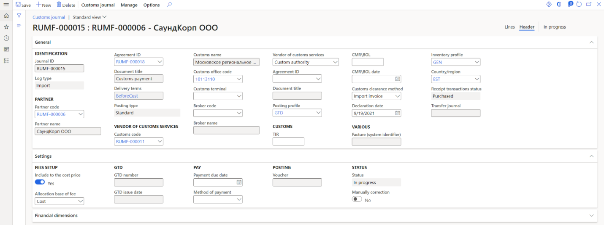
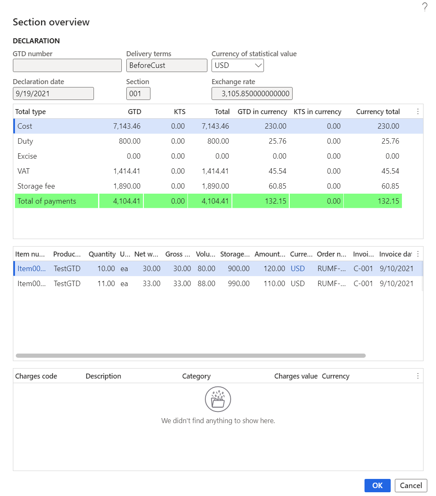

# Work with customs clearance

The registration of the customs clearance process is done in two new journals: the customs journal and the KTS journal. In these journals, information about the composition of the cargo customs declaration (GTD) or the customs value correction (KTS) is shown, customs payments are calculated based on the transaction amount or indicative price of products, and factures of the **GTD** or **KTS** type are registered.

The form that a customs journal takes when it's created depends on whether the products are imported or exported, and on the delivery conditions that determine the moment of the transfer of ownership (either before or after the customs clearance process).

For an import journal where the transfer of ownership occurs after the customs clearance process, purchase orders must be registered. The lines of the customs journal are generated based on inventory transactions that have a status of **Ordered**. After a customs journal or KTS journal is posted, the amounts of customs duties and fees adjust the cost of products or are debited to the expense account, depending on the parameters of the journal. Transactions are generated for the amount of value-added tax (VAT), excise, and debt to the customs service provider. Adjustment of the cost price for the amount of duties and fees occurs in two iterations: a transaction is generated in the transit account when the customs journal is posted, and a cost adjustment transaction is generated when a purchase order invoice is posted. In the inventory transactions, the analytics of the **GTD number** value are registered, and the status of the inventory transactions is changed to **Registered**.

For an import journal where the transfer of ownership occurs before the customs clearance process, invoices for purchase orders must be registered. The lines of the customs journal are generated based on inventory transactions that have a status of **Purchased**. After a customs journal or KTS journal is posted, the amounts of customs duties and fees adjust the cost of products or are debited to the expense account, depending on the parameters of the journal. Transactions are generated for the amount of VAT, excise, and debt to the customs service provider. In the inventory transactions, the analytics of the **GTD number** value are registered.

For an export journal where the transfer of ownership occurs after the customs clearance process, invoices for purchase orders of the **Postponed passing of property** posting type must be registered. The lines of the customs journal are generated based on inventory transactions that have a status of **Deducted** or **Sold**. After a customs journal or KTS journal is posted, the amounts of customs duties and fees are debited to the expense account. The debt to the customs service provider is also generated.

For an export journal where the transfer of ownership occurs before the customs clearance process, invoices for purchase orders of the **Standard** posting type must be registered. The lines of the customs journal are generated based on inventory transactions that have a status of **Deducted** or **Sold**. After a customs journal or KTS journal is posted, the amounts of customs duties and fees are debited to the expense account. The debt to the customs service provider is also generated.

## Create and set up a customs journal

The registration of information about customs clearance is done on the **All customs journals** page.

The page for the customs journal consists of two parts, the header and journal lines.

### Create the customs journal header

1. Go to **Inventory management** \> **Journal entries** \> **All customs journals**.
2. To manage an existing customs journal, select a line, and then, on the Action Pane, select **Customs journal** \> **Edit**.

    –or–

    To create a new customs journal, on the Action pane, select **Customs journal** \> **New**.

3. In the **Create customs journal** dialog box, set the following fields:

    - In the **Partner** section:

        - In the **Log type** field, select **Import** or **Export**.
        - In the **Partner code** field, select a counteragent account for journals of the **Import** type or a customer account for journals of the **Export** type.

            > [!NOTE] 
            > You can select a counteragent where the **Foreign counteragent** option is set to **Yes**.

         - The **Partner name** field is automatically set.
         - In the **Agreement ID** field, select an agreement number for the partner. The **Document title** field is automatically set.
         - The **Delivery terms** field is automatically set from either the agreement or the partner's account details.

    - In the **Customs requisites** section:

        - In the **Customs code** field, select a customs code. The **Customs name** and the **Customs office code** fields are automatically set.
        - In the **Vendor of customs services** field, select **Custom authority** or **Custom broker**, depending on who the debt for customs clearance will be formed to.

    - In the **Requisites of customs services vendor** section:

        - In the **Broker code** field, select a broker code. The **Broker name** field is automatically set.
        - In the **Agreement ID** field, select the registration number of the contract for the customs service provider. Consider the value in the **Vendor of customs services** field. The **Document title** field is automatically set.

    - In the **Delivery and pay** section:

        - In the **CMR\\BOL** field, select a road transport document (CMR)/bill of lading (BOL) number.
        - In the **CMR\\BOL date** field, select the date of the CMR/BOL.
        - In the **TIR** field, select an International Road Transports (TIR) number.
        - In the **Declaration date** field, select the date of declaration.
        - In the **Posting type** field, select the posting type for sales order invoices to reflect a sale that has a deferred transfer of ownership. This field is available only for journals of the **Export** type.
        - In the **Inventory profile** field, select an accounting profile to change the accounting profile of products after the customs clearance process. The value of this field is taken from the terms of delivery and is available only for journals of the **Import** type.
        - In the **Customs clearance method** field, select the method of customs clearance: **Import invoice** or **Indicative**. This method determines the prices that the calculation of the customs duty will be based on. If this field is set in the customs journal, it's automatically applied to all lines of the journal.
        - In the **Country/region** field, select the country or region of origin of the products. If this field is set in the customs journal, it's automatically applied to all lines of the journal.
        - Set the **Include to the cost price** option to **Yes** if you must include duties and fees for customs clearance in the cost of the product. This option is available only for journals of the **Import** type.

4. Select **OK**. The journal ID is automatically created and shown in the **Journal ID** field on the **Customs journal** page.

    

5. On the **Header** tab, you can correct the values that you entered in the **Create customs journal** dialog box. The following additional fields are also available:

    - On the **General** FastTab, in the **Vendor of customs services** section:

        - The **Posting profile** field reflects the posting profile for the formation of debt to the customs service provider. This field is set based on the selected agreement of the customs service provider.
        - The **Customs terminal** field reflects the warehouse that is associated with the customs office. This field must be set if the **Warehouse change** option is set to **Yes** when the GTD issuance is generated.

    - In the **Various** section:

        - The **Facture (system identifier)** field reflects the number of the facture that is generated from the KTS journal.
        - The **Receipt transactions status** field shows the terms of delivery for customs clearance of products. This field is available only for journals of the **Import** type.
        - The **Transfer journal** field shows the number of the journal that has a status of **Transfer**. This journal can be created when a GTD is issued.

    - On the **Settings** FastTab, in the **Fees setup** section, in the **Allocation base of fee** field, select the base for allocation of the fee to the lines of the customs journal. This field is available if the **Include to the cost price** option is set to **Yes**.
    - In the **GTD** section, the **GTD number** and **GTD issue date** fields are set when the GTD journal is posted.
    - In the **Pay** section:

        - In the **Payment due date** field, select the deadline for customs payments.
        - In the **Method of payment** field, select a method of payment.

    - In the **Posting** section, the **Voucher** field shows the number of the journal's voucher. This field is automatically set after a GTD is posted.
    - In the **Status** section:

        - The **Status** field reflects the status of the journal. When the journal is created, the initial status is **In Progress**. After a GTD is issued, the status is changed to **Issued**. After the customs journal is posted, the status is changed to **Posted**.
        - The **Manually correction** option reflects the manual adjustment of the calculated customs payments on the journal lines.

    - On the **Financial dimensions** FastTab, you can view financial analyses of the customs journal. These analyses are determined by the selection of the customs service provider and can be manually changed.

    

### Create customs journal lines

1. Go to **Inventory management** \> **Journal entries** \> **All customs journals**.
2. Select the line for a customs journal, and then, on the Action Pane, select **Customs journal** \> **Edit**.
3. On the **Customs journal** FastTab, you can view data that was entered about the journal when it was created.
4. On the **Customs journal lines** FastTab, you can view the following fields:

    - **TN VED code** – A TN VED code that was set on the **Item relation with TN VED** page, based on the date of declaration and customs that is specified on the customs journal header.
    - **Item number** – The product number that the journal line is generated for.
    - **Product name** – The name of the product.
    - **Section** – The number of the section. This field is automatically set when lines are created, but you can manually change the value.
    - **Quantity** – The quantity of the product.
    - **Unit** – The unit of the product.
    - **Customs clearance method** – The customs clearance method. The value is taken from the customs journal header. If no value is specified on the customs journal header, the value is taken from the last customs journal that was posted for the TN VED code and customs.
    - **Total (import invoice)** – The amount of customs payments that are calculated based on the invoice cost.
    - **Total (indicative)** – The amount of customs payments that are calculated based on the indicative cost.
    - **Variance** – The difference between the values in the **Total (import invoice)** and **Total (indicative)** fields.

5. On the **Customs journal lines** FastTab, you can use the following buttons.

    | Button | Function |
    |--------|----------|
    | **Create lines** | Create a new line. |
    | **Remove** | Delete the current line. |
    | **Update line** \> **Adjust section amounts** | Adjust the value of the duty for the section. |
    | **Customs journal line** \> **Overview of section data** | Reflect the data for the current section. |
    | **Customs journal line** \> **Order** | Go to the order that the current line is based on. |
    | **Customs journal line** \> **Invoice** | Go to the invoice for the current line. This button is available only for journals of the **Import** type that are formed according to terms of delivery where the transfer of ownership occurs before the border. |
    | **Customs journal line** \> **Product receipt** | Go to the qualifying invoice for the current line. This button is available only for journals of the **Export** type. |

6. On the **Line details** FastTab, you can view the details of the customs journal line that was created:

    - On the **General** tab:

        - In the **Identification** section, you can view the **Journal ID** and **Line number** fields.
        - In the **General** section, in the **Section** field, you can change the section number. For example, this field is used when duties are distributed.
        - The values of the **Customs clearance method** and **Country/region** fields are taken from the customs journal header.
        - In the **Item** section, you can view the **Item number** and **TN VED code** fields. Their relation was set on the **Item relation with TN VED** page.
        - In the **References** and **Invoice** section, there are links to the original purchaser or sales order number, invoice, or packing slip.

    - On the **Setup** tab, there is information about the calculation of customs payments based on the invoice and indicative values, and the amount of the calculated storage fee. The indicative cost is determined based on the settings on the **Indicative prices of TN VED** page.

        

    - On the **Financial dimensions** tab, you can view financial information about the line that is defined from the line of the linked purchase order, invoice, sales order, or packing slip line.

To create a new line, follow these steps.

1. On the **Customs journal lines** FastTab, select **Create lines**.

    The following table shows the inventory transactions that are available for creating customs journal lines.

    | Customs journal type | Conditions | Source | Inventory transaction status |
    |----------------------|------------|--------|------------------------------|
    | Import | The value of the **Receipt transactions status** field in the terms of delivery is **Ordered**. | Purchase order | **Ordered** |
    | Import | The value of the **Receipt transactions status** field in the terms of delivery is **Purchased**. | Purchase order invoice | **Purchased** |
    | Export | The posting type is **Standard**. | Packing slip for a sales order | **Deducted** or **Sold** |
    | Export | The posting type is **Postponed passing of property**. | Sales order invoice of the **Deferred transfer of ownership** posting type | **Deducted** or **Sold** |

    The **Create customs journal lines** dialog box consists of two main parts:

    - **Upper** – The upper part of the page shows the source of the payment. The view depends on the value of the **Log type** field. For the **Import** journal type, it depends on the terms of the transfer of ownership that are reflected in the terms of delivery. For the **Export** journal type, it depends on the terms of the transfer of ownership that are reflected in the posting type. Filters are applied to this part of the page. The **Invoice account** field is set to the same account as the **Partner code** field on the customs journal header. If the **Agreement ID** field on the customs journal header is set to a value (that is, it isn't blank), orders and invoices that have the same agreement ID are shown. If the **Agreement ID** field is blank, all orders and invoices of the partner are shown.
    - **Lower** – The lower part of the page shows the quantity of products that are available for selection according to the warehouse transaction that is associated with the purchase order line, supplier's invoice, customer's packing slip, or customer's invoice. The following conditions must be met:

        - For the **Import** journal type, the GTD number isn't specified in the warehouse transaction.
        - For the **Export** journal type, the warehouse transaction isn't included in another customs journal.
        - The source of the transaction isn't a credit note.
        - The status of the warehouse transaction matches the type of the customs journal and the terms of the transfer of ownership.
        - For the **Export** journal type, the lines have a sales tax code where the **Type of tax** field is set to **VAT 0%** and the **Tax code for domestic market** field is set to a value (that is, it isn't blank).

2. Mark the required lines. Additionally, in the **Selected quantity** field, you can change the quantity to include in the customs journal.
3. Select **OK**.

    

4. Optional: To recalculate the journal lines, on the Action Pane, select **Manage** \> **Recalculate lines**. For example, if you created journal lines and then changed the indicative prices for those products, you should recalculate the lines so that the actual information in the customs journal is used.

    > [!NOTE] 
    > For a journal that has a status of **In Progress**, you can create and change lines as many times as you require.

5. If you created lines for a journal of the **Export** type, information about including a warehouse transaction in the customs journal is added to the source. In the **Grouping reference type** field, you should see a value of **Custom journal line** or **Customs journal line (goods in transit)**. In the **Grouping reference** field, you should see the packing slip or invoice number.

When you calculate the import overhead cost, the settings of the charges code for customs payments are also analyzed in addition to the order cost. The amount of the overhead charges that have been registered for the purchase order or invoice, and that have been configured for the value of the **Delivery terms** field on the customs journal header, is added to the invoice cost on the line.

> [!NOTE]
> If overhead expenses were set in the purchase order, they must be allocated.

After you post the customs journal, you can add only overhead expenses that don't increase the customs cost of the products on the purchase order line or invoice line from the customs journal. In other words, you can add only overhead expenses that aren't related to the delivery condition from the customs journal header.

The values of customs payments (VAT, duty, and excise) are calculated based on the settings on the **TN VED code relation with customs payment** page. You can correct the **VAT** and **Excise** fields in the **Import invoice amount** and **Indicative amount** sections on the **Line details** FastTab. In this case, the **Manually correction** option is set to **Yes** on the customs journal header.

The duty is calculated for the section and distributed to the lines, based on the value of the **Complex rate** field for the sales tax code. If the value isn't set to **Summation**, the distribution is done in proportion to the cost. If the value is set to **Maximum**, the distribution is done in proportion to the weight, quantity, or volume, based on the value of the **Method of duty calculation** field.

### Calculate customs fees for issuance, storage, and escort

#### Calculate customs fees for issuance

The customs fee for issuance is automatically calculated based on the type of customs journal, the customs value, and the value that is specified in the settings of the tax code for the customs fee for issuance.

> [!NOTE]
> If the **Include to the cost price** option on the customs journal header is set to **Yes**, the calculated customs fee for issuance is distributed based on the method that is specified in the **Allocation base of fee** field.

#### Calculate customs fees for storage and escort

To calculate the customs fee for storage or escort, follow these steps.

1. Open the customs journal.
2. On the Action Pane, select **Manage** \> **Fees calculation**.

    > [!NOTE]
    > The status of the customs journal must be **In progress** or **Issued**.

3. To calculate the customs fee for escort, follow these steps in the **Customs fees calculation** dialog box:

    1. In the **Vehicles quantity** field, enter the number of escort vehicles.
    2. In the **Distance** field, enter the escort distance.
    3. In the **Sales tax code** field, select the sales tax code that is associated with the customs fee for escort.

        If the **Include to the cost price** option on the customs journal header is set to **Yes**, the calculated customs fee for escort is distributed based on the method that is specified in the **Allocation base of fee** field.

    4. Select **OK**. The fee is calculated based on the settings of the tax codes.

    –or–

    To calculate the customs fee for storage, follow these steps:

    1. In the **Storage days** field, enter the number of days of storage.
    2. In the **Sales tax code** field, select the sales tax code that is associated with the customs fee for storage.
    3. Select the **Choose** checkboxes of the lines, based on the weight that the total storage weight should be calculated for. The calculated amount of the storage fee will be distributed to the selected lines.
    4. Select **OK**. The fee is calculated based on the settings of the tax codes.

    

4. To view the calculated fees for storage and escort, on the Action Pane, select **Customs journal** \> **Fees**.

    

5. From the **Fees of storage and escort** page, you can adjust the value of the storage fee for non-posted customs journal. On the Action Pane, select **Delete lines of storage**. All lines of the storage fees for the journal will be deleted. Then create new fees for storage.

### Adjust the amount of duty for the section

The amount of duty for the section can be adjusted only for a customs journal that has a status of **In progress** or **Issued**.

1. Open the customs journal.
2. On the **Customs journal lines** FastTab, select **Update line** \> **Adjust section amounts**.
3. In the **Adjust section amounts** dialog box, change the required amounts for the section, based the selected customs clearance method.
4. Select **OK**. The amounts are changed and recalculated for all lines in the section.

### Analyze the totals of the customs journal

1. Open the customs journal or the **All customs journals** page.
2. On the Action Pane, select **Customs journal** \> **Totals**.
2. In the **Inquiry** dialog box, set a filter on the lines of the customs journal.

    

3. In the **Totals** dialog box, you can view calculations in the following columns:

    - **Import invoice** – The value of the basis for calculating customs payments based on the transaction value (invoice value) and the value of customs payments according to the lines of the customs journal in the **Total type** column.
    - **Indicative** – The value of the basis for calculating customs payments at the indicative cost and the value of customs payments on the lines of the customs journal in the **Total type** column.
    - **Variance** – The difference between the **Import invoice** and **Indicative** values.
    - **GTD** – The total value of customs payments by journal lines, considering customs clearance methods.
    - **KTS** – The value of customs payments by KTS.
    - **Total of payments** – The total result of the calculation of customs payments by GTD and KTS.

    

4. Fees for escort and storage are calculated regardless of the method that determines the customs value (invoice or indicative). Therefore, only the **GTD** and **Total of payments** columns are filled in for those lines.

### Analyze the results of the customs journal section

1. Open the customs journal.
2. On the **Customs journal lines** FastTab, select **Customs journal line** \> **Overview of section data** to open the **Section overview** dialog box for the section that owns the current journal line.

    > [!NOTE]
    > The **Section overview** dialog box doesn't show fees for escort and issuance.

    The **Declaration** section includes the following information:

    - **GTD number** – The GTD number.
    - **Declaration date** – The date of declaration.
    - **Delivery terms** –The delivery terms.
    - **Section** – The number of the section.
    - **Currency of statistical value** – The statistical value currency.
    - **Exchange rate** – The currency exchange rate for the statistical value on the date of declaration.

    The first grid is a total table that has the following columns:

    - **Total type** – The type of total (for example, cost, duty, excise, VAT, storage fee, or payment total).
    - **GTD** – The value of the payment amounts for the section in the main currency of the company.
    - **KTS** – The value of the KTS amounts for the section in the main currency of the company.
    - **Total** – The total payments.
    - **GTD in currency** – The value of the payment amounts for the section in the selected currency of the statistical value.
    - **KTS in currency** – The value of the KTS amounts for the section in the selected currency of the statistical value.
    - **Currency total** – The total payments in the selected statistical value currency.

    The second grid reflects information about the products from the section. It has the following columns:

    - **Item number** – The product number from the declaration line that belongs to the section.
    - **Product number** – The product number.
    - **Quantity** – The product quantity from the customs journal line.
    - **Unit** – The unit of measurement for the product from the customs journal line.
    - **Net weight** – The value is defined by the formula *K* = *q* &times; *m*, where *q* is the value of the **Quantity** field, and *m* is the value of the **Net weight** field on the **Released product details** page.
    - **Gross weight** – The value is defined by the formula *K* = *q* &times; *m*, where *q* is the value of the **Quantity** field, and *m* is the value of the **Gross weight** field on the **Released product details** page.
    - **Volume** – The value is defined by the formula *K* = *q* &times; *m*, where *q* is the value of the **Quantity** field, and *m* is the value of the **Volume** field on the **Released product details** page.
    - **Storage fee** – The fee for the storage of products.
    - **Amount in transaction currency** – The product cost from the order or invoice line.
    - **Currency** – The order or invoice currency.
    - **Order number** – The purchase or sales order number from the declaration line that belongs to the section.
    - **Invoice** – The invoice number from the declaration line that belongs to the section.
    - **Invoice date** – The date of the invoice.

    The third grid reflects information about the overhead expenses that are related to the selected products and considered in the calculation of customs payments. It has the following columns:

    - **Charges code** – The overhead code.
    - **Description** – The text of the miscellaneous transaction.
    - **Category** – The category of the miscellaneous transaction.
    - **Charges value** – The amount of the overhead expense per line.
    - **Currency** – The currency of the overhead expense.

    

### Issue a GTD 

If you must generate a GTD number without issuing a GTD, open the customs journal or **All customs journals** page, and then, on the Action Pane, select **Manage** \> **GTD number registration**. Then, when you issue a GTD, you can change the **GTD number** and **Issuance date** values.

Otherwise, follow these steps to issue a GTD.

1. Open a customs journal that has a status of **In progress**.
2. On the Action Pane, select **Manage** \> **GTD issue**.
3. In the **GTD issue** dialog box, in the third **GTD number** field, enter a seven-digit code. The first **GTD number** field is set to the customs office code that is specified on the customs journal header. The second **GTD number** field is set to the date of declaration.
4. In the **Issue date** field, enter the date of the issue.
5. To automatically post the customs journal, set the **Posting** option to **Yes**. The status of the journal is changed to **Posted**.

    > [!NOTE] 
    > You can't cancel a GTD issue if you post a journal.

6. The **Warehouse change** option is available only for journals of the **Import** type where the transfer of ownership occurs before the products cross the customs border. Set this option to **Yes** to create a journal that has a status of **Transfer** status, where the products will be transferred, according to the invoice, from the posting warehouse to the customs warehouse that is specified in the **Customs terminal** field. To open the transfer journal, select **Manage** \> **Transfer journal** on the Action Pane.
7. Select **OK**.

    

    The GTD is issued, and the status of the journal is changed to the **Issued**.

    - For journals of the **Import** type, the GTD number is generated for all products of the customs journal, and the warehouse operations are updated based on the type of journal and the conditions for the transfer of ownership.

        - If the transfer of ownership occurs before the products cross the customs border, the **Warehouse change** option is set to **Yes** when a customs journal is generated. A warehouse journal that has a status of **Transfer** is generated. The value of the **Inventory profile** field and information about the warehouse are updated according to the customs journal header. The GTD number is added to the description of the transfer journal. If the quantity on the warehouse transaction line exceeds the quantity in the customs journal, the inventory transaction is split. The GTD number is entered in the transaction that is associated with the customs journal.
        - If the transfer of ownership occurs after the products cross the customs border, the GTD number is entered on the purchase order or sale order lines. The status of warehouse transactions in purchase orders is changed to **Registered**. If the quantity on the order line exceeds the quantity on the customs journal line, the purchase order line is split, and the GTD number on the created line is entered based on the quantity that is specified on the customs journal line. If miscellaneous charges have been entered for the line that must be split, they are split in proportion to the quantity.

    - For export delivery invoices, the export date is updated with the value of the GTD issue date.

### Cancel a GTD issuance 

A GTD issuance can't be canceled if a KTS has been created for the receipt transactions that are related to the customs journal.

Follow these steps to cancel a GTD issuance.

1. Open a customs journal that has a status of **Issued**.
2. On the Action Pane, select **Manage** \> **GTD issue cancelling**.
3. In the **GTD issue cancelling** dialog box, set the **Delete value of inventory dimension** option to **Yes**. If the inventory dimension is present only in inventory transactions that are associated with the current customs journal, the inventory dimension value is deleted. This option is available only for journals of the **Import** type where the transfer of ownership occurs after the products cross the customs border.
4. Select **OK**. The GTD issuance is canceled. The status of the customs journal is changed to **In progress**. For journals of the **Import** type where the transfer of ownership occurs before the products cross the customs border, a reversal journal of the **Transfer** type will be generated if this journal was generated when the GTD was issued.

### Post a customs journal

1. Open a customs journal that has a status of **Issued**.
2. On the Action Pane, select **Manage** \> **GTD posting**.
3. Select **OK**. The status of the journal is changed to **Posted**, and transactions are generated on customs payments and debts to the customs counterparty.
4. On the Action Pane, select **Manage** \> **Ledger transactions** to view the ledger transactions that were created when the journal was posted.

    

There are multiple algorithms for generating transactions. Here are some examples:

- Formation of debt to the customs counteragent
- Formation of transactions for VAT and excise
- Formation of transactions for duties and fees

#### Formation of debt to the customs counteragent

Depending on the value of the **Vendor of customs services** field on the customs journal header, debt transactions are generated either for the customs authority that is specified in the **Customs code** field or for the broker that is specified in the **Broker code** field.

#### Formation of transactions for VAT and excise

For journals of the **Import** type, VAT and excise tax transactions are generated based on the settings of the corresponding sales tax codes. Debit and credit accounts are defined in the following way.

| Type | Debit | Credit |
|------|-------|--------|
| VAT/Excise | The account is defined by the **Sales tax receivable** field in the ledger postings group for the tax code that is defined as **VAT, Excise** on the **TN VED code relation with customs payment** page. | The account is defined by the **Posting profile** field on the customs journal header, based on the posting profile for the customs service provider. |

#### Formation of transactions for duties and fees

The formation of transactions for customs duties and fees depends on the setting of the **Include to the cost price** option on the customs journal header and the conditions for the transfer of ownership.

##### Import journal type

For the **Import** journal type, if the **Include to the cost price** option is set to **Yes**, and the transfer of ownership occurs before the customs clearance process, cost correction transactions are generated for duty and fees. Debit and credit accounts are defined in the following way.

| Type | Debit | Credit |
|------|-------|--------|
| Duty/Fee | The account is the account of the receipt of the product, considering the value of the **Inventory profile** field on the customs journal header. | The account is defined by the **Posting profile** field on the customs journal header, based on the posting profile for the customs service provider. |

If the **Include to the cost price** option is set to **Yes**, and the transfer of ownership occurs after the customs clearance process, invoice lines are generated for duty and fees. You can't edit or delete missed charge data on purchase order lines. When you post a customs journal, a transaction is generated in a transit account. Debit and credit accounts are defined in the following way.

| Type | Debit | Credit |
|------|-------|--------|
| Duty | The general ledger account is determined based on the **Account** field for the **Credit** section of the **Ledger account** type (when a charges code is created) for the overhead expense of the duty type. | The account is defined  by the **Posting profile** field on the customs journal header, based on the posting profile for the customs service provider. |
| Fee | The general ledger account is determined based on the **Account** field for the **Credit** section of the **Ledger account** type (when a charges code is created) for the overhead expense that has the same type as the corresponding customs fee. | The account is defined by the **Posting profile** field on the customs journal header, based on the posting profile for the customs service provider. |

After the invoice is posted, product cost adjustment transactions are made from the transit account.

| Type | Debit | Credit |
|------|-------|--------|
| Duty | The account is the account of the receipt of the product, considering the value of the **Inventory profile** field on the customs journal header. | The general ledger account is determined based on the **Account** field for the **Credit** section of the **Ledger account** type (when a charges code is created) for the overhead expense of the duty type. |
| Fee | The account is the account of the receipt of the product, considering the value of the **Inventory profile** field on the customs journal header. | The general ledger account is determined based on the **Account** field for the **Credit** section of the **Ledger account** type (when a charges code is created) for the overhead expense that has the same type as the corresponding customs fee. |

If the **Include to the cost price** option is set to **No**, and the transfer of ownership occurs either before or after the customs clearance process, transactions for duty and fees are generated in the expense account. Debit and credit accounts are defined in the following way.

| Type | Debit | Credit |
|------|-------|--------|
| Duty | The account is defined based on the value of the **Sales tax receivable** field of the ledger posting group for the tax code that is defined as customs duty in the **Customs duty** field when the customs payment relation with TN VED is set up. | The account is defined by the **Posting profile** field on the customs journal header, based on the posting profile for the customs service provider. |
| Fee | The account is defined based on the value of the **Sales tax receivable** field of the ledger posting group for the tax code that is selected when the escort, storage, and import issuance fees are calculated. | The account is defined by the **Posting profile** field on the customs journal header, based on the posting profile for the customs service provider. |

##### Export journal type

For the **Export** journal type, transactions for duty and fees are generated in the expense account. Debit and credit accounts are defined in the following way.

| Type | Debit | Credit |
|------|-------|--------|
| Duty | The account is defined based on the value of the **Sales tax receivable** field of the ledger posting group for the tax code that is defined as the customs duty in the **Customs duty** field when the customs payment relation with TN VED is set up. | The account is defined by the **Posting profile** field on the customs journal header, based on the posting profile for the customs service provider. |
| Fee | The account is defined based on the value of the **Sales tax receivable** field in the ledger posting group for the tax code that is selected when the escort, storage and export issuance fees are calculated. | The account is defined by the **Posting profile** field on the customs journal header, based on the posting profile for the customs service provider. |

## Process customs value corrections

### Create a customs value correction for import or export operations

Follow these steps to create a customs value correction (KTS) for import or export transactions that are completed. In accordance with a KTS that is created to update the customs payments, a company must pay or return additional customs payments.

> [!NOTE]
> The status of the customs journal must be **Posted**.

1. Go to **Inventory management** \> **Common** \> **All customs journals**.
2. Select a customs journal, and then, on the Action Pane, select **Manage** \> **KTS creation**.
3. In the **Create KTS** dialog box, in the **Parameters** section, set the following fields:

    - In the **KTS number** field, enter an identification number for the KTS.
    - In the **KTS date** field, enter the date when the KTS is created.
    - In the **Description** field, enter a short description of the customs value correction.
    - In the **Origin** field, select the reason why you're creating the KTS: **Exigency** (an order of the customs authority) or **Error**.
    - If the **Include to the cost price** option is set to **Yes**, transactions to correct the cost of customs duties will be generated. This option is only available for customs journals of the **Import** type.
    - If the **Credit correction** option is set to **Yes**, transactions for negative correction will be generated.

4. In the **Adjust** section, set the following fields:

    - In the **Correct** field, select the allocation method to use for the KTS: **TN VED**, **Line**, or **Section**. The lines that are shown depend on the value of this field.
    - In the **Amount of the correction** field, enter the correction amount for the product on the customs journal line.
    - In the **Allocation base** field, select the payment allocation base to use for the KTS in proportion to the cost, weight, or quantity.

5. Select the **Choose** checkbox to mark the customs journal line for correction.
6. Select **OK**. On the customs journal header, on the **General** FastTab, in the **Various** section, the **Facture (system identifier)** field is automatically set.
7. Select **Customs journal** to open the **Customs journal** page. The **KTS** checkbox for the customs journal is selected.
8. To open the KTS journal that was created, on the Action Pane, select **Manage** \> **KTS**. The **Status** field reflects the status of the KTS journal: **Open** for a created journal or **Posted** for a posted journal.
9. To view KTS journal lines, select the value in the **Journal ID** field.
10. On the **Customs value correction** FastTab, you can view the following information:

    - The journal information that you entered when you created the KTS journal.
    - In the **Status** field, the status of the journal.
    - In the **Fee correction** section, in the **Issuance fee** field, the amount of the issuance fee adjustment. This amount is automatically calculated when the KTS journal lines are created.
    - In the **References** section, in the **Customs journal** field, the number of the customs journal that the KTS was created based on.
    - in the **References** section, in the **Facture (system identifier)** field, the facture that was created based on the KTS journal.

11. To adjust the KTS journal lines, on the **KTS lines** FastTab, on the toolbar, select **Create KTS lines**. Then set the fields just as you set them when you created the KTS journal. When you've finished, select **OK**.

    

12. To remove a selected line from the KTS journal, on the toolbar, select **Remove**.
13. On the **Line details** FastTab, you can view the values of the **Cost**, **Duty**, **Excise**, **VAT**, and **Total of payments** fields in the following sections:

    - **Accrued previously** – For the initial values of customs payments.
    - **Adjust** – For adjustment values.
    - **New values** – For the new values of customs payments after the adjustments are made.

    

14. To view KTS journal totals, on the Action Pane, select **Customs value correction** \> **Totals**.
15. To go to the customs journal that is corrected by the KTS journal, on the Action Pane, select **Customs value correction** \> **Customs journal**.

### Post a customs value correction for a customs journal

Follow these steps to post a customs value correction (KTS) for a customs journal. After you post a KTS, a facture is created. You can view the details of the facture on the **Facture journal** page.

1. Go to **Inventory management** \> **Common** \> **All customs journals**.
2. Select a customs journal that has a status of **Open**, and then, on the Action Pane, select **Customs value correction** \> **KTS posting**.
3. Select **OK**.
4. The status of the KTS journal is changed to **Posted**. Transactions for the amount of the customs payment adjustment are generated in the same way that they are generated when a customs journal is posted.
5. To view the transactions, on the Action Pane, select **Customs value correction** \> **Facture**.

## Create a facture of the GTD or KTS type

When you post a customs journal or a KTS journal of the **Import** type, a facture is automatically generated for a GTD or a KTS.

1. Go to **Inventory management** \> **Common** \> **All customs journals**.
2. Select the customs journal.
3. To view the factures that are created, on the Action Pane, select **Manage** \> **Facture** on the header of the customs journal (for a facture of the **GTD** type) or **Customs value correction** \> **Facture** on the header of the KTS journal (for a facture of the **KTS** type).

## Input VAT processing and purchase book generation

All factures of the **GTD** or **KTS** type have the standard **Incoming VAT processing** functionality.

The printed form of the purchase book for factures of the **GTD** or **KTS** type includes the country or region of origin of the products (from the lines of the customs journal or the KTS journal), and the number of the GTD that the facture was generated based on.
