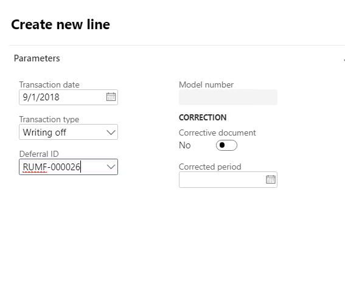

# Write off deferrals (Russia)

[!include [banner](../../includes/banner.md)]

## Write off deferrals

1. Go to **General ledger** \> **Journal entries** \> **Deferrals journal**.
2. On the Action Pane, select **New**.
3. In the **Name** field, select a journal name.
4. On the Action Pane, select **Lines** to open the **Journal voucher** page.
5. On the Action Pane, select **Group operations** \> **Writing off** to open the **Deferrals writing off** dialog box.
6. In the **Transaction date** field, select the transaction date.
7. On the **Records to include** FastTab, select **Filter** to open the **Inquiry** dialog box, where you can set up the selection criteria.
8. Select **OK** to return to the **Journal voucher** page. Details for deferrals write-off vouchers that have a status of **In Process** are shown, based on the filter parameters that you set up in the **Inquiry** dialog box.

    

9. On the Action Pane, select **Functions** \> **Edit line** to edit the deferrals journal before you post it.
10. On the Action Pane, select **Post** \> **Post** to post the deferrals write-off voucher details.

You can create a journal line for a single write-off.

1. Go to **General ledger** \> **Journal entries** \> **Deferrals journal**.
2. On the Action Pane, select **New**.
3. In the **Name** field, select a journal name.
4. On the Action Pane, select **Lines** to open the **Journal voucher** page.
5. On the **Overview** tab, select **New** to create a line.
6. In the **Transaction type** field, select **Writing off**.
7. In the **Deferral ID** field, select the deferral to create a receipt transaction for.

    The fields in the **Correction** section of the **Create new line** dialog box are used to create a corrective transaction for a closed period.

    

8. Select **OK**. Voucher lines are created for the selected deferral on the **Journal voucher** page.
9. On the Action Pane, select **Functions** \> **Edit line** to edit the deferrals journal before you post it.
10. On the Action Pane, select **Post** \> **Post** to post the deferrals write-off voucher details.

## Reverse the writing off of deferrals

1. Go to **General ledger** \> **Journal entries** \> **Deferrals journal**.
2. On the Action Pane, select **New**.
3. In the **Name** field, select a journal name.
4. On the Action Pane, select **Lines** to open the **Journal voucher** page.
5. On the Action Pane, select **Group operations** \> **Writing off reversal** to open the **Writing off reversal** dialog box.
6. In the **Reversal date** field, select the transaction date.
7. On the **Records to include** FastTab, select **Filter** to open the **Inquiry** dialog box, where you can set up the selection criteria.
8. Select **OK** to return to the **Journal voucher** page.
9. On the Action Pane, select **Post** \> **Post** to post the reversal voucher. The deferrals and ledger transactions that are specified in the posting profile are generated.

[!INCLUDE[footer-include](../../../includes/footer-banner.md)]
