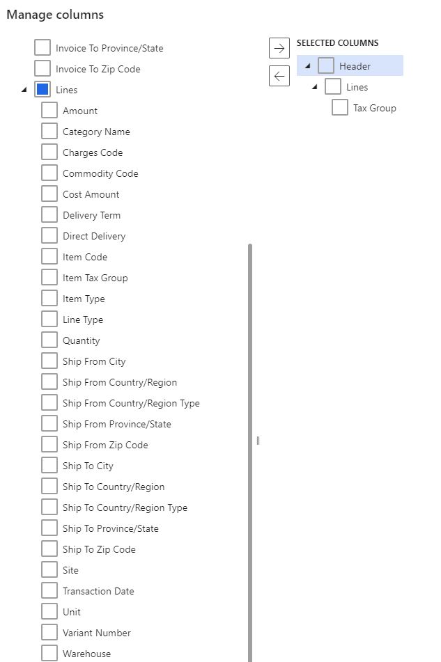

---
# required metadata 

title: Set up tax groups
description: This topic explains how to set up tax groups in the the Tax Calculation service. 
author: wangchen
ms.date: 11/30/2021
ms.topic: business-process 
ms.prod:  
ms.technology:  

# optional metadata 

ms.search.form: TaxTable, TaxData   
audience: Application User 
# ms.devlang:  
ms.reviewer: kfend
# ms.tgt_pltfrm:  
# ms.custom:  
ms.search.region: Global
# ms.search.industry: 
ms.author: wangchen
ms.search.validFrom: 2021-10-26 
ms.dyn365.ops.version: Version 10.0.21 
---

# Set up tax groups

[!include [banner](../includes/banner.md)]

This topic explains how to set up tax groups in the Tax Calculation service. This topic also explains how to set up the tax group applicability matrix and configure lines within the matrix.

Tax groups in the Tax Calculation service have a similar concept as sales tax groups in Dynamics 365 Finance. They are a group of tax codes. The Tax Calculation service uses the intersection of tax group and item tax group to determine the tax codes.

However, the difference is that there is no additional parameter like **Use tax** and **Exempt tax** on tax groups in the Tax Calculation service. These parameters are now available at the tax code level.

> [!IMPORTANT]
> Tax group setup in the Tax Calculation service is legal entity-agnostic. You can complete this setup in the Regulatory Configuration Service (RCS) only once. When you enable the Tax Calculation service in Finance, tax groups are synchronized automatically for the selected legal entity.

## Set up a tax group

Complete the steps in this section to set up a tax group.

1. Sign into [Regulatory Configuration Service](https://marketing.configure.global.dynamics.com/).
2. Go to **Workspaces** > **Globalization features** > **Tax calculation**.
3. Select the feature and version which you want to set up, and select **Edit**.
4. On the **General** tab, select **Configuration version**.
5. On the **Tax group** tab, select **Manage Column**. If this is your first time configureing a tax group, the **Manage column** page will be populated automatically.
6. Expand **Lines** and select the **Tax group** check box.

   

7. Select the **Add** arrow to add this field into the **Selected Columns** list.

   

8. Select **OK**.

## Configure tax group

After you set up a tax group, the tax group applicability rule matrix is created. You can add lines to the matrix to configure the tax group.

1. On the **Tax group** tab, select **Add** and in the **Tax group** field, enter the name of the tax group.

  > [!IMPORTANT]
  > We recommend you limit the length of the sales tax group name to 10 characters. This name is synchronized with Finance which has a limit of 10 characters for the sales tax group name.

2. Select the tax codes to include in this tax group. You can select multiple tax codes under one tax group by selecting the radio button next to the tax code name.

    

3. Repeat step 1 and 2 to add multiple tax groups.

[!INCLUDE[footer-include](../../includes/footer-banner.md)]
