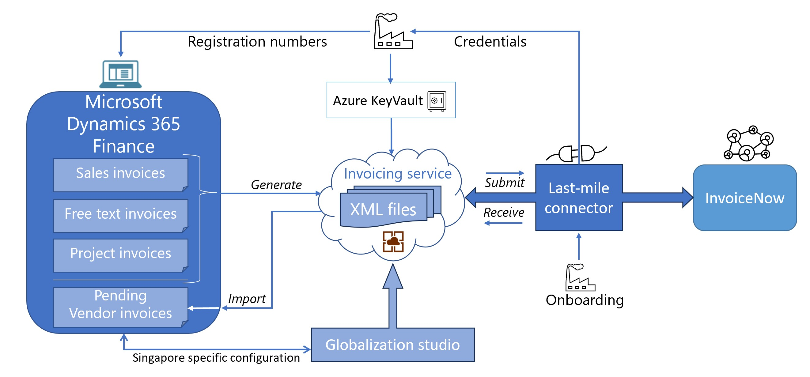
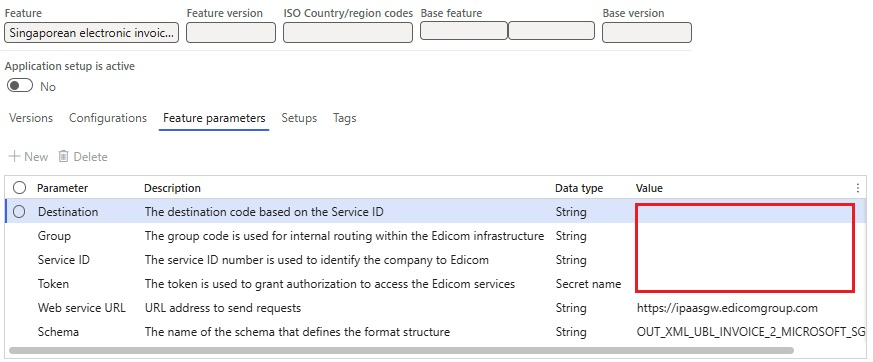
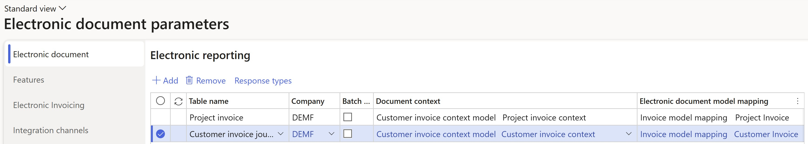
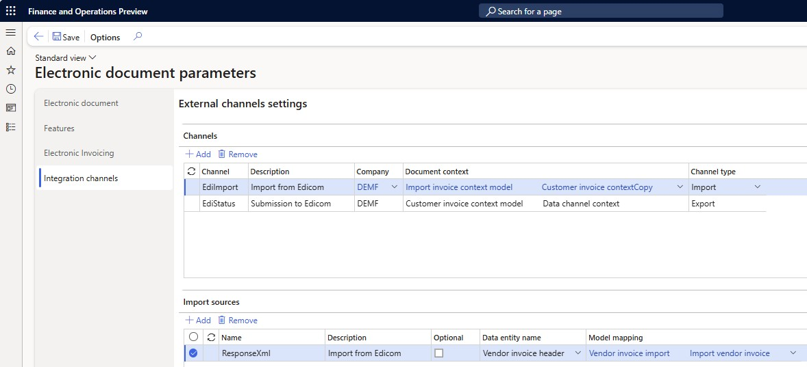

# Electronic invoicing for Singapore

[!include [banner](../../includes/banner.md)]

This article provides information to help you get started with Electronic invoicing for Singapore. It includes information about how to configure the system so that you can generate, submit, and receive electronic invoices in the Singaporean extension of the [PEPPOL International (PINT)](https://www.peppolguide.sg/billing/) format in Microsoft Dynamics 365 Finance using the last-mile connector.

> [!NOTE]
> The electronic invoicing approach that this article describes is implemented by using an invoicing service that's applicable only to cloud deployments of Microsoft Dynamics 365 Finance.

## Prerequisites

Before you begin the procedures in this article, the following prerequisites must be met:

- The company must be a registered tax payer in Singapore.
- The company must have a signed agreement with the provider of electronic document delivery service that secures electronic document interchange in the PEPPOL (PINT) format.
- Among the registered profile IDs, the company should have the following profile that Microsoft Dynamics 365 Finance uses for electronic document interchange:

    - **urn:fdc:peppol.eu:2017:poacc:billing:01:1.0** – This profile is used to interchange documents in PEPPOL (PINT) format.

- The company must obtain, from the service provider, the required credentials to enable integration of the Electronic Invoicing service with the [Electronic Invoicing service independent software vendor (ISV) last-mile connector](../global/e-invoicing-isv-connector.md).

   > [!NOTE]
   > Current implementation assumes [Edicom](https://edicomgroup.com/electronic-invoicing) as the Electronic Invoicing ISV last-mile connection service provider. For more information refer to: [Edicom integration with Microsoft Dynamics 365](https://edicomgroup.com/edicom-microsoft?365).

- Become familiar with Electronic invoicing as it's described in [Electronic Invoicing service overview](../global/gs-e-invoicing-service-overview.md) and [Electronic invoicing components](../global/gs-e-invoicing-administration-integration-components.md).
- Do the common part of Electronic Invoicing service configuration as described in [Electronic invoicing configuration](../global/gs-e-invoicing-set-up-overview.md).

## Create the Azure Key Vault configuration

Create an Azure key vault to store the required secrets that are issued for your company. For more information, see [Configure Azure resources for Electronic invoicing](../global/gs-e-invoicing-set-up-azure-resources.md).

Add the following required elements in the key vault:

- The secret for the **token** that grants authorization to access the Edicom services. Must be preliminary obtained from Edicom as was described in the prerequisites.

## Configure electronic invoicing Key Vault parameters

To configure electronic invoicing Key Vault parameters, follow these steps.

1. Go to **Organization administration** \> **Setup** \> **Electronic document parameters**.
1. On the **Electronic invoicing** tab, in the **Key Vault settings** section, in the **Key Vault** field, select the reference to the key vault that you created in the previous section of this article.
1. In the **SAS token secret** field, select the name of the storage account secret URL that must be used to authenticate access to the storage account.
1. Select **Key Vault parameters**.
1. On the **Key Vault parameters** page, in the **Certificates** section, select **Add** to create new elements of the appropriate type for each secret that is described in the previous section.

    - The **token** element of the **Secret** type.

> [!NOTE]
> The value in the **Name** column should match the name of the secret that are described in the previous section.

## Import the electronic invoicing feature

1. Go to **Globalization Studio**, and select the **Electronic invoicing** tile. Then import the latest version of the **Singaporean electronic invoice (SG)** globalization feature as described in [Import features from the repository](../global/gs-e-invoicing-import-feature-global-repository.md).
1. In the **Electronic reporting** workspace, on the **Reporting configurations** tile, make sure that the following Electronic reporting configurations are successfully imported as result of the **Singaporean electronic invoice (SG)** globalization feature import.

    - **Invoice model**
    - **Invoice model mapping**
    - **PINT Sales e-invoice** 
    - **PINT Sales e-credit note**
    - **PINT Project e-invoice**
    - **PINT Project e-credit note**
    - **Customer invoice context model**
    - **Response message model**
    - **Edicom Response Processing**
    - **Error log import Json**

    > [!NOTE]
    > If due to some reason the mentioned Electronic reporting configurations were not imported then import them manually as described in [Import Electronic reporting (ER) configurations from Dataverse](../global/workspace/gsw-import-er-config-dataverse.md).

1. In the **Electronic reporting** workspace, on the **Reporting configurations** tile, additionally import the latest versions of the following Electronic reporting configurations required for receiving incoming vendor invoices.

    - **Vendor invoice import**
    - **Vendor invoice Mapping to destination**
    - **Import invoice context model**
    
## Configure the electronic invoicing feature

Some of the parameters from the **Singaporean electronic invoice (SG)** electronic invoicing feature are published with default values. Before you deploy the electronic invoicing feature to the service, review the default values, and update them as required, so that they better reflect your business operations.

To review and update the **Singaporean electronic invoice (SG)** electronic invoicing feature configuration, follow these steps.

1. Go to **Globalization Studio**, and select the **Electronic invoicing** tile. Then  Globalization feature as described in [Import features from the repository](../global/gs-e-invoicing-import-feature-global-repository.md).
1. Create a copy of the previously imported **Singaporean electronic invoice (SG)** Globalization feature, and select your configuration provider for it, as described in [Create a Globalization feature](../global/gs-e-invoicing-create-new-globalization-feature.md).
1. On the **Versions** tab, verify that the **Draft** version is selected.
1. On the **Feature parameters** tab, specify values for the following connection and integration parameters. These parameters are required for interoperation with **Edicom** services.

    - **Service ID** – The service ID (Domain) number obtained from Edicom is used for company identification.
    - **Group** – The group code is used for internal routing within the Edicom infrastructure.
    - **Destination** – The destination is constructed from the service ID number concatenated with the string **_EDIWIN**. For example, if the service ID number is **123456**, enter **123456_EDIWIN**.
    - **Token** – select the name of the [token](#Tok) that you previously created.

    

1. The copy of the feature is always created as a **Draft** version. Complete and deploy the feature as described in [Complete and deploy a Globalization feature](../global/gs-e-invoicing-complete-publish-deploy-globalization-feature.md).

## Configure electronic document parameters

1. Go to **Organization administration** \> **Setup** \> **Electronic document parameters**.
1. On the **Electronic document** tab, add records for the **Customer Invoice journal** and **Project invoice** table names.
1. For each table name, set the **Document context** and **Electronic document model mapping** fields in accordance with [Set up electronic invoicing parameters](../global/gs-e-invoicing-set-up-parameters.md#set-up-electronic-document-parameters).

> [!NOTE]
> If you have created the derived analogues of the mentioned above Electronic Reporting configurations then use it instead of standard ones.
    
4. On the **Integration channels** tab, in the **Channels** section, select **Add** to create a new channel.
5. In the **Channel** field, enter the **EdiStatus** value. You must enter the value exactly as it appears here. The system will use it as the channel for outgoing electonic invoices submission.
6. In the **Company** field, select a required legal entity.
7. In the **Document context** field, select the **Data channel context** mapping from the **Customer invoice context model** configuration.
8. In the **Channel type** field, select the **Export** value.
9. In the **Channels** section, select **Add** to create another channel.
10. In the **Channel** field, enter the **EdiImport** value. You must enter the value exactly as it appears here. The system will use it as the channel for incoming electonic invoices import.
11. In the **Company** field, select a required legal entity.
12. In the **Document context** field, select the **Data channel context** mapping from the **Import invoice context model** configuration.
13. In the **Channel type** field, select the **Import** value.
14. In the **Import sources** section, select **Add** to create an import source.
15. in the **Name** field, enter the **ResponseXml** value. You must enter the value exactly as it appears here.
16. In the **Data entity name** field, select the **Vendor invoice header** entity.
17. In the **Model mapping** field, select the **Import vendor invoice** mapping from the **Vendor invoice import** configuration.
18. Select **Save**, and close the page. 

> [!NOTE]
> If you need to use other integration channels, different from **EdiStatus** and **EdiImport**, then you must do additional configuration of the feature and the context configurations.

## Configure registration numbers

If the mentioned below registration types and registration categories already exist, you can skip this procedure.

### Configure UEN Number

To configure the registration number which represents the Unique Entity Number (UEN), follow the steps described in this chapter: [UEN of the business user](apac-sgp-iras-audit-file.md#company-uen)

### Configure GST Number

To configure the registration number which represents the Goods and Services Tax (GST), follow the steps described in this chapter: [GST Registration Number of the business user](apac-sgp-iras-audit-file.md#company-gst)

## Configure address structure

To configure the structure of the postal address to define all required elements, follow these steps.

1. Go to **Organization administration** \> **Global address book** \> **Addresses** \> **Address setup**.
1. Make sure that at least the following mandatory elements are configured:

    - Country code
    - Postal code
    - Street

## Configure legal entity data

### Enter the address

To enter the address, follow these steps.

1. Go to **Organization administration** \> **Organizations** \> **Legal entities**.
1. Select a legal entity.
1. On the **Addresses** FastTab, add a valid primary address for the selected legal entity.

### Seller identification

To enter the registration numbers, follow these steps.

1. Go to **Organization administration** \> **Organizations** \> **Legal entities**.
1. On the Action Pane, select **Registration IDs**.
1. On the **Registration ID** FastTab, select **Add** to create a registration ID.
1. In the **Registration type** field, select the [Unique Entity Number (UEN)](#UEN) registration type that you created earlier.
1. In the **Registration number** field, enter a valid UEN registration number for the selected legal entity.
1. Select **Add** to create another registration ID.
1. In the **Registration type** field, select the [Goods and Services Tax (GST)](#GST) registration type that you created earlier.
1. In the **Registration number** field, enter a valid GST registration number for the selected legal entity.

    The **UEN** number is entered in the **Invoice\\cac:AccountingSupplierParty\\cac:Party\\cbc:EndpointID** element and the **GST** number is entered in the **Invoice\\cac:AccountingSupplierParty\\cac:Party\\cac:PartyTaxScheme\\cbc:CompanyID** element in the electronic invoice XML file that is generated. It's used as the seller's identification during the submission process.

> [!NOTE]
> The contact information for the legal entity is automatically retrieved from the related **Person** that is associated with the current user in Dynamics 365 Finance.

## Configure customer data

### Enter the address

To enter the address, follow these steps.

1. Go to **Accounts receivable** \> **Customers** \> **All customers**.
1. Select a customer.
1. On the **Addresses** FastTab, add a valid address for the selected customer.

### Enter the contact person

To enter the contact person, follow these steps.

1. Go to **Accounts receivable** \> **Customers** \> **All customers**.
1. Select a customer.
1. On the **Sales demographics** FastTab, in the **Primary contact** field, select the person who is considered the buyer's contact.

    > [!NOTE]
    > All available contact persons must already be defined for the selected customer. Make sure that the selected contact person has a valid email address and phone number.

### Buyer identification

To enter the registration numbers, follow these steps.

1. Go to **Accounts receivable** \> **Customers** \> **All customers**.
1. On the Action Pane, on the **Customer** tab, in the **Registration** group, select **Registration IDs**.
1. On the **Registration ID** FastTab, select **Add** to create a registration ID.
1. In the **Registration type** field, select the [Unique Entity Number (UEN)](#UEN) registration type that you created earlier.
1. In the **Registration number** field, enter a valid BRN registration number for the selected customer.
1. Select **Add** to create another registration ID, if required.
1. In the **Registration type** field, select the [Goods and Services Tax (GST)](#GST) registration type that you created earlier.
1. In the **Registration number** field, enter a valid SST registration number for the selected customer.

   The **UEN** number is entered in the **Invoice\\cac:AccountingCustomerParty\\cac:Party\\cbc:EndpointID** element and the **GST** number is entered in the **Invoice\\cac:AccountingCustomerParty\\cac:Party\\cac:PartyTaxScheme\\cbc:CompanyID** element in the electronic invoice XML file that is generated. It's used as the buyer's identification during the submission process.

> [!NOTE]
> For both, Seller and Buyer identification, the schema **0195** (Singapore UEN identifier) will be used by default according to the [Electronic Address Scheme (EAS)](https://docs.peppol.eu/poacc/billing/3.0/codelist/eas/). If there is a necessity to redefine the default schema then perform the steps described in the next section. Otherwise you can ignore the next section.

## Configure identification schemas

Follow the configuration steps in this section only if you need to redefine the default identification schemas for Sellers and/or Buyers.

### Configure electronic document properties

To configure electronic document properties, follow these steps.

1. Go to **Accounts receivable** \> **Setup** \> **Electronic document property types**, and select **New**.
1. In the **Type** field, enter **CompanyEndpointType**. You must enter the value exactly as it appears here. It will be used for the **Seller** identification schema definition.
1. Select **Applicability** to add an applicable table.
1. On the **Electronic document property type applicability setup** page, in the **Table name** field, select the **Legal entities** table name.
1. Save your changes, and return to the **Electronic document property types** page.
1. Select **New** to created another Electronic document property type.
1. In the **Type** field, enter **CustomerEndpointType**. You must enter the value exactly as it appears here. It will be used for the **Buyer** identification schema definition.
1. Select **Applicability** to add an applicable table.
1. On the **Electronic document property type applicability setup** page, in the **Table name** field, select the **Customers** table name.
1. Save your changes, and return to the **Electronic document property types** page.
1. Save your changes, and close the page.

    

### Enter the Seller schema code

To enter the Seller schema code, follow these steps.

1. Go to **Organization administration** \> **Organizations** \> **Legal entities** and select a legal entity.
1. Select **Electronic document properties** from the Action Pane.
1. In the **Value** column, enter the required Seller schema code.

### Enter the Buyer schema codes

To enter the Buyer schema codes, follow these steps.

1. Go to **Accounts receivable** \> **Customers** \> **All customers**.
1. Select a specific customer in the list, and then, on the Action Pane, on the **Customer** tab, in the **Properties** group, select **Electronic document properties**.
1. In the **Value** column, enter the required Buyer schema code.

> [!NOTE]
> The schema codes definend via the Electronic document property types have a higher priority then the default **0195** schema code.

## Configure units of measure

To configure units of measure, follow these steps.

1. Go to **Organization administration** \> **Setup** \> **Units** \> **Units**.
1. Select a unit ID, and then select **External codes**.
1. On the **External codes** page, in the **Overview** section, in the **Code** column, enter a code that is equal to the selected unit ID.
1. In the **Standard code** column, select the checkbox.
1. In the **Value** section, in the **Value** field, enter the external code according to [the required codification](https://docs.peppol.eu/poacc/billing/3.0/codelist/UNECERec20/).

    > [!NOTE]
    > For scenarios where no specific units of measure are assumed, the default value **EA** is used.

## Configure sales tax codes

1. Go to **Tax** \> **Indirect taxes** \> **Sales tax** \> **Sales tax codes**.
2. Select a sales tax code, and then, on the Action Pane, on the **Sales tax code** tab, in the **Sales tax code** group, select **External codes**.
3. In the **Overview** section, create a line for the selected unit. In the **External code** field, enter the sales tax code you selected in step 2.
4. In the **Value** section, in the **Value** field, enter an external code which must be one of the Singapore specific [Duty or tax or fee category codes](https://www.peppolguide.sg/billing/codelist/SGTaxCat/). 

## Issue electronic invoices

After you complete all the required configuration steps, you can generate and submit electronic invoices for posted invoices by going to **Organization administration** \> **Periodic** \> **Electronic documents** \> **Submit electronic documents**. Learn more about how to generate electronic invoices in [Submit electronic documents](../global/e-invoicing-submit-electronic-documents.md).

> [!IMPORTANT]
> In current implementations, the standard submission procedure that was described earlier only generates electronic invoices and stores them on the service side. The invoices aren't submitted. Submission of electronic invoices requires that you complete the following additional steps.

To submit the generated electronic invoices, follow these steps.

1. Go to **Organization administration** \> **Periodic** \> **Electronic documents** \> **Run submission process in export channels**.
1. In the **Channel** field, select the export channel that you [previously created](#ExChannel), and then select **OK**.

You can inquire about the results of the submission by going to **Organization administration** \> **Periodic** \> **Electronic documents** \> **Electronic document submission log**. Learn more in [Work with Electronic document submission log](../global/e-invoicing-submission-log.md).

> [!NOTE]
> Submited electronic invoices will be also available in your [Ediwin](https://ediwin.edicomgroup.com/) portal, in the **Outbound** folder and its subfolders, where you can monitor further processing of the documents.

## Receive incoming electronic invoices

To import incoming invoices, some additional parameters must be configured directly in Microsoft Dynamics 365 Finance.

You must configure the following types of master data to provide a match for incoming electronic invoices:

- Vendors
- Products
- Units

Follow the configuration steps in [Import vendor electronic invoices](../europe/emea-peppol-import.md). Start from the [Configure vendor data](../europe/emea-peppol-import.md#configure-vendor-data) section.

### Receive electronic invoices

After you complete all the required configuration steps, you can receive incoming electronic invoices in the **PEPPOL** format.

> [!NOTE]
> You can review incoming electronic invoices in the **Inbound** folder and its subfolders, in your [Ediwin](https://ediwin.edicomgroup.com/) portal.

To receive electronic invoices, follow these steps.

1. Go to **Organization administration** \> **Periodic** \> **Electronic documents** \> **Receive electronic documents**.
1. Select **OK**, and then close the page.

To view the receipt logs for processed electronic invoices, go to **Organization administration** \> **Periodic** \> **Electronic documents** \> **Electronic document receipt log**.

To view successfully received invoices, go to **Accounts payable** \> **Invoices** \> **Pending vendor invoices**.

## Additional resources

- [Electronic invoicing coverage for supported and planned countries and regions](../global/e-invoicing-coverage.md)

[!INCLUDE[footer-include](../../../includes/footer-banner.md)]

