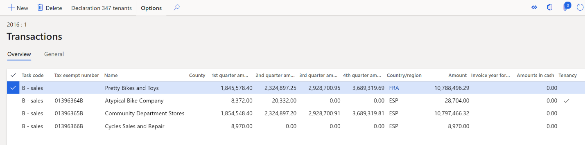
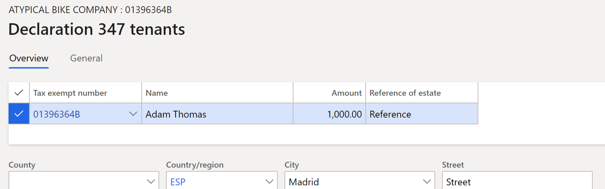
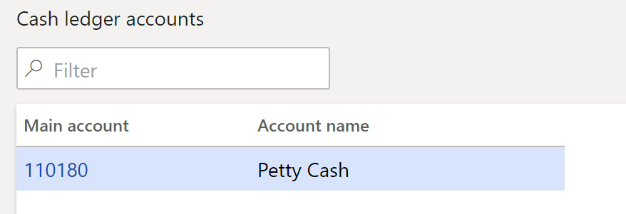
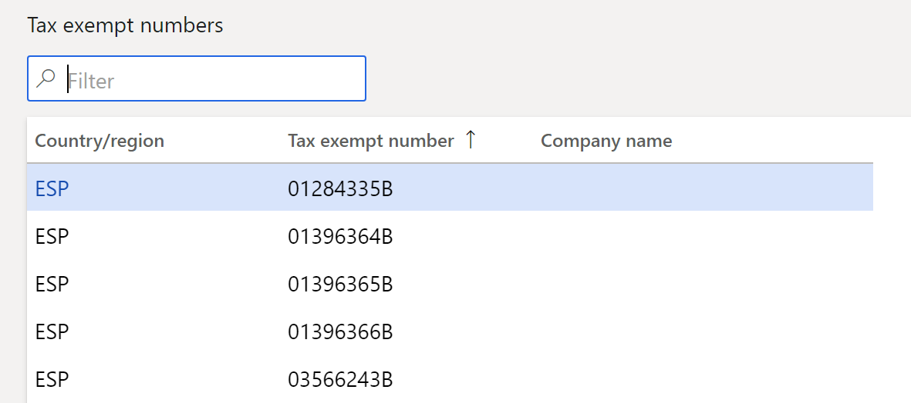
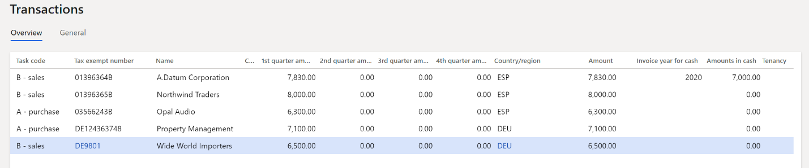
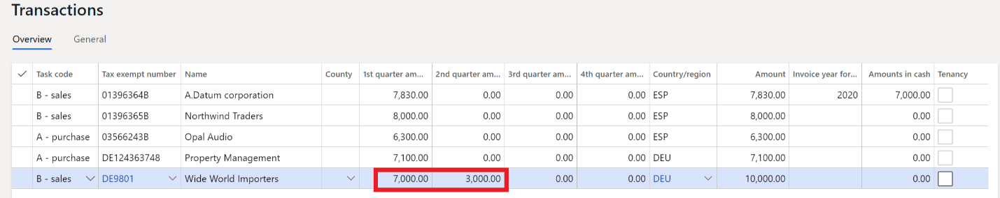
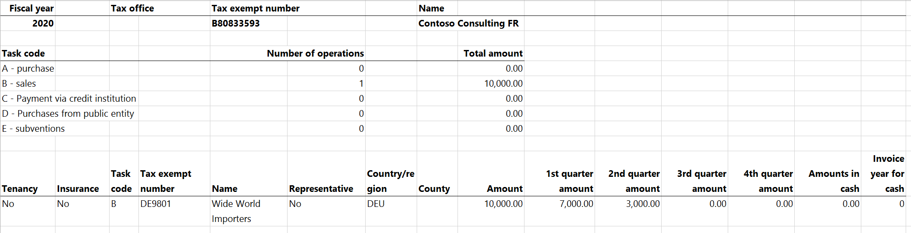

# Declaration 347 report

[!include [banner](../../includes/banner.md)]

This article explains how to generate the Declaration 347 report available to legal entities that have their primary address in Spain in Microsoft Dynamics 365 Finance.

The Declaration 347 report must be electronically submitted to the tax authorities every year during the first 20 days of March. It must include all the information from the previous fiscal year (January through December). All transactions over 3,000 Euros must be included. Also, cash payment amounts that exceed 6,000 Euros in a year must be included. Amounts are split per quarter over the year.

You can use the **Declaration 347** form to generate the Declaration 347 report. All invoices are grouped either by tax exempt number and customer/vendor number, or only by tax exempt number. The resulting aggregated line is included on the **Declaration 347** form if the total amount of invoices on the line exceeds the value of the **Minimum amount** field that's set in the **Declaration 347** dialog. If some invoices are paid in cash, and the total amount of cash payments for invoices on the line exceeds the value of the **Minimum amount of payments in cash** field in the **Declaration 347** dialog, this amount will be shown in the **Amounts in cash** field of the declaration.

## Prerequisites

The following procedures must be completed up before you start work with the Declaration 347 report.

### Set up a legal entity

To set up a legal entity, follow these steps:

1. In Dynamics 365 Finance, go to **Organization administration** \> **Organizations** \> **Legal entities**, and select your legal entity.
1. On the **Addresses** FastTab, create an address.
1. In the **Country/region** field, select **Spain**, and mark the address as **Primary**.
1. Fill in the remaining address components.
1. On the **Tax registration** FastTab, in the **Tax registration number** field, specify the tax registration number for your company.

### Set up contact information

To set up contact information, follow these steps:

1. In Dynamics 365 Finance, go to **Organization administration** \> **Organizations** \> **Legal entities**.
1. On the **Contact information** tab, add lines for **Phone** and **Email**, and set them to **Primary**.

### Set up tax exempt numbers

To set up tax exempt numbers, follow these steps:

1. In Dynamics 365 Finance, go to **Tax** \> **Setup** \> **Sales tax** \> **Tax exempt numbers**.
1. For each tax exempt number, create a record on the page, and specify the following information:
    -   **Country/region:** Select the country or region of the tax registration of the counterparty.
    -   **Tax exempt number:** Enter the tax exempt number of the counterparty.
    -   **Company name:** (Optional) Enter the name of the counterparty.

## Set up the Declaration 347 report

To set up the Declaration 347 report, follow these steps:

1. In [Microsoft Dynamics Lifecycle Services (LCS)](https://lcs.dynamics.com/V2), in the Shared asset library, download the latest versions of the Electronic reporting (ER) configurations for the following VAT declaration formats:
    - Declaration 347 export format (ES)
    - Declaration 347 report format (ES)

    For more information, see [Download Electronic reporting configurations from Lifecycle Services](../../../fin-ops-core/dev-itpro/analytics/download-electronic-reporting-configuration-lcs.md).

1. In Dynamics 365 Finance, go to **Tax** \> **Setup** \> **Sales tax** \> **Cash ledger accounts**.
1. On the **Cash ledger accounts** page, specify the cash ledger accounts that are required for the Declaration 347.
1. Go to **Tax \> Setup \> Sales tax \> 347 validation lists**.
1. On the **Validation list** page, specify any sales tax groups that should be excluded from the Declaration 347.

## Generate the Declaration 347 report

To generate the Declaration 347 report, follow these steps:

1. In Dynamics 365 Finance, go to **Tax \> Declarations \> Sales tax \> Declaration 347**.
1. On the **Declaration 347** form, select **Generate**.
1. In the **Declaration 347** dialog, set the following fields.

    | **Field**                          | **Description**                                                                                                               |
    |------------------------------------|-------------------------------------------------------------------------------------------------------------------------------|
    | Fiscal year                        | Enter the fiscal year for which to generate the Declaration 347.                                                                    |
    | Surname and given name               | Enter the surname and given name of the company representative for the Declaration 341.                                            |
    | Minimum amount                     | Enter the minimum amount to report on the declaration.                                                                        |
    | Minimum amount of payments in cash | Enter the minimum cash payment amount to report on the declaration.                                                           |
    | Document number of the declaration | Enter the unique 13 character document identification code of the declaration.                                                |
    | Replacement declaration            | Set this option to **Yes** to indicate that the declaration is being generated as a replacement for the original declaration. |
    | Previous declaration number        | If you set the **Replacement declaration** option to **Yes**, enter the document number of the original declaration.          |
    | Group only by tax exempt number    | Set this option to **Yes** to group all customer and vendor transactions by tax exempt number only.                           |

1. Select **OK** to generate the data on the **Declaration 347** form.
1. Review the information on the declaration.

    

    The **General** tab has the following fields.

    | Field                                | Description   |
    |--------------------------------------|-------------------------------------|
    | Fiscal year                        | The fiscal year for the Declaration 341. |
    | Replacement                          | A selected checkbox indicates that the declaration is a replacement declaration. This checkbox is equivalent to the **Replacement declaration** option in the **Declaration 347** dialog.                                                                                                          |
    | Tax exempt number                  | The tax exempt number of the company for which the Declaration 347 is generated.    |
    | Name                                 | The name of the company for which the Declaration 347 is generated.   |
    | Reported                             | Select this checkbox to indicate that the Declaration 347 reporting is finished and has been sent to the Spanish tax authorities.  When the **Reported** checkbox is   selected, the declaration lines can't be edited.                                                                                  |
    | Minimum amount                     | The minimum amount, in the company's accounting currency, that was required to generate the Declaration 347. By default, all transactions that exceed 500,000 euros are included on   the declaration. This amount is filled in for the **Minimum amount** field of the **Declaration 347** dialog.  |
    | Minimum amount of payments in cash | The minimum amount of cash payments required to report the cash payment amount.   This amount is filled in from the **Minimum amount of payments in cash** field of the **Declaration 347** dialog.       |
    | Presentation type                  | Select the media type that is used to declare the Declaration 347: - Telematic -   CD-R - Report  The default value is **Telematic**.   |
    | Presentation date                  | The date when the report is generated. |
    | Reported by                        | The identifier (ID) of the user who generated the report.     |
    | Telephone                            | The telephone number of the contact person. This value is transferred from the setting that you defined in the **Prerequisites** section earlier in this article.  |
    | Contact                              | Enter the name of the contact person.  |
    | Document number of the declaration | The document number of the Declaration 347. This number is filled in from the **Document number of the declaration** field of the **Declaration 347** dialog. |
    | Previous declaration number        | The document number of the original Declaration 347. This number is filled in from the **Previous declaration number** field of the **Declaration 347** dialog.     |

    The **Totals** tab shows the number of operations and the total amounts of purchases and sales.

1. Select **Transactions** to review and modify the information for the aggregated customer transactions and vendor transactions before you generate the report as an ASCII file.

    

1. On the **Transactions** page, on the **General** tab, review the following fields.

    | Field                                       | Description  |
    |---------------------------------------------|------------------------------------------------------------------------------------------------------------------------------------------------------------------------------------------------------------------------------------------------------------------------------------------------------------------------------------------------------------------------------------------------------------------------------------------------------------------------------------------------------------------------------------------------------------------------------------------------------------------------------------------------------------------------------|
    | Task   code                                 | The task code that describes the   origin of the transaction: - **A - Purchase**: This task code is automatically defined for purchase transactions. - **B - Sales**: This task code is automatically defined for sales transactions. -   **C - Payment via credit institution**: Select this value if the transaction is a payment that was made through a credit institution. - **D -   Purchases from public entity**: Select this value if the transaction is a purchase from a public entity. - **E - Subventions**: Select this value if the transaction is a subvention that is received from public administrations or private companies. |
    | Tax exempt number                         | The tax exempt number of the customer or vendor.  |
    | Name                                        | The name of the customer or vendor.    |
    | County                                      | The county of the customer or vendor.   |
    | Country/region                              | The International Organization for Standardization (ISO) code for the customer's or vendor's country or region.   |
    | 1st quarter amount                        | The total amount of aggregated transactions that were posted in the first quarter of the year.  |
    | 2nd quarter amount                        | The total amount of aggregated transactions that were posted in the second quarter of the year.  |
    | 3rd quarter amount                        | The total amount of aggregated transactions that were posted in the third quarter of the year.  |
    | 4th quarter amount                        | The total amount of aggregated transactions that were posted in the fourth quarter of the year.  |
    | Amount                                      | The total amount of the aggregated transactions in the accounting currency.  |
    | Amount settled                            | The amount in the accounting currency. |
    | Amounts in cash                           | The amount of payments in cash for the transaction. This value is filled in only for customer transactions.  |
    | Invoice year of cash                      | The year of the invoice that is associated with cash payments on the transaction line. This field is set if the **Amounts is cash** field is set.  |
    | Tenancy                                     | Select this checkbox to indicate that the transaction is a tenancy process.  |
    | Representative                              | Select this checkbox to indicate that the tax exempt number is attached to a legal representative of the customer or vendor.    |
    | Insurance process                         | Select this checkbox to indicate that the transaction is an insurance process.    |
    | Special regime for cash accounting method | Select this checkbox to indicate that the **Special regime for cash accounting** method is set up for this period.   |
    | Deposit                                     | Select this checkbox to indicate that the transaction is a deposit.    |
    | Reverse charge                            | Select this checkbox to indicate that the reverse charge is used for this transaction.   |

1. If you selected the **Tenancy** checkbox on the **General** tab, select **Declaration 347 tenants** to add information about tenants.

    

1. On the **Declaration 347 tenants** page, on the **Overview** tab, set the **Name**, **Amount**, **Reference of estate**, **County**, **Country/region**, **City**, and **Street** fields.
1. On the **General** tab, set the **ZIP/postal code**, **Address abbreviation**, **Street No.**, **Entrance**, **Floor**, **Door**, and **Location code** fields for the building or property.
1. Close the **Declaration 347 tenants** page and the **Transactions** page.
1. On the **Declaration 347** form, select **Output \> Export to ASCII file**.
1. In the **Export to ASCII file** dialog, in the **Format mapping** field, select the **Declaration 347 export format (ES)** format that you downloaded earlier.
1. In the **File name** field, enter the file name, and then select **OK**.
1. Select **Output \> Print**.
1. In the **Declaration 347** dialog, in the **Format mapping** field, select the **Declaration 347 report format (ES)** format that you downloaded earlier.
1. In the **File name** field, enter the file name, and then select **OK**. You can review the format of the report in the example later in this article.

## Generate the delta report

You can create a new Declaration 347 for the same period and use the delta report to view lines that differ from the lines of the original Declaration 347.

To generate the delta report, follow these steps:

1. In Dynamics 365 Finance, go to **Tax** \> **Declarations** \> **Sales tax** \> **Declaration 347**, and select **Generate** to generate the report that has corrections.
1. In the **Declaration 347** dialog, set the **Replacement declaration** option to **Yes** to identify this declaration as a correction of the original declaration.
1. In the **Previous declaration number** field, enter the declaration number of the original declaration, and then select **OK**.
1. Select **Output \> Delta report**.
1. In the **Delta report** dialog, in the **Format mapping** field, select the **Declaration 347 report format (ES)** format that you downloaded earlier.
1. In the **File name** field, enter the file name, and then select **OK**. You can review the format of the report in the example later in this article.

## Example

Consider an example in the DEMF legal entity.

### Set up example

To set up an example in the DEMF legal entity, follow these steps:

1. In Dynamics 365 Finance, go to **Organization administration** \> **Setup** \> **Organization** \> **Legal entities**.
1. On the **Tax registration** FastTab, in the **Tax registration number** field, enter **B80833593**.
1. Go to **Tax** \> **Setup** \> **Sales tax** \> **Cash ledger accounts**, and select **New** to create a line.
    
    

1. Go to **Tax** \> **Setup** \> **Sales tax** \> **Tax exempt number** and select **New** to create a line.

    

### Customer transactions

To set up customer transactions, follow these steps:

1. In Dynamics 365 Finance, go to **Accounts receivable** \> **Customers** \> **All customers**, and select customer **DE-010**.
1. On the **Address** FastTab, set **ESP** as the country/region, and then, on the **Invoice and Delivery** FastTab, set the **Tax exempt number** field to **01396364B**.
1. Select **Save**, and close page.
1. Select customer **DE-011**.
1. On the **Address** FastTab, set **ESP** as the country/region, and then, on the **Invoice and Delivery** FastTab, set the **Tax exempt number** field to **01396365B**.
1. Select **Save**, and close page.
1. Select customer **DE-012**.
1. On the **Address** FastTab, set **ESP** as the country/region, and then, on the **Invoice and Delivery** FastTab, set the **Tax exempt number** field to **01396366B**.
1. Select **Save**, and close page.
1. Select customer **DE-014**.
1. On the **Address** FastTab, verify that **DEU** is set as the country/region, and then, on the **Invoice and Delivery** FastTab, verify that the **Tax exempt number** field is set to **DE9801**.
1. Go to **Accounts receivable** \> **Invoices** \> **All free text invoices**, create the following four invoices, and then post them.

    | **Invoice** | **Customer** | **Date**          | **Delivery address** | **Amount** |
    |-------------|--------------|-------------------|----------------------|------------|
    | FTI-000007  | DE-012       | February 1, 2020  | ESP                  | 4,000.00   |
    | FTI-000008  | DE-010       | February 3, 2020  | ESP                  | 7,000.00   |
    | FTI-000009  | DE-011       | February 5, 2020  | ESP                  | 8,000.00   |
    | FTI-000010  | DE-014       | February 10, 2020 | DEU                  | 6,500.00   |

1. Go to **Accounts receivable** \> **Payments** \> **Customer payment journal**, create the following five payments, and then post them.

    | **Date**          | **Account (tax exempt number)** | **Settled invoice** | **Credit** | **Offset account type** | **Offset account** |
    |-------------------|---------------------------------|---------------------|------------|-------------------------|--------------------|
    | February 20, 2020 | DE-012 (01396366B)              | FTI-000007          | 4,000      | Ledger                  | 110180             |
    | February 25, 2020 | DE-010 (01396364B)              | FTI-000008          | 7,000      | Ledger                  | 110180             |
    | February 27, 2020 | DE-011 (01396365B)              | FTI-000009          | 5,000      | Ledger                  | 110180             |
    | March 1, 2020     | DE-011 (01396365B)              | FTI-000009          | 3,000      | Bank                    | DEMF OPER          |
    | March 3, 2020     | DE-014 (DE9801)                 | FTI-000010          | 6,500      | Bank                    | DEMF OPER          |

### Vendor transactions

To set up vendor transactions, follow these steps:

1. In Dynamics 365 Finance, go to **Accounts payable** \> **Vendors** \> **All vendors**, and select vendor **DE-001**.
1. On the **Address** FastTab, set **ESP** as the country/region, and then, on the **Invoice and Delivery** FastTab, set the **Tax exempt number** field to **03566243B**.
1. Select **Save**, and close page.
1. Select vendor **DE-01001**.
1. On the **Address** FastTab, verify that **DEU** is set as the country/region, and then, on the **Invoice and Delivery** FastTab, set the **Tax exempt number** field to **DE124363748**.
1. Go to **Accounts payable** \> **Invoices** \> **Invoice journal**, create the following two invoices, and then post them.

    | **Invoice** | **Vendor** | **Date**         | **Vendor address** | **Amount** |
    |-------------|------------|------------------|--------------------|------------|
    | 1           | DE-001     | February 4, 2020 | ESP                | 6,300      |
    | 2           | DE-01001   | February 7, 2020 | DEU                | 7,100      |

1. Go to **Accounts payable** \> **Payments** \> **Vendor payment journal**, create the following two payments, and then post them.

    | **Date**          | **Account** | **Invoice** | **Credit** | **Offset account type** | **Offset account** |
    |-------------------|-------------|-------------|------------|-------------------------|--------------------|
    | February 10, 2020 | DE-001      | 1           | 6,300      | Ledger                  | 110180             |
    | February 15, 2020 | DE-01001    | 2           | 7,100      | Bank                    | DEMF OPER          |

### Generate the Declaration 347 and delta reports

To generate the Declaration 347 and delta reports, follow these steps:

1. In Dynamics 365 Finance, go to **Tax** \> **Declarations** \> **Sales tax** \> **Declaration 347**, select **Generate**, and fill the following fields with the following values:
    - **Fiscal year** – 2020
    - **Minimum amount** – 6000
    - **Minimum amount of payments in cash** - 6000
1. Select **OK**.
1. Select the declaration line that was created, select **Transactions**, and review the data.

    

    - The line for customer **DE-012** wasn't transferred to the declaration because both amounts were less than 6,000.
    - On the line for customer **DE-011** (tax exempt number **01396365B**), because the payment amount in cash is less than 6,000 it was reset to 0 (zero).
    - On the line for vendor **DE-001** (tax exempt number **03566243B**), even though the payment was in cash, the cash payment amount is 0 (zero) because the **Amounts in cash** field is filled in only for customers.

1. Close the **Transactions** page, and then, on the **Declaration 347** form, select **Generate** to generate the report that has corrections.
1. Set the **Replacement declaration** option to **Yes** to identify this declaration as a correction of the original declaration.
1. In the **Previous declaration number** field, enter the declaration number of the original declaration, and then select **OK**.
1. Select the declaration line that is created, select **Transactions**, and edit the line for customer with tax exempt number **DE9801** in the following way:
    - The value in **1st quarter amount** column becomes 7000 instead of 6500
    - The value in **2nd quarter amount** column becomes 3000 instead of 0.

    

1. Close the **Transactions** page.
1. Select **Output \> Delta report**.
1. In the **Format mapping** field, select **Declaration 347 report format (ES)**.
1. In the **File name** field, enter the file name, and then select **OK**.
1. Open downloaded file and review the data. Notice that only the line that has corrections is printed on the report.

[!INCLUDE[footer-include](../../../includes/footer-banner.md)]
