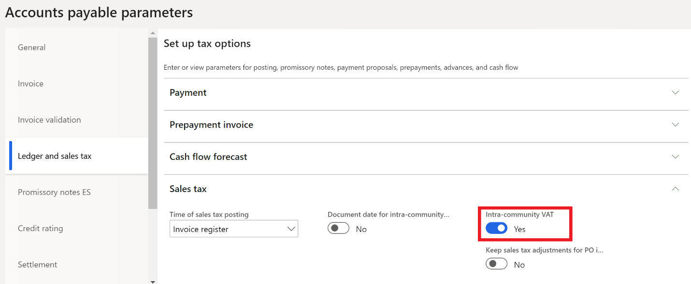
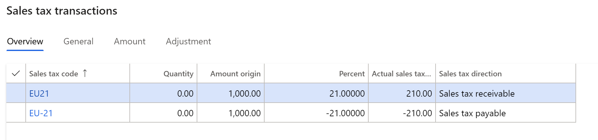

# Intra-community VAT for Spain
[!include [banner](../../includes/banner.md)]

This article provides information about the functionality for intra-community value-added tax (VAT). It explains how to turn on the functionality, calculate and print intra-community VAT amounts, and review intra-community VAT amounts that have been posted.

Information about intra-community value-added tax (VAT) can be calculated and posted automatically. When you post a European Union (EU) vendor invoice, two VAT transactions are created. One VAT transaction is created for payable sales tax, and the other VAT transaction is created for receivable sales tax. Before you can use the intra-community VAT functionality, you must enable the **Intra-community VAT** option on the **Sales tax** FastTab of the **Ledger and sales tax** tab on the **Accounts payable parameters** page (**Accounts payable** \> **Setup** \> **Accounts payable parameters**).

## Calculating intracommunity VAT for purchase transactions
To calculate intra-community VAT for purchase transactions, you must have two sales tax codes that have the same tax percentage. However, one code must have a positive tax percentage, and the other code must have a negative tax percentage. You must also have a sales tax group that contains both a positive sales tax code and a negative sales tax code. 
Select the **Intra-community VAT** check box for the line that has a negative sales tax code. 

## Printing intracommunity VAT on a purchase invoice
To print intra-community VAT on a purchase invoice, enable the **Print EU sales tax on Spanish invoices** option on the **Invoice** tab on the **Form setup** page (**Accounts payable** \> **Setup** \> **Forms** \> **Form setup**).

## Printing invoices that have intracommunity VAT amounts
To print purchase invoices and intra-community invoices that have intra-community VAT amounts, on the vendor invoice page, on the **Process** tab, select **Print setup** &gt; **Print options**. In the **Print options** dialog box, enable the **Print invoice** and **Print intra-community invoice** options.

> [!NOTE]
> A vendor’s country/region must be set up as EU member state. To do this, go to **Tax** \> **Setup** \> **Foreign trade \> Foreign trade parameters Country/region properties tab**).

## Reviewing posted intracommunity VAT amounts
To review the intra-community VAT amounts that have been posted, run the Posted sales tax query (**Tax** \> **Inquiries and reports** \> **Sales tax inquiries** \> **Posted sales tax**). On the **Posted sales tax** page, on the **General** tab, if the **Intra-community VAT** check box is selected, the tax transaction is an intra-community VAT transaction. Spanish VAT books must be set up so that posted payable and receivable VAT transactions are reflected in the appropriate sections. To set up Spanish VAT books, go to **Tax** \> **Setup** \> **Sales tax** \> **Spanish VAT books**. For more information, see [Report 340 for Spain](emea-esp-report-340.md).

## Example

The following example shows how you can set up sales tax codes and post and print transactions for Intra-community VAT.

1. Go to **Accounts payable** \> **Setup** \> **Accounts payable parameters**. 
2. On the **Ledger and sales tax** tab, on the **Sales tax** FastTab, set the **Intra-community VAT** option to **Yes**.

3. Go to **Tax** \> **Indirect taxes** \> **Sales tax** \> **Sales tax codes** and create a pair of sales tax codes with the same tax percentage for each tax rate. One code must have a positive tax percentage, and the other code must have a negative tax percentage. For codes with negative tax percentage, on the **Calculation** FastTab, set the **Allow negative sales tax percentage** option to **Yes**.

| **Sales tax code** | **Percentage** | **Description**                       |
|--------------------|----------------|---------------------------------------|
| EU21               | 21             | EU purchases at a rate of 21 percent. |
| EU-21              | -21            | EU purchases at a rate of 21 percent. |
| EU10               | 10             | EU purchases at a rate of 10 percent. |
| EU-10              | -10            | EU purchases at a rate of 10 percent. |
| EU4               | 4             | EU purchases at a rate of 4 percent. |
| EU-4              | -4            | EU purchases at a rate of 4 percent. |

4.  Go to **Tax** \> **Indirect taxes** \> **Sales tax** \> **Sales tax groups** and create a new sales tax group called **EU**.
5. On the **Setup** FastTab, add the following codes.

| **Sales tax code** | **Intra-community VAT** |
|--------------------|-------------------------|
| EU21               | No                      |
| EU-21              | Yes                     |
| EU10               | No                      |
| EU-10              | Yes                     |
| EU4                | No                      |
| EU-4               | Yes                     |

6.  Go to **Tax** \> **Indirect taxes** \> **Sales tax** \> **Item sales tax groups** and create the following item sales tax groups.

| **Item sales tax group** | **Sales tax codes** |
|--------------------------|---------------------|
| 21                       | EU21, EU-21         |
| 10                       | EU10, EU-10         |
| 4                        | EU4, EU-4           |

7.  Go to **Accounts payable** \> **Invoices** \> **Invoice journal** and create the following line.

| **Date**        | **Transaction type** | **Amount net** | **VAT amount** | **Sales tax codes** |
|-----------------|----------------------|----------------|----------------|---------------------|
| January 1, 2020 | Customer invoice     | 1000           | 210            | EU21 EU-21          |

8.  Verify that there are two lines in the **Sales tax transactions** list.

    

9.  Select **Post** to post the transaction and then select **OK**.

[!INCLUDE[footer-include](../../../includes/footer-banner.md)]
