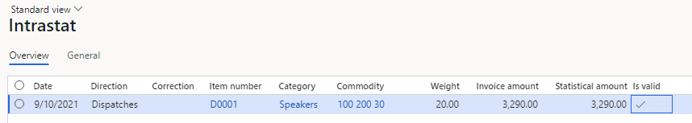
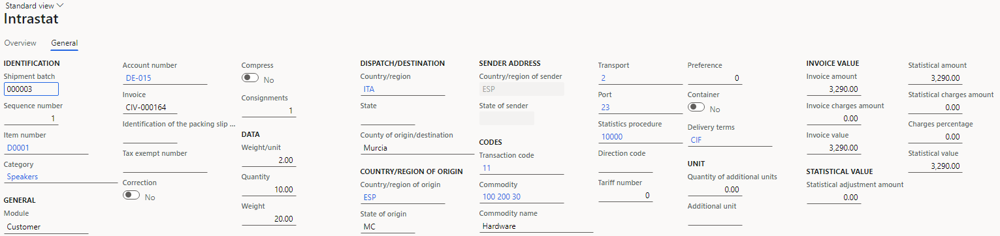
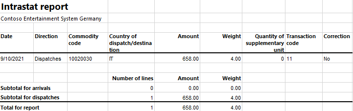
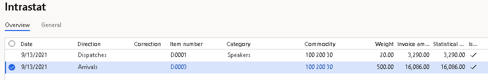
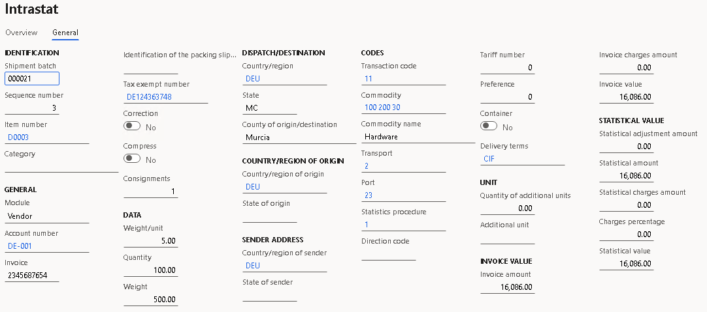
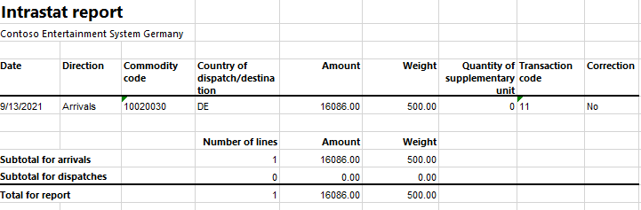

# Spanish Intrastat

[!include [banner](../../includes/banner.md)]

This article explains how to set up and configure the Spanish Intrastat report in Microsoft Dynamics 365 Finance.

The **Intrastat** page is used to generate and report information about trade among European Union (EU) countries/region. The Spanish Intrastat declaration contains information about the trade of goods that you can use for reporting.

The following fields are included on the Spanish Intrastat declaration.

| **Field on the Intrastat declaration** | **Corresponding field on the Intrastat journal page** | **Description** |
|-------------------------|-------------------------|-------------------------|
| Dispatch/destination country | **Country/region** (in the **Dispatch/destination** section) | The member state that is the origin or destination of the goods. |
| County | **County of origin/destination** (in the **Dispatch/destination** section) | The Spanish province where goods were obtained (in the case dispatches) or arrive (in the case of arrivals). |
| Delivery terms | **Delivery terms** (in the **Codes** section) | How the commodities are transported to or from Spain. |
| Transaction code | **Transaction code** (in the **Codes** section) | The nature of the agreement that forms the basis for the delivery of commodities. |
| Transport | **Transport** (in the **Codes** section) | How the commodities are transported. |
| Port | **Port** (in the **Codes** section) | The unique port code. |
| Commodity code | **Commodity** (in the **Codes** section) | The eight-digit commodity code according to the Combined Nomenclature. |
| Origin country | **Country/region of origin** (in the **Country/region of origin** section) | The country or region where the commodities were produced or manufactured. |
| Statistics procedure | **Statistics procedure** (in the **Codes** section) | The detailed version of the commodity flow. |
| Net mass | **Weight** (in the **Data** section) | The mass of the goods of all positions of the Combined Nomenclature. The value includes goods that require the declaration of additional units but excludes the weight of the packaging. The net mass is specified in kilograms. |
| Additional units | **Quantity of additional units** (in the **Unit** section) | For some commodities, you must report the supplementary unit, such as the number of items, and the number of m2, m3, pairs, and dozens. |
| Invoice amount | **Invoice amount** (in the **Invoice value** section) | The taxable amount. This amount constitutes the value that must be determined for tax purposes. |
| Statistical value | **Statistical value** (in the **Statistical value** section) | The value that the company would have at the time of entry into (in the case of arrivals) or departure from (in the case of dispatches) the Spanish statistical territory, after taxes on consumption (but no other taxes) are deducted. The value includes a proportional part of the transport and insurance costs of the journey up to the point where the goods enter or leave Spanish territory. For more information, see the description of the prerequisite for miscellaneous charges in [Intrastat overview](../europe/emea-intrastat.md). |

## Set up Intrastat

From the Global repository, import the latest version of the following Electronic reporting (ER) configurations:

- Intrastat model
- Intrastat report
- Intrastat (ES)

For more information, see [Download ER configurations from the Global repository of Configuration service](../../../fin-ops-core/dev-itpro/analytics/er-download-configurations-global-repo.md).

## Set up the delivery address

For the Intrastat declaration on arrivals, it's important that you set the delivery address. The report will show the county from the delivery address as the destination county where the goods arrive.

When you create a vendor invoice, you can select the delivery address in the **Delivery** **address** field in the **Address** section on the **Vendor** FastTab of the **Create purchase order** dialog. Select either your company's address or the site address.

### Set up an address format

To set up an address format that includes county information, follow these steps:

1. In Dynamics 365 Finance, go to **Organization administration** \> **Global address book** \> **Addresses** \> **Address setup**.
1. On the **Address format** tab, select **New** to create a new address format. To update an existing address format, select it in the grid.
1. In the **Configure address component** section, select **Add**.
1. In the **Address application object** field, select **County**.
1. Select the corresponding box in the **New line** column.
1. Add the address objects as required by the authorities.
1. On the **Country/region** tab, select **ESP** in the grid.
1. In the **Address format** field, select the address format that you created.

### Set up the county code

The Intrastat declaration requires that a county code be reported. 

To set up the county code, follow these steps:

1. In Dynamics 365 Finance, go to **Organization administration** \> **Global address book** \> **Addresses** \> **Address setup**.
1. On the **State/province** tab, select **New**.
1. In the **Country/region** field, select **ESP**.
1. In the **State** field, enter the name.
1. On the **County** tab, select **New**.
1. In the **Country/region** field, select **ESP**.
1. In the **State** field, select the corresponding state.
1. In the **County** field, enter the name of the county.
1. In the **ES county code** field, enter the code according to the authority requirements.

### Set up an address for a legal entity

To set up an address for a legal entity, follow these steps:

1. In Dynamics 365 Finance, go to **Organization administration** \> **Organizations** \> **Legal entities**, and select your organization in the grid.
1. On the **Addresses** FastTab, select **Edit**.
1. In the **Edit address** dialog, in the **State** field, select your company's state.
1. In the **County** field, select your company's county.

### Set up an address for a site

To set up an address for a site, follow these steps:

1. In Dynamics 365 Finance, go to **Warehouse management** \> **Setup** \> **Warehouse** \> **Site**, and select the site in the grid.
1. On the **Addresses** FastTab, select **Edit**.
1. In the **Edit address** dialog, in the **State** field, select your site's state.
1. In the **County** field, select your site's county.

## Set up foreign trade parameters

To set up foreign trade parameters, follow these steps:

1. In Dynamics 365 Finance, go to **Tax** \> **Setup** \> **Foreign trade parameters**.
1. On the **Intrastat** tab, on the **Electronic reporting** FastTab, in the **File format mapping** field, select **Intrastat (ES)**.
1. In the **Report format mapping** field, select **Intrastat report**.
1. On the **Commodity code hierarchy** FastTab, in the **Category hierarchy** field, select **Intrastat**.
1. On the **General** FastTab, in the **Transaction code** field, select the transaction code for property transfers. You use this code for transactions that produce actual or planned transfers of property against compensation (financial or otherwise).
1. In the **Credit note** field, select the transaction code for the return of goods.
1. In the **County of origin/destination** field, select the county in Spain where your company is located. This value is used for the Intrastat declaration on dispatches.
1. On the **Spanish Intrastat** tab, on the **General** FastTab, follow these steps to set default values for purchase orders and sales orders. You can overwrite the default values when you create an order.

    1. In the **Transport** field, select the code for the default transport type.
    1. In the **Port** field, select the code for the default port.
    1. In the **Statistics procedure** field, select the code for the default statistics procedure.
    1. In the **Delivery terms** field, select the code for the default delivery terms.

1. On the **Country/region properties** tab, in the **Country/region** field, list all the countries or regions that your company does business with. For each country/region that is part of the EU, in the **Country/region type** field, select **EU**, so that the country/region appears on your Intrastat report.

## Set up product parameters for the Intrastat declaration

To set up product parameters for the Intrastat declaration, follow these steps:

1. In Dynamics 365 Finance, go to **Product information management** \> **Products** \> **Released products**, and select a product in the grid.
1. On the **Foreign trade** FastTab, in the **Intrastat** section, in the **Commodity** field, select the commodity code.
1. In the **Origin** section, in the **Country/region** field, select the product's country or region of origin.
1. On the **Manage inventory** FastTab, in the **Net weight** field, enter the product's weight in kilograms.

## Compress the Intrastat declaration

To compress the Intrastat declaration, follow these steps:

1. In Dynamics 365 Finance, go to **Tax** \> **Setup** \> **Foreign trade** \> **Compression of Intrastat**.
1. Select the fields to compare when the Intrastat information is summarized. For Spanish Intrastat, select the following fields:
    - County of origin/destination
    - Country/region of origin
    - Direction
    - Country/region of sender
    - Country/region
    - Delivery terms
    - Port
    - Statistics procedure
    - Transport
    - Transaction code
    - Commodity
    - Invoice

## Set up a transport method for the Intrastat declaration

To set up a transport method for the Intrastat declaration, follow these steps:

1. In Dynamics 365 Finance, go to **Tax** \> **Setup** \> **Foreign trade** \> **Transport method**.
1. On the Action Pane, select **New**.
1. In the **Transport** field, enter a unique code.

>[!NOTE]
> Spanish companies use one-digit transport codes.

## Intrastat transfer

On the **Intrastat** page, on the Action Pane, you can select **Transfer** to automatically transfer the information about intracommunity trade from your sales orders, free text invoices, purchase orders, vendor invoices, vendor product receipts, project invoices, and transfer orders. Only documents that have an EU country/region as the country or region of destination (for dispatches) or consignment (for arrivals) will be transferred.

You can also manually enter transactions by selecting **New** on the Action Pane.

### Generate an Intrastat report

To generate an Intrastat report, follow these steps:

1. In Dynamics 365 Finance, go to **Tax** \> **Declarations** \> **Foreign trade** \> **Intrastat**.
1. On the Action Pane, select **Output** \> **Report**.
1. In the **Intrastat Report** dialog, enter the start and end dates for the report.
1. Set the **Generate file** option to **Yes** to generate a .txt file, and then enter the name of the .txt file for the Intrastat report.
1. Set the **Generate report** option to **Yes** to generate an .xlsx file, and then enter a name for the file.
1. Select **Arrivals** if the report is about intracommunity arrivals or **Dispatches** if it's about intracommunity dispatches.
1. Select **OK**, and review the generated reports.

## Example

This example shows how to post arrivals and dispatches for Intrastat. It uses the **DEMF** legal entity.

### Preliminary setup

To do the preliminary setup, follow these steps:

1. In Dynamics 365 Finance, go to **Organization administration** \> **Organization** \> **Legal entities**, and select the **DEMF** legal entity.
1. On the **Addresses** FastTab, select **Edit**, and then, in the **Country/region** field, select **ESP (Spain)**.
1. Import the latest version of the following ER configurations:

    - Intrastat model
    - Intrastat report
    - Intrastat (ES)

### Set up region codes

To set up region codes, follow these steps:

1. In Dynamics 365 Finance, go to **Organization administration** \> **Global address book** \> **Addresses** \> **Address setup**.
1. On the **State/province** tab, select **New**.
1. In the **Country/region** field, select **ESP**.
1. In the **State** field, enter "MC".
1. In the **Description** field, enter "Region of Murcia".
1. On the **County** tab, select **New**.
1. In the **Country/region** field, select **ESP**.
1. In the **State** field, select **MC**.
1. In the **County** field, enter "Murcia".
1. In the **ES county code** field, enter "47".
1. On the Action Pane, select **Save**.

### Set up an address format

To set up an address format that includes county information, follow these steps:

1. In Dynamics 365 Finance, go to **Organization administration** \> **Global address book** \> **Addresses** \> **Address setup**.
1. On the **Address format** tab, select **0005** in the grid.
1. In the **Configure address component** section, verify that the **Address application object** field is set to **County** and that the corresponding box in the **New line** column is selected.
1. On the **Country/region** tab, select **ESP** in the grid.
1. In the **Address format** field, select **0005**.

### Set up an address for a legal entity

To set up an address for a legal entity, follow these steps:

1. In Dynamics 365 Finance, go to **Organization administration** \> **Organizations** \> **Legal entities**, and select **DEMF** in the grid.
1. On the **Addresses** FastTab, select **Edit**.
1. In the **Edit address** dialog, in the **State** field, select **MU**.
1. In the **County** field, select **Murcia**.

### Change the site address

To change the site address, follow these steps:

1. In Dynamics 365 Finance, go to **Warehouse management** \> **Setup** \> **Warehouse** \> **Sites**, and select **1** in the grid.
1. On the **Addresses** FastTab, select **Edit**.
1. In the **Edit address** dialog, in the **Country/region** field, select **ESP**.
1. In the **State** field, select **MU**.
1. In the **County** field, select **Murcia**.
1. Select **OK**.

### Set up transport parameters

To set up transport parameters, follow these steps:

1. In Dynamics 365 Finance, go to **Tax** \> **Setup** \> **Foreign trade** \> **Transport method**.
1. On the Action Pane, select **New**.
1. In the **Transport** field, enter "2".
1. In the **Description** field, enter "Air transport".
1. Go to **Procurement and sourcing** \> **Setup** \> **Distribution** \> **Terms of delivery**, and select **CIF** in the grid.
1. On the **General** FastTab, in the **Intrastat code** field, enter "3".

### Set up a statistics procedure

To set up a statistics procedure, follow these steps:

1. In Dynamics 365 Finance, go to **Tax** \> **Setup** \> **Foreign trade** \> **Statistics procedure**.
1. On the Action Pane, select **New**.
1. In the **Statistics procedure** field, enter "1".
1. In the **Text 1** field, enter "Sending to finals".

### Set up foreign trade parameters

To set up foreign trade parameters, follow these steps:

1. In Dynamics 365 Finance, go to **Tax** \> **Setup** \> **Foreign trade** \> **Foreign trade parameters**.
1. On the **Intrastat** tab, on the **General** FastTab, in the **Transaction code** field, select **11**.
1. In the **County of origin/destination** field, select **Murcia**.
1. On the **Electronic reporting** FastTab, in the **File format mapping** field, select **Intrastat (ES)**.
1. In the **Report format mapping** field, select **Intrastat Report**.
1. On the **Commodity code hierarchy** FastTab, verify that the **Category hierarchy** field is set to **Intrastat**.
1. On the **Spanish Intrastat** tab, on the **General** FastTab, in the **Transport** field, select **2**.
1. In the **Port** field, select **23**.
1. In the **Statistics procedure** field, select **1**.
1. In the **Delivery terms** field, select **CIF**.
1. On the **Country/region properties** tab, select **New**.
1. In the **Party country/region** field, select **ESP**.
1. In the **Intrastat code** field, enter "ES".
1. In the **Country/region type** field, select **Domestic**.
1. In the **Party country/region** field, select **DEU**. Then, in the **Country/region type** field, select **EU**.
1. Verify that a line for **ITA** (Italy) is created and that the **Country/region type** field is set to **EU**.

### Set up product information

To set up product information, follow these steps:

1. In Dynamics 365 Finance, go to **Product information management** \> **Products** \> **Released products**, and select **D0001** in the grid.
1. On the **Foreign trade** FastTab, in the **Intrastat** section, in the **Commodity** field, select **100 200 30**.
1. In the **Origin** section, in the **Country/region** field, select **ESP**.
1. In the **State/province** field, select **MC**.
1. On the **Manage inventory** FastTab, in the **Weight measurements** section, in the **Net weight** field, enter "2".
1. On the Action Pane, select **Save**.
1. Select **D0003** in the grid.
1. On the **Foreign trade** FastTab, in the **Intrastat** section, in the **Commodity** field, select **100 200 30**.
1. In the **Origin** section, in the **Country/region** field, select **DEU**.
1. On the **Manage inventory** FastTab, in the **Weight measurements** section, in the **Net weight** field, enter "5".
1. On the Action Pane, select **Save**.

### Create a sales order with an EU customer

To create a sales order with an EU customer, follow these steps:

1. In Dynamics 365 Finance, go to **Accounts receivable** \> **Orders** \> **All sales orders**.
1. On the Action Pane, select **New**.
1. In the **Create sales order** dialog, on the **Customer** FastTab, in the **Customer** section, in the **Customer account** field, select **DE-015**.
1. On the **Address** FastTab, verify that the address is in **ITA** (Italy).
1. On the **General** FastTab, in the **Storage dimensions** section, in the **Site** field, select **1**.
1. In the **Warehouse** field, select **11**.
1. Select **OK**.
1. On the **Lines** tab, on the **Sales order lines** FastTab, in the **Item number** field, select **D0001**. Then, in the **Quantity** field, enter "10".
1. On the **Line details** FastTab, on the **Foreign trade** tab, verify that the **Statistics procedure**, **Transaction code**, **Transport**, **Port**, **Commodity**, **County of origin/destination**, **Country/region of origin**, and **State of origin** fields are automatically set.
1. On the **Header** tab, on the **Delivery** FastTab, in the **Misc. delivery info** section, in the **Delivery terms** field, select **CIF**.
1. On the Action Pane, select **Save**.
1. On the Action Pane, on the **Invoice** tab, in the **Generate** group, select **Invoice**.
1. In the **Posting invoice** dialog, on the **Parameters** FastTab, in the **Parameter** section, in the **Quantity** field, select **All**.
1. Select **OK** to post the invoice.

### Transfer a transaction to the Intrastat journal and review the result

To transfer a transaction to the Intrastat journal and review the result, follow these steps:

1. In Dynamics 365 Finance, go to **Tax** \> **Declarations** \> **Foreign trade** \> **Intrastat**.
1. On the Action Pane, select **Transfer**.
1. In the **Intrastat (Transfer)** dialog, in the **Parameters** section, set the **Customer invoice** option to **Yes**.
1. Select **Filter**.
1. In the **Intrastat Filter** dialog, on the **Range** tab, select the first line, and verify that the **Field** field is set to **Date**.
1. In the **Criteria** field, select the current date.
1. Select **OK** to close the **Intrastat Filter** dialog.
1. Select **OK** to close the **Intrastat (Transfer)** dialog, and review the result. The line represents the sales order that you created earlier.

    

1. Select the transaction line, and then select the **General** tab to view more details.

    

1. On the Action Pane, select **Output** \> **Report**.
1. In the **Intrastat Report** dialog, on the **Parameters** FastTab, in the **Date** section, select the month of the sales order that you created.
1. In the **Export** **options** section, set the **Generate file** option to **Yes**. Then, in the **File name** field, enter the required name.
1. Set the **Generate report** option to **Yes**. Then, in the **Report file name** field, enter the required name.
1. In the **Direction** field, select **Dispatches**.
1. Select **OK**, and review the report in .txt format that is generated. The following table shows the values in the example report.

    | **Field**                    | **Value** |
    |------------------------------|-----------|
    | Dispatch/destination country | IT        |
    | County                       | 47        |
    | Delivery terms               | 3         |
    | Transaction code             | 11        |
    | Transport                    | 2         |
    | Port                         | 23        |
    | Commodity code               | 10020030  |
    | Origin country               | ES        |
    | Statistics procedure         | 1         |
    | Net mass                     | 20        |
    | Additional units             | (Blank)   |
    | Invoice amount               | 3290      |
    | Statistical value            | 3290      |

1. Review the report in Excel format that is generated.

    

### Create a purchase order

To create a purchase order, follow these steps:

1. In Dynamics 365 Finance, go to **Accounts payable** \> **Purchase orders** \> **All purchase orders**.
1. On the Action Pane, select **New**.
1. In the **Create purchase order** dialog, in the **Vendor account** field, select **DE-001**.
1. On the **General** FastTab, in the **Storage dimensions** section, in the **Site** field, select **1**.
1. In the **Warehouse** field, select **11**.
1. On the **Vendor** FastTab, in the **Address** section, in the **Delivery address** field, select **Site 1**.
1. Select **OK**.
1. On the **Header** tab, on the **Delivery** FastTab, verify that the **Delivery terms** field is set to **CIF**.
1. On the **Lines** tab, on the **Purchase order lines** FastTab, in the **Item number** field, select **D0003**. Then, in the **Quantity** field, enter "100".
1. On the **Line details** FastTab, on the **Foreign trade** tab, in the **Foreign trade** section, verify that the **Transaction code**, **Transport**, **Port**, **Statistics procedure**, **County of origin/destination**, **Commodity**, and **Country/region of origin** fields are automatically set.
1. On the Action Pane, on the **Purchase** tab, in the **Actions** group, select **Confirm**.
1. On the Action Pane, on the **Invoice** tab, in the **Generate** group, select **Invoice**.
1. On the Action Pane, select **Default from**. In the **Default quantity for lines** field, select **Ordered quantity**. Then select **OK**.
1. On the **Vendor invoice header** FastTab, in the **Invoice identification** section, in the **Number** field, enter "0001".
1. In the **Invoice dates** section, in the **Invoice date** field, select **9/13/2021** (September 13, 2021).
1. On the Action Pane, select **Post** to post the invoice.

### Create an Intrastat declaration for arrivals

To create an Intrastat declaration for arrivals, follow these steps:

1. In Dynamics 365 Finance, go to **Tax** \> **Declarations** \> **Foreign trade** \> **Intrastat**.
1. On the Action Pane, select **Transfer**.
1. In the **Intrastat (Transfer)** dialog, set the **Vendor invoice** option to **Yes**.
1. Select **OK** to transfer the transactions, and review the Intrastat journal.

    

1. Review the **General** tab for the purchase order.

    

1. On the Action Pane, select **Output** \> **Report**.
1. In the **Intrastat Report** dialog, on the **Parameters** FastTab, in the **Date** section, select the month of the purchase order that you created.
1. In the **Export** **options** section, set the **Generate file** option to **Yes**. Then, in the **File name** field, enter the required name.
1. Set the **Generate report** option to **Yes**. Then, in the **Report file name** field, enter the required name.
1. In the **Direction** field, select **Arrivals**.
1. Select **OK**, and review the report in .txt format that is generated. The following table shows the values in the example report.

    | **Field**                    | **Value** |
    |------------------------------|-----------|
    | Dispatch/destination country | DE        |
    | County                       | 47        |
    | Delivery terms               | 3         |
    | Transaction code             | 11        |
    | Transport                    | 2         |
    | Port                         | 23        |
    | Commodity code               | 10020030  |
    | Origin country               | DE        |
    | Statistics procedure         | 1         |
    | Net mass                     | 500       |
    | Additional units             | (Blank)   |
    | Invoice amount               | 16086     |
    | Statistical value            | 16086     |

1. Review the report in Excel format that is generated.

    
