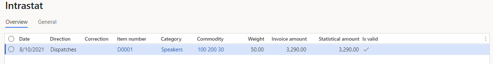
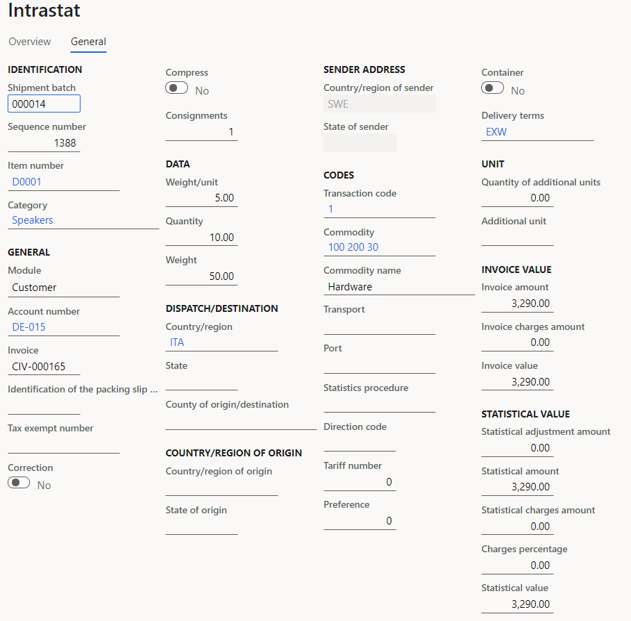
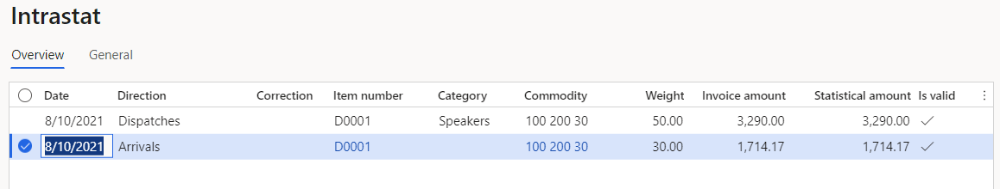

# Swedish Intrastat

[!include[banner](../../includes/banner.md)]

This article explains how to set up Intrastat reporting for Sweden in Microsoft Dynamics 365 Finance.

The **Intrastat** page is used to generate and report information about trade among European Union (EU) countries/regions. The Swedish Intrastat declaration contains information about the trade of goods for reporting.

The following fields are included in the Swedish Intrastat declaration:
   - Partner country ISO code
   - Transaction code
   - Commodity Code
   - Additional unit
   - Weight
   - Invoice amount

## Set up Intrastat

To set up Intrastat, import the latest version of the following electronic reporting (ER) configurations:
   - Intrastat model
   - Intrastat report
   - Intrastat (SE)

Learn more in [Download ER configurations from the Global repository of Configuration service](../../../fin-ops-core/dev-itpro/analytics/er-download-configurations-global-repo.md).

## Set up foreign trade parameters

To set up foreign trade parameters, follow these steps:

1. In Dynamics 365 Finance, go to **Tax** \> **Setup** \> **Foreign trade parameters**.
1. On the **Intrastat** tab, on the **Electronic reporting** FastTab, in the **File format mapping** field, select **Intrastat (SE)**.
1. In the **Report format mapping** field, select **Intrastat report**.
1. On the **Commodity code hierarchy** FastTab, in the **Category hierarchy** field, select **Intrastat**.
1. In the **Transaction code** field, select the transaction code for property transfers. You use this code for transactions that produce actual or planned transfers of property against compensation (financial or otherwise). You also use it for corrections. Companies in Sweden use one-digit transaction codes.
1. In the **Credit note** field, select the transaction code for the return of goods.
1. On the **Country/region properties** tab, in the **Country/region** field, list all the countries or regions that your company does business with. For each country/region that is part of the EU, in the **Country/region type** field, select **EU**, so that the country/region appears on your Intrastat report.

## Set up the product parameters for the Intrastat declaration

To set up the product parameters for the Intrastat declaration, follow these steps:

1. In Dynamics 365 Finance, go to **Product information management** \> **Products** \> **Released products**.
1. In the grid, select a product.
1. On the **Foreign trade** FastTab, in the **Intrastat** section, in the **Commodity** field, select the commodity code.
1. On the **Manage inventory** FastTab, in the **Net weight** field, enter the product's weight in kilograms.
1. Go to **Tax** \> **Setup** \> **Foreign trade** \> **Compression of Intrastat**, and select the fields that should be compared when Intrastat information is summarized. For Swedish Intrastat, select the following fields:

    - Commodity
    - Transaction code
    - Direction
    - Country/region
    - Correction
    - Invoice

## Intrastat transfer

On the **Intrastat** page, on the Action Pane, you can select **Transfer** to automatically transfer the information about intracommunity trade from your sales orders, free text invoices, purchase orders, vendor invoices, vendor product receipts, project invoices, and transfer orders. Only documents that have an EU country/region as the country or region of destination (for dispatches) or consignment (for arrivals) will be transferred.

Alternatively, you can manually enter transactions by selecting **New** on the Action Pane.

### Generate an Intrastat report

To generate an Intrastat report, follow these steps:

1. In Dynamics 365 Finance, go to **Tax** \> **Declarations** \> **Foreign trade** \> **Intrastat**.
1. On the Action Pane, select **Output** \> **Report**.
1. In the **Intrastat Report** dialog, set the following fields.

    | Field            | Description                                                                                                                         |
    |------------------|-------------------------------------------------------------------------------------------------------------------------------------|
    | From date        | Select the start date for the report.                                                                                               |
    | To date          | Select the end date for the report.                                                                                                 |
    | Generate file    | Set this option to **Yes** to generate a .txt file for your Intrastat report.                                                       |
    | File name        | Enter the name of the .txt file.                                                                                                    |
    | Generate report  | Set this option to **Yes** to generate an .xlsx file for your Intrastat report.                                                     |
    | Report file name | Enter the name of the .xlsx file.                                                                                                   |
    | Direction        | Select **Arrivals** for a report about intracommunity arrivals. Select **Dispatches** for a report about intracommunity dispatches. |

1. Select **OK**, and review the generated reports.

## Example

This example shows how to post arrivals and dispatches for Intrastat. It uses the **DEMF** legal entity.

### Preliminary setup

To do preliminary setup, follow these steps:

1. In Dynamics 365 Finance, go to **Organization administration** \> **Organization** \> **Legal entities**, and select the **DEMF** legal entity.
1. On the **Addresses** FastTab, select **Edit**, and then, in the **Country/region** field, select **SWE (Sweden)**.
1. Import the latest version of the following ER configurations:

    - Intrastat model
    - Intrastat report
    - Intrastat (SE)

### Create transaction codes

To create transaction codes, follow these steps:

1. In Dynamics 365 Finance, go to **Tax** \> **Setup** \> **Foreign trade** \> **Transaction codes**.
1. On the Action Pane, select **New**.
1. In the **Transaction** **code** field, enter "1".
1. In the **Name** field, enter "Normal transactions".
1. On the Action Pane, select **Save**.

### Set up foreign trade parameters

To set up foreign trade parameters, follow these steps:

1. In Dynamics 365 Finance, go to **Tax** \> **Setup** \> **Foreign trade** \> **Foreign trade parameters**.
1. On the **Intrastat** tab, on the **General** FastTab, in the **Transaction** **code** field, select **1**.
1. On the **Electronic reporting** FastTab, in the **File format mapping** field, select **Intrastat (SE)**.
1. In the **Report format mapping** field, select **Intrastat Report**.
1. On the **Commodity code hierarchy** FastTab, in the **Category hierarchy** field, make sure that **Intrastat** is selected.
1. On the **Country/region properties** tab, select **New**.
1. In the **Party country/region** field, select **SWE**.
1. In the **Country/region type** field, select **Domestic**.
1. In the **Party country/region** field, select **DEU**, and then, in the **Country/region type** field, select **EU**.

### Set up product information

To set up product information, follow these steps:

1. In Dynamics 365 Finance, go to **Product information management** \> **Products** \> **Released  products**.
1. In the grid, select **D0001**.
1. On the **Foreign trade** FastTab, in the **Intrastat** section, in the **Commodity** field, select **100 200 30**.
1. On the **Manage inventory** FastTab, in the **Weight measurements** section, in the **Net weight** field, enter "5".
1. On the Action Pane, select **Save**.

### Change the site address

To change the site address, follow these steps:

1. In Dynamics 365 Finance, go to **Warehouse management** \> **Setup** \> **Warehouse** \> **Sites**.
1. In the grid, select **1**.
1. On the **Addresses** FastTab, select **Edit**.
1. In the **Edit address** dialog, in the **Country/region** field, select **SWE**.
1. Select **OK**.

### Create a sales order with an EU customer

To create a sales order with an EU customer, follow these steps:

1. In Dynamics 365 Finance, go to **Accounts receivable** \> **Orders** \> **All sales orders**.
1. On the Action Pane, select **New**.
1. In the **Create sales order** dialog, on the **Customer** FastTab, in the **Customer** section, in the **Customer account** field, select **DE-015**.
1. On the **General** FastTab, in the **Storage dimensions** section, in the **Site** field, select **1**.
1. In the **Warehouse** field, select **11**.
1. Select **OK**.
1. On the **Lines** tab, on the **Sales order lines** FastTab, in the **Item number** field, select **D0001**. Then, in the **Quantity** field, enter "10".
1. On the **Line details** FastTab, on the **Foreign trade** tab, make sure that the **Transaction code** and **Commodity** fields are automatically set.
1. On the Action Pane, select **Save**.
1. On the Action Pane, on the **Invoice** tab, in the **Generate** section, select **Invoice**.
1. In the **Posting invoice** dialog, on the **Parameters** FastTab, in the **Parameter** section, in the **Quantity** field, select **All**.
1. Select **OK** to post the invoice.

### Transfer the transaction to the Intrastat journal and review the result

To transfer the transaction to the Intrastat journal and review the result, follow these steps:

1. In Dynamics 365 Finance, go to **Tax** \> **Declarations** \> **Foreign trade** \> **Intrastat**.
1. On the Action Pane, select **Transfer**.
1. In the **Intrastat (Transfer)** dialog, in the **Parameters** section, set the **Customer invoice** option to **Yes**.
1. Select **Filter**.
1. In the **Intrastat Filter** dialog, on the **Range** tab, select the first line, and make sure that the **Field** field is set to **Date**.
1. In the **Criteria** field, select the current date.
1. Select **OK** to close the **Intrastat Filter** dialog.
1. Select **OK** to close the **Intrastat (Transfer)** dialog, and review the result. The line represents the sales order that you created earlier.

    

1. Select the transaction line, and then select the **General** tab to view more details.

    

1. On the Action Pane, select **Output** \> **Report**.
1. In the **Intrastat Report** dialog, on the **Parameters** FastTab, in the **Date** section, select the month of the sales order that you created.
1. In the **Export** **options** section, set the **Generate file** option to **Yes**. Then, in the **File name** field, enter the required name.
1. Set the **Generate report** option to **Yes**. Then, in the **Report file name** field, enter the required name.
1. In the **Direction** field, select **Dispatches**.
1. Select **OK** and review the report in .txt format that is generated. The following table shows the values in the example report.

    | Partner country ISO code | Transaction code | Commodity Code | Additional unit | Weight | Invoice amount |
    |--------------------------|------------------|----------------|-----------------|--------|----------------|
    | IT                       | 1                | 10020030       | 0               | 50     | 3290           |

1. Review the report in Excel format that is generated.

    

### Create a purchase order

To create a purchase order, follow these steps:

1. In Dynamics 365 Finance, go to **Accounts payable** \> **Purchase orders** \> **All purchase orders**.
1. On the Action Pane, select **New**.
1. In the **Create purchase order** dialog, in the **Vendor account** field, select **DE-001**.
1. Select **OK**.
1. On the **Header** tab, on the **Foreign** **trade** FastTab, verify that the **Transaction code** field is set to **1**.
1. On the **Lines** tab, on the **Purchase order lines** FastTab, in the **Item number** field, select **D0001**. Then, in the **Quantity** field, enter "6".
1. On the Action Pane, on the **Purchase** tab, in the **Actions** group, select **Confirm**.
1. On the Action Pane, on the **Invoice** tab, in the **Generate** group, select **Invoice**.
1. On the Action Pane, select **Default from**. In the **Default quantity for lines** field, select **Ordered quantity**. Then select **OK**.
1. On the **Vendor invoice header** FastTab, in the **Invoice identification** section, in the **Number** field, enter "0001".
1. On the Action Pane, select **Post** to post the invoice.

### Create an Intrastat declaration for arrivals

To create an Intrastat declaration for arrivals, follow these steps:

1. In Dynamics 365 Finance, go to **Tax** \> **Declarations** \> **Foreign trade** \> **Intrastat**.
1. On the Action Pane, select **Transfer**.
1. In the **Intrastat (Transfer)** dialog, set the **Vendor invoice** option to **Yes**.
1. Select **OK** to transfer the transactions, and review the Intrastat journal.

    

1. Review the **General** tab for the purchase order.

    

1. On the Action Pane, select **Output** \> **Report**.
1. In the **Intrastat Report** dialog, on the **Parameters** FastTab, in the **Date** section, select the month of the sales order that you created.
1. In the **Export** **options** section, set the **Generate file** option to **Yes**. Then, in the **File name** field, enter the required name.
1. Set the **Generate report** option to **Yes**. Then, in the **Report file name** field, enter the required name.
1. In the **Direction** field, select **Arrivals**.
1. Select **OK**, and review the report in .txt format that is generated. The following table shows the values in the example report.

    | Partner country ISO code | Transaction code | Commodity Code | Additional unit | Weight | Invoice amount |
    |--------------------------|------------------|----------------|-----------------|--------|----------------|
    | IT                       | 1                | 10020030       | 0               | 30     | 1714           |

1. Review the report in Excel format.

    
