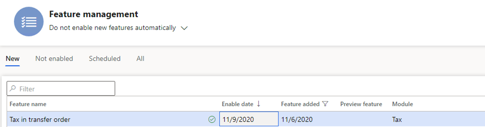
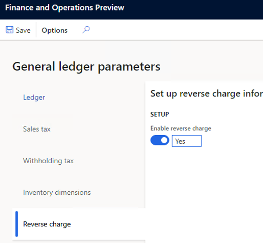
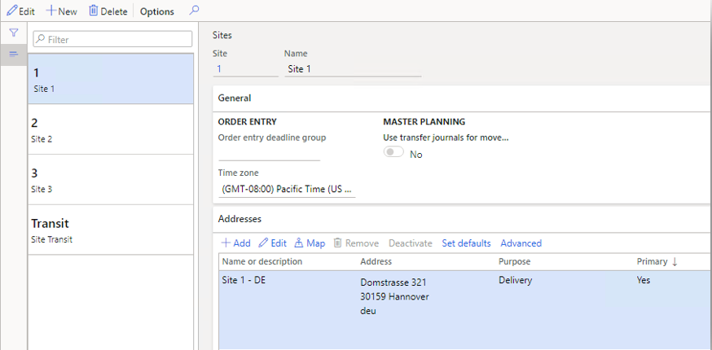
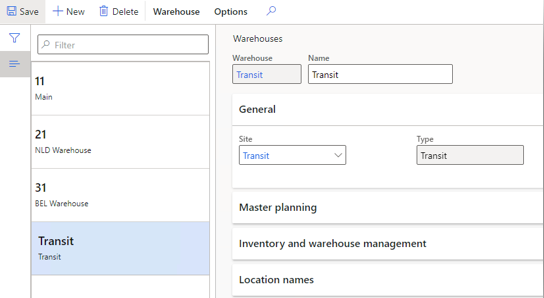
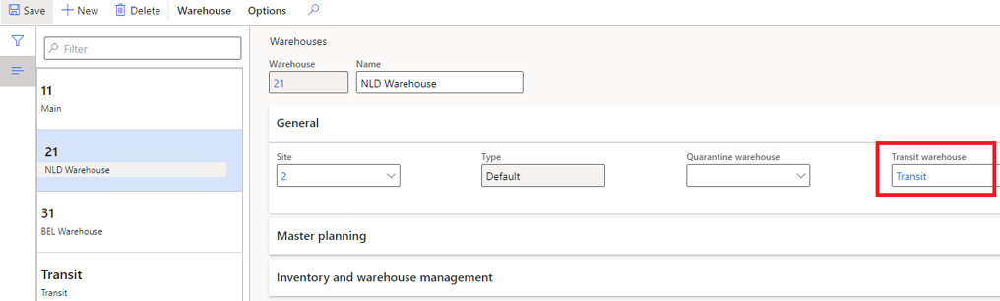
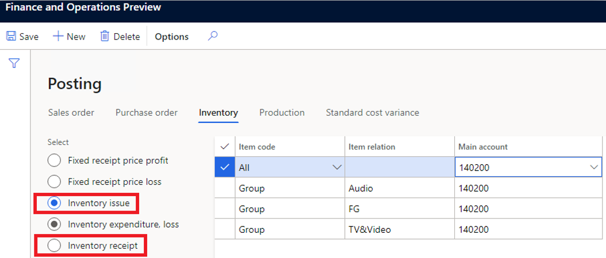
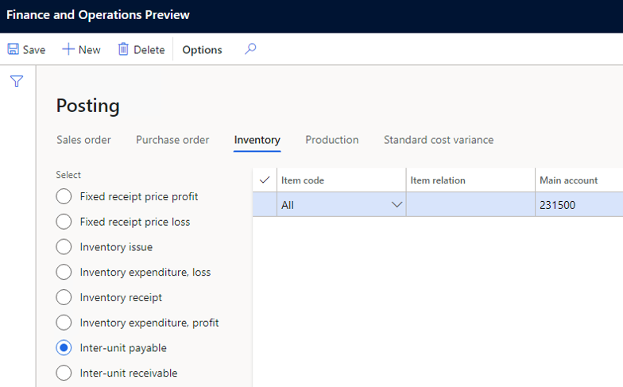
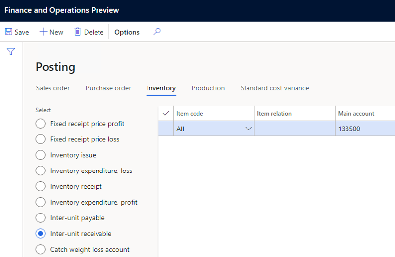

---
# required metadata

title: Tax feature support for transfer orders
description: This topic explains the new tax feature support for transfer orders by using the tax calculation service.
author: Kai-Cloud
ms.date: 10/13/2021
ms.topic: article
ms.prod: 
ms.technology: 

# optional metadata

ms.search.form:
audience: Application user
# ms.devlang: 
ms.reviewer: kfend
ms.search.scope: Core, Operations
# ms.tgt_pltfrm: 
ms.custom: 
ms.search.region: Global
# ms.search.industry: 
ms.author: kailiang
ms.search.validFrom: 2021-04-01
ms.dyn365.ops.version: 10.0.18

---

# Tax feature support for transfer orders

[!include [banner](../../includes/banner.md)]

This topic provides information about tax calculation and posting integration in transfer orders. This functionality lets you set up tax calculation and posting in transfer orders for stock transfers. Under European Union (EU) value-added tax (VAT) regulations, stock transfers are considered intra-community supply and intra-community acquisitions.

To configure and use this functionality, you must complete three main steps:

1. **RCS setup:** In Regulatory Configuration Service, set up the tax feature, tax codes, and tax codes applicability for tax code determination in transfer orders.
2. **Dynamics 365 Finance setup:** In Finance, enable the **Tax in transfer order** feature, set up the tax calculation service parameters for inventory, and set up core tax parameters.
3. **Inventory setup:** Set up the inventory configuration for transfer order transactions.

## Set up RCS for tax and transfer order transactions

Follow these steps to set up the tax that is involved in a transfer order. In the example that is shown here, the transfer order is from the Netherlands to Belgium.

1. On the **Tax features** page, on the **Versions** tab, select the draft feature version, and then select **Edit**.

2. On the **Tax features setup** page, on the **Tax codes** tab, select **Add** to create new tax codes. For this example, three tax codes are created: **NL-Exempt**, **BE-RC-21**, and **BE-RC+21**.

    - When a transfer order is shipped from a warehouse in the Netherlands, the Netherlands VAT exempted tax code (**NL-Exempt**) is applied.
      
        Create the tax code **NL-Exempt**.
        1. Select **Add**, enter **NL-Exempt** in the **Tax code** field.
        2. Select **By Net Amount** in the **Tax component** field.
        3. Select **Save**.
        4. Select **Add** in the **Rate** table.
        5. Set **Is Exempt** to **Yes** in the **General** section.
        6. In the **Exempt Code** field, enter **EC**.

    - When a transfer order is received at a Belgium warehouse, the reverse charge mechanism is applied by using the **BE-RC-21** and **BE-RC+21** tax codes.
        
        Create the tax code **BE-RC-21**.      
        1. Select **Add**, enter **BE-RC-21** in the **Tax code** field.
        2. Select **By Net Amount** in the **Tax component** field.
        3. Select **Save**.
        4. Select **Add** in the **Rate** table.
        5. Enter **-21** in the **Tax Rate** field.
        6. Set **Is Reverse Charge** to **Yes** in the **General** section.
        7. Select **Save**.
        
        Create the tax code **BE-RC+21**.
        1. Select **Add**, enter **BE-RC-21** in the **Tax code** field.
        2. Select **By Net Amount** in the **Tax component** field.
        3. Select **Save**.
        4. Select **Add** in the **Rate** table.
        5. Enter **21** in the **Tax Rate** field.
        6. Select **Save**.

3. Define the tax group.
    1. Select **Manage columns**, and then select the line field **Tax Group**.
    2. Select **->**, and then select **OK**.
    3. Select **Add** to add a tax group.
    4. In the **Tax Group** column, enter **AR-EU** and then select the **NL-Exempt** tax code.
    5. Select **Add** to add a tax group.
    6. In the **Tax Group** column, enter **RC-VAT** and then select the **BE-RC-21** and **BE-RC+21** tax codes.
4. Define Item tax group.
    1. Select **Manage columns**, and then select the line field **Item Tax Group**.
    2. Select **->** and then select **OK**.
    3. Select **Add** to add an item tax group.
    4. Enter **FULL** in the column **Item Tax Group**. Select tax codes **BE-RC-21**, **BE-RC+21**, and **NL-Exempt**.
5. Define the applicability of the tax group.

    1. Select **Manage columns**, and then select columns that should be used to build the applicability table.

        > [!NOTE]
        > Be sure to add the **Business process** and **Tax directions** columns to the table. Both columns are essential to the functionality for tax in transfer orders.

    2. Add applicability rules. Don't leave the **Tax group** field blank.
        
        Add a new rule for transfer order shipment.
        1. Select **Add** in the **Applicability rules** table.
        2. In the **Business process** field, select **Inventory** to make the rule applicable for a transfer order.
        3. In the **Ship From Country/Region** field, enter **NLD**.
        4. In the **Ship To Country/Region** field, enter **BEL**.
        5. In the **Tax direction** field, select **Output** to make the rule applicable to transfer order shipment.
        6. In the **Tax Group** field, select **AR-EU**.
        
        Add another rule for transfer order receipt.
        
        1. Select **Add** in the **Applicability rules** table.
        2. In the **Business process** field, select **Inventory** to make the rule applicable for a transfer order.
        3. In the **Ship From Country/Region** field, enter **NLD**.
        4. In the **Ship To Country/Region** field, enter **BEL**.
        5. In the **Tax direction** field, select **Input** to make the rule applicable to transfer order receipt.
        6. In the **Tax Group** field, select **RC-VAT**.

6. Define the applicability of the item tax group.

    1. Select **Manage columns**, and then select columns that should be used to build the applicability table.
    2. Add applicability rules. Don't leave the **Item Tax group** field blank.
        
        Add a new rule for transfer order shipment and receipt.
        1. On the **Applicability rules** page, select **Add**.
        2. In the **Business process** field, select **Inventory** to make the rule applicable for the transfer order.
        3. In the **Item Tax Group** field, select **FULL**.
7. Complete and publish the new tax feature version.

## Set up Finance for transfer order transactions

Follow these steps to enable and set up taxes for transfer orders.

1. In Finance, go to **Workspaces** > **Feature management**.
2. In the list, find and select the **Tax in transfer order** feature, and then select **Enable now** to turn it on.

    > [!IMPORTANT]
    > The **Tax in transfer order** feature is fully dependent on the tax calculation service. Therefore, it can be turned on only after you've installed the tax calculation service.

    

3. Enable the tax calculation service, and select the **Inventory** business process.

    > [!IMPORTANT]
    > You must complete this step for each legal entity in Finance where you want the tax calculation service and the functionality for tax in transfer orders to be available.

    1. Go to **Tax** > **Setup** > **Tax configuration** > **Tax calculation parameters**.
    2. In the **Business process** field, select **Inventory**.

4. Verify that the reverse charge mechanism is set up. Go to **General ledger** \> **Setup** \> **Parameters**, and then, on the **Reverse charge** tab, verify that the **Enable reverse charge** option is set to **Yes**.

    

5. Verify that the related tax codes, tax groups, item tax groups, and VAT registration numbers have been set up in Finance according to the tax calculation service guidance.
6. Set up an interim transit account. This step is required only when the tax that is applied to a transfer order isn't applicable to a tax exempted or reverse charge mechanism.

    1. Go to **Tax** > **Setup** > **Sales tax** > **Ledger posting groups**.
    2. In the **Interim transit** field, select a ledger account.

       

## Set up basic inventory for transfer order transactions

Follow these steps to set up basic inventory to enable transfer order transactions.

1. Create ship-from and ship-to sites for your warehouses in different countries or regions, and add the primary address for each site.

    1. Go to **Warehouse management** > **Setup** > **Warehouse** > **Sites**.
    2. Select **New** to create the site that you will assign to a warehouse later.
    3. Repeat step 2 for all the other sites that you must create.

    > [!NOTE]
    > One of the sites that you create should be named **Transit**. In later steps of this procedure, you will assign this site to the transit warehouse, so that tax-related inventory vouchers can be posted in "ship" and "receive" transactions for transfer orders. The address of the transit site is irrelevant to tax calculation. Therefore, you can leave it blank.

    

2. Create ship-from, transit, and ship-to warehouses. Any address information that is maintained in a warehouse will override the site address during tax calculation.

    1. Go to **Warehouse management** > **Setup** > **Warehouse** > **Warehouses**.
    2. Select **New** to create a warehouse, and assign it to the corresponding site.
    3. Repeat step 2 to create a warehouse for each site as required.

       

    > [!NOTE]
    > For a ship-from warehouse, a transit warehouse must be selected in the **Transit warehouse** field for transfer order transactions.
    >
    > 

3. Verify that the inventory posting configuration is set up for transfer order transactions.

    1. Go to **Inventory management** > **Setup** > **Posting** > **Posting**.
    2. On the **Inventory** tab, verify that a ledger account is set up for both **Inventory issue** and **Inventory receipt** posting.

        

    3. Verify that a ledger account is set up for **Inter-unit payable** posting.

        

    4. Verify that a ledger account is set up for **Inter-unit receivable** posting.

        
        
        
  [!INCLUDE[footer-include](../../../includes/footer-banner.md)]
