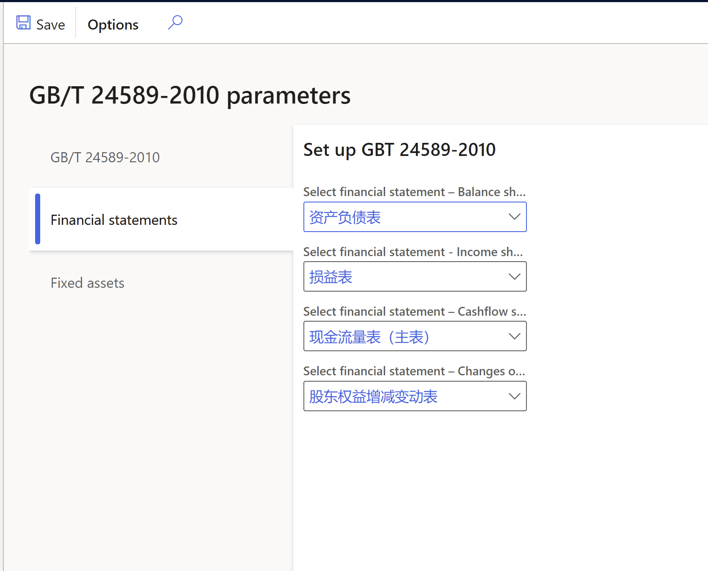
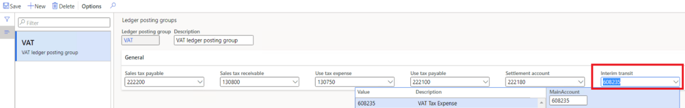

---
# required metadata

title: Tax feature support for transfer order
description: This topic explains the new tax feature support for transfer order using tax calculation service.
author: kliang
manager: beya
ms.date: 02/03/2021
ms.topic: article
ms.prod: 
ms.service: dynamics-ax-applications
ms.technology: 

# optional metadata

ms.search.form:
audience: Application user
# ms.devlang: 
ms.reviewer: kfend
ms.search.scope: Core, Operations
# ms.tgt_pltfrm: 
ms.custom: 
ms.search.region: Global
# ms.search.industry: 
ms.author: wangchen
ms.search.validFrom: 2021-04-01
ms.dyn365.ops.version: 10.0.18

---

# Tax feature support for transfer order

This topic provides information about the functionality of tax calculation and posting integration in transfer order.

Note that all settings that are described in this document are under the scope of the tax service public preview. The content is subjected to change later.

This functionality provides a possibility to set up tax calculation and posting in transfer order for stock transfers, which are considered as intra-community supply and intra-community acquisition under EU VAT regulation.

The main steps to configure and use this functionality are:

-   RCS setup: Set up tax feature, tax codes and tax codes applicability for tax code determination in transfer order.

-   Finance setup: Enable feature "tax in transfer order", Set up tax service parameters for inventory (for example, transfer order), set up core tax parameters (for example, reverse charge).

-   Inventory setup: Follow generic process to set up the inventory configuration for transfer order transactions.

## Microsoft Dynamics Regulatory Service setup

Following is an example setup for the tax involved in a transfer order from Netherlands to Belgium. 

1.  Create and edit **Tax Feature**, select the draft feature version, click **Edit.**

2.  Create **Tax codes** (for example, NL-exempt, BE-RC+21, BE-RC-21).

    a.  When shipping a transfer order from a Netherlands warehouse, it shall apply a Netherlands VAT exempted tax code.

b.  When receiving a transfer order at a Belgium warehouse, it shall apply reverse charge mechanism.

3.  Create and edit Tax codes applicability.

    1. Click Manage columns and select columns to build the applicability table.
    
       > [!NOTE]
       > Select "Business process" and "Tax Directions" into the table. Both columns are essential to tax in transfer order functionality.
    
    2. Add applicability rules (Tax codes, Tax Group, and Item Tax Group shall not be blank).
    
       > [!NOTE]
       > - Set Business Process = "Inventory" to make the rule applicable in Transfer order.
       > - Set Tax Direction = "Output" to make the rule applicable when "Ship Transfer order".
       > - Set Tax Direction = "Input" to make the rule applicable when "Receive Transfer order".

4.  Make sure "Multiple VAT ID configurations" has been properly configured. 
5.  Complete and Publish the new tax feature version.

## Microsoft Dynamics 365 Finance setup

After you complete the setups in section "Microsoft Dynamics Regulatory Configuration Service setup" and published version of tax feature, you can continue the setups in this section in Dynamics 365 Finance.

1. Enable feature "Tax in transfer order" in Feature Management.

   > [!NOTE]
   > Feature "Tax in transfer order" is fully dependent on tax service. It can be only enabled after you have installed tax service.

The following setup is by legal entity. You need to configure it for each legal entity, which you want to enable tax service and tax in transfer order in Dynamics 365 Finance.

2.  Enable tax service and select "Inventory" in Business process.

    a.  Go to module Tax, path Setup - Tax configuration - Tax service setup.

    b.  Tick "Inventory" in the parameter "Business process"

3.  Ensure reverse charge mechanism has been properly set up.

    a.  Switch on "Enable reverse charge" under General ledger parameters.

4.  Ensure related tax codes, tax groups, item tax groups and VAT registration numbers have been set up in Dynamics 365 Finance according to tax service guidance.

5.  **\[Optional\]** Setup a ledger account in Ledger posting groups for "Interim transit" (it's only required in case the tax applied to transfer order is not applicable for tax exempted or reverse charge mechanism)

    a.  Go to module Tax, path Setup - Sales tax - Ledger posting groups.

    b.  Add a ledger account in parameter "Interim transit".

## Inventory setup

In the next section, the basic inventory setup is shared as a sample configuration which enables transfer order transactions.

1. Create ship-from and ship-to **Sites** for your warehouses in different countries. Add primary address for each Site.

   a.  Go to module Warehouse management, path Setup - Warehouse - Sites.

   b.  Click New, create Sites which will be assigned to your warehouses later.

   > [!NOTE]
   > Create a dedicated Site for Transit and assign to the Transit warehouse in the next steps, so that tax related inventory vouchers will be posted both in transfer order "ship" and "receive" transactions. The address of the transit Site is irrelevant to tax calculation and can be left as blank.

2.  Create ship-from, transit, and ship-to Warehouses. If there is address infromation maintained in the warehouse, it will override the address of Sites in tax calculation.

    a.  Go to module Warehouse management, path Setup - Warehouse - Warehouses.

    b.  Click New, create Warehouses and assign the corresponding Sites.
    
    
    
    > [!NOTE]
    > For a ship-from warehouse, a transit Warehouse (with type "Transit") is required to be assigned under parameter "Transit warehouse" for transfer order transactions.

3.  Ensure the inventory posting configuration has been properly set up for transfer order transactions.

    1. Go to module Inventory management, path Setup - Posting - Posting.

    2. Go to tab Inventory, check option Inventory issue & Inventory receipt has respective ledger account setup.
    
       
    
    3. Check option Inter-unit payable has ledger account setup.
    
       
    
    4. Check option Inter-unit receivable has ledger account setup.
    
       

