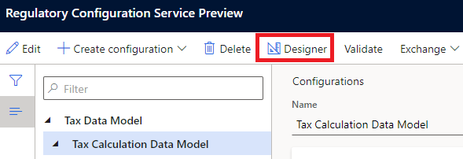
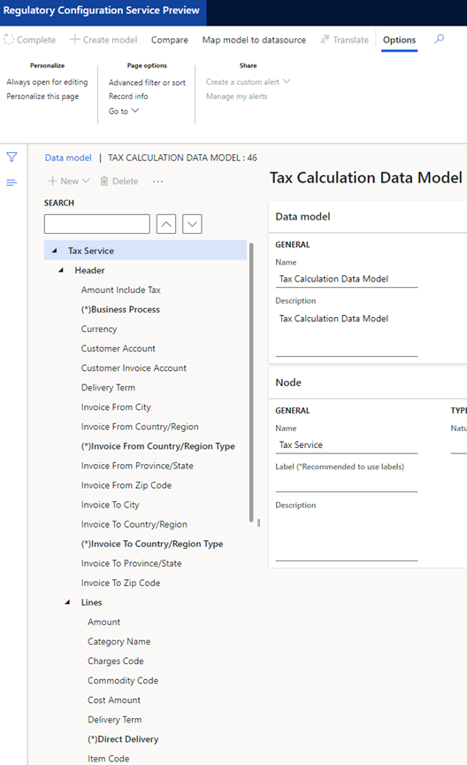
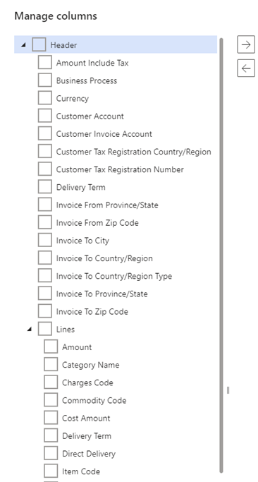

---
# required metadata

title: Tax calculation data model
description: This article provides information about the tax data model, and how the field values of each data model are determined by the context of tax calculation transactions.
author: kailiang
ms.date: 10/15/2021
ms.topic: overview
ms.prod: 
ms.technology: 

# optional metadata

ms.search.form:
audience: Application user
# ms.devlang: 
ms.reviewer: kfend

# ms.tgt_pltfrm: 
ms.custom: 
ms.search.region: Global
# ms.search.industry: 
ms.author: kailiang
ms.search.validFrom: 2021-08-02
ms.dyn365.ops.version: 10.0.21

---
# Tax calculation data model

This article provides information about how the field values in the tax data model are determined in tax calculation transactions.

The *tax data model* is made up of fields that are required for tax calculations. Microsoft provides the *tax calculation data model*, which includes the header fields and line fields of transaction documents in finance and operations apps. The fields that are defined in the tax calculation data model are the available columns of the applicability rules tables in the configuration of the tax calculation feature configuration.

> [!NOTE] 
> Some nodes that are defined in the data model, such as **Record ID** and **Table ID**, are for technical purposes. They aren't available columns in the tax calculation feature configuration.

Follow these steps to view the tax calculation data model.

1. Sign in to Regulatory Configuration Service (RCS), and go to **Electronic reporting** \> **Tax configurations**.
2. Select **Tax Data Model** \> **Tax Calculation Data Model**.
3. On the **Versions** FastTab, select a version.
4. Select **Designer**.

    

5. Expand the **Tax service** node.
6. Expand the **Header** node to view the header data models.
7. Expand the **Lines** node to view the line data models.

    

You can also view the tax calculation data model and the available columns in the applicability rules table.

1. In RCS, go to **Globalization features** \> **Tax calculation**.
2. Find a tax feature that has a status of **Draft**, and then select **Edit**.
3. On the **General** tab, select the configuration version, based on the version of the tax calculation data model. For example, select **40.46.212**.
4. On the **Tax group applicability** tab, select **Manage columns**.

    

The tax calculation data model is integrated with finance and operations apps. During each transaction that is related to tax calculation, the values of the fields that is defined in the applicability rules tables are collected and sent to the tax calculation service for calculation. In version 40.46, 57 predefined data models are available for the following transaction types: purchase orders, sales orders, transfer orders, purchase requisitions, requests for quotation, and sales quotations.

## Version updates and restrictions

- **Free text invoice:** Supported as of version 40.50.221 and Finance version 10.0.23.
- **General journals:** Supported as of version 40.54.234 and Finance version 10.0.26.

    *Restriction:* [One voucher](../general-ledger/one-voucher.md#issues-with-one-voucher) and payment fee aren't supported.

- **Vendor invoice journal:** Supported as of version 40.54.234 and Finance version 10.0.26.
- **Periodic journals:** Supported as of version 40.55.236 and Finance version 10.0.29.

## Field mapping

Thirty-two data models can be included as fields on the header of a transaction. However, not all fields are applicable to all transaction types. The following table shows which header fields are available for specific transaction types. In some cases, the field mapping must be determined by predefined logic. Where applicable, the logic is provided.

| Header field                            | Business transaction type and field mapping |
|----------------------------------|---------------------------------------------|
| Amount include tax               | <ul><li>**Sales order:** Prices include sales tax</li><li>**Purchase order:** Prices include sales tax</li><li>**Purchase requisition:** No</li><li>**Request for quotation:** Prices include sales tax</li><li>**Sales quotation:** Prices include sales tax</li><li>**Free text invoice:** Prices include sales tax</li><li>**Journal:** Amounts include sales tax</li></ul> |
| Business process                 | <ul><li>**Sales order:** Sales</li><li>**Purchase order:** Purchase</li><li>**Transfer order - Ship:** Inventory</li><li>**Transfer order - Receive:** Inventory</li><li>**Purchase requisition:** Purchase</li><li>**Request for quotation:** Purchase</li><li>**Sales quotation:** Sales</li><li>**Free text invoice:** FTI</li><li>**Journal:** Journal</li></ul> |
| Currency                         | <ul><li>**Sales order:** Transaction currency</li><li>**Purchase order:** Transaction currency</li><li>**Transfer order - Ship:** Accounting currency</li><li>**Transfer order - Receive:** Accounting currency</li><li>**Purchase requisition:** Transaction currency</li><li>**Free text invoice:** Transaction currency</li><li>**Journal:** Currency</li></ul> |
| Customer account                 | <ul><li>**Sales order:** Customer account</li><li>**Sales quotation:** Customer account</li><li>**Free text invoice:** Customer account</li><li>**Journal (customer):** Customer account</li></ul> |
| Customer account group                 | <ul><li>**Sales order:** Customer account group</li><li>**Sales quotation:** Customer account group</li><li>**Free text invoice:** Customer account group</li><li>**Journal (customer):** Customer account group</li></ul> |
| Customer invoice account         | <ul><li>**Sales order:** Invoice account</li><li>**Sales quotation:** Invoice account</li><li>**Free text invoice:** Invoice account</li><li>**Journal (customer):**<ol><li>Customer master &gt; Invoice account</li><li>Customer account</li></ol></li></ul> |
| Customer invoice account group         | <ul><li>**Sales order:** Invoice account group</li><li>**Sales quotation:** Invoice account group</li><li>**Free text invoice:** Invoice account group</li><li>**Journal (customer):**<ol><li>Customer master &gt; Invoice account group</li><li>Customer account group</li></ol></li></ul> |
| Customer tax registration country/region                 | <ul><li>**Sales order:** Customer VAT ID country/region</li><li>**Sales quotation:** Customer VAT ID country/region</li><li>**Free text invoice:** Customer VAT ID country/region</li><li>**Journal (customer):** Customer VAT ID country/region</li></ul> |
| Customer tax registration number                 | <ul><li>**Sales order:** Tax exempt number (registration category **VAT ID**)</li><li>**Sales quotation:** Tax exempt number (registration category **VAT ID**)</li><li>**Free text invoice:** Tax exempt number (registration category **VAT ID**)</li><li>**Journal (customer):** Tax exempt number (registration category **VAT ID**)</li></ul> |
| Delivery term                    | <ul><li>**Sales order:** Delivery terms</li><li>**Purchase order:** Delivery terms</li><li>**Transfer order - Ship:** Delivery terms</li><li>**Transfer order - Receive:** Delivery terms</li><li>**Request for quotation:** Delivery terms</li><li>**Sales quotation:** Delivery terms</li><li>**Free text invoice:** Delivery terms</li></ul> |
| Direct delivery               | <ul><li>**Sales order:** Line details > Direct delivery</li><li>**Purchase order:** Direct delivery</li></ul> |
| Intercompany direct delivery               | <ul><li>**Sales order:** Header > Intercompany settings > Direct delivery</li></ul> |
| Invoice from city                | <ul><li>**Sales order:**<ol><li>Legal entity &gt; Default invoice address &gt; City</li><li>Legal entity &gt; Primary address &gt; City</li></ol></li><li>**Purchase order:**<ol><li>Header &gt; Invoice account &gt; Default invoice address &gt; City</li><li>Header &gt; Invoice account &gt; Primary address &gt; City</li></ol></li><li>**Sales quotation:**<ol><li>Legal entity &gt; Default invoice address &gt; City</li><li>Legal entity &gt; Primary address &gt; City</li></ol></li><li>**Free text invoice:**<ol><li>Legal entity &gt; Default invoice address &gt; City</li><li>Legal entity &gt; Primary address &gt; City</li></ol></li><li>**Journal (customer):**<ol><li>Legal entity &gt; Default invoice address &gt; City</li><li>Legal entity &gt; Primary address &gt; City</li></ol></li><li>**Journal (vendor):**<ol><li>Vendor invoice account &gt; Default invoice address &gt; City</li><li>Vendor invoice account &gt; Primary address &gt; City</li><li>Vendor account &gt; Default invoice address &gt; City</li><li>Vendor account &gt; Primary address &gt; City</li></ol></li></ul> |
| Invoice from country/region      | <ul><li>**Sales order:**<ol><li>Legal entity &gt; Default invoice address &gt; Country/region</li><li>Legal entity &gt; Primary address &gt; Country/region</li></ol></li><li>**Purchase order:**<ol><li>Header &gt; Invoice account &gt; Default invoice address &gt; Country/region</li><li>Header &gt; Invoice account &gt; Primary address &gt; Country/region</li></ol></li><li>**Sales quotation:**<ol><li>Legal entity &gt; Default invoice address &gt; Country/region</li><li>Legal entity &gt; Primary address &gt; Country/region</li></ol></li><li>**Free text invoice:**<ol><li>Legal entity &gt; Default invoice address &gt; Country/region</li><li>Legal entity &gt; Primary address &gt; Country/region</li></ol></li><li>**Journal (customer):**<ol><li>Legal entity &gt; Default invoice address &gt; Country/region</li><li>Legal entity &gt; Primary address &gt; Country/region</li></ol></li><li>**Journal (vendor):**<ol><li>Vendor invoice account &gt; Default invoice address &gt; Country/region</li><li>Vendor invoice account &gt; Primary address &gt; Country/region</li><li>Vendor account &gt; Default invoice address &gt; Country/region</li><li>Vendor account &gt; Primary address &gt; Country/region</li></ol></li></ul> |
| Invoice from country/region type | <ul><li>If the **Invoice from country/region** and **Invoice to country/region** fields have the same value, the type is **Domestic**.</li><li>The mapping is determined by the configuration on the **Country/region properties** tab of the **Foreign trade parameters** page (**Tax** &gt; **Setup** &gt; **Foreign trade** &gt; **Foreign trade parameters**), based on the value of the **Invoice from country/region** field.</li><li>Not applicable to **Purchase requisition** or **Request for quotation**.</li></ul> |
| Invoice from province/state      | <ul><li>**Sales order:**<ol><li>Legal entity &gt; Default invoice address &gt; State</li><li>Legal entity &gt; Primary address &gt; State</li></ol></li><li>**Purchase order:**<ol><li>Header &gt; Invoice account &gt; Default invoice address &gt; State</li><li>Header &gt; Invoice account &gt; Primary address &gt; State</li></ol></li><li>**Sales quotation:**<ol><li>Legal entity &gt; Default invoice address &gt; State</li><li>Legal entity &gt; Primary address &gt; State</li></ol></li><li>**Free text invoice:**<ol><li>Legal entity &gt; Default invoice address &gt; State</li><li>Legal entity &gt; Primary address &gt; State</li></ol></li><li>**Journal (customer):**<ol><li>Legal entity &gt; Default invoice address &gt; State</li><li>Legal entity &gt; Primary address &gt; State</li></ol></li><li>**Journal (vendor):**<ol><li>Vendor invoice account &gt; Default invoice address &gt; State</li><li>Vendor invoice account &gt; Primary address &gt; State</li><li>Vendor account &gt; Default invoice address &gt; State</li><li>Vendor account &gt; Primary address &gt; State</li></ol></li></ul> |
| Invoice from zip code            | <ul><li>**Sales order:**<ol><li>Legal entity &gt; Default invoice address &gt; ZIP/postal code</li><li>Legal entity &gt; Primary address &gt; ZIP/postal code</li></ol></li><li>**Purchase order:**<ol><li>Header &gt; Invoice account &gt; Default invoice address &gt; ZIP/postal code</li><li>Header &gt; Invoice account &gt; Primary address &gt; ZIP/postal code</li></ol></li><li>**Sales quotation:**<ol><li>Legal entity &gt; Default invoice address &gt; ZIP/postal code</li><li>Legal entity &gt; Primary address &gt; ZIP/postal code</li></ol></li><li>**Free text invoice:**<ol><li>Legal entity &gt; Default invoice address &gt; ZIP/postal code</li><li>Legal entity &gt; Primary address &gt; ZIP/postal code</li></ol></li><li>**Journal (customer):**<ol><li>Legal entity &gt; Default invoice address &gt; ZIP/postal code</li><li>Legal entity &gt; Primary address &gt; ZIP/postal code</li></ol></li><li>**Journal (vendor):**<ol><li>Vendor invoice account &gt; Default invoice address &gt; ZIP/postal code</li><li>Vendor invoice account &gt; Primary address &gt; ZIP/postal code</li><li>Vendor account &gt; Default invoice address &gt; ZIP/postal code</li><li>Vendor account &gt; Primary address &gt; ZIP/postal code</li></ol></li></ul> |
| Invoice to city                  | <ul><li>**Sales order:**<ol><li>Header &gt; Invoice account &gt; Default invoice address &gt; City</li><li>Header &gt; Invoice account &gt; Primary address &gt; City</li></ol></li><li>**Purchase order:**<ol><li>Legal entity &gt; Default invoice address &gt; City</li><li>Legal entity &gt; Primary address &gt; City</li></ol></li><li>**Sales quotation:**<ol><li>Header &gt; Invoice account &gt; Default invoice address &gt; City</li><li>Header &gt; Invoice account &gt; Primary address &gt; City</li></ol></li><li>**Free text invoice:**<ol><li>Header &gt; Invoice address &gt; City</li><li>Header &gt; Invoice account &gt; Default invoice address &gt; City</li><li>Header &gt; Invoice account &gt; Primary address &gt; City</li></ol></li><li>**Journal (customer):**<ol><li>Customer invoice account &gt; Default invoice address &gt; City</li><li>Customer invoice account &gt; Primary address &gt; City</li><li>Customer account &gt; Default invoice address &gt; City</li><li>Customer account &gt; Primary address &gt; City</li></ol></li><li>**Journal (vendor):**<ol><li>Legal entity &gt; Default invoice address &gt; City</li><li>Legal entity &gt; Primary address &gt; City</li></ol></li></ul> |
| Invoice to country/region        | <ul><li>**Sales order:**<ol><li>Header &gt; Invoice account &gt; Default invoice address &gt; Country/region</li><li>Header &gt; Invoice account &gt; Primary address &gt; Country/region</li></ol></li><li>**Purchase order:**<ol><li>Legal entity &gt; Default invoice address &gt; Country/region</li><li>Legal entity &gt; Primary address &gt; Country/region</li></ol></li><li>**Sales quotation:**<ol><li>Header &gt; Invoice account &gt; Default invoice address &gt; Country/region</li><li>Header &gt; Invoice account &gt; Primary address &gt; Country/region</li></ol></li><li>**Free text invoice:**<ol><li>Header &gt; Invoice address &gt; Country/region</li><li>Header &gt; Invoice account &gt; Default invoice address &gt; Country/region</li><li>Header &gt; Invoice account &gt; Primary address &gt; Country/region</li></ol></li><li>**Journal (customer):**<ol><li>Customer invoice account &gt; Default invoice address &gt; Country/region</li><li>Customer invoice account &gt; Primary address &gt; Country/region</li><li>Customer account &gt; Default invoice address &gt; Country/region</li><li>Customer account &gt; Primary address &gt; Country/region</li></ol></li><li>**Journal (vendor):**<ol><li>Legal entity &gt; Default invoice address &gt; Country/region</li><li>Legal entity &gt; Primary address &gt; Country/region</li></ol></li></ul> |
| Invoice to country/region type   | <ul><li>If the **Invoice from country/region** and **Invoice to country/region** fields have the same value, the type is **Domestic**.</li><li>The mapping is determined by the configuration on the **Country/region properties** tab of the **Foreign trade parameters** page (**Tax** &gt; **Setup** &gt; **Foreign trade** &gt; **Foreign trade parameters**), based on the value of the **Invoice to country/region** field.</li><li>Not applicable to **Purchase requisition** or **Request for quotation**.</li></ul> |
| Invoice to province/state        | <ul><li>**Sales order:**<ol><li>Header &gt; Invoice account &gt; Default invoice address &gt; State</li><li>Header &gt; Invoice account &gt; Primary address &gt; State</li></ol></li><li>**Purchase order:**<ol><li>Legal entity &gt; Default invoice address &gt; State</li><li>Legal entity &gt; Primary address &gt; State</li></ol></li><li>**Sales quotation:**<ol><li>Header &gt; Invoice account &gt; Default invoice address &gt; State</li><li>Header &gt; Invoice account &gt; Primary address &gt; State</li></ol></li><li>**Free text invoice:**<ol><li>Header &gt; Invoice address &gt; State</li><li>Header &gt; Invoice account &gt; Default invoice address &gt; State</li><li>Header &gt; Invoice account &gt; Primary address &gt; State</li></ol></li><li>**Journal (customer):**<ol><li>Customer invoice account &gt; Default invoice address &gt; State</li><li>Customer invoice account &gt; Primary address &gt; State</li><li>Customer account &gt; Default invoice address &gt; State</li><li>Customer account &gt; Primary address &gt; State</li></ol></li><li>**Journal (vendor):**<ol><li>Legal entity &gt; Default invoice address &gt; State</li><li>Legal entity &gt; Primary address &gt; State</li></ol></li></ul> |
| Invoice to zip code              | <ul><li>**Sales order:**<ol><li>Header &gt; Invoice account &gt; Default invoice address &gt; ZIP/postal code</li><li>Header &gt; Invoice account &gt; Primary address &gt; ZIP/postal code</li></ol></li><li>**Purchase order:**<ol><li>Legal entity &gt; Default invoice address &gt; ZIP/postal code</li><li>Legal entity &gt; Primary address &gt; ZIP/postal code</li></ol></li><li>**Sales quotation:**<ol><li>Header &gt; Invoice account &gt; Default invoice address &gt; ZIP/postal code</li><li>Header &gt; Invoice account &gt; Primary address &gt; ZIP/postal code</li></ol></li><li>**Free text invoice:**<ol><li>Header &gt; Invoice address &gt; ZIP/postal code</li><li>Header &gt; Invoice account &gt; Default invoice address &gt; ZIP/postal code</li><li>Header &gt; Invoice account &gt; Primary address &gt; ZIP/postal code</li></ol></li><li>**Journal (customer):**<ol><li>Customer invoice account &gt; Default invoice address &gt; ZIP/postal code</li><li>Customer invoice account &gt; Primary address &gt; ZIP/postal code</li><li>Customer account &gt; Default invoice address &gt; ZIP/postal code</li><li>Customer account &gt; Primary address &gt; ZIP/postal code</li></ol></li><li>**Journal (vendor):**<ol><li>Legal entity &gt; Default invoice address &gt; ZIP/postal code</li><li>Legal entity &gt; Primary address &gt; ZIP/postal code</li></ol></li></ul> |
| Is prepayment journal voucher              | <ul><li>**Journal:** From the **Prepayment journal voucher** field on the Customer or Vendor line</li></ul> |
| Journal name                 | <ul><li>**Journal:** Name</li></ul> |
| Order type                 | <ul><li>**Sales order:** Order type</li><li>**Purchase order:** Order type</li></ul> |
| Ship from city                   | <ul><li>**Sales order:**<ol><li>Header &gt; Warehouse &gt; Primary address &gt; City</li><li>Header &gt; Site &gt; Primary address &gt; City</li><li>Legal entity &gt; Default delivery address &gt; Country/region</li><li>Legal entity &gt; Primary address &gt; Country/region</li></ol></li><li>**Purchase order:**<ol><li>Transportation details &gt; Loading address &gt; City</li><li>Header &gt; Vendor account &gt; Default delivery address &gt; City</li><li>Header &gt; Vendor account &gt; Primary address &gt; City</li></ol></li><li>**Transfer order - Ship:**<ol><li>Header &gt; From warehouse &gt; Primary address &gt; City</li><li>Header &gt; From site &gt; Primary address &gt; City</li></ol></li><li>**Transfer order - Receive:**<ol><li>Header &gt; From warehouse &gt; Primary address &gt; City</li><li>Header &gt; From site &gt; Primary address &gt; City</li></ol></li><li>**Request for quotation:**<ol><li>Header &gt; Vendor account &gt; Default delivery address &gt; City</li><li>Header &gt; Vendor account &gt; Primary address &gt; City</li></ol></li><li>**Sales quotation:**<ol><li>Header &gt; Warehouse &gt; Primary address &gt; City</li><li>Header &gt; Site &gt; Primary address &gt; City</li><li>Legal entity &gt; Default delivery address &gt; City</li><li>Legal entity &gt; Primary address &gt; City</li></ol></li><li>**Free text invoice:**<ol><li>Transportation details &gt; Loading address &gt; City</li><li>Legal entity &gt; Default delivery address &gt; City</li><li>Legal entity &gt; Primary address &gt; City</li></ol></li><li>**Journal (customer):**<ol><li>Legal entity &gt; Default delivery address &gt; City</li><li>Legal entity &gt; Primary address &gt; City</li></ol></li><li>**Journal (vendor):**<ol><li>Vendor account &gt; Default delivery address &gt; City</li><li>Vendor account &gt; Primary address &gt; City</li></ol></li></ul> |
| Ship from country/region         | <ul><li>**Sales order:**<ol><li>Header &gt; Warehouse &gt; Primary address &gt; Country/region</li><li>Header &gt; Site &gt; Primary address &gt; Country/region</li><li>Legal entity &gt; Default delivery address &gt; Country/region</li><li>Legal entity &gt; Primary address &gt; Country/region</li></ol></li><li>**Purchase order:**<ol><li>Transportation details &gt; Loading address &gt; Country/region</li><li>Header &gt; Vendor account &gt; Default delivery address &gt; Country/region</li><li>Header &gt; Vendor account &gt; Primary address &gt; Country/region</li></ol></li><li>**Transfer order - Ship:**<ol><li>Header &gt; From warehouse &gt; Primary address &gt; Country/region</li><li>Header &gt; From site &gt; Primary address &gt; Country/region</li></ol></li><li>**Transfer order - Receive:**<ol><li>Header &gt; From warehouse &gt; Primary address &gt; Country/region</li><li>Header &gt; From site &gt; Primary address &gt; Country/region</li></ol></li><li>**Request for quotation:**<ol><li>Header &gt; Vendor account &gt; Default delivery address &gt; Country/region</li><li>Header &gt; Vendor account &gt; Primary address &gt; Country/region</li></ol></li><li>**Sales quotation:**<ol><li>Header &gt; Warehouse &gt; Primary address &gt; Country/region</li><li>Header &gt; Site &gt; Primary address &gt; Country/region</li><li>Legal entity &gt; Default delivery address &gt; Country/region</li><li>Legal entity &gt; Primary address &gt; Country/region</li></ol></li><li>**Free text invoice:**<ol><li>Transportation details &gt; Loading address &gt; Country/region</li><li>Legal entity &gt; Default delivery address &gt; Country/region</li><li>Legal entity &gt; Primary address &gt; Country/region</li></ol></li><li>**Journal (customer):**<ol><li>Legal entity &gt; Default delivery address &gt; Country/region</li><li>Legal entity &gt; Primary address &gt; Country/region</li></ol></li><li>**Journal (vendor):**<ol><li>Vendor account &gt; Default delivery address &gt; Country/region</li><li>Vendor account &gt; Primary address &gt; Country/region</li></ol></li></ul> |
| Ship from country/region type    | <ul><li>If the **Ship from country/region** and **Ship to country/region** fields have the same value, the type is **Domestic**.</li><li>The mapping is determined by the configuration on the **Country/region properties** tab of the **Foreign trade parameters** page (**Tax** &gt; **Setup** &gt; **Foreign trade** &gt; **Foreign trade parameters**), based on the value of the **Ship from country/region** field.</li><li>Not applicable to **Purchase requisition**.</li></ul> |
| Ship from province/state         | <ul><li>**Sales order:**<ol><li>Header &gt; Warehouse &gt; Primary address &gt; State</li><li>Header &gt; Site &gt; Primary address &gt; State</li><li>Legal entity &gt; Default delivery address &gt; State</li><li>Legal entity &gt; Primary address &gt; State</li></ol></li><li>**Purchase order:**<ol><li>Transportation details &gt; Loading address &gt; State</li><li>Header &gt; Vendor account &gt; Default delivery address &gt; State</li><li>Header &gt; Vendor account &gt; Primary address &gt; State</li></ol></li><li>**Transfer order - Ship:**<ol><li>Header &gt; From warehouse &gt; Primary address &gt; State</li><li>Header &gt; From site &gt; Primary address &gt; state</li></ol></li><li>**Transfer order - Receive:**<ol><li>Header &gt; From warehouse &gt; Primary address &gt; State</li><li>Header &gt; From site &gt; Primary address &gt; State</li></ol></li><li>**Request for quotation:**<ol><li>Header &gt; Vendor account &gt; Default delivery address &gt; State</li><li>Header &gt; Vendor account &gt; Primary address &gt; State</li></ol></li><li>**Sales quotation:**<ol><li>Header &gt; Warehouse &gt; Primary address &gt; State</li><li>Header &gt; Site &gt; Primary address &gt; State</li><li>Legal entity &gt; Default delivery address &gt; State</li><li>Legal entity &gt; Primary address &gt; State</li></ol></li><li>**Free text invoice:**<ol><li>Transportation details &gt; Loading address &gt; State</li><li>Legal entity &gt; Default delivery address &gt; State</li><li>Legal entity &gt; Primary address &gt; State</li></ol></li><li>**Journal (customer):**<ol><li>Legal entity &gt; Default delivery address &gt; State</li><li>Legal entity &gt; Primary address &gt; State</li></ol></li><li>**Journal (vendor):**<ol><li>Vendor account &gt; Default delivery address &gt; State</li><li>Vendor account &gt; Primary address &gt; State</li></ol></li></ul> |
| Ship from zip code               | <ul><li>**Sales order:**<ol><li>Header &gt; Warehouse &gt; Primary address &gt; ZIP/postal code</li><li>Header &gt; Site &gt; Primary address &gt; ZIP/postal code</li><li>Legal entity &gt; Default delivery address &gt; ZIP/postal code</li><li>Legal entity &gt; Primary address &gt; ZIP/postal code</li></ol></li><li>**Purchase order:**<ol><li>Transportation details &gt; Loading address &gt; ZIP/postal code</li><li>Header &gt; Vendor account &gt; Default delivery address &gt; ZIP/postal code</li><li>Header &gt; Vendor account &gt; Primary address &gt; ZIP/postal code</li></ol></li><li>**Transfer order - Ship:**<ol><li>Header &gt; From warehouse &gt; Primary address &gt; ZIP/postal code</li><li>Header &gt; From site &gt; Primary address &gt; ZIP/postal code</li></ol></li><li>**Transfer order - Receive:**<ol><li>Header &gt; From warehouse &gt; Primary address &gt; ZIP/postal code</li><li>Header &gt; From site &gt; Primary address &gt; ZIP/postal code </li></ol></li><li>**Request for quotation:**<ol><li>Header &gt; Vendor account &gt; Default delivery address &gt; ZIP/postal code</li><li>Header &gt; Vendor account &gt; Primary address &gt; ZIP/postal code</li></ol></li><li>**Sales quotation:**<ol><li>Header &gt; Warehouse &gt; Primary address &gt; ZIP/postal code</li><li>Header &gt; Site &gt; Primary address &gt; ZIP/postal code</li><li>Legal entity &gt; Default delivery address &gt; ZIP/postal code</li><li>Legal entity &gt; Primary address &gt; ZIP/postal code</li></ol></li><li>**Free text invoice:**<ol><li>Transportation details &gt; Loading address &gt; ZIP/postal code</li><li>Legal entity &gt; Default delivery address &gt; ZIP/postal code</li><li>Legal entity &gt; Primary address &gt; ZIP/postal code</li></ol></li><li>**Journal (customer):**<ol><li>Legal entity &gt; Default delivery address &gt; ZIP/postal code</li><li>Legal entity &gt; Primary address &gt; ZIP/postal code</li></ol></li><li>**Journal (vendor):**<ol><li>Vendor account &gt; Default delivery address &gt; ZIP/postal code</li><li>Vendor account &gt; Primary address &gt; ZIP/postal code</li></ol></li></ul> |
| Ship to city                     | <ul><li>**Sales order:**<ol><li>Header &gt; Delivery address &gt; City</li></ol></li><li>**Purchase order:**<ol><li>Header &gt; Delivery address &gt; City</li></ol></li><li>**Transfer order - Ship:**<ol><li>Header &gt; To warehouse &gt; Primary address &gt; City</li><li>Header &gt; To site &gt; Primary address &gt; City</li></ol></li><li>**Transfer order - Receive:**<ol><li>Header &gt; To warehouse &gt; Primary address &gt; City</li><li>Header &gt; To site &gt; Primary address &gt; City</li></ol></li><li>**Request for quotation:**<ol><li>Header &gt; Delivery address &gt; City</li></ol></li><li>**Sales quotation:**<ol><li>Header &gt; Delivery address &gt; City</li></ol></li><li>**Free text invoice:**<ol><li>Header &gt; Customer account &gt; Default delivery address &gt; City</li><li>Header &gt; Customer account &gt; Primary address &gt; City</li></ol></li><li>**Journal (customer):**<ol><li>Customer account &gt; Default delivery address &gt; City</li><li>Customer account &gt; Primary address &gt; City</li></ol></li><li>**Journal (vendor):**<ol><li>Legal entity &gt; Default delivery address &gt; City</li><li>Legal entity &gt; Primary address &gt; City</li></ol></li></ul> |
| Ship to country/region           | <ul><li>**Sales order:**<ol><li>Header &gt; Delivery address &gt; Country/region</li></ol></li><li>**Purchase order:**<ol><li>Header &gt; Delivery address &gt; Country/region</li></ol></li><li>**Transfer order - Ship:**<ol><li>Header &gt; To warehouse &gt; Primary address &gt; Country/region</li><li>Header &gt; To site &gt; Primary address &gt; Country/region</li></ol></li><li>**Transfer order - Receive:**<ol><li>Header &gt; To warehouse &gt; Primary address &gt; Country/region</li><li>Header &gt; To site &gt; Primary address &gt; Country/region</li></ol></li><li>**Request for quotation:**<ol><li>Header &gt; Delivery address &gt; Country/region</li></ol></li><li>**Sales quotation:**<ol><li>Header &gt; Delivery address &gt; Country/region</li></ol></li><li>**Free text invoice:**<ol><li>Header &gt; Customer account &gt; Default delivery address &gt; Country/region</li><li>Header &gt; Customer account &gt; Primary address &gt; Country/region</li></ol></li><li>**Journal (customer):**<ol><li>Customer account &gt; Default delivery address &gt; Country/region</li><li>Customer account &gt; Primary address &gt; Country/region</li></ol></li><li>**Journal (vendor):**<ol><li>Legal entity &gt; Default delivery address &gt; Country/region</li><li>Legal entity &gt; Primary address &gt; Country/region</li></ol></li></ul> |
| Ship to country/region type      | <ul><li>If the **Ship from country/region** and **Ship to country/region** fields have the same value, the type is **Domestic**.</li><li>The mapping is determined by the configuration on the **Country/region properties** tab of the **Foreign trade parameters** page (**Tax** &gt; **Setup** &gt; **Foreign trade** &gt; **Foreign trade parameters**), based on the value of the **Ship to country/region** field.</li><li>Not applicable to **Purchase requisition**.</li></ul> |
| Ship to province/state          | <ul><li>**Sales order:**<ol><li>Header &gt; Delivery address &gt; State</li></ol></li><li>**Purchase order:**<ol><li>Header &gt; Delivery address &gt; State</li></ol></li><li>**Transfer order - Ship:**<ol><li>Header &gt; To warehouse &gt; Primary address &gt; State</li><li>Header &gt; To site &gt; Primary address &gt; State</li></ol></li><li>**Transfer order - Receive:**<ol><li>Header &gt; To warehouse &gt; Primary address &gt; State</li><li>Header &gt; To site &gt; Primary address &gt; State</li></ol></li><li>**Request for quotation:**<ol><li>Header &gt; Delivery address &gt; State</li></ol></li><li>**Sales quotation:**<ol><li>Header &gt; Delivery address &gt; state</li></ol></li><li>**Free text invoice:**<ol><li>Header &gt; Customer account &gt; Default delivery address &gt; State</li><li>Header &gt; Customer account &gt; Primary address &gt; State</li></ol></li><li>**Journal (customer):**<ol><li>Customer account &gt; Default delivery address &gt; State</li><li>Customer account &gt; Primary address &gt; State</li></ol></li><li>**Journal (vendor):**<ol><li>Legal entity &gt; Default delivery address &gt; State</li><li>Legal entity &gt; Primary address &gt; State</li></ol></li></ul> |
| Ship to zip code                 | <ul><li>**Sales order:**<ol><li>Header &gt; Delivery address &gt; ZIP/postal code</li></ol></li><li>**Purchase order:**<ol><li>Header &gt; Delivery address &gt; ZIP/postal code</li></ol></li><li>**Transfer order - Ship:**<ol><li>Header &gt; To warehouse &gt; Primary address &gt; ZIP/postal code</li><li>Header &gt; To site &gt; Primary address &gt; ZIP/postal code</li></ol></li><li>**Transfer order - Receive:**<ol><li>Header &gt; To warehouse &gt; Primary address &gt; ZIP/postal code</li><li>Header &gt; To site &gt; Primary address &gt; ZIP/postal code</li></ol></li><li>**Request for quotation:**<ol><li>Header &gt; Delivery address &gt; ZIP/postal code</li></ol></li><li>**Sales quotation:**<ol><li>Header &gt; Delivery address &gt; ZIP/postal code</li></ol></li><li>**Free text invoice:**<ol><li>Header &gt; Customer account &gt; Default delivery address &gt; ZIP/postal code</li><li>Header &gt; Customer account &gt; Primary address &gt; ZIP/postal code</li></ol></li><li>**Journal (customer):**<ol><li>Customer account &gt; Default delivery address &gt; ZIP/postal code</li><li>Customer account &gt; Primary address &gt; ZIP/postal code</li></ol></li><li>**Journal (vendor):**<ol><li>Legal entity &gt; Default delivery address &gt; ZIP/postal code</li><li>Legal entity &gt; Primary address &gt; ZIP/postal code</li></ol></li></ul> |
| Site                             | <ul><li>**Sales order:** Site</li><li>**Purchase order:** Site</li><li>**Transfer order - Ship:** Site of the From warehouse</li><li>**Transfer order - Receive:** Site of the To warehouse</li><li>**Request for quotation:** Site</li><li>**Sales quotation:** Site</li></ul> |
| Tax direction                    | <ul><li>**Sales order:** Output</li><li>**Purchase order:** Input</li><li>**Transfer order - Ship:** Output</li><li>**Transfer order - Receive:** Input</li><li>**Purchase requisition:** Input</li><li>**Request for quotation:** Input</li><li>**Sales quotation:** Output</li><li>**Free text invoice:** Output</li><li>**Journal:** Output</li></ul> |
| Vendor account                   | <ul><li>**Purchase order:** Vendor account</li><li>**Journal (vendor):** Vendor account</li></ul> |
| Vendor account group                   | <ul><li>**Purchase order:** Vendor account group</li><li>**Journal (vendor):** Vendor account group</li></ul> |
| Vendor invoice account           | <ul><li>**Purchase order:** Invoice account</li><li>**Journal (vendor):**<ol><li>Vendor master &gt; Invoice account</li><li>Vendor account</li></ol></li></ul> |
| Vendor invoice account group           | <ul><li>**Purchase order:** Invoice account group</li><li>**Journal (vendor):**<ol><li>Vendor master &gt; Invoice account group</li><li>Vendor account group</li></ol></li></ul> |
| Vendor tax registration country/region                   | <ul><li>**Purchase order:** Vendor VAT ID country/region</li><li>**Journal (vendor):** Vendor VAT ID country/region</li></ul> |
| Vendor tax registration number                   | <ul><li>**Purchase order:** Tax exempt number (registration category **VAT ID**)</li><li>**Journal (vendor):** Tax exempt number (registration category **VAT ID**)</li></ul> |
| Warehouse                        | <ul><li>**Sales order:** Warehouse</li><li>**Purchase order:** Warehouse</li><li>**Transfer order - Ship:** From warehouse</li><li>**Transfer order - Receive:** To warehouse</li><li>**Request for quotation:** Warehouse</li><li>**Sales quotation:** Warehouse</li></ul> |

Twenty-six data models are included as fields on the lines of a transaction. As for the header fields, not all fields are applicable to all transaction types. The following table shows which line fields are available for specific transaction types. In some cases, the field mapping must be determined by predefined logic. Where applicable, the logic is provided.

| Line field                         | Business transaction type and mapping |
|-------------------------------|---------------------------------------|
| Amount                        | <ul><li>**Sales order:** Net amount</li><li>**Purchase order:** Net amount</li><li>**Transfer order - Slip:** Amount</li><li>**Transfer order - Receive:** Amount</li><li>**Purchase requisition:** Net amount</li><li>**Request for quotation:** Net amount</li><li>**Sales quotation:** Net amount</li><li>**Free text invoice:** Net amount</li><li>**Journal:** Debit/Credit</li></ul> |
| Category name                 | <ul><li>**Sales order:** Sales category</li><li>**Purchase order:** Procurement category</li><li>**Purchase requisition:** Procurement category</li><li>**Request for quotation:** Procurement category</li><li>**Sales quotation:** Sales category</li></ul> |
| Charges code                  | <ul><li>**Sales order:** Charges code</li><li>**Purchase order:** Charges code</li><li>**Purchase requisition:** Charges code</li><li>**Request for quotation:** Charges code</li><li>**Sales quotation:** Charges code</li><li>**Free text invoice:** Charges code</li></ul> |
| Commodity code                | <ul><li>**Sales order:** Line &gt; Foreign trade &gt; Commodity</li><li>**Purchase order:** Line &gt; Foreign trade &gt; Commodity</li><li>**Transfer order - Ship:** Line &gt; Foreign trade &gt; Commodity</li><li>**Transfer order - Receive:** Line &gt; Foreign trade &gt; Commodity</li><li>**Sales quotation:** Line &gt; Foreign trade &gt; Commodity</li><li>**Free text invoice:** Line &gt; Foreign trade &gt; Commodity</li></ul> |
| Cost amount                   | <ul><li>**Sales order:** The cost price of the item in inventory</li><li>**Sales quotation:** The cost price of the item in inventory</li></ul> |
| Delivery term                 | <ul><li>**Sales order:** Delivery terms</li><li>**Request for quotation:** Delivery terms</li><li>**Sales quotation:** Delivery terms</li></ul> |
| Direct delivery               | <ul><li>**Sales order:** Direct delivery</li><li>**Purchase order:** Direct delivery</li></ul> |
| Item code                     | <ul><li>**Sales order:** Item number</li><li>**Purchase order:** Item number</li><li>**Transfer order - Ship:** Item number</li><li>**Transfer order - Receive:** Item number</li><li>**Purchase requisition:** Item number</li><li>**Request for quotation:** Item number</li><li>**Sales quotation:** Item number</li></ul> |
| Item group                     | <ul><li>**Sales order:** Item group of the item</li><li>**Purchase order:** Item group of the item</li><li>**Transfer order - Ship:** Item group of the item</li><li>**Transfer order - Receive:** Item group of the item</li><li>**Purchase requisition:** Item group of the item</li><li>**Request for quotation:** Item group of the item</li><li>**Sales quotation:** Item group of the item</li></ul> |
| Item type                     | <ul><li>**Sales order:** The Product type of the Item code</li><li>**Purchase order:** The Product type of the Item code</li><li>**Transfer order - Ship:** The Product type of the Item code</li><li>**Transfer order - Receive:** The Product type of the Item code</li><li>**Purchase requisition:** The Product type of the Item code</li><li>**Request for quotation:** The Product type of the Item code</li><li>**Sales quotation:** The Product type of the Item code</li></ul>|
| Line type                     | <ul><li>**Sales order:** The type of the current line. Options include header charge, line charge, and normal order line.</li><li>**Purchase order:** The type of the current line. Options include header charge, line charge, and normal order line.</li><li>**Transfer order - Ship:** Normal</li><li>**Transfer order - receive:** Normal</li><li>**Purchase requisition:** The type of the current line. Options include header charge, line charge, and normal order line.</li><li>**Request for quotation:** The type of the current line. Options include header charge, line charge, and normal order line.</li><li>**Sales quotation:** The type of the current line. Options include header charge, line charge, and normal order line.</li><li>**Free text invoice:** The type of the current line. Options include header charge, line charge, and normal order line.</li><li>**Journal:** Normal</li></ul> |
| Quantity                      | <ul><li>**Sales order:** Quantity</li><li>**Purchase order:** Quantity</li><li>**Transfer order - Ship:** Quantity</li><li>**Transfer order - Receive:** Quantity</li><li>**Purchase requisition:** Quantity</li><li>**Request for quotation:** Quantity</li><li>**Sales quotation:** Quantity</li><li>**Free text invoice:** Quantity</li></ul> |
| Ship from city                | <ul><li>**Sales order:**<ol><li>Header &gt; Warehouse &gt; Primary address &gt; City</li><li>Header &gt; Site &gt; Primary address &gt; City</li><li>Legal entity &gt; Default delivery address &gt; City</li><li>Legal entity &gt; Primary address &gt; City</li></ol></li><li>**Purchase order:**<ol><li>Transportation details &gt; Loading address &gt; City</li><li>Header &gt; Vendor account &gt; Default delivery address &gt; City</li><li>Header &gt; Vendor account &gt; Primary address &gt; City</li></ol></li><li>**Transfer order - Ship:**<ol><li>Header &gt; From warehouse &gt; Primary address &gt; City</li><li>Header &gt; From site &gt; Primary address &gt; City</li></ol></li><li>**Transfer order - Receive:**<ol><li>Header &gt; From warehouse &gt; Primary address &gt; City</li><li>Header &gt; From site &gt; Primary address &gt; City</li></ol></li><li>**Purchase requisition:**<ol><li>Line &gt; Vendor account &gt; Default delivery address &gt; City</li><li>Line &gt; Vendor account &gt; Primary address &gt; City</li></ol></li><li>**Request for quotation:**<ol><li>Header &gt; Vendor account &gt; Default delivery address &gt; City</li><li>Header &gt; Vendor account &gt; Primary address &gt; City</li></ol></li><li>**Sales quotation:**<ol><li>Header &gt; Warehouse &gt; Primary address &gt; City</li><li>Header &gt; Site &gt; Primary address &gt; City</li><li>Legal entity &gt; Default delivery address &gt; City</li><li>Legal entity &gt; Primary address &gt; City</li></ol></li><li>**Free text invoice:**<ol><li>Transportation details &gt; Loading address &gt; City</li><li>Legal entity &gt; Default delivery address &gt; City</li><li>Legal entity &gt; Primary address &gt; City</li></ol></li></ul> |
| Ship from country/region      | <ul><li>**Sales order:**<ol><li>Line &gt; Warehouse &gt; Primary address &gt; Country/region</li><li>Line &gt; Site &gt; Primary address &gt; Country/region</li><li>Legal entity &gt; Default delivery address &gt; Country/region</li><li>Legal entity &gt; Primary address &gt; Country/region</li></ol></li><li>**Purchase order:**<ol><li>Transportation details &gt; Loading address &gt; Country/region</li><li>Header &gt; Vendor account &gt; Default delivery address &gt; Country/region</li><li>Header &gt; Vendor account &gt; Primary address &gt; Country/region</li></ol></li><li>**Transfer order - Ship:**<ol><li>Header &gt; From warehouse &gt; Primary address &gt; Country/region</li><li>Header &gt; From site &gt; Primary address &gt; Country/region</li></ol></li><li>**Transfer order - Receive:**<ol><li>Header &gt; From warehouse &gt; Primary address &gt; Country/region</li><li>Header &gt; From site &gt; Primary address &gt; Country/region</li></ol></li><li>**Purchase requisition:**<ol><li>Line &gt; Vendor account &gt; Default delivery address &gt; Country/region</li><li>Line &gt; Vendor account &gt; Primary address &gt; Country/region</li></ol></li><li>**Request for quotation:**<ol><li>Header &gt; Vendor account &gt; Default delivery address &gt; Country/region</li><li>Header &gt; Vendor account &gt; Primary address &gt; Country/region</li></ol></li><li>**Sales quotation:**<ol><li>Line &gt; Warehouse &gt; Primary address &gt; Country/region</li><li>Line &gt; Site &gt; Primary address &gt; Country/region</li><li>Legal entity &gt; Default delivery address &gt; Country/region</li><li>Legal entity &gt; Primary address &gt; Country/region</li></ol></li><li>**Free text invoice:**<ol><li>Transportation details &gt; Loading address &gt; Country/region</li><li>Legal entity &gt; Default delivery address &gt; Country/region</li><li>Legal entity &gt; Primary address &gt; Country/region</li></ol></li></ul> |
| Ship from country/region type | <ul><li>If the **Ship from country/region** and **Ship to country/region** fields have the same value, the type is **Domestic**.</li><li>The mapping is determined by the configuration on the **Country/region properties** tab of the **Foreign trade parameters** page (**Tax** &gt; **Setup** &gt; **Foreign trade** &gt; **Foreign trade parameters**), based on the value of the **Ship from country/region** field.</li><li>Not applicable to **Purchase requisition** or **Journal**.</li></ul> |
| Ship from province/state      | <ul><li>**Sales order:**<ol><li>Line &gt; Warehouse &gt; Primary address &gt; State</li><li>Line &gt; Site &gt; Primary address &gt; State</li><li>Legal entity &gt; Default delivery address &gt; State</li><li>Legal entity &gt; Primary address &gt; State</li></ol></li><li>**Purchase order:**<ol><li>Transportation details &gt; Loading address &gt; State</li><li>Header &gt; Vendor account &gt; Default delivery address &gt; State</li><li>Header &gt; Vendor account &gt; Primary address &gt; State</li></ol></li><li>**Transfer order - Ship:**<ol><li>Header &gt; From warehouse &gt; Primary address &gt; State</li><li>Header &gt; From site &gt; Primary address &gt; State</li></ol></li><li>**Transfer order - Receive:**<ol><li>Header &gt; From warehouse &gt; Primary address &gt; State</li><li>Header &gt; From site &gt; Primary address &gt; State</li></ol></li><li>**Purchase requisition:**<ol><li>Line &gt; Vendor account &gt; Default delivery address &gt; State</li><li>Header &gt; Vendor account &gt; Primary address &gt; State</li></ol></li><li>**Request for quotation:**<ol><li>Header &gt; Vendor account &gt; Default delivery address &gt; State</li><li>Header &gt; Vendor account &gt; Primary address &gt; State</li></ol></li><li>**Sales quotation:**<ol><li>Line &gt; Warehouse &gt; Primary address &gt; State</li><li>Line &gt; Site &gt; Primary address &gt; State</li><li>Legal entity &gt; Default delivery address &gt; State</li><li>Legal entity &gt; Primary address &gt; State</li></ol></li><li>**Free text invoice:**<ol><li>Transportation details &gt; Loading address &gt; State</li><li>Legal entity &gt; Default delivery address &gt; State</li><li>Legal entity &gt; Primary address &gt; State</li></ol></li></ul> |
| Ship from ZIP code            | <ul><li>**Sales order:**<ol><li>Line &gt; Warehouse &gt; Primary address &gt; ZIP/postal code</li><li>Line &gt; Site &gt; Primary address &gt; ZIP/postal code</li><li>Legal entity &gt; Default delivery address &gt; ZIP/postal code</li><li>Legal entity &gt; Primary address &gt; ZIP/postal code</li></ol></li><li>**Purchase order:**<ol><li>Transportation details &gt; Loading address &gt; ZIP/postal code</li><li>Header &gt; Vendor account &gt; Default delivery address &gt; ZIP/postal code</li><li>Header &gt; Vendor account &gt; Primary address &gt; ZIP/postal code</li></ol></li><li>**Transfer order - Ship:**<ol><li>Header &gt; From warehouse &gt; Primary address &gt; ZIP/postal code</li><li>Header &gt; From site &gt; Primary address &gt; ZIP/postal code</li></ol></li><li>**Transfer order - Receive:**<ol><li>Header &gt; From warehouse &gt; Primary address &gt; ZIP/postal code</li><li>Header &gt; From site &gt; Primary address &gt; ZIP/postal code</li></ol></li><li>**Purchase requisition:**<ol><li>Line &gt; Vendor account &gt; Default delivery address &gt; ZIP/postal code</li><li>Header &gt; Vendor account &gt; Primary address &gt; ZIP/postal code</li></ol></li><li>**Request for quotation:**<ol><li>Header &gt; Vendor account &gt; Default delivery address &gt; ZIP/postal code</li><li>Header &gt; Vendor account &gt; Primary address &gt; ZIP/postal code</li></ol></li><li>**Sales quotation:**<ol><li>Line &gt; Warehouse &gt; Primary address &gt; ZIP/postal code</li><li>Line &gt; Site &gt; Primary address &gt; ZIP/postal code</li><li>Legal entity &gt; Default delivery address &gt; ZIP/postal code</li><li>Legal entity &gt; Primary address &gt; ZIP/postal code</li></ol></li><li>**Free text invoice:**<ol><li>Transportation details &gt; Loading address &gt; ZIP/postal code</li><li>Legal entity &gt; Default delivery address &gt; ZIP/postal code</li><li>Legal entity &gt; Primary address &gt; ZIP/postal code</li></ol></li></ul> |
| Ship to city                  | <ul><li>**Sales order:**<ol><li>Line &gt; Delivery address &gt; City</li></ol></li><li>**Purchase order:**<ol><li>Line &gt; Delivery address &gt; City</li><li>Header &gt; Delivery address &gt; City</li></ol></li><li>**Transfer order - Ship:**<ol><li>Header &gt; To warehouse &gt; Primary address &gt; City</li><li>Header &gt; To site &gt; Primary address &gt; City</li></ol></li><li>**Transfer order - Receive:**<ol><li>Header &gt; To warehouse &gt; Primary address &gt; City</li><li>Header &gt; To site &gt; Primary address &gt; City</li></ol></li><li>**Purchase requisition:**<ol><li>Line &gt; Delivery address &gt; City</li></ol></li><li>**Request for quotation:**<ol><li>Line &gt; Delivery address &gt; City</li></ol></li><li>**Sales quotation:**<ol><li>Line &gt; Delivery address &gt; City</li></ol></li></ul> |
| Ship to country/region        | <ul><li>**Sales order:**<ol><li>Line &gt; Delivery address &gt; Country/region</li></ol></li><li>**Purchase order:**<ol><li>Line &gt; Delivery address &gt; Country/region</li><li>Header &gt; Delivery address &gt; Country/region</li></ol></li><li>**Transfer order - Ship:**<ol><li>Header &gt; To warehouse &gt; Primary address &gt; Country/region</li><li>Header &gt; To site &gt; Primary address &gt; Country/region</li></ol></li><li>**Transfer order - Receive:**<ol><li>Header &gt; To warehouse &gt; Primary address &gt; Country/region</li><li>Header &gt; To site &gt; Primary address &gt; Country/region</li></ol></li><li>**Purchase requisition:**<ol><li>Line &gt; Delivery address &gt; Country/region</li></ol></li><li>**Request for quotation:**<ol><li>Line &gt; Delivery address &gt; Country/region</li></ol></li><li>**Sales quotation:**<ol><li>Line &gt; Delivery address &gt; Country/region</li></ol></li></ul> |
| Ship to country/region type   | <ul><li>If the **Ship from country/region** and **Ship to country/region** fields have the same value, the type is **Domestic**.</li><li>The mapping is determined by the configuration on the **Country/region properties** tab of the **Foreign trade parameters** page (**Tax** &gt; **Setup** &gt; **Foreign trade** &gt; **Foreign trade parameters**), based on the value of the **Ship to country/region** field.</li><li>Not applicable to **Purchase requisition** or **Journal**.</li></ul> |
| Ship to province/state        | <ul><li>**Sales order:**<ol><li>Line &gt; Delivery address &gt; State</li></ol></li><li>**Purchase order:**<ol><li>Line &gt; Delivery address &gt; State</li><li>Header &gt; Delivery address &gt; State</li></ol></li><li>**Transfer order - Ship:**<ol><li>Header &gt; To warehouse &gt; Primary address &gt; ZIP/postal code</li><li>Header &gt; To site &gt; Primary address &gt; ZIP/postal code</li></ol></li><li>**Transfer order - Receive:**<ol><li>Header &gt; To warehouse &gt; Primary address &gt; State</li><li>Header &gt; To site &gt; Primary address &gt; State</li></ol></li><li>**Purchase requisition:**<ol><li>Line &gt; Delivery address &gt; State</li></ol></li><li>**Request for quotation:**<ol><li>Line &gt; Delivery address &gt; State</li></ol></li><li>**Sales quotation:**<ol><li>Line &gt; Delivery address &gt; State</li></ol></li></ul> |
| Ship to ZIP code              | <ul><li>**Sales order:**<ol><li>Line &gt; Delivery address &gt; ZIP/postal code</li></ol></li><li>**Purchase order:**<ol><li>Line &gt; Delivery address &gt; ZIP/postal code</li><li>Header &gt; Delivery address &gt; ZIP/postal code</li></ol></li><li>**Transfer order - Ship:**<ol><li>Header &gt; To warehouse &gt; Primary address &gt; ZIP/postal code</li><li>Header &gt; To site &gt; Primary address &gt; ZIP/postal code</li></ol></li><li>**Transfer order - Receive:**<ol><li>Header &gt; To warehouse &gt; Primary address &gt; ZIP/postal code</li><li>Header &gt; To site &gt; Primary address &gt; ZIP/postal code</li></ol></li><li>**Purchase requisition:**<ol><li>Line &gt; Delivery address &gt; ZIP/postal code</li></ol></li><li>**Request for quotation:**<ol><li>Line &gt; Delivery address &gt; ZIP/postal code</li></ol></li><li>**Sales quotation:**<ol><li>Line &gt; Delivery address &gt; ZIP/postal code</li></ol></li></ul> |
| Site                          | <ul><li>**Sales order:**<ol><li>Line &gt; Site</li><li>Product &gt; Site</li></ol></li><li>**Purchase order:**<ol><li>Line &gt; Site</li><li>Product &gt; Site</li></ol></li><li>**Transfer order - Ship:** The Site that is selected for the From warehouse on the line</li><li>**Transfer order - receive:** The Site that is selected for the From warehouse on the line</li><li>**Purchase requisition:** Line &gt; Site</li><li>**Request for quotation:** Line &gt; Site</li><li>**Sales quotation:**<ol><li>Line &gt; Site</li><li>Product &gt; Site</li></ol></li></ul> |
| Transaction date              | <ul><li>**Sales order:** The date that is used for tax calculation. The logic follows the configuration of the **Calculation date type** field on the **Sales tax** tab of the **General ledger parameters** page (**General ledger** &gt; **Setup** &gt; **General ledger parameters**). For example, if **Delivery date** is selected, the date is retrieved by using the following order:<ol><li>Line confirmed ship date</li><li>Header confirmed ship date</li><li>Line requested ship date</li><li>Header requested ship date</li></ol>
If the configured calculation date type isn't available in the transaction, the current session date is retrieved instead.
</li><li>**Purchase order:** The date that is used for tax calculation. The logic follows the configuration of the **Calculation date type** field on the **Sales tax** tab of the **General ledger parameters** page. For example, if **Delivery date** is selected, the date is retrieved by using the following order:<ol><li>Line confirmed delivery date</li><li>Line delivery date</li><li>Header delivery date</li></ol>
If the configured calculation data type isn't available in the transaction, the current session date is retrieved instead.
</li><li>**Transfer order - Ship:** The date that is used for tax calculation. The logic follows the configuration of the **Calculation date type** field on the **Sales tax** tab of the **General ledger parameters** page. For example, if **Delivery date** is selected, the date is retrieved by using the following order:<ol><li>Ship date</li><li>Receipt date</li><li>Posting date</li></ol>
If **Invoice date** or **Document date** is selected, the posting date is retrieved.
</li><li>**Transfer order - Received:** The date that is used for tax calculation. The logic follows the configuration of the **Calculation date type** field on the **Sales tax** tab of the **General ledger parameters** page. For example, if **Delivery date** is selected, the date is retrieved by using the following order:<ol><li>Ship date</li><li>Receipt date</li><li>Posting date</li></ol>
If **Invoice date** or **Document date** is selected, the posting date is retrieved.
</li><li>**Purchase requisition:** The date that is used for tax calculation. The logic follows the configuration of the **Calculation date type** field on the **Sales tax** tab of the **General ledger parameters** page. If the configured calculation date type isn't available in the transaction, the current session date is retrieved instead.</li><li>**Request for quotation:** The date that is used for tax calculation. The logic follows the configuration of the **Calculation date type** field on the **Sales tax** tab of the **General ledger parameters** page. If the configured calculation date type isn't available in the transaction, the current session date is retrieved instead.</li><li>**Sales quotation:** The date that is used for tax calculation. The logic follows the configuration of the **Calculation date type** field on the **Sales tax** tab of the **General ledger parameters** page. For example, if **Delivery date** is selected, the date is retrieved by using the following order:<ol><li>Line &gt; Attributes &gt; Ship date</li><li>Line &gt; Delivery &gt; Requested ship date</li><li>Header requested ship date</li></ol>
If the configured calculation date type isn't available in the transaction, the current session date is retrieved instead.
</li><li>**Free text invoice:** The date that is used for tax calculation. The logic follows the configuration of the **Calculation date type** field on the **Sales tax** tab of the **General ledger parameters** page. For example, if **Delivery date** is selected, the date is retrieved by using the following order:<ol><li>Line confirmed ship date</li><li>Header confirmed ship date</li><li>Line requested ship date</li><li>Header requested ship date</li></ol>
If the configured calculation date type isn't available in the transaction, the current session date is retrieved instead.
</li><li>**Journal:** Date</li></ul> |
| Unit                          | <ul><li>**Sales order:** Unit</li><li>**Purchase order:** Unit</li><li>**Transfer order - Ship:** Unit</li><li>**Transfer order - Receive:** Unit</li><li>**Purchase requisition:** Unit</li><li>**Request for quotation:** Unit</li><li>**Sales quotation:** Unit</li></ul> |
| Variant number                | <ul><li>**Sales order:** Variant number</li><li>**Purchase order:** Variant number</li><li>**Sales quotation:** Variant number</li></ul> |
| Warehouse                     | <ul><li>**Sales order:**<ol><li>Line &gt; Warehouse</li><li>Product &gt; Warehouse</li></ol></li><li>**Purchase order:**<ol><li>Line &gt; Warehouse</li><li>Product &gt; Warehouse</li></ol></li><li>**Transfer order - Ship:** From warehouse</li><li>**Transfer order - Receive:** To warehouse</li><li>**Purchase requisition:** Line &gt; Warehouse</li><li>**Request for quotation:** Line &gt; Warehouse</li><li>**Sales quotation:**<ol><li>Line &gt; Warehouse</li><li>Product &gt; Warehouse</li></ol></li></ul> |

