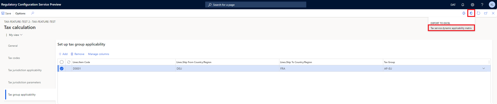

---
# required metadata

title: Import and export tax calculation configuration feature 
description: This topic provides information about the import and export functionality of the tax calculation service which enables a flexible and efficient configuration experience.
author: Kai-Cloud
ms.date: 11/15/2021
ms.topic: article
ms.prod: 
ms.technology: 

# optional metadata

ms.search.form:
audience: Application user
# ms.devlang: 
ms.reviewer: kfend
ms.search.scope: Core, Operations
# ms.tgt_pltfrm: 
ms.custom: 
ms.search.region: Global
# ms.search.industry: 
ms.author: kailiang
ms.search.validFrom: 2021-11-15
ms.dyn365.ops.version: 10.0.23
---
# Import and export tax calculation configuration feature

This topic provides information about the import and export functionality of the tax calculation service which enables a flexible and efficient configuration experience.
## Import and export tax codes

### Export templates

1. Sign in to [RCS](https://marketing.configure.global.dynamics.com/).

2. In the **Globalization features** workspace, select **Features**, select **Tax calculation** tile.

3. Select an existing feature, or [create a new feature](https://docs.microsoft.com/en-us/dynamics365/finance/localizations/global-get-started-with-tax-calculation-service?toc=/dynamics365/finance/toc.json#set-up-tax-calculation-in-rcs).

4. Select **Edit** on the menu of the **Versions** table.

5. In the **Tax calculation** feature page, set the [Configuration version](https://docs.microsoft.com/en-us/dynamics365/finance/localizations/global-get-started-with-tax-calculation-service?toc=/dynamics365/finance/toc.json#set-up-tax-calculation-in-rcs).

6. Select **Tax codes** tab, select **Import** on the menu of the **Tax codes** table.

7. Select **Export a tax code template** to download the **TaxCodesTemplate.zip**.

8. Unzip **TaxCodesTemplate.zip**, the tax code templates are compressed separately per **Calculation origin**.

9. Unzip **By Net Amount.zip** to get the following csv files,

   - **TaxCode.csv** - enter the tax codes.

   - **TaxLimit.csv** - enter the tax limits for each tax code.

   - **TaxRate.csv** - enter the tax rates for each tax code.

     > [!Note]
     >
     > Entries of the tax code **Sample** are by default available in the templates. The **Sample** tax code will be imported to the feature if not removed from the csv.

### Import tax codes

Follow the steps to import the Sample tax code in the template to your tax calculation feature.

1. In the **Tax calculation** feature page, select **Tax codes** tab.
2. Select **Import** on the menu of the **Tax codes** table，select **Browse**.
3. Select the **TaxCode.csv** file, in the **Target table** drop down list, select **Tax code**.
4. Select **OK** to import the tax code.
5. Select the **TaxRate.csv** file, in the **Target table** drop down list, select **Tax rate**.
6. Select **OK** to import the tax rate.
7. Select the **TaxLimit.csv** file, in the **Target table** drop down list, select **Tax limit**.
8. Select **OK** to import the tax limit.

You can also directly import the zip file which includes all these 3 csv files to complete the import with one click.

1. In the **Tax calculation** feature page, select **Tax codes** tab.
2. Select **Import** on the menu of the **Tax codes** table，select **Browse**.
3. Select the **By Net Amount.zip** file.
4. Select **OK**.

### Export tax codes

1. In the **Tax calculation** feature page, select **Tax codes** tab.

2. The **Export** button is enabled when there is at least one tax code in the **Tax codes** table.

3. Select **Export** on the menu of the **Tax codes** table.

4. Select **OK** to export all tax codes of the feature in a zip file.

   > [!Note]
   >
   > The exported file can be used as a template for tax code import to the corresponding feature.

## Import and export applicability rules

### Export applicability rules

1. Sign in to [RCS](https://marketing.configure.global.dynamics.com/).
2. In the **Globalization features** workspace, select **Features**, select **Tax calculation** tile.
3. Select an existing feature, or [create a new feature](https://docs.microsoft.com/en-us/dynamics365/finance/localizations/global-get-started-with-tax-calculation-service?toc=/dynamics365/finance/toc.json#set-up-tax-calculation-in-rcs).
4. Select **Edit** on the menu of the **Versions** table.
5. In the **Tax calculation** feature page, set the [Configuration version](https://docs.microsoft.com/en-us/dynamics365/finance/localizations/global-get-started-with-tax-calculation-service?toc=/dynamics365/finance/toc.json#set-up-tax-calculation-in-rcs).
6. Select **Tax group applicability** tab, select the rows in the **Set up tax group applicability** table.
7. Select **Open in Microsoft Office**.
8. Select **Tax service dynamic applicability matrix**.

9. Select **Download** to export the selected rows to the excel sheet.

### Import applicability rules

The downloaded excel sheet contains the table structure of the **Tax group applicability** table. You can add new rules directly in the sheet. 

Follow the steps to import the added rules back to the applicability table.

1. Select and copy the rows that you want to import from the excel sheet.
2. In the **Tax group applicability** tab, select **Add** to insert an empty record at the bottom of the table.
3. Press **Ctrl + V** to paste the copied rows to the table. 
4. Select **Save**.

