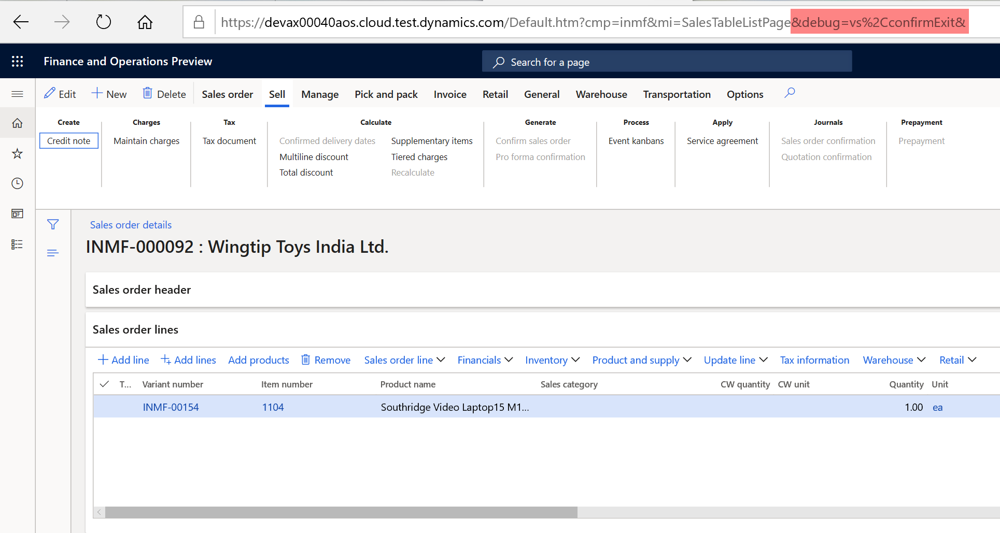
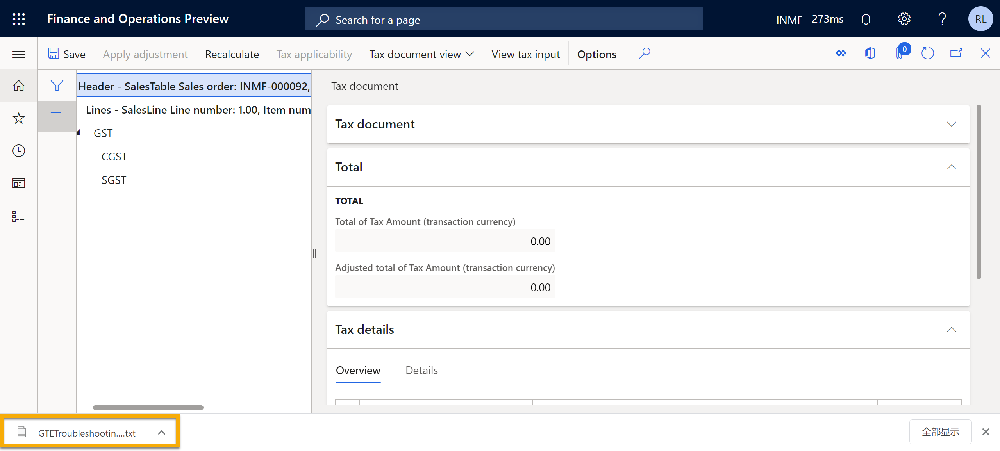
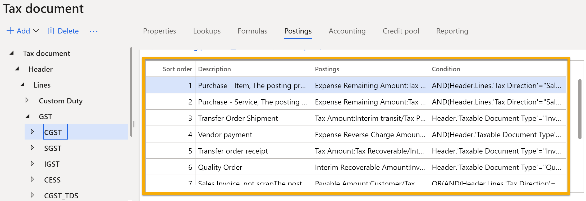
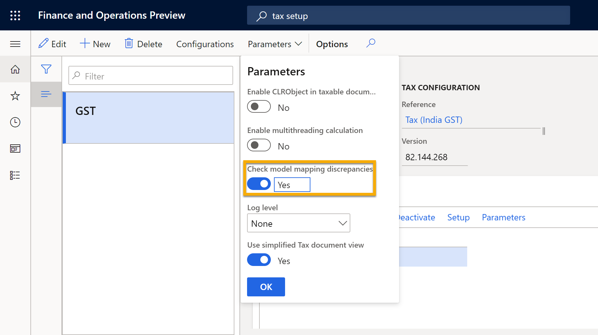
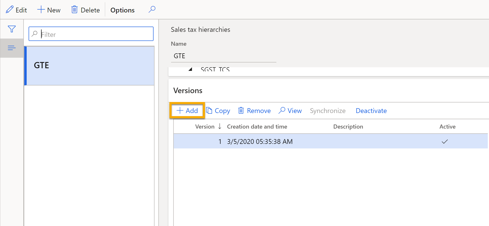

---
# required metadata

title: GTE trouble shooting guide
description: This topic explains the common issues while using GTE, and how to resolve them.
author: yijialuan
manager: Krstin Fender
ms.date: 03/06/2020
ms.topic: article
ms.prod:
ms.service: dynamics-ax-applications
ms.technology:

# optional metadata

ms.search.form: ERSolutionTable, ERDataModelDesigner, ERModelMappingTable
audience: Application User

# ms.devlang:

ms.reviewer: Kristin Fender
ms.search.scope: Core, Operations

# ms.tgt_pltfrm:

ms.search.region: India

# ms.search.industry:

ms.author: riluan
ms.search.validFrom: 07/30/2019
ms.dyn365.ops.version: 7.3
---

# Trouble shooting guide

[!include [banner](../includes/banner.md)]

The tax engine is a highly configurable engine handling tax applicability, calculation, posting, and settlement. This document lists the common mistakes/issues while using it.

> [!NOTE]
> The tax engine functionality is available only for legal entities that have their primary address in India.

For a quick overview of the tax engine, watch [Tax engine overview (YouTube video)](https://www.youtube.com/watch?v=jAFpEBOtNWI&feature=youtu.be).

## Debug mode

Before running into the detailed issues/mistakes, you should be familiar with the debug mode of the tax engine which can facilitate you to identify the root causes.

To enable the debug mode, you should append **&debug=vs%2CconfirmExit&** to the URL of Dynamics 365 Finance.


With it is enabled, when you open the Tax document, the system will dump a file that contains runtime details.


The structure of the dumpfile as below. The section of **Data model mapping mismatch** is available only if **Check model mapping discrepancies** is turned on.

```
======Tax engine calculation parameter======
...
===========Taxable document JSON===========
...
=====Tax engine runtime posting profiles=====
...
========Data model mapping mismatch========
Unmatched data provider fields
...
Unmatched taxable document fields
...

=====Tax engine runtime posting profiles=====
Header - TaxDocLine: TableId=6791 RecId=68719507754:
Line - TaxDocLine: TableId=13307 RecId=68719685245:
Path of the tax component 1:
-"Posting profile 1 description(Hit)"
-"osting profile 2 description"
...
Path of the tax component 2:
-"Posting profile 1 description(Hit)"
-"Posting profile 2 description"
...
Line - TaxDocLine: TableId=13307 RecId=68719685245:
...
```

## Imbalanced voucher with GST

The issue happens after you extended the GST configuration by adding/modifying the posting profile.

Per the current design, each tax component has a set of posting profiles to handle all the possible tax postings. The tax engine picks up the first matched posting profile in runtime.


Sometimes, if you add/modify the posting profiles without carefully handling the condition of each posting profiles, it might result in unexpected posting profiles are picked up in the runtime.
With the debug mode, you can easily find the picked posting profiles in section of **Tax engine runtime posting profiles** in the dump file.

## Incorrect tax rate/tax component

The tax engine reply on the input from taxable documents, like sales invoice, purchase invoice, etc. to work probably. If you extend the configuration by adding new fields, it's possible that you do not map the fields correctly or write your data provider correctly. To quickly identify such descrepancies, you can turn on **Check model mapping descrepancies**. Then there will be addtional section to show the descrepancies.


### Incorrect tax component

Whenever you cannot see the expected tax components, it means the transaction cannot satisfy the [applicability](../general-ledger/tax-engine-applicability.md) rules of the tax component and/or the tax type. If you extended the configuration, make sure there are no descrepancies. Then compare the fields value in section **Taxable document JSON** in the dump file, with the applicability rules of the tax component.

### Incorrect tax rate

Whenever you cannot see the expected tax rate, you need to check the field values which are used in the [tax setup](apac-ind-gst-apac-ind-GST-set-up-rate-percentage-tables.md) and compare them with the fields value in section _Taxable document JSON_ in the dump file.

## Cannot post the voucher with GST

If you encounter error like <span style="color:red">Unable to find ## in the setoff hierarchy ## version ##, please check and try again</span>. Normally it is because you extend the configuration by adding new tax component or modifying the credit pool.

You need to add a newer version into the current **Sales tax hierarchies**, **Synchronize** and **Activate** it. Then enable it in **Maintain setoff hierarchy profiles** following [Set up a sales tax hierarchy](apac-ind-gst-apac-ind-GST-set-up-activate-tax-hierarchy-tree.md)

