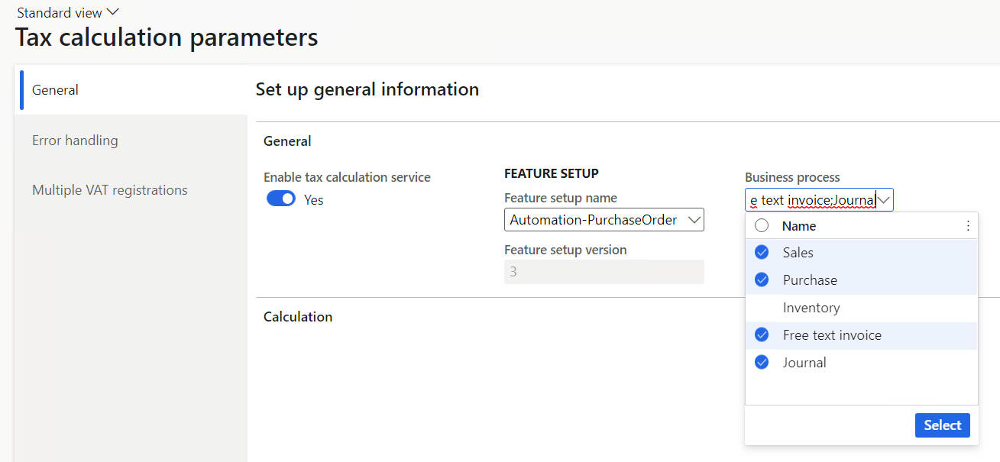

# Entrance code to tax integration 

This article explains how to integrate a new transaction to tax integration. Before diving in to the real tax integration world, some code is needed to use the new logic and bypass the legacy tax engine. This article introduces how to introduce the entrance code.

## Locate a code point

The first step is to locate a code point for the entrance code. This code point should meet the following conditions:

- The code point should be before tax is calculated by the legacy tax engine so that it can be bypassed. And the code point should only bypass tax calculation. No other processes should be bypassed.
- The code should be in a context that contains the basic transaction information to initialize a `TaxIntegrationDocumentObject` object. The object can be initialized in 2 ways:
   - The transaction header table record itself.
   - By the table ID and record ID to distinguish the header table record of the transaction.

Usually, if the transaction to be integrated is already supported by the legacy tax engine, it should have a specific derived class of `TaxCalculation` class, like `TaxSales` for sales orders and `TaxPurch` for purchase orders. This is an ideal code point. Currently, transactions like purchase orders and sales orders are all done in this way. You can refer to `TaxPurch.calculateTax()` and `TaxSales.calc()`.

If the transaction isn't supported by legacy tax, some extra effort should be taken to create the subclass of `Tax`. This article doesn't cover this scenario.

## Implement the entrance of tax integration

Take the entrance code of the *Sales order* as an example,
`TaxSales.xpp`:

```X++
    TaxAmount calc()
    {
        TaxAmount taxAmount;
        if (Tax::isTaxIntegrationEnabledForBusinessProcess(TaxIntegrationBusinessProcess::Sales))
        {
            taxAmount = this.calcUsingTaxIntegration();
            return taxAmount;
        }
        boolean                  moreLines;
        TaxBaseCur               baseAmount;
        ...
    }
```

- `Tax::isTaxIntegrationEnabledForBusinessProcess()` is used to determine whether to use **Tax Integration** for a transaction. This line is a switch so you can enable a transaction for tax integration from the front end.
  -  This switch can be controlled by a drop-down list under **Tax** > **Setup** > **Tax configuration** > **Tax calculation** > **General** > **Feature setup** > **Business process**.
  
   

- TaxIntegrationBusinessProcess is an Enum type that currently has 5 values: Sales, Purchase, Inventory(used for *Transfer order*), Free text invoice, and Journal. Add a new business process enum value for your new transaction if it's not covered by these five.

- All logic is wrapped in `this.calcUsingTaxIntegration()`.

### The calcUsingTaxIntegration method

The calcUsingTaxIntegration method is the code that prepares a `TaxIntegrationDocumentObejct` and calls `TaxIntegrationFacade::calculate(document)`. The following sample uses the *Purchase order* as an example.

```X++
    private TaxAmount calcUsingTaxIntegration()
    {
        // code on lock
        ...
        TaxAmountCur taxAmount;
        try
        {
            TaxIntegrationDocumentObject document;
            document = TaxIntegrationDocumentObject::constructWithRecord(purchCalcTax.getSource());
            this.setFieldsForLegacyTax();
            this.setFieldsForTaxIntegrationDocumentObject(document);
            TaxIntegrationFacade::calculate(document);
            amountInclTaxMap = document.getAmountIncludingTax();
            amountExclTaxMap = document.getAmountExcludingTax();
            ...
            taxAmount = this.finalizeCalculationForTaxIntegration(
                TaxParameters::isBankExchRateEnabled_W() && purchCalcTax.vendInvoiceInfoTable(),
                doIsolateTransactionScopeTrue);
        }
        // code on error handling
        ...
        return taxAmount;
    }
```

The steps completed are as follows:

- A `TaxIntegrationDocumentObject` object is constructed in one of two ways.
  
  - `TaxIntegrationDocumentObject::constructWithRecord(Common _record)` receives a transaction header table record as its parameter. This is the preferred method because it avoids conflict when updating fields to the transaction table in the data persistence activity.
  - `TaxIntegrationDocumentObject::construct(RefTableId _tableId, RefRecId _recId)` receives a table ID and a record ID as its parameters to distinguish the header table record of the transaction. However the header table record is re-selected from the database, so a conflict may occur.

- Basic information is set to `TaxIntegrationDocumentObject` by the setter methods. This part is is completed by the `this.setFieldsForTaxIntegrationDocumentObject(document)` method in the sample above.
- `TaxIntegrationFacade::calculate(document)` is called to trigger the real tax integration flow.
- Get the `amountIncludingTax` map for compatibility with the existing tax adjustment function.
- Call `this.finalizeCalculationForTaxIntegration()` method to handle `TaxUncommitted`. This step is only necessary when the transaction is using `TaxUncommitted`.
- Return the tax amount.

### Set fields for the document object

The `this.setFieldsForTaxIntegrationDocumentObject()` method initializes basic data fields for a taxable document to use in later activities.

Most of the data fields should be retrieved in the data retrieval activity. However, some of them are set here because of the following reasons:

- The field is fundamental and is used before the data retrieval activity. For example the `headingTableId` and `headingRecId`.
- The field can only be accessed in this context like the tax object is set by `_document.setLegacyTax(this);`
- It's convenient to set some particular fields here because local methods and methods in the subclass of `TradeCalcTax` can be leveraged to avoid duplicate code with the data retrieval class. For example, the document date, invoice date, and delivery date.

Set the data fields according to the new transaction before the facade is called. Usually, data can be retrieved by an object of **TradeCalcTax** in the context of the entrance point. For example, `SalesFormLetter` for sales orders is an object of `SalesCalcTax_Sales`, `purchCalcTax` for purchase orders, and `custInvoiceCalcTax` for free text invoices.

The following is an example from `TaxPurch.xpp`:

```X++
    protected void setFieldsForTaxIntegrationDocumentObject(TaxIntegrationDocumentObject _document)
    {
        _document.setTransactionDate(this.taxDate);
        // This deliveryDateMarkup() is for header.
        _document.setDeliveryDate(salesFormLetter.deliveryDateMarkup());
        _document.setDocumentDate(salesFormLetter.documentDate());
        _document.setInvoiceDate(salesFormLetter.invoiceDate());
        _document.setTransactionCurrencyCode(salesFormLetter.currencyCode());
        _document.setCompany(this.getCompany());
        _document.setHeadingTableId(this.headingTableId());
        _document.setHeadingRecId(this.headingRecId());
        // this sign is used as sign in TmpTaxWorkTrans, 1 for purchase and -1 for sales.
        _document.setSign(-1);
        _document.setSource(TaxModuleType::Sales);
        _document.setBusinessProcess(TaxIntegrationBusinessProcess::Sales);
        _document.setPrepaid(this.isPrePayment());
        _document.setEUROTriangulation(this.getTriangulation());
        _document.setLegacyTax(this);
        _document.setShouldSkipDocumentCharge(skipTableMarkup);
        _document.setShouldSkipLineCharge(skipLineMarkup);
    }
```

[!include [banner](../includes/banner.md)]
