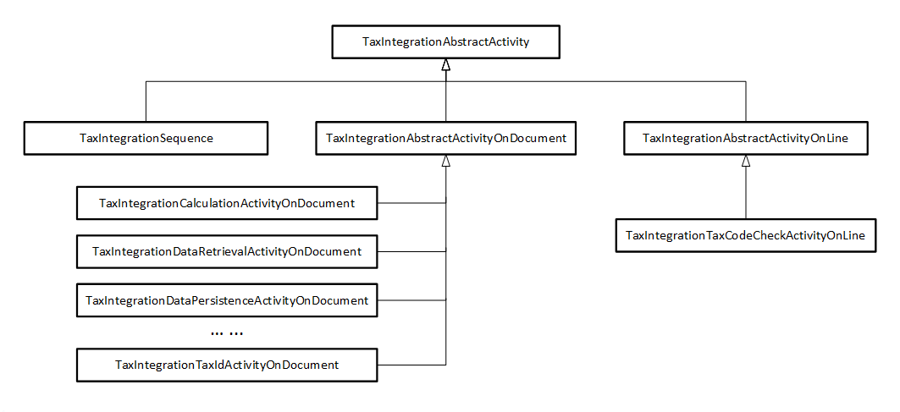

# Facade, sequence, and activities in tax integration

[!include [banner](../includes/banner.md)]

The **facade** controls the tax integration flow through a **sequence** that maintains a list of **activities**. This article introduces these three classes in tax integration.

## Facade

```X++
public final static class TaxIntegrationFacade
```

The facade (`TaxIntegrationFacade`) is the outermost interface of tax integration. It's a bridge to the [Tax Calculation service](global-tax-calcuation-service-overview.md).

The following example shows the most important method.

```X++
[Replaceable]
public static void calculate(TaxIntegrationDocumentObject _document)
```

This method accepts a document (`TaxIntegrationDocumentObject`) as input, and it returns `void`.

The method modifies the document directly. The document also serves as the output.

> [!NOTE]
> The method is replaceable. In other words, it can be completely replaced (customized).

```X++
TaxIntegrationSequence sequence = TaxIntegrationSequence::construct(LoggerName)
    .appendActivityOnDocument(TaxIntegrationSettingRetrievalActivityOnDocument::construct())
    .appendActivityOnDocument(TaxIntegrationDataRetrievalActivityOnDocument::construct())
    .appendActivityOnDocument(TaxIntegrationCalculationActivityOnDocument::construct())
    // ...
    .appendActivityOnDocument(TaxIntegrationDataPersistenceActivityOnDocument::construct());
sequence.act(_document);
if (!_document.isOK())
{
    throw _document.getException();
}
```

Inside the method, a sequence (`TaxIntegrationSequence`) is constructed and invoked. All activities are appended to the sequence in order.

As required, an exception is explicitly thrown at the end.

## Sequence

The sequence (`TaxIntegrationSquence`) is a special activity that maintains a sequence of activities. When its `act` method is invoked, all activities are run in the order that they're appended in.

```X++
public final class TaxIntegrationSequence
    extends TaxIntegrationAbstractActivity
{
    public final void act(TaxIntegrationDocumentObject _document);
    private void actInternal(TaxIntegrationDocumentObject _document);
}
```

The following steps are required to use a sequence (`TaxIntegrationSequence`):

1. The `construct` method creates the sequence.
2. The `appendActivitySequence`, `appendActivityOnDocument`, and `appendActivityOnLine` methods build up the sequence.
3. The `act` method plays the sequence.

Internally, the sequence maintains an activity list (`List`). It then enumerates that list upon invocation (`act`).

- The sequence calls the `shouldSkip` method of an activity to determine whether the activity should be skipped for the current document.
- For `TaxIntegrationSequence` and `TaxIntegrationAbstractActivityOnDocument`, if the activity shouldn't be skipped, the `act` method is invoked directly.
- For `TaxIntegrationAbstractActivityOnLine`, the sequence enumerates all `TaxIntegrationLineObject` objects in the document and invokes its `act` method. Charges are also implemented by the `TaxIntegrationLine` object. The `act` method is first invoked on the charges of the document. It's then invoked on the lines of the document, together with the charges on each line. For example, there are two charges and two lines on a document. At the same time, there are two charges on each line. In this case, the complete sequence will be as follows:

    1. The first charge of the document
    2. The second charge of the document
    3. The first line of the document
    4. The first charge of the first line
    5. The second charge of the first line
    6. The second line of the document
    7. The first charge of the second line
    8. The second charge of the second line

`TaxIntegrationSequence` is intended to be used directly and is implemented as a concrete class that has a public `act` method.

The following examples shows the `actInternal` method for quick reference.

```X++
private void actInternal(TaxIntegrationDocumentObject _document)
{
    var enumerator = list.getEnumerator();
    while (enumerator.moveNext())
    {
        anytype current = enumerator.current();
        if (current is TaxIntegrationSequence)
        {
            TaxIntegrationSequence sequence = current;
            sequence.act(_document);
            continue;
        }
        if (current is TaxIntegrationAbstractActivityOnDocument)
        {
            TaxIntegrationAbstractActivityOnDocument activity = current;
            if (!activity.shouldSkip(_document))
            {
                activity.act(_document);
            }
            continue;
        }
        if (current is TaxIntegrationAbstractActivityOnLine)
        {
            TaxIntegrationAbstractActivityOnLine activity = current;
            if (!activity.shouldSkip(_document))
            {
                SetEnumerator chargeEnumerator = _document.getChargeSet().getEnumerator();
                while (chargeEnumerator.moveNext())
                {
                    TaxIntegrationLineObject charge = chargeEnumerator.current();
                    activity.act(charge);
                }
                SetEnumerator lineEnumerator = _document.getLineSet().getEnumerator();
                while (lineEnumerator.moveNext())
                {
                    TaxIntegrationLineObject line = lineEnumerator.current();
                    activity.act(line);
                    chargeEnumerator = line.getChargeSet().getEnumerator();
                    while (chargeEnumerator.moveNext())
                    {
                        TaxIntegrationLineObject charge = chargeEnumerator.current();
                        activity.act(charge);
                    }
                }
            }
            continue;
        }
    }
}
```

## Activity

An activity does the real work in an integration flow. It acts as a segment in the integration flow. The name of an activity describes its purpose.

All activities are inherited from the same class, `TaxIntegrationAbstractActivity`. There are three types of activities:

- `TaxIntegrationSequence`
- `TaxIntegrationAbstractActivityOnDocument`
- `TaxIntegrationAbstractActivityOnLine`

Each type of activity contains an `act` method and an `actInternal` method, but they accept different arguments. `TaxIntegrationAbstractActivityOnDocument` and `TaxIntegrationAbstractActivityOnLine` are intended to be extended. They are implemented as abstract classes that have an internal `act` method and an abstract `actInternal` method. Therefore, a new activity should extend one of these two abstract classes. The activity should implement its own `actInternal` method to hold the real logic of the activity. If the activity isn't applicable to all transactions/documents, it should implement its own `shouldSkip` method. `TaxIntegrationSequence` is intended to be used directly. It's implemented as a concrete class that has a public `act` method.

All three types of activities log events during the `act` method as required after `TaxIntegrationLogLevelUtility` is checked. The logging context is inherited from `TaxIntegrationAbstractActivity`. The following illustration shows the hierarchy of activities.



For more information about how to add a new activity, see [Add a new activity in tax integration](./tax-integration-how-to-add-activity.md).

### Sequence

`TaxIntegrationSequence` is a special activity.

### Document activity

The document activity acts on `TaxIntegrationDocumentObject` and extends `TaxIntegrationAbstractActivityOnDocument`.

```X++
public abstract class TaxIntegrationAbstractActivityOnDocument
    extends TaxIntegrationAbstractActivity
{
    internal final void act(TaxIntegrationDocumentObject _document);
    protected abstract void actInternal(TaxIntegrationDocumentObject _document);
}
```

A new document activity should implement the `actInternal` method to hold the logic of this activity. The `actInternal` method accepts a `TaxIntegrationDocumentObject` object as input. Therefore, unlike a line activity, it can manipulate data at the document level. However, a document activity can also act on `TaxIntegrationLineObject` by enumerating the `TaxIntegrationDocumentObject` object. Most document activities handle data at both the document level and the line level. If an activity isn't applicable to all transactions and documents, it should implement its own `shouldSkip` method.

### Line activity

The line activity acts on `TaxIntegrationLineObject` and extends `TaxIntegrationAbstractActivityOnLine`.

```X++
public abstract class TaxIntegrationAbstractActivityOnLine
    extends TaxIntegrationAbstractActivity
{
    internal final void act(TaxIntegrationLineObject _line);
    protected abstract void actInternal(TaxIntegrationLineObject _line);
}
```

A new line activity should implement the `actInternal` method to hold the logic of this activity. The `actInternal` method accepts a `TaxIntegrationLineObject` object as input and can manipulate data only on the given line object. However, because charges are also described as a `TaxIntegrationLineObject` object, charges will also be processed by the line activity. If an activity isn't applicable to **all lines** in the document, it should implement its own `shouldSkip` method. The `shouldSkip` method indicates whether the current activity should be skipped for **all lines** (including charges) in the document, because it accepts a `TaxIntegrationDocumentObject` object as input.

### Current activities

Here's the list of current activities, in the order of `TaxIntegrationFacade::calculate`:

1. TaxIntegrationSettingRetrievalActivityOnDocument
2. TaxIntegrationDataRetrievalActivityOnDocument
3. TaxIntegrationCalculationActivityOnDocument
4. TaxIntegrationErrorHandlingActivityOnDocument
5. TaxIntegrationTaxCodeCheckActivityOnLine
6. TaxIntegrationTaxIdActivityOnDocument
7. TaxIntegrationListCodeActivityOnDocument
8. TaxIntegrationCurrencyExchangeActivityOnDocument
9. TaxIntegrationDataPersistenceActivityOnDocument

[!INCLUDE[footer-include](../../includes/footer-banner.md)]
