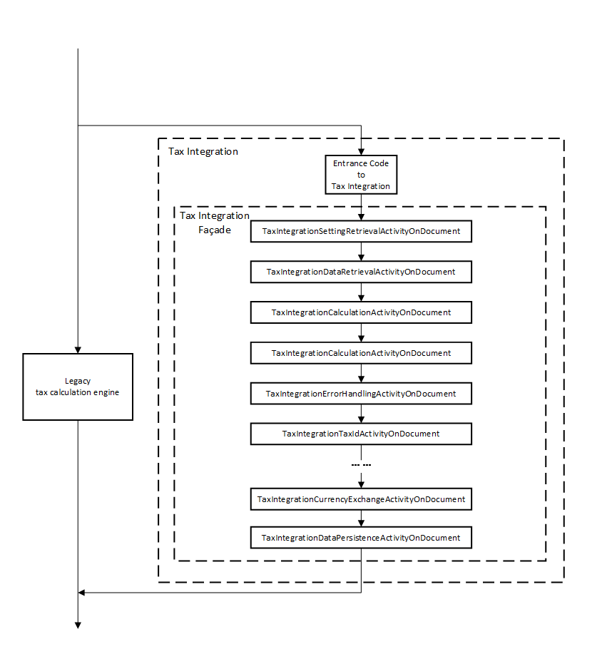

# Tax integration flow

[!include [banner](../includes/banner.md)]

**Tax integration** is a framework designed to replace the legacy tax calculation engine by calling [Tax Calculation Service](./global-tax-calcuation-service-overview.md).
This article introduces the basic flow of **tax integration**.

The left part of the chart is the legacy tax calculation engine. It is bypassed by **Tax Integration** to call the new calculation engine **Tax Calculation Service**.

All the modules in the big square make up the **Tax Integration**.

## Entrance to tax integration

`TaxIntegrationFacade` class contains most of the code and functions of tax integration. However, some code is needed to enter the tax integration flow before `TaxIntegrationFacade`, which is the entrance to tax integration.
This entrance code constructs a `TaxIntegrationDocumentObject`, which is passed to `TaxIntegrationFacade`. It also prepares some basic information, which is used in the following integration actions.

## TaxIntegrationFacade

`TaxIntegrationFacade` class realizes and controls the real flow of tax integration. It calls a bunch of classes with names like `TaxIntegration***ActivityOnDocument`. A `TaxIntegrationDocument` object is passed from activity to activity. And these activities carry out their actions on the object in turn.

The activities shown in the chart are all document-level activities with the suffix **OnDocument**. There are also line-level activities that work on `TaxIntegrationLineObject`, which suffix is *OnLine*.

Here is a simple introduction to these activities:

- TaxIntegrationSettingRetrievalActivityOnDocument: Retrieves the settings that will impact tax calculation. Then, it saves all the settings into the `TaxIntegrationDocumentObject`.
- TaxIntegrationDataRetrievalActivityOnDocument: Prepares the metadata needed by tax calculation. Then it copies them to the `TaxIntegrationDocumentObject`.
- TaxIntegrationCalculationActivityOnDocument: Transforms the `TaxIntegrationDocumentObejct` to a request Then, sends the request to the tax calculation service and parses the response from it.
- TaxIntegrationErrorHandlingActivityOnDocument: Handles the error message returned from the tax calculation service.
- TaxIntegrationTaxIdActivityOnDocument: Processes logic regarding **Multiple VAT ID** feature.
- TaxIntegrationListCodeActivityOnDocument: Processes logic regarding **List Code** feature.
- TaxIntegrationCurrencyExchangeActivityOnDocument: Processes logic regarding **Currency Exchange rate/Rounding/Penny difference adjustment** feature.
- TaxIntegrationDataPersistenceActivityOnDocument: Persists the tax calculation result and other information (VAT ID, list code, etc.) that need to be saved to the database.

[!INCLUDE[footer-include](../../includes/footer-banner.md)]
