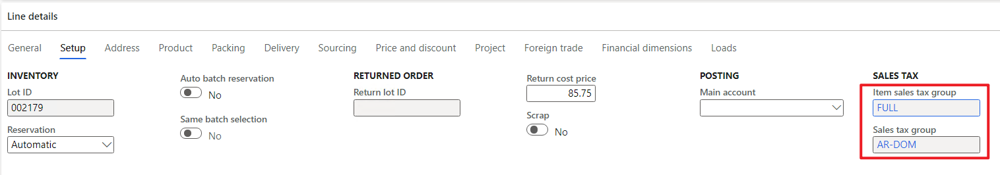
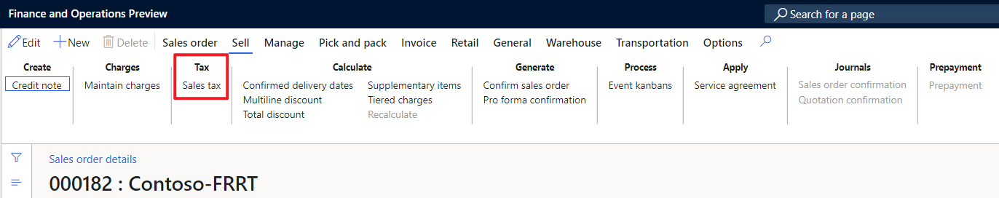
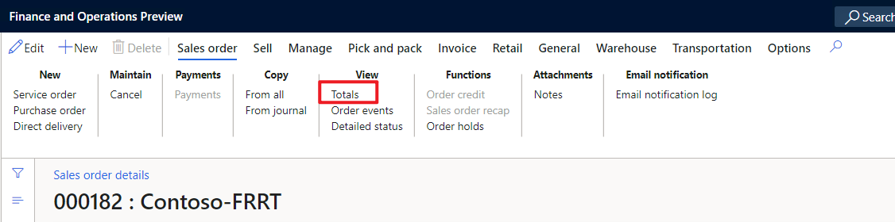
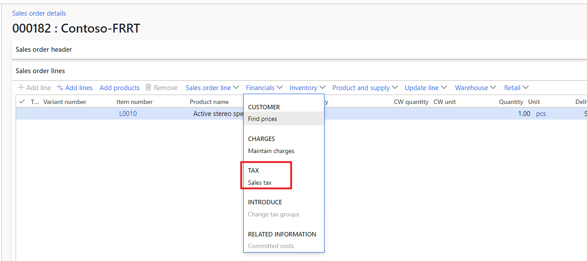

# Modification on switch functions and front end

[!include [banner](../includes/banner.md)]

Till now, most logic to integrate a new transaction is done. Still, some work is needed on a switch function and frontend stuff to enable the code created.

## Switch functions to enable the new transaction

There is a switch function to control if tax integration should be applied to a specific transaction, header table, and line table. Developers should extend it to enable the new transaction.

- In `Tax.xpp`: add the header and line table of new transactions according to the business process. Extend the method to return true for the header and line tables of the new transaction.
  ```X++
    /// <summary>
    /// Checks whether Tax Integration is enabled.
    /// </summary>
    /// <param name = "_refTableId">The table id.</param>
    /// <returns>Whether Tax Integration is enabled.</returns>
    public static boolean isTaxIntegrationEnabledForTable(RefTableId _refTableId)
    {
        if (TaxIntegrationFlight::instance().isEnabled()
            && TaxIntegrationTaxServiceParameters::find().IsEnable)
        {
            switch (_refTableId)
            {
                case tableNum(SalesTable):
                case tableNum(SalesLine):
                case tableNum(SalesParmTable):
                case tableNum(SalesParmLine):
                case tableNum(SalesQuotationTable):
                case tableNum(SalesQuotationLine):
                    return TaxIntegrationBusinessProcessTable::exist(TaxIntegrationBusinessProcess::Sales);
                case tableNum(PurchTable):
                case tableNum(PurchLine):
                case tableNum(VendInvoiceInfoTable):
                case tableNum(VendInvoiceInfoSubTable):
                case tableNum(VendInvoiceInfoLine):
                case tableNum(PurchParmTable):
                case tableNum(PurchParmLine):
                case tableNum(PurchReqLine):
                case tableNum(PurchRFQCaseTable):
                case tableNum(PurchRFQCaseLine):
                case tableNum(PurchRFQTable):
                case tableNum(PurchRFQLine):
                    return TaxIntegrationBusinessProcessTable::exist(TaxIntegrationBusinessProcess::Purchase);
                default:
                    return false;
            }
        }

        return false;
    }
  ```

## Modification on F&O front end

Uptake the front-end modification to adapt to tax integration business logic.

- In the transaction form, make "Override sales tax" control visible. And do not allow editing tax group and item tax group. Take sales quotation as an example, in the `init()` method of the `SalesQuotationTable` form:

  ```X++
        if (Tax::isTaxIntegrationEnabledForBusinessProcess(TaxIntegrationBusinessProcess::Sales))
        {
            SalesQuotationTable_ds.object(fieldNum(SalesQuotationTable, OverrideSalesTax)).visible(true);
            SalesQuotationLine_ds.object(fieldNum(SalesQuotationLine, TaxGroup)).allowEdit(false);
            SalesQuotationLine_ds.object(fieldNum(SalesQuotationLine, TaxItemGroup)).allowEdit(false);
            SalesQuotationLine_ds.object(fieldNum(SalesQuotationLine, OverrideSalesTax)).visible(true);
        }
  ```

  

- Find all buttons that can trigger tax calculation and reread the data source after tax calculation. Because during the calculation of tax integration, several fields are updated (ex. tax group), the data source of the form also needs a refresh to reflect the changes. Take free text invoices as an example, below code is from `CustFreeInvoice.xpp`:

  ```X++
    private void refreshDataSourceForTaxIntegration()
    {
        if (isTaxIntegrationEnabledForFTI)
        {
            CustInvoiceTable_ds.reread();
            CustInvoiceLine_ds.research(true);
        }
    }
  ```

make a method for the form, then call this method once tax calculation is triggered by UI action like:

  ```X++
    [Control("MenuFunctionButton")]
    class CustInvoiceTableTotals
    {
        public void clicked()
        {
            super();

            element.refreshDataSourceForTaxIntegration();
        }

    }
  ```

  Usually, there can be 3 buttons:

- **Sales tax** button on header:

  

- **Total** button on header

  

- **Sales tax** button on line

  

If there are other buttons that will trigger tax calculation, call the refresh in the clicked() method of those buttons too.

[!INCLUDE[footer-include](../../includes/footer-banner.md)]
