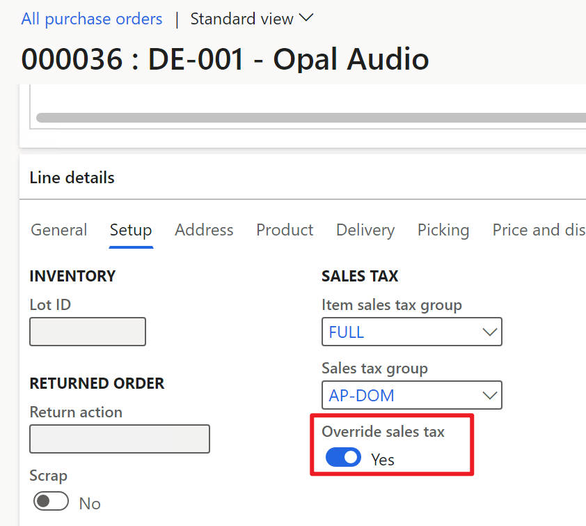
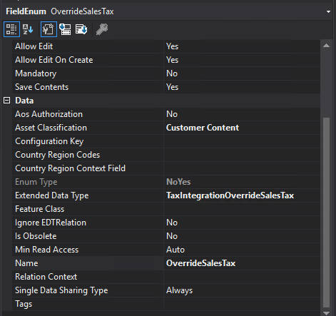
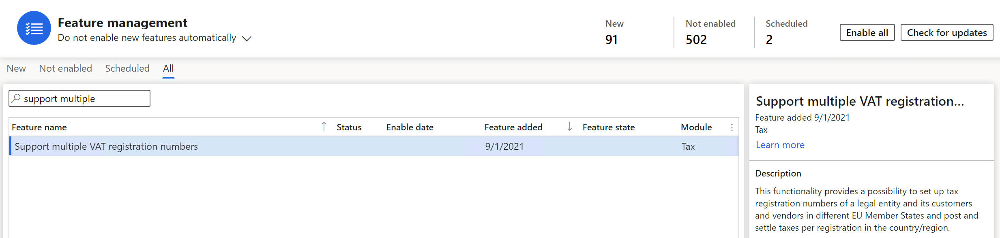
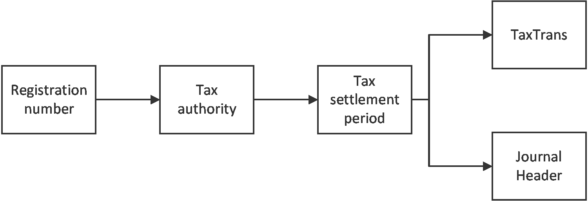

# Uptake features and functions

[!include [banner](../includes/banner.md)]

After the former steps, the main process of tax integration should work. But there are some more features and functions to uptake in order to take all advantage of tax integration. This article introduces how to update these features and functions.

There are the new features and functionalities that are now supported in the tax integration:

  - Override sales tax
  - Multiple VAT ID
  - List code
  - Cash discount

## Override sales tax

In tax integration, you cannot edit the tax group and item tax group on a line (and charge) because taxes are determined by the tax calculation service. The **Override sales tax group** functionality allows you to change the tax group or item tax group specified on a line (and charge) to calculate sales tax. This calculation overrides the tax groups determined by the tax calculation service.

A new checkbox is added beside the tax group and item tax group. When **Override sales tax** is set to **Yes**, the user can select a specific tax group and item tax group for tax calculation.

  

Complete the following steps to enable this functionality.

1. Add the **Override sales tax** field to the transaction line table schema.

     
    - Also add it to the *Sales tax* field group if it exists.
    - Set its default visibility to false on related transaction form datasource.
    - Map it the **SalesPurchJournalLine** map. This map is used widely in tax integration. If not mapped, additional code may be needed to realize the expected function.

2. Set its visibility and editability on the transaction form.
   - Set its default visibility to false on the transaction form datasource.
   - Set its visibility to true, only if tax integration is enabled for this transaction:
        ```X++
            if (isTaxIntegrationEnabledForPurchase) // Condition should be modified according to the business process
            {
                PurchTable_ds.object(fieldNum(PurchTable, OverrideSalesTax)).visible(true);
                PurchLine_ds.object(fieldNum(PurchLine, OverrideSalesTax)).visible(true);
            }
        ```

   - Add `allowEdit` control to the transaction form to control the editability of the tax group and item tax group. Usually, 3 places to add:

        ```X++
                if (isTaxIntegrationEnabledForPurchase) // Condition should be modified according to the business process
                {
                    PurchLine_ds.object(fieldNum(PurchLine, TaxGroup)).allowEdit(purchLine.OverrideSalesTax == NoYes::Yes);
                    PurchLine_ds.object(fieldNum(PurchLine, TaxItemGroup)).allowEdit(purchLine.OverrideSalesTax == NoYes::Yes);
                }
        ```

     - the `init()` method of the form
     - the `active` method of line
     - the modified() method of the "Override sales tax" field.

3. Set the value of override sales tax in data retrieval activity.
   
   `line.setOverrideSalesTax(this.vendInvoiceInfoLine.OverrideSalesTax);`

4. To keep the design consistent, the newly created charge will default override sales tax from its origin. Modify `MarkupTrans::getOverrideSalesTaxFromParentRecord(MarkupTransRefTableId _tableId, MarkupTransRefRecId _refRecId)` for new transaction support.
5. (Optional) Modify related entities to support import/export of override sales tax.

## Multiple VAT ID

Multiple VAT ID (VAT ID, also known as tax registration number) is a feature that enables the determination of VAT ID from the tax calculation service. It is controlled by a feature named **Support multiple VAT registration numbers**. Please refer to [Multiple VAT registration numbers](./emea-multiple-vat-registration-numbers.md) for details.

  

Two registration numbers need to be determined and saved in this feature, the registration number for the tax authority of the current legal entity, and the registration number for the counterparty. If the transaction does not have a customer or vendor as a counterparty, the counterparty registration number will not work for it.

> [!Note]
> There will be only one legal entity registration number and one counterparty registration number for all lines in a transaction.
Most code of this feature is done in `TaxIntegrationTaxIdActivityOnDocument.xpp`.

### DB schema

Two data fields (TaxId and PartyTaxId, which are the record IDs of registration numbers)) are added to related tables to store the registration numbers of a transaction. The tables are:

- TmpTaxWorkTrans
- TaxUncommitted
- TaxTrans
- CustPackingslipJour
- CustInvoiceJour
- VendPackingSlipJour
- VendInvoiceJour

The tax-related tables are line-level tables, and the last 4 are header-level tables since one transaction should have the same registration number.

### Registration number for legal entity

This part is relatively easy compared with the counterparty. Legal entity registration number is enabled and mandatory if **Support multiple VAT registration numbers** is enabled. The determination and flow of legal entity VAT ID are:

  

The legal entity registration number is enabled by the feature, and nothing is needed here for a new transaction. As long as the tax code is determined, the legal entity registration number will be filled by the registration number assigned to the settlement period of that tax code.

It is determined at `TaxIntegrationTaxIdActivityOnDocument::populateTaxLineTaxId()` and saved to the database together with the tax result.

There is also a validation logic for the LE registration number, in case a different registration number is determined for various lines in a transaction. Basically, it is done at `TaxIntegrationTaxIdActivityOnDocument::checkTaxIdConsistency()`.

### Counterparty registration number

The counterparty registration number is determined by the tax calculation service. After receiving the response, it will be validated and saved to the database together with the legal entity registration number. However, if the number determined by the service is not in the user's master data, the default value on the transaction header will be written to the database instead of the returned one. Besides, the counterparty registration number is not applied to all transactions, there is an extra logic to handle this.

#### Default logic

There is a default logic from customer and vendor master data to the transaction header. You can set the **Tax-exempt number** at the customer and vendor master data level. When a new transaction is created, the exempt number defaults to it. You can also select a new number to override the default. The number on the header before tax calculation will be used as the default number if the number returned by the tax service is not valid.

The tax-exempt number is a string field (VATNum) instead of a record ID, and it has two data sources. One data source is from the tax registration number and the otehr is from the tax-exempt number. Tax integration only supports the tax registration number as its source. Two new fields, **VATNumRecId** and **VATNumTableType** should be added to the appropriate tables to distinguish the record.

When a new transaction is added, decide if the fields, **VATNum**, **VATNumRecId**, and **VATNumTableType** should be added to the transaction header table. If yes, also add the table to TaxExemptVATNumMap. When you do that, the record ID and table type will be saved to the header table automatically when users select a number from the UI.

A developer must identify the default logic and call `copyPrimaryRegistrationNumberToVATMap` to copy the two fields to the newly created transaction header table. Use the default code from `CustTable` to `SalesTable` below as an example, in `SalesTable.xpp`:

```X++
    private void initRegistrationNumbers(CustTable _custTable)
    {
        this.vatNum = _custTable.getPrimaryRegistrationNumber(TaxRegistrationTypesList::TAXID);
        _custTable.copyPrimaryRegistrationNumberToVATMap(this);     // This line is to copy the new fields.
        this.EnterpriseNumber = _custTable.getPrimaryRegistrationNumber(TaxRegistrationTypesList::UID);
    }
```

#### Switch function

1. Modify the switch function to support the new transaction when journalizing: `TaxIntegrationUtils::isMultipleTaxIdEnabledForJournalV3(RefTableId _journalHeaderTableId, RefRecId _journalHeaderRecId, Tax _tax = null)`.
2. If there is no counterparty, or the counterparty registration number isn't applicable for the new transaction, skip the counterparty logic at `TaxIntegrationTaxIdActivityOnDocument::shouldSetPartyTaxId()`:

    ```X++
        protected static boolean shouldSetPartyTaxId(TaxIntegrationDocumentObject _document)
        {
            // Sales quotation for a prospect customer doesn't apply to the counterparty VAT ID
            if (_document.getHeadingTableId() == tableNum(SalesQuotationTable) && _document.getCustVendAccount() == '')
                return false;
            // Currently for purchase order and sales order, the party tax ID is set only if returned by the tax service.
            // For Transfer Order, its party tax ID isn't determined by the tax service and must be set for the first calculation round.
            return _document.isPartyTaxIdReturned()
                || ((_document.getBusinessProcess() == TaxIntegrationBusinessProcess::Inventory)
                    && !(TaxInventTransferCalcTaxContext::current() && TaxInventTransferCalcTaxContext::current().parmShouldSkipSetPartyTaxId()))
                // If a default exists, always go through the tax ID process.
                || _document.getPartyTaxIdRecIdDefault();
        }
    ```

### Number sequence group

The number sequence group is part of the multiple VAT ID feature. When the VAT ID is updated to the transaction header, the corresponding number sequence group should also be updated. However, the update doesn't apply to all transactions. If the number sequence group should be integrated into the new transaction, use the following example in data persistence activity:

``` X++
    private void saveNumberSequenceGroupToTable()
    {
        NumberSequenceGroupId numberSequenceGroupId = document.getNumberSequenceGroupId();
        if (numberSequenceGroupId && custInvoiceTable.numberSequenceGroup != numberSequenceGroupId)
        {
            ttsbegin;
            custInvoiceTable.numberSequenceGroup = document.getNumberSequenceGroupId();
            custInvoiceTable.doUpdate();
            ttscommit;
        }
    }
```

The determination is done in the tax ID activity for all transactions. Add and call the logic in the data persistence activity to persist the number sequence group.

## List Code

The list code is similar to the counterparty VAT ID as they are both determined by service and persist in the database. The list code feature is always enabled if the list code applicability matrix is configured at RCS.

### Data retrieval

Retrieve the default list code to `TaxIntegrationDocument`. Add a line in the `copyToDocumentFromHeaderTable` of the newly created data retrieval class.

```X++
    protected void copyToDocumentFromHeaderTable()
    {
        super();
        ...
        document.setListCode(this.purchTable.ListCode);
        ...
    }
```

### Map list code to map

A `SalesPurchJournalTable` map is used in the data persistence class to reduce duplicate code. Map the list code from the header table to the map.

```X++
        <AxTableMapping>
        <MappingTable>SalesPurchJournalTable</MappingTable>
            <Connections>
                ...
                <AxTableMappingConnection>
                    <MapField>ListCode</MapField>
                    <MapFieldTo>ListCode</MapFieldTo>
                </AxTableMappingConnection>
            </Connections>
        </AxTableMapping>
```

If your transaction table isn't mapped to this `SalesPurchJournalTable`, write your own logic in the data persistence activity to update the list code.

### Data persistence

Call the `TaxIntegrationListCodeUtility::saveListCodeFromDocumentToTable()` method in the `saveDocument` method of the newly created data persistence class:

```X++
    /// <summary>
    /// Saves the document.
    /// </summary>
    /// <returns>Always true.</returns>
    protected boolean saveDocument()
    {
        TaxIntegrationTaxIdUtility::saveTaxIDFromDocumentToTable(document, salesTable);
        TaxIntegrationListCodeUtility::saveListCodeFromDocumentToTable(document, salesTable);
        return true;
    }
```

### Currency exchange, rounding, and penny difference adjustment

This function is enabled by default. Set the transaction currency, reporting currency fixed exchange rate, and accounting currency fixed exchange rate to the document object. It is been done by `TaxIntegrationCurrencyExchangeActivityOnDocument` which is called in `TaxIntegrationFacade` without any condition. There is no action required on your part to uptake it.

## Cash discount

If the cash discount function is already supported for the new transaction in your finance and operations apps, tax integration can also provide the ability to determine the cash discount parameters by the Tax Calculation service. The following is a brief introduction on how to enable this function.

1. Find all references of cash discount parameters in the code base.
2. Replace the references of cash discount parameters with parameters from the Tax Calculation service. The parameters can be retrieved by one of two methods: 

    - `TaxIntegrationFacade:: getTaxJurisdictionParameters(RefTableId _sourceHeadingTableId, RefRecId _sourceHeadingRecId)` 
    - `TaxIntegrationFacade::getTaxJurisdictionParametersByTable(Common _sourceHeadingTable)`

3. Extend the switch functions to enable the new transaction: `TaxIntegrationUtils::shouldRetrieveCashDiscParametersFromTaxService(RefTableId _refTableId, RefRecId _refRecId)` and `TaxIntegrationUtils::getBusinessProcessBySourceHeadingTable(RefTableId _sourceHeadingTableId, RefRecId _sourceHeadingRecId)`.

[!INCLUDE[footer-include](../../includes/footer-banner.md)]
