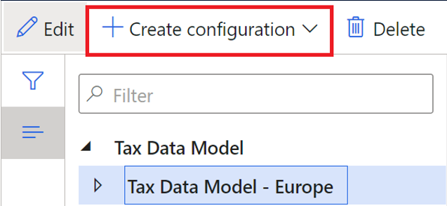
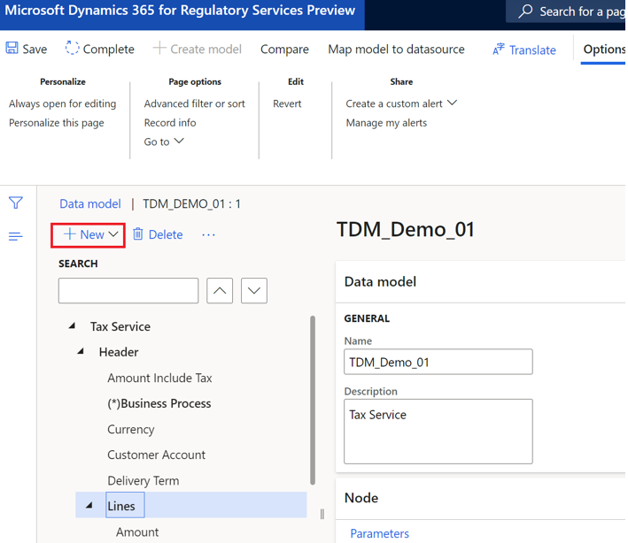
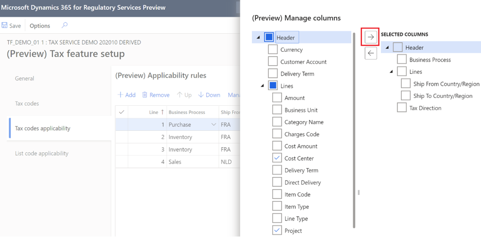

---
# required metadata

title: Add data fields in tax configurations
description: This topic explains how to customize tax configuration with data fields.
author: kailiang
manager: tfehr
ms.date: 03/05/2021
ms.topic: article
ms.prod: 
ms.service: dynamics-ax-applications
ms.technology: 

# optional metadata

ms.search.form:
audience: Application user
# ms.devlang: 
ms.reviewer: kfend
ms.search.scope: Core, Operations
# ms.tgt_pltfrm: 
ms.custom: 
ms.search.region: Global
# ms.search.industry: 
ms.author: wangchen
ms.search.validFrom: 2021-04-01
ms.dyn365.ops.version: 10.0.18
---

# Add data fields in tax configurations

[!include [banner](../includes/banner.md)]

[!include [banner](../includes/preview-banner.md)]

This topic explains how to customize **Tax configuration** with [data fields added in the tax integration](tax-service-add-data-fields-tax-integration-extension.md).

## Customize the tax data model

1. In Dynamics 365 Finance, go to **Electronic Reporting** > **Tax configurations**.
2. Select **Tax Data Model - Europe** and then select **Create configuration**.

    

3. Select the **Taxable document model derived from Name: Tax Data Model -- Europe, Microsoft** radio button, enter a name, and then select **Create configuration**.
4. Select the tax data model you just created and then select **Designer**.
5. Expend the data model tree, select **Lines**, and then select **New**.

    

6. In the **Create node** dialog box, add the name and item type, and then select **Add**.
7. Add any required columns, select **Save**, and the select **Complete**.
8. Close the page and view the **Completed** version of your tax data model.

## Customize the tax configuration

1. In Finance, go to **Electronic reporting** > **Tax configurations**.
2. Select **Tax Configuration -- Europe**, and then select **Create configuration**.
3. Select the **Tax service configuration derived from Name: Tax Configuration -- Europe, Microsoft** radio button, enter a name for the tax configuration, and then select **Create configuration**.
4. Select the tax configuration you just created, and then select **Designer**.
5. In the **Properties** field group, in the **Data model** drop-down list, select your customized tax data model.
6. In the **Data model version** field, select the completed version of the tax data model.
7. Select **Add**, and add the required tax measures.
8. Select **Save** and then select **Complete**.
9. Close page and view the **Completed** version of your tax configuration.

## Implement tax features on the customized tax configurations

1. In the Regulatory Configuration Service, go to **Globalization Features** > **Tax**.
2. Select **Add**, enter the new feature information, and then select **Create feature**.
3. On the **Versions** tab, select the feature in the list, and then select **Edit**.
4. On the **General** tab, in the **Configuration version** drop-down list, select the customized tax configuration and version.
5. In the **Manage columns** pane, select the header and line columns to include in your customized tax measure.

      
